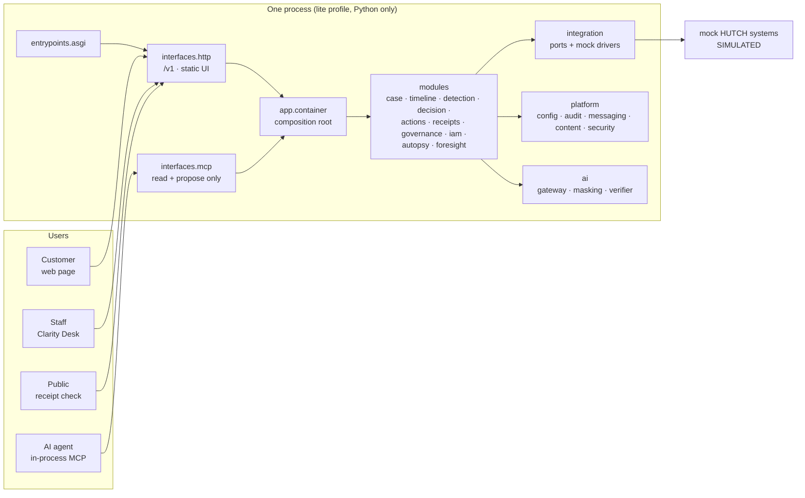

# ARCHITECTURE.md - what is actually built

> The [enterprise plan](docs/enterprise-plan/README.md) is the **intended** design, and [chapter 21](docs/enterprise-plan/21-migration-and-deployment-plan.md) is the plan for getting there. This file is the **as-built** state: what exists, how it is layered, what differs from the plan, and how far the migration has gone. It is updated in the same change as anything that affects it.
>
> **Last updated:** 2026-10-02 (branch `dev`) · **Migration:** R1 complete; D1-D4 and D6 fixed; team work from `main` merged (chat module, admin APIs, `full`-profile SQL store, Next.js apps) · **Tests:** 546 · `ruff`, `mypy --strict` (106 files), 3 import contracts and the module-boundary tests all clean

---

## 1. The system today

Everything runs in one process with no infrastructure (`lite` profile, ADR-0027). All HUTCH systems are **simulated and labelled as such**.

## 2. Layers

Enforced on every `make check` by import-linter (`backend/pyproject.toml`) and by `backend/tests/architecture/test_module_boundaries.py`.

| Layer | Package | Rule |
|---|---|---|
| L7 Entry points | `clarity.entrypoints` | Start processes (`asgi.py`) |
| L6 Interfaces | `clarity.interfaces.http`, `clarity.interfaces.mcp` | Thin; independent of each other; no business logic |
| L5 Composition | `clarity.app` | Builds the object graph; the only reader of `CLARITY_PROFILE` |
| L4 Domain | `clarity.modules.*` | Each module imported only through its `public.py` |
| L3 AI | `clarity.ai` | Language only; no authority over money |
| L2 Platform | `clarity.platform.*` | Config (policy resolver, switches), audit, messaging, content, security |
| L1 Integration | `clarity.integration` | Every HUTCH access goes through a port |
| L0 Vocabulary | `clarity.contracts`, `clarity.kernel` | Money, IDs, canonical hashing, canonical models |

Money protection:
- `clarity.ai`, `clarity.interfaces.mcp` and the MCP view cannot import the tool layer's capability modules (`layer`, `confirmation`, `budget`, `capability`).
- `modules.actions` exposes two surfaces: `public.py` (vocabulary: errors and result types; it imports no executing code, test-enforced) and `capability.py` (`ToolLayer`, `ConfirmationService`, `RefundBudget`), which only `modules.case` and `app` may import.

## 3. Modules

How modules talk (ADR-0029, plan 21 §11): they **call** each other's `public.py` only along declared edges (`case` → timeline, detection, decision, actions, receipts; `decision` → detection; `governance` → decision; `receipts` → actions), and **publish events** through the outbox for side effects. Today no module publishes events yet; the first event-driven flow (receipts on `action.completed`) follows the R2a platform work.

Registry with status and next migration step: [docs/modules.md](docs/modules.md). Each module's `MODULE.md` lists its public surface, users, dependencies, invariants and tests.

## 4. Decisions

28 ADRs in [docs/adr/](docs/adr/README.md). The ones that shape the code today: rule packs as YAML (0001, amended by 0026), policy as scoped effective-dated data (0002), policy governance (0003), MCP holds no execute capability (0004), idempotency claimed before side effects (0005), confirmation tokens never leave the server (0007), risk from evidence (0008), no model by default (0009), own issuer behind a federation interface (0010), migration approach (0025), runtime profiles (0027), containers for the core and serverless at the edges (0028).

## 5. Migration status (plan 21 §7)

| Step | Status |
|---|---|
| R0 Freeze behaviour | **Done.** `backend/tests/acceptance`: route contract for all 66 routes (public, signed-in, synthetic-only), the four journeys plus subject binding over HTTP, and an OpenAPI snapshot of 54 operations. |
| R0.5 Defects | **D1, D2, D3, D4, D6, D7, D8 fixed** with regression tests (`backend/tests/unit/test_migration_defects.py`). D5 (rule parameters to policy) moves with R3; ADR-0001 amended. |
| R1 Restructure | **Done.** Layered layout, `public.py` per module, `MODULE.md` per module, boundary tests, composition root in `app`, entry point in `entrypoints`, docs merged. |
| R2 Infrastructure drivers | **Started by the team:** the `full` profile persists the simulated HUTCH estate and receipts in SQL (PostgreSQL via `DATABASE_URL`, or a local SQLite file). Kafka, Keycloak, OPA and the per-module schemas are still to do. |
| R3, R4, R6, R7 | Not started. Work items with acceptance tests: [docs/backlog](docs/backlog/README.md) (waves W0-W5); assistant design: [plan 22](docs/enterprise-plan/22-agentic-assistant-and-rag.md). |
| R5 Frontend | **Started early by the team:** Next.js 14 `customer-web`, `console`, `verify` and shared packages call the `/v1` API. Build not yet verified on `dev`; the static UI stays until it is. |

## 6. Where this differs from the target

| Area | Target (plan) | Built | Why / when |
|---|---|---|---|
| Persistence | PostgreSQL 18, schema per module, RLS | In memory | `lite` profile; PostgreSQL driver in R2, modules move in R3 |
| Concurrency | Database unique keys and row locks | In-process locks; correct for **one** process only | R3. Do not run more than one replica until then (risk R28). |
| Identity | Keycloak (staff, admins, MCP clients) + customer issuer + OPA | Own EdDSA issuer; Python permission checks; demo-only role picker | ADR-0010; Keycloak and OPA drivers in R2 |
| Events | Outbox → Kafka + Apicurio | In-process relay over an outbox | R2 |
| Decision outcomes | ZEN decision table | Python over a hashed input document | R3 (ADR-0026) |
| Rule parameters | In the policy store | Inside the YAML packs | R3 (D5) |
| MCP | `clarity-mcp`: MCP SDK, Streamable HTTP, OAuth 2.1, token exchange | In-process class; tools listed at `/v1/mcp/tools` | R4. No external agent can connect yet. |
| Signing key | `clarity-signer` with OpenBao/KMS | Generated in memory at startup | R4 |
| Front end | Next.js 16 apps + shared packages (plan 19) | Static UI served by FastAPI **and** Next.js 14 apps in `frontend/` | R5: verify the build, retire the static UI, move to Next.js 16 |
| Model | Roles with fallback chains; templates by default | Template tier only | R4 (ADR-0009 keeps templates as the default) |
| Channels | Web, app, WhatsApp, SMS/USSD | Web only | R4/R6 |
| Rules | 16 candidates | 6 | Prototype scope |

## 7. Known gaps

Full list in [docs/submission/KNOWN_LIMITATIONS.md](docs/submission/KNOWN_LIMITATIONS.md). Most important:

1. **Single process only.** Correctness under concurrency holds inside one process (1,500 of 1,500 concurrent double confirms give one refund and one receipt); a second replica would not share that state until R3.
2. **Identity is ours, not HUTCH's.** Permission checks are real; the issuer key is generated at startup, so a restart signs everyone out; no refresh, revocation or session store. Development sign-in routes return 404 in the `prod` profile.
3. **No persistence.** A restart loses every case and receipt.
4. **MCP has no network transport yet.**
5. **Sinhala and Tamil wording is not native-speaker reviewed.**
6. **Foresight is uncalibrated** and says so in every report.

## 8. Keeping this file true

Update it in the same change as: a new module or dependency, a migration step landing, a decision that differs from the plan (ADR first), or a change to what is built versus planned. History lives in [docs/devlog/](docs/devlog/README.md).
