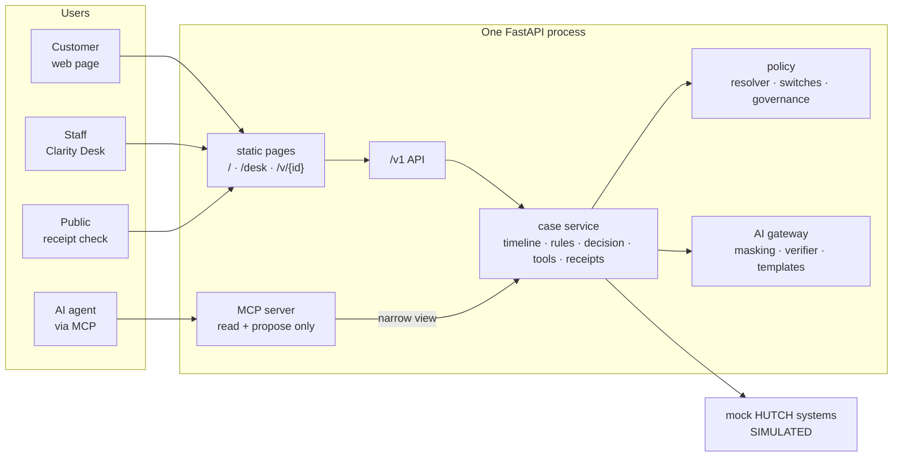

# ARCHITECTURE.md - what is actually built

> The [enterprise plan](docs/enterprise-plan/README.md) is the **intended**
> design. This file is the **as-built** state: what exists, what does not, and
> where the two differ. It is updated in the same change as anything that
> affects it.
>
> **Last updated:** 2026-10-02 · **Tests:** 387 · `ruff`, `mypy --strict` and
> all import contracts clean

---

## 1. The system today

Everything runs in one process with no infrastructure (ADR-0006). All HUTCH
systems are **simulated and labelled as such**.

## 2. Layers

Enforced by `import-linter` on every `make check` (contracts in
`pyproject.toml`).

| Layer | Package | Rule |
|---|---|---|
| Experience | `api/static/` | Talks only to `/v1` |
| Interfaces | `clarity.api`, `clarity.mcp` | Thin; no business logic |
| AI | `clarity.ai` | Language only. No authority over money. |
| Domain | `clarity.core` | Decides causes, outcomes, actions, receipts |
| Integration | `clarity.integrations` | Every HUTCH access goes through a port |
| Events | `clarity.events` | Envelope, catalogue, outbox |
| Vocabulary | `clarity.schemas` | Money, IDs, canonical hashing. Depends on nothing. |

Two contracts exist specifically to protect money:

- `clarity.ai` and `clarity.mcp` cannot import the tool layer's capability
  modules (`layer`, `confirmation`, `budget`). They may import its error types.
- `clarity.core`, `clarity.integrations` and `clarity.schemas` cannot import
  `clarity.api`.

## 3. Modules

| Module | Does | State |
|---|---|---|
| `schemas` | Money (Decimal), IDs, canonical JSON, hash chaining, domain models | built |
| `integrations` | Ports + mock drivers for all 8 sources; synthetic HUTCH world | built (mock only) |
| `core.timeline` | Joins 8 sources into a hashed evidence snapshot | built |
| `core.rules` | Predicate engine, YAML rule packs, confidence, ruled-out | built (6 of 16 rules) |
| `core.decision` | Outcome matrix, caps, budgets, risk from evidence | built |
| `core.policy` | Scoped effective-dated artefacts, resolver, switches, replay, governance | built |
| `core.tools` | Plans, confirmation tokens, budget ledger, idempotent execution, compensation | built |
| `core.receipts` | Build, chain, sign (Ed25519), verify, render PNG/PDF, recurrence test | built |
| `core.audit` | Append-only hash-chained ledger | built |
| `core.cases` | Orchestration shared by every channel | built |
| `core.content` | CX-approved templates (si/ta/en) | built |
| `core.iam` | Roles, permissions, separation of duties, EdDSA tokens, OTP | built (own issuer) |
| `events` | CloudEvents-style envelope, transactional outbox, DLQ | built (in-process relay) |
| `ai` | PII masking + vault, verifier, gateway, providers, autopsy, foresight | built (no model configured) |
| `mcp` | 8 tools, 3 profiles, subject binding, audit, no execute capability | built |
| `api` | `/v1`, OpenAPI, problem details, static UI, deny-by-default authorization | built |

## 4. Decisions

See [docs/adr/](docs/adr/README.md). Nine accepted: YAML rule packs (0001),
policy as data (0002), policy governance (0003), MCP capability boundary
(0004), idempotency ordering (0005), no-infrastructure prototype (0006),
server-side confirmation tokens (0007), risk from evidence (0008), no model by
default (0009).

## 5. Where this differs from the plan

| Area | Plan | Built | Why |
|---|---|---|---|
| Persistence | PostgreSQL 16 + pgvector | In memory | ADR-0006. Nothing survives a restart. |
| Identity | HUTCH OTP + SSO/MFA, OPA | Clarity issues EdDSA tokens; permissions checked in `api/auth.py` | ADR-0010. The permission matrix is real; the issuer is ours, so the Desk role picker and the simulated SMS inbox are labelled as such. Keycloak and OPA slot in as drivers. |
| Events | Kafka + Schema Registry | In-process relay over an outbox | ADR-0006. Same guarantees modelled; no broker. |
| Decision policy | OPA/Rego bundles | Python over a hashed input document | Same input contract, so OPA can replace it |
| Front end | Next.js + TypeScript | Static HTML + vanilla JS | ADR-0006 |
| Rules | 16 candidate rules | 6 | Prototype scope (plan §1.9) |
| Model | Tiered routing with a live model | Template tier only | ADR-0009 |
| Channels | Web, app, WhatsApp, SMS/USSD | Web only | Prototype scope |

## 6. Known gaps

Full list in [docs/submission/KNOWN_LIMITATIONS.md](docs/submission/KNOWN_LIMITATIONS.md).
The ones that matter most:

1. **Identity is ours, not HUTCH's.** The permission checks are real, but the
   issuer is a development one: the key is generated at startup, so a restart
   signs everyone out, and there is no refresh, revocation or session store.
   The Desk role picker asserts roles rather than proving them, and says so.
2. **No persistence.** A restart loses every case and receipt.
3. **Sinhala and Tamil wording is not native-speaker reviewed.**
4. **Foresight is uncalibrated** and says so in every report it produces.

## 7. Keeping this file true

Update it in the same change as: a new module or dependency, a decision that
differs from the plan (ADR first), or a change to what is built versus planned.
Progress and the change log live in [`agent.md`](agent.md).
