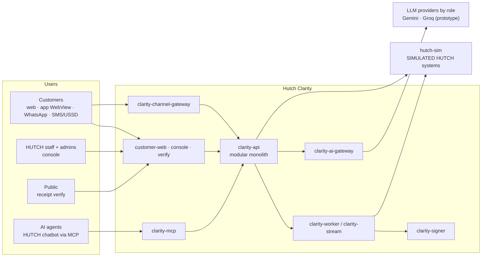

# ARCHITECTURE.md - Hutch Clarity (living document)

> **What this file is:** the *current* architecture and the status of every unit. The plan ([docs/enterprise-plan/](docs/enterprise-plan/README.md)) is the intended design; this file says what is actually true now. It is updated in the same PR as any change that affects it (see the sync matrix in [AGENTS.md §5](AGENTS.md)).
>
> **Last updated:** 2026-10-02 · **Plan baseline:** v1.1 (combined) · **Code status:** modular monolith in progress (backend/services/frontend; src/clarity strangler)

---

## 1. System in one picture

Layers, rules and the full module catalogue: [17 §2–§4](docs/enterprise-plan/17-build-blueprint.md). Stack: [18 §2](docs/enterprise-plan/18-tech-stack-and-ai.md).

## 2. Layers

| Layer | Contents | Rule |
|---|---|---|
| L7 Experience | `frontend/apps/*` | Talks only to BFF routes → `clarity-api` |
| L6 Interfaces | REST routers, MCP server, channel webhooks, consumers | Thin; no business logic |
| L5 Identity / AuthZ | `iam` module, Keycloak, OPA | Deny by default |
| L4 Domain modules | `backend/src/clarity/modules/*` | Talk via `public.py` or events only |
| L3 AI | AI gateway, PII, verifier, RAG | No authority over money |
| L2 Platform | Module system, data access, outbox/bus, idempotency, audit, vault, config, flags, telemetry | Frozen at `baseline-v1` |
| L1 Integration | Ports + drivers (mock / sandbox / hutch) | All HUTCH access goes through here |
| L0 Kernel | Money, IDs, Clock, errors, contracts | No dependencies |

### Runtime profiles

| Profile | Used for | Needs | Status |
|---|---|---|---|
| `lite` | Daily development and unit/contract tests | Python, Node, PostgreSQL | planned (A1) |
| `full` | Integration checks locally, CI integration lane | Docker Compose | planned (I0) |
| `prod` | HUTCH deployment | HUTCH platform | planned (F3) |

Driver matrix: [17 §2.3](docs/enterprise-plan/17-build-blueprint.md). Decision: ADR-0014.

## 3. Module map and status

Status values: `planned` → `in-progress` → `built` → `integrated` → `verified`. Owners are assigned at kickoff. Details per unit: [docs/modules.md](docs/modules.md).

| Unit | Layer | Deployable | Depends on (calls / events) | Status |
|---|---|---|---|---|
| kernel | L0 | all | - | planned |
| platform | L2 | all | kernel | planned |
| integration (ports + drivers) | L1 | api, worker, stream | platform | planned |
| iam | L5 | api | platform, Identity port, Keycloak | planned |
| customer | L4 | api | platform, iam | planned |
| case | L4 | api | platform | planned |
| timeline | L4 | api | integration | planned |
| detection | L4 | api | timeline (snapshot) | planned |
| decision | L4 | api | detection, customer, config | planned |
| actions | L4 | api | decision, integration (commands), customer | planned |
| receipts | L4 | worker | `action.completed`, signer | planned |
| reconciliation | L4 | worker | actions, integration | planned |
| conversation | L4 | api | iam, case, timeline, detection, decision, knowledge, ai | planned |
| notifications | L4 | worker | customer, channel-gateway, templates | planned |
| knowledge | L4 | api, worker | ai, catalogue port | planned |
| proactive | L4 | stream | ingest topics, case, notifications | planned |
| governance | L4 | api | detection, decision, config | planned |
| desk-ops | L4 | api, worker | actions, receipts, case | planned |
| autopsy | L4 | worker | ai, knowledge, case | planned |
| foresight | L4 | worker | ai, insights | planned |
| insights | L4 | worker | all events (read-only) | planned |
| ai-gateway | L3 | own service | providers, PII | planned |
| mcp | L6 | own service | clarity-api | planned |
| signer | L4 support | own service | KMS/key port | planned |
| channel-gateway | L6 | own service | providers, conversation | planned |
| hutch-sim | external (simulated) | own service | - | planned |
| customer-web | L7 | own app | clarity-api | planned |
| console | L7 | own app | clarity-api | planned |
| verify | L7 | own app | clarity-api | planned |

## 4. Cross-cutting decisions (accepted ADRs)

See [docs/adr/README.md](docs/adr/README.md). Summary: modular monolith with satellites (0002), schema per module (0003), outbox + Kafka (0004), detectors + ZEN tables + OPA (0005), deployment contract and infrastructure ports (0006), identity (0007), MCP (0008), AI roles and providers (0009), template-only notifications (0010), policy artefact lifecycle (0011), neutral-licence stack (0012), living documentation (0013), runtime profiles (0014).

## 5. Deviations from the plan

| Date | Deviation | ADR | Plan updated? |
|---|---|---|---|
| - | None yet | - | - |

## 6. How to update this file
- Status changes: when a work package reaches a gate (G1, M1–M4 in [17 §14](docs/enterprise-plan/17-build-blueprint.md)).
- Module map: whenever a module or dependency is added/removed (with the `MODULE.md` of both sides).
- Deviations: every accepted ADR that departs from the plan.
