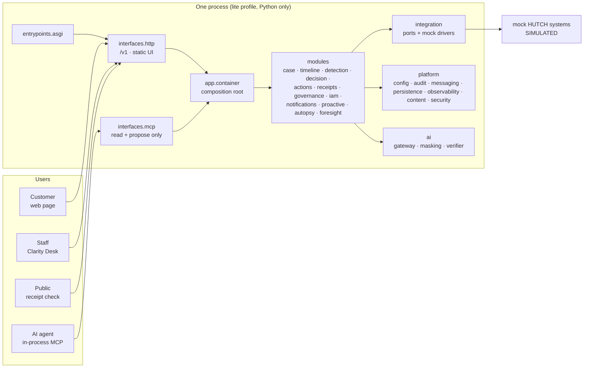

# ARCHITECTURE.md - what is actually built

> The [enterprise plan](docs/enterprise-plan/README.md) is the **intended** design, and [chapter 21](docs/enterprise-plan/21-migration-and-deployment-plan.md) is the plan for getting there. This file is the **as-built** state: what exists, how it is layered, what differs from the plan, and how far the migration has gone. It is updated in the same change as anything that affects it.
>
> **Last updated:** 2026-10-02 (branch `main`) · **Migration:** R1 complete; R2 and R3 in progress; R4 started with H01; R6 includes N01 and P01 · **Tests:** 1,222 passed, 512 infrastructure-dependent skipped · `ruff`, `mypy --strict` (193 files), 3 import contracts and the module-boundary tests all clean

---

## 1. The system today

Everything runs in one process with no infrastructure (`lite` profile, ADR-0027). All HUTCH systems are **simulated and labelled as such**.

## 2. Layers

Enforced on every `make check` by import-linter (`backend/pyproject.toml`) and by `backend/tests/architecture/test_module_boundaries.py`.

| Layer | Package | Rule |
|---|---|---|
| L7 Entry points | `clarity.entrypoints` | Start processes (`asgi.py`) |
| L6 Interfaces | `clarity.interfaces.http`, `clarity.interfaces.mcp` | Thin; independent of each other; no business logic |
| L5 Composition | `clarity.app` | Builds the object graph; the only reader of `CLARITY_PROFILE` |
| L4 Domain | `clarity.modules.*` | Each module imported only through its `public.py` |
| L3 AI | `clarity.ai` | Language only; no authority over money |
| L2 Platform | `clarity.platform.*` | Config (policy resolver, switches), audit, messaging (outbox, event bus), persistence (unit of work, repositories), observability (traces, masked logs), content, security |
| L1 Integration | `clarity.integration` | Every HUTCH access goes through a port |
| L0 Vocabulary | `clarity.contracts`, `clarity.kernel` | Money, IDs, canonical hashing, canonical models |

Money protection:
- `clarity.ai`, `clarity.interfaces.mcp` and the MCP view cannot import the tool layer's capability modules (`layer`, `confirmation`, `budget`, `capability`).
- `modules.actions` exposes two surfaces: `public.py` (vocabulary: errors and result types; it imports no executing code, test-enforced) and `capability.py` (`ToolLayer`, `ConfirmationService`, `RefundBudget`), which only `modules.case` and `app` may import.

## 3. Modules

How modules talk (ADR-0029, plan 21 §11): they **call** each other's `public.py` only along declared edges (`resolution` → case, timeline, detection, decision, actions, receipts; `decision` → detection; `governance` → decision; `receipts` → actions), and **publish events** through the outbox for side effects. Typed, versioned events now carry case, cause, decision, action, receipt, policy and reconciliation facts without personal data.

Registry with status and next migration step: [docs/modules.md](docs/modules.md). Each module's `MODULE.md` lists its public surface, users, dependencies, invariants and tests.

## 4. Decisions

28 ADRs in [docs/adr/](docs/adr/README.md). The ones that shape the code today: rule packs as YAML (0001, amended by 0026), policy as scoped effective-dated data (0002), policy governance (0003), MCP holds no execute capability (0004), idempotency claimed before side effects (0005), confirmation tokens never leave the server (0007), risk from evidence (0008), no model by default (0009), own issuer behind a federation interface (0010), migration approach (0025), runtime profiles (0027), containers for the core and serverless at the edges (0028).

## 5. Migration status (plan 21 §7)

| Step | Status |
|---|---|
| R0 Freeze behaviour | **Done.** `backend/tests/acceptance`: route contract for all 68 routes (public, signed-in, synthetic-only), the four journeys plus subject binding over HTTP, and an OpenAPI snapshot of 56 operations. |
| R0.5 Defects | **D1-D8 fixed.** D5 now resolves rule confidence/windows from effective-dated policy values (M-DET). |
| R1 Restructure | **Done.** Layered layout, `public.py` per module, `MODULE.md` per module, boundary tests, composition root in `app`, entry point in `entrypoints`, docs merged. |
| R2 Infrastructure drivers | **In progress.** PostgreSQL, Kafka, Keycloak, OPA and OpenBao drivers are wired behind parity-tested ports; lite remains Python-only. Remaining full-stack components are tracked in the backlog. |
| R3 Core migration | **In progress.** Wave 1 core work M-ACT, M-CASE, M-DET, M-GOV, M-DEC, M-RCPT and M-REC is implemented. |
| R4 Satellites | **In progress.** H01 is complete: `hutch-sim` runs as a separate HTTP service and the `full` profile selects parity-tested HTTP read and command drivers. Other satellites remain in the backlog. |
| R6 Capabilities | **In progress.** N01 notifications is built with template-only dispatch, preferences, consent, quiet hours, idempotency and fallback. P01 consumes payment, usage and pack facts, publishes deduplicated risks and starts the existing zero-contact resolution flow for duplicate reloads. Other capabilities remain in the backlog. |
| R7 | Not started. Work items with acceptance tests: [docs/backlog](docs/backlog/README.md). |
| R5 Frontend | **Started early by the team:** Next.js 14 `customer-web`, `console`, `verify` and shared packages call the `/v1` API. Build not yet verified on `dev`; the static UI stays until it is. |

## 6. Where this differs from the target

| Area | Target (plan) | Built | Why / when |
|---|---|---|---|
| Persistence | PostgreSQL 18, schema per module, RLS | **Built** (B02, B05). Unit of work and repositories per module; in-memory driver for `demo`, PostgreSQL for `full`, both passing one parity suite. Schema and role per module with grants on its own schema only, and row-level security on customer-scoped tables. | Versioned Alembic migrations before there is data worth keeping |
| Concurrency | Database unique keys and row locks | Case, action, receipt, outbox, OTP and session state share the selected persistence driver. Budget counters remain a later distributed-state concern. | Budget migration |
| Identity | Keycloak (staff, admins, MCP clients) + customer issuer + OPA | Keycloak JWKS and OPA drivers in full; shared OTP/session state; labelled dev drivers in lite | HUTCH federation configuration requires confirmation |
| Events | Outbox → Kafka + Apicurio | Transactional outbox, Kafka/in-process buses, idempotent consumers and core fact events are built. | Apicurio with later R2 work |
| Decision outcomes | ZEN decision table | Versioned ZEN-compatible JSON table with Python parity oracle | Complete (M-DEC) |
| Rule parameters | In the policy store | Confidence and time windows resolve effective-dated policy values | Complete (M-DET) |
| Simulated HUTCH | Separate `hutch-sim` HTTP service in `full` | `lite` keeps in-process mock drivers; `full` selects HTTP read and command drivers; the Clarity API exposes no `/mock/*` routes | Complete (H01); deployment image belongs to X03 |
| MCP | `clarity-mcp`: MCP SDK, Streamable HTTP, OAuth 2.1, token exchange | `clarity.entrypoints.mcp_asgi` serves MCP at `/mcp` (stateless), OAuth 2.1 resource server, scope to profile, MCP Apps cards | A04 done. Token exchange is implemented and refuses rather than forwarding when unconfigured; `clarity-mcp` still reads through the in-process narrow view instead of calling `/v1` over HTTP. |
| Signing key | `clarity-signer` with OpenBao/KMS | OpenBao Transit driver in full; rotatable dev key in lite; isolated render job | Service extraction remains R4 |
| Front end | Next.js 16 apps + shared packages (plan 19) | Static UI served by FastAPI **and** Next.js 14 apps in `frontend/` | R5: verify the build, retire the static UI, move to Next.js 16 |
| Model | Roles with fallback chains; templates by default | Template tier only | R4 (ADR-0009 keeps templates as the default) |
| Channels | Web, app, WhatsApp, SMS/USSD | Web plus template-only notification routing and a simulated dispatch driver; external channel gateway remains | N02 |
| Proactive care | Stream detectors open zero-contact cases from system facts | Duplicate reload, FUP threshold and pack-end detectors publish `risk.detected`; duplicate reloads enter the existing resolution flow | Complete (P01); source interfaces require HUTCH confirmation |
| Rules | 16 candidates | 10 | Remaining candidates need product/CX confirmation |

## 7. Known gaps

Full list in [docs/submission/KNOWN_LIMITATIONS.md](docs/submission/KNOWN_LIMITATIONS.md). Most important:

1. **Single process only.** Correctness under concurrency holds inside one process (1,500 of 1,500 concurrent double confirms give one refund and one receipt); a second replica would not share that state until R3.
2. **Identity is ours, not HUTCH's.** Permission checks are real; the issuer key is generated at startup, so a restart signs everyone out; no refresh, revocation or session store. Development sign-in routes return 404 in the `prod` profile.
3. **No persistence.** A restart loses every case and receipt.
4. **`clarity-mcp` reads in-process, not over `/v1`.** The network transport landed (A04), but the deployable reads through the narrow MCP view rather than calling `clarity-api` over HTTP as plan 07 §10.6 wants. The authorization boundary is real either way and the RFC 8693 token exchange is implemented and tested; the HTTP adapter is not, because no generated Python client exists yet.
5. **Sinhala and Tamil wording is not native-speaker reviewed.** The `language_review` gate in `config/ai/gates.yaml` exists and blocks for exactly this reason: the harness cannot score fluency, so the ratings have to come from people (A05).
6. **Three of five evaluation datasets have no subject built.** `flow` needs C02 (C01 landed the pipeline), `rag` needs K01-K03, `language_review` needs native speakers. Their gates are declared and **block**, rather than being absent and therefore silently satisfied. The intake set holds 20 utterances per language against the 300 plan 22 §10 requires, so that gate blocks too while still reporting its score (si 0.559, ta 0.520, en 0.688, si-en 0.305 against a 0.90 gate).
7. **The assistant has flows, bounded agency and a knowledge registry, but no retrieval.** C01 landed the turn pipeline, conversation state per case (24h TTL) and the turn audit, so a conversation now resumes across channels and every turn is recorded. C02 added the seven flows as versioned YAML in `config/flows/`, with the tool allowlist validated on load and enforced at call time. C03 added the bounded agent step: in an `agentic` state a planner may choose among that state's tools, validated against a per-tool argument allowlist, with per-turn limits and a deterministic fallback; with no model configured, which is the default, an agentic state behaves exactly like a deterministic one. K01 added the knowledge module: source versions with an owner, an effective window, an audience and a language, and structure-aware ingestion into citable chunks.

   K02 added lexical retrieval: BM25 over the filtered candidate set, a deterministic rerank, top-k from `config/ai/retrieval.yaml`, and Singlish query expansion. K03 added grounded answers: the template path quotes the source verbatim and cites it, every citation is verified against the retrieval behind it, and a question with no source gets "I do not know" and a person. `KNOWLEDGE_QA` now reaches its `answered` exit, `GET /v1/knowledge/search` is served by the module rather than the mock store, and `knowledge.published` invalidates the answer cache.

   **The embedding model is the one gap that now has a number on it.** `ModelRole.EMBED` is a declared name with no implementation, `local-bge` is a template stand-in and `RoleRouter.invoke` returns text, so there is no shape in the AI layer that can carry a vector. The `full` profile's pgvector hybrid therefore cannot be built and its retrieval is the same lexical retrieval as `lite`. The consequence is measured: `rag.recall_at_5` passes at 0.967, and `rag.citation_accuracy` **fails at 0.931** because two of 29 answered queries cite a source that is real, effective and audience-allowed but is the wrong document. Lexical signals cannot separate those (half the correct hits in the golden set match a single term), so the gate is left failing rather than lowered.

   Also still missing: the real corpus, which is HUTCH content (the registry is seeded only with the simulated help articles that were already in the repository, labelled `hutch-sim`); a recorded cassette, so no model path has ever been exercised against a model; and the governance change lifecycle, since neither flows nor knowledge sources are published through `PolicyGovernance` (plan 20), which is the same remaining half of the M-GOV dependency in both cases.
8. **Foresight is uncalibrated** and says so in every report.

## 8. Keeping this file true

Update it in the same change as: a new module or dependency, a migration step landing, a decision that differs from the plan (ADR first), or a change to what is built versus planned. History lives in [docs/devlog/](docs/devlog/README.md).
