# Hutch Clarity - Architecture Diagrams

[← 04-enterprise-architecture.md](04-enterprise-architecture.md) · [← Plan index](README.md) · [06-integration-tmf.md →](06-integration-tmf.md)

> Part of the **Hutch Clarity Enterprise Project Plan**. Labels: `[DECK Sx]` = stated in deck slide x · `[PROPOSED]` = expanded by this plan · **ASSUMPTION** / **REQUIRES HUTCH CONFIRMATION** / **PROPOSED TARGET – REQUIRES HUTCH VALIDATION**. See the [index](README.md) for the full legend.

> **Plan v1.1 (2026-10-01).** Updated to match [17](17-build-blueprint.md), [18](18-tech-stack-and-ai.md) and [19](19-policy-change-management.md). Change record: [CHANGES.md](CHANGES.md).

## 8. Architecture Diagrams

All diagrams are created for this plan (`[PROPOSED]`), based on deck slides 4, 7, 8, 11, 12 and 14.

### Diagram 1 - High-Level Solution Architecture

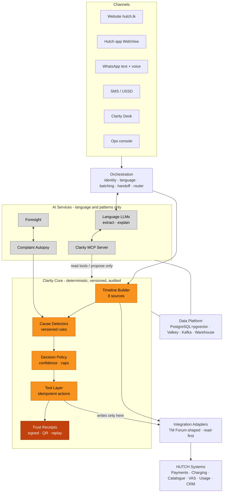

### Diagram 2 - Detailed Enterprise Architecture

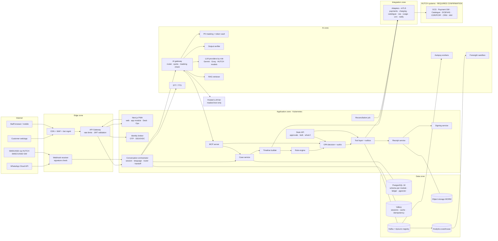

### Diagram 3 - Customer Dispute Request Flow

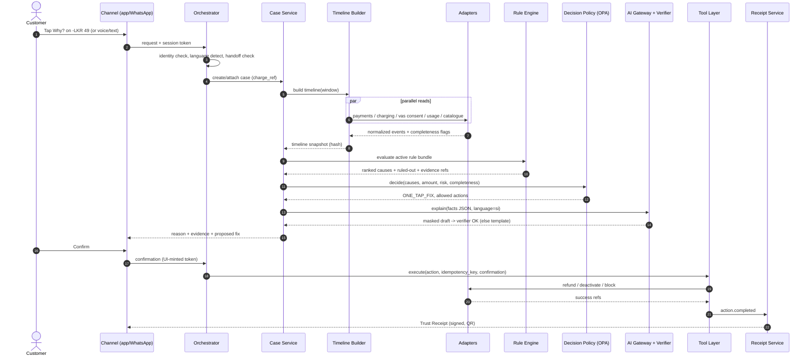

### Diagram 4 - Decision Engine Flow

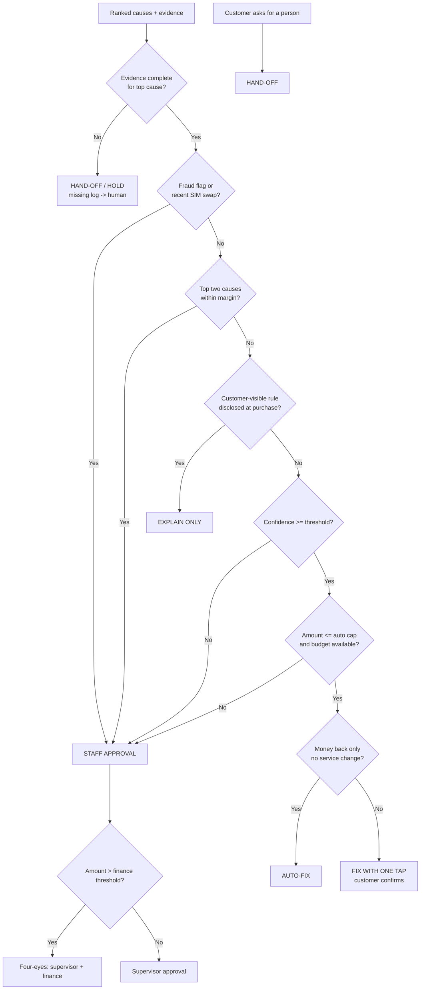

### Diagram 5 - AI + Deterministic Rule Boundary

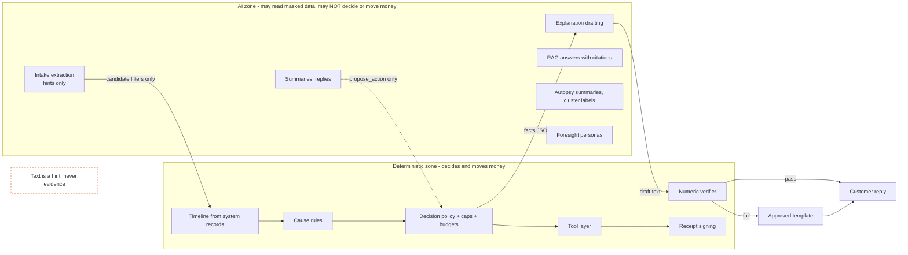

### Diagram 6 - MCP Architecture

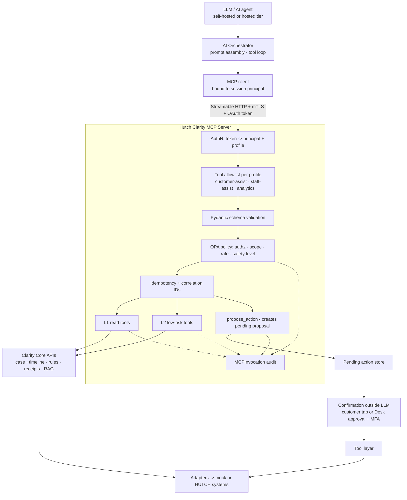

### Diagram 7 - HUTCH Integration Architecture

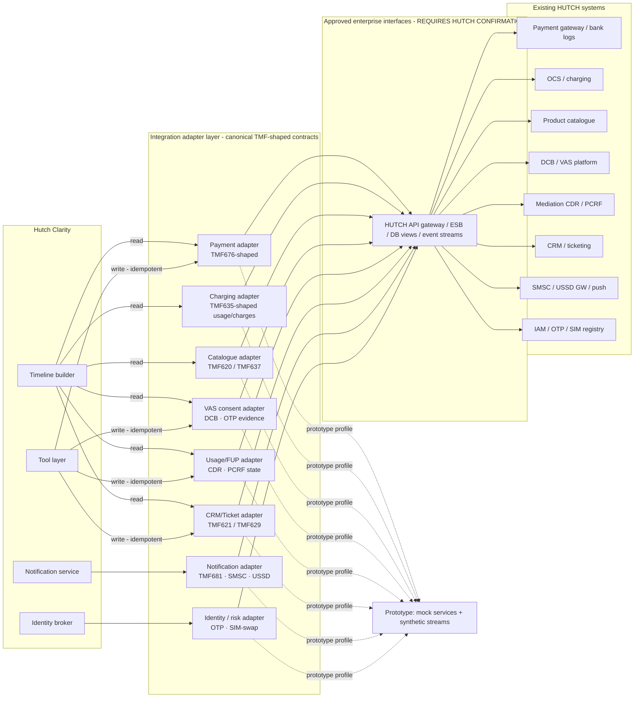

### Diagram 8 - Security Trust Boundaries

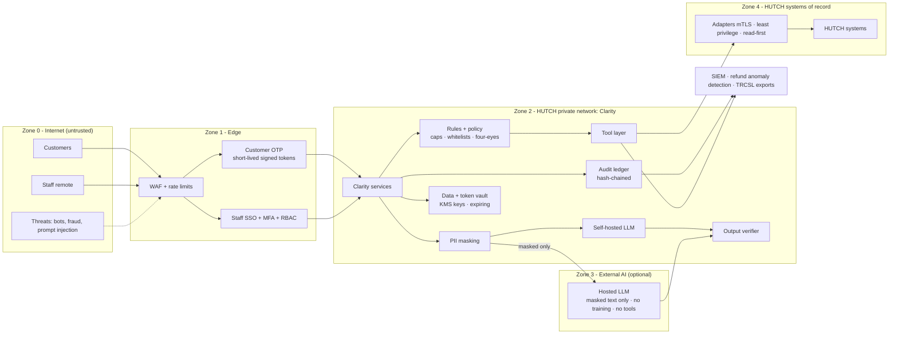

### Diagram 9 - Deployment Architecture (Production)

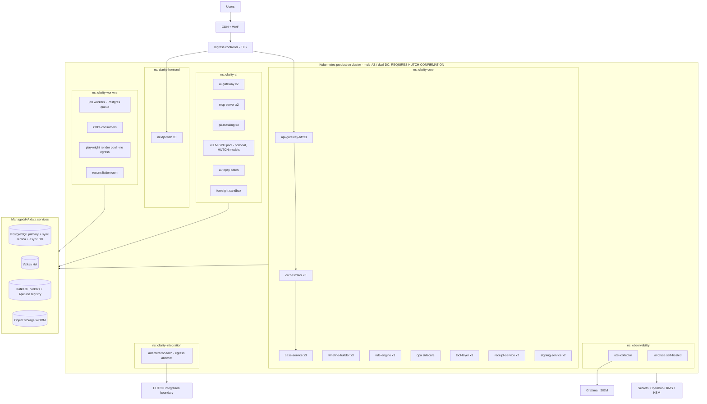

### Diagram 10 - CI/CD Pipeline

```mermaid
flowchart LR
    DEV["Developer"] --> PR["Pull request"]
    PR --> L["Lint + type check<br/>ruff · mypy · eslint · tsc"]
    L --> UT["Unit tests"]
    UT --> RT["Rule golden tests<br/>+ policy tests (opa test)"]
    RT --> SAST["SAST<br/>Semgrep / CodeQL"]
    SAST --> DEP["Dependency + licence scan<br/>SCA · SBOM"]
    DEP --> SEC["Secret scan"]
    SEC --> B["Build images<br/>signed (cosign)"]
    B --> CS["Container scan<br/>Trivy/Grype"]
    CS --> IT["Integration tests<br/>testcontainers + mock adapters"]
    IT --> AIE["AI eval smoke<br/>golden prompts"]
    AIE --> MERGE["Merge to main"]
    MERGE --> DDEV["Deploy DEV - GitOps"]
    DDEV --> QA["Deploy QA<br/>API · MCP · contract · E2E"]
    QA --> STG["Deploy STAGING/UAT<br/>perf · DAST · migration rehearsal"]
    STG --> UAT["UAT sign-off"]
    UAT --> CAB["Change approval / CAB"]
    CAB --> PROD["Production<br/>canary -> progressive"]
    PROD --> MON{"SLOs and refund<br/>anomaly OK?"}
    MON -- No --> RB["Automated rollback<br/>+ feature flag off"]
    MON -- Yes --> DONE["Full rollout"]
```

### Diagram 11 - Data Flow

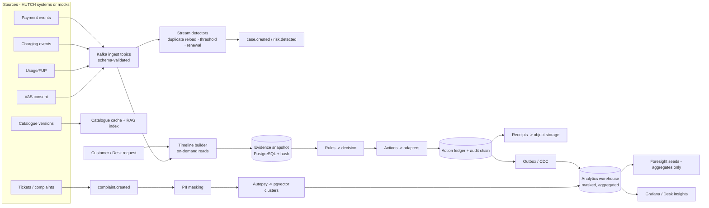

### Diagram 12 - Complaint Autopsy Pipeline

```mermaid
flowchart LR
    IN["Complaints<br/>1788 notes · WhatsApp · email · app · cases"] --> DD["Dedupe<br/>exact + MinHash"]
    DD --> LID["Language detect<br/>si · ta · en · Singlish"]
    LID --> PM["PII masking<br/>Presidio + LK rules"]
    PM --> CS["LLM canonical summary<br/>English canonical form"]
    CS --> EMB["Multilingual embeddings<br/>-> pgvector"]
    EMB --> UM["UMAP reduce"]
    UM --> HD["HDBSCAN clusters<br/>+ noise"]
    HD --> JOIN["Join cluster to rule hits<br/>+ timeline facts"]
    JOIN --> LBL["LLM label + hypothesis<br/>marked unconfirmed"]
    LBL --> CXR["CX engineer review"]
    CXR -->|"known cause"| FLOW["Generate self-service flow<br/>from real read tools only"]
    CXR -->|"new cause"| RP["Draft rule proposal<br/>+ golden tests"]
    FLOW --> REP["Replay on historic cases"]
    RP --> REP
    REP --> APR["Approval: CX + product + compliance"]
    APR --> PUB["Publish behind flag<br/>WhatsApp / app"]
    PUB --> MEAS["Measure: repeats, completion"]
    MEAS --> IN
```

### Diagram 13 - Foresight Pipeline

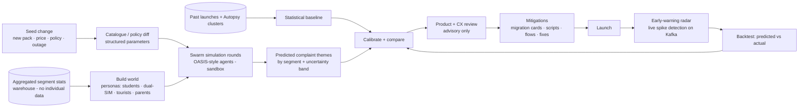

### Diagram 14 - Trust Receipt Generation & Verification Flow

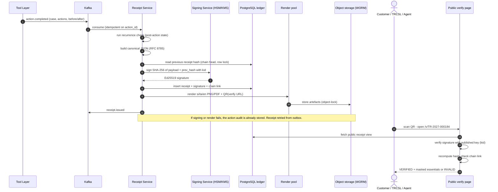

### Diagram 15 - System Context (C4 Level 1)

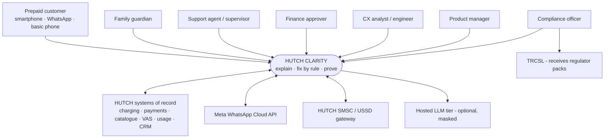

### Diagram 16 - Container View (C4 Level 2)

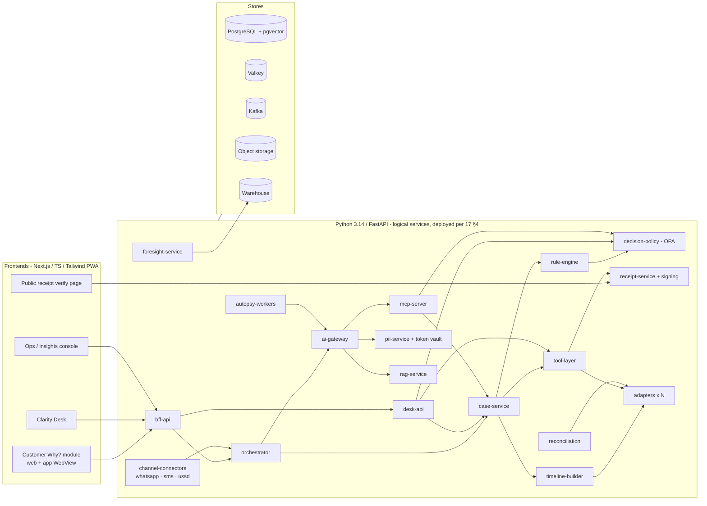

### Diagram 17 - Clarity Core Component Design

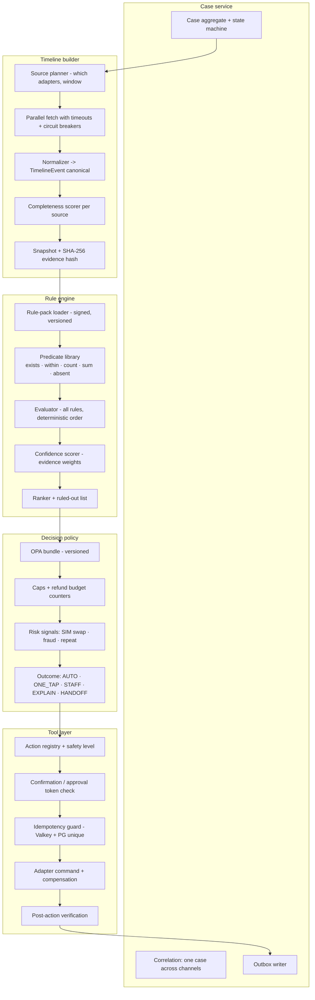

### Diagram 18 - Case Lifecycle State Machine

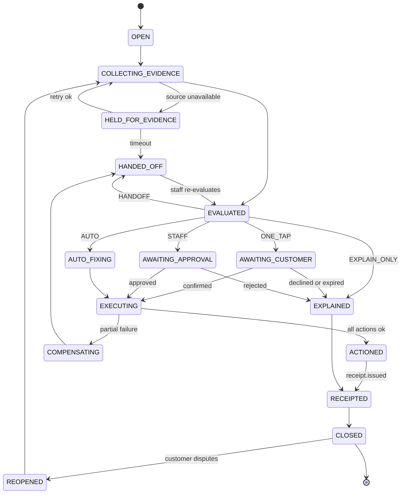

### 8.1 Diagram Index (all 34 architecture diagrams in this plan)

| # | Diagram | Type | Location |
|---|---|---|---|
| 1 | High-Level Solution Architecture | flowchart | §8 |
| 2 | Detailed Enterprise Architecture | flowchart | §8 |
| 3 | Customer Dispute Request Flow | sequence | §8 |
| 4 | Decision Engine Flow | flowchart | §8 |
| 5 | AI + Deterministic Rule Boundary | flowchart | §8 |
| 6 | MCP Architecture | flowchart | §8 |
| 7 | HUTCH Integration Architecture | flowchart | §8 |
| 8 | Security Trust Boundaries | flowchart | §8 |
| 9 | Deployment Architecture (Production) | flowchart | §8 |
| 10 | CI/CD Pipeline | flowchart | §8 |
| 11 | Data Flow | flowchart | §8 |
| 12 | Complaint Autopsy Pipeline | flowchart | §8 |
| 13 | Foresight Pipeline | flowchart | §8 |
| 14 | Trust Receipt Generation & Verification | sequence | §8 |
| 15 | System Context (C4 L1) | flowchart | §8 |
| 16 | Container View (C4 L2) | flowchart | §8 |
| 17 | Clarity Core Component Design | flowchart | §8 |
| 18 | Case Lifecycle State Machine | state | §8 |
| 19 | Adapter Internal Design | flowchart | [§9.4](06-integration-tmf.md) |
| 20 | MCP Propose → Confirm → Execute | sequence | [§10.5](07-mcp.md) |
| 21 | Model Routing Tiers (token strategy) | flowchart | [§12.2](08-ai-architecture.md) |
| 22 | RAG Pipeline | flowchart | [§12.5](08-ai-architecture.md) |
| 23 | Rule Lifecycle (Teach once → publish) | flowchart | [§13.4](09-rules-decision-receipts.md) |
| 24 | Entity-Relationship Diagram | ERD | [§16.2](10-data-api-events.md) |
| 25 | Event Topology (Kafka) | flowchart | [§18.3](10-data-api-events.md) |
| 26 | PII Masking Pipeline | flowchart | [§20.1](11-security-privacy-audit.md) |
| 27 | Audit Architecture (hash chain + WORM) | flowchart | [§20.3](11-security-privacy-audit.md) |
| 28 | Network Zones | flowchart | [§22.3](12-platform-devops-testing-observability.md) |
| 29 | Environment Promotion | flowchart | [§23.1](12-platform-devops-testing-observability.md) |
| 30 | Telemetry Pipeline | flowchart | [§25.1](12-platform-devops-testing-observability.md) |
| 31 | Implementation Gantt Chart | gantt | [§28.2](13-delivery-plan.md) |
| 32 | Critical Path Network | flowchart | [§29](13-delivery-plan.md) |
| 33 | Rollout Path (Steps 1–4) | flowchart | [§34](14-risk-pilot-readiness-operations.md) |
| 34 | Degradation Ladder | flowchart | [§39](15-cost-scale-failure-kpi.md) |

When split into files ([§43](16-gap-submission-repo-docs.md)), Diagrams 1–18 go to `05-architecture-diagrams.md`. The others stay with their chapters.
---

[← 04-enterprise-architecture.md](04-enterprise-architecture.md) · [← Plan index](README.md) · [06-integration-tmf.md →](06-integration-tmf.md)
