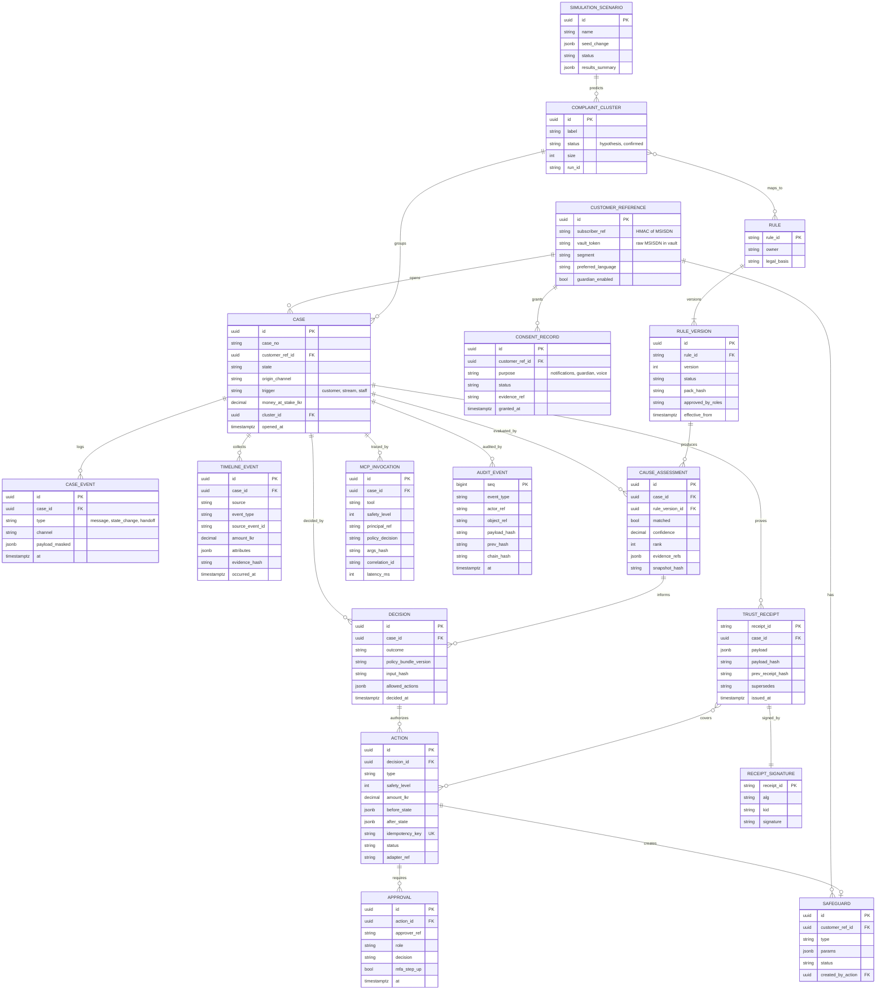
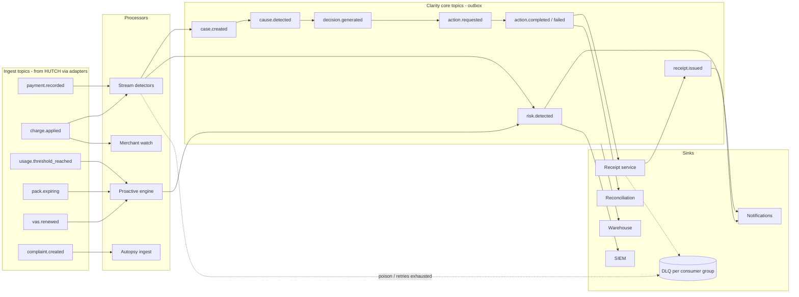

# Hutch Clarity - Data, API & Event Architecture

[← 09-rules-decision-receipts.md](09-rules-decision-receipts.md) · [← Plan index](README.md) · [11-security-privacy-audit.md →](11-security-privacy-audit.md)

> Part of the **Hutch Clarity Enterprise Project Plan**. Labels: `[DECK Sx]` = stated in deck slide x · `[PROPOSED]` = expanded by this plan · **ASSUMPTION** / **REQUIRES HUTCH CONFIRMATION** / **PROPOSED TARGET – REQUIRES HUTCH VALIDATION**. See the [index](README.md) for the full legend.

> **Plan v1.1 (2026-10-01).** Updated to match [17](17-build-blueprint.md), [18](18-tech-stack-and-ai.md) and [19](19-policy-change-management.md). Change record: [CHANGES.md](CHANGES.md).

## 16. Data Architecture

### 16.1 Principles
- **System-of-record stays with HUTCH.** Clarity stores *references*, evidence snapshots (minimal fields + hashes), decisions, actions, receipts and audit.
- **Pseudonymous keys.** Customers are identified by `subscriber_ref` (a keyed HMAC of the MSISDN). The raw MSISDN is held only in the token vault.
- **Partitioning.** High-volume tables (`timeline_event`, `audit_event`, `mcp_invocation`) are partitioned by month and sharded logically by `subscriber_ref` hash `[DECK S14]` ("scales out by phone number").
- **Schema per module.** Each module owns one PostgreSQL schema and one DB role ([17 §2](17-build-blueprint.md)). Application code never joins across schemas; the ERD below is the *logical* model across modules.
- **Retention** per [§20.6](11-security-privacy-audit.md).

### 16.2 Entity-Relationship Diagram - Diagram 24



(Snapshot attributes are minimal; raw PII lives only in the token vault.) Supporting stores outside this ERD: `knowledge_chunk` (pgvector), `complaint_embedding` (pgvector), `proposal`, `refund_budget_counter`, `outbox`, and the policy tables (`policy_artefact`, `policy_version`, `policy_approval`, `policy_activation`) defined in [19](19-policy-change-management.md).

---

## 17. API Architecture

### 17.1 Conventions
- REST/JSON over HTTPS, OpenAPI 3.1 generated from FastAPI/Pydantic, versioned at `/v1`.
- Problem Details (RFC 9457) for errors. `Idempotency-Key` header on all POSTs that change state. `traceparent` propagated.
- Cursor pagination; ETags for optimistic concurrency on approvals.
- AuthN: customer short-lived JWT (after OTP or app token exchange); staff OIDC (SSO + MFA); service-to-service mTLS + workload identity.

### 17.2 Major APIs

| Method & path | Purpose | Caller | Notes |
|---|---|---|---|
| `POST /v1/cases` | Open/attach case from a charge, message or stream trigger | Orchestrator, stream detector, Desk | Body: `{trigger, channel, charge_ref?, text_masked?, language}` → `201 {case_id, state}`. Dedupes on open case for the same charge. |
| `GET /v1/cases/{id}` | Case summary | Channel BFF, Desk | Field-level filtering by role |
| `GET /v1/cases/{id}/timeline` | Evidence timeline | Desk, MCP | `?sources=&types=&from=&to=`; completeness per source |
| `POST /v1/cases/{id}/evaluate` | Run rules + decision policy | Orchestrator, Desk | Returns ranked causes, ruled out, decision outcome, allowed actions, versions |
| `POST /v1/cases/{id}/proposals` | Create action proposal | MCP, Desk | Returns `proposal_id`, display summary |
| `POST /v1/cases/{id}/actions` | Execute an action | Orchestrator (with confirmation token), Desk (with approval) | Requires `Idempotency-Key` + `X-Confirmation-Token` or approval ID → `202 {action_id, status}` |
| `POST /v1/cases/{id}/approve` | Approve/reject a pending action | Supervisor, finance | MFA step-up claim (`acr`) required above threshold; four-eyes check |
| `POST /v1/cases/{id}/handoff` | Route to Desk with reason code | Orchestrator, MCP | |
| `GET /v1/receipts/{id}` | Receipt (owner/staff full; public masked) | Customer, staff, verify page | |
| `POST /v1/receipts/{id}/verify` | Verify signature + chain | Public (rate-limited) | Body optional (uploaded payload) → `{valid, kid, chain_ok, superseded_by?}` |
| `POST /v1/receipts/{id}/replay` | Re-run decision on snapshot | Auditor, staff | Returns match/mismatch report |
| `GET /v1/catalogue/offerings/{id}?at=` | Pack truth label at a point in time | Channels, RAG | Version-aware |
| `GET /v1/customers/me/safeguards` · `PUT …/{type}` | View/change safeguards | Customer (confirmed) | PUT → proposal + confirmation |
| `POST /v1/policy/replays` | Policy what-if job | CX engineer, finance | Async; `202 {job_id}` |
| `POST /v1/bulk-fixes` | Fix-all-like-this (L4) | Supervisor maker | Requires dry-run ID + checker approval |
| `POST /v1/regulator-packs` | Generate TRCSL pack (L4) | Compliance | Async; WORM export; audited |
| `GET /v1/autopsy/clusters` | Cluster list/trends | CX analyst | |
| `POST /v1/simulation/scenarios` · `POST …/{id}/runs` | Foresight scenario + run | Product manager | Async; aggregates only |
| `POST /v1/channels/whatsapp/webhook` | Meta webhook | Meta | Signature (`X-Hub-Signature-256`) verified |
| `POST /v1/channels/ussd/session` | USSD session callback | HUTCH USSD GW | mTLS; **interface REQUIRES CONFIRMATION** |

### 17.3 Example: evaluate

```http
POST /v1/cases/CASE-01J9.../evaluate
Idempotency-Key: 7f9c...
traceparent: 00-4bf9...-01
```
```json
{
  "case_id": "CASE-01J9...",
  "snapshot_hash": "sha256:9a1...",
  "causes": [
    { "rule_id": "VAS_NO_CONSENT", "version": 4, "confidence": 0.96, "evidence_refs": ["ev-17","ev-18"] }
  ],
  "ruled_out": [
    { "rule_id": "PACK_EXPIRY_BURN", "reason": "3.2 GB remaining" },
    { "rule_id": "LOAN_RECOVERY", "reason": "no loan in 30 days" }
  ],
  "decision": { "decision_id": "DEC-...", "outcome": "ONE_TAP_FIX", "policy_bundle_version": "2027.09.1",
                "allowed_actions": ["REFUND","DEACTIVATE_VAS","BLOCK_MERCHANT_UNTIL_OPTIN"], "amount_lkr": "49.00" }
}
```

---

## 18. Event Architecture

### 18.1 Envelope (CloudEvents-style, TMF688-inspired)
`{id, type, source, subject (subscriber_ref), time, schema_version, correlation_id, causation_id, data}`. The Kafka key is `subscriber_ref`, so per-customer ordering holds `[DECK S14]`. Schemas live in the schema registry (Apicurio) with BACKWARD compatibility. Breaking changes become a new type version (`.v2`).

### 18.2 Event catalogue

| Event | Producer | Consumers | Notes |
|---|---|---|---|
| `payment.recorded` | Payments adapter (from HUTCH feed) | Stream detectors, timeline cache | Source of duplicate-reload detection |
| `charge.applied` | Charging adapter | Detectors, timeline cache, merchant watch | High volume |
| `usage.threshold_reached` | Usage adapter | Proactive engine | 80/95% FUP alerts `[DECK S6]` |
| `pack.expiring` | Catalogue/inventory adapter or scheduler | Proactive engine, bill-shock model | |
| `vas.renewed` | VAS adapter | Detectors, proactive engine | Early renewal notice |
| `case.created` | Case service | Desk queue, analytics | |
| `cause.detected` | Rule engine | Decision policy, Autopsy, analytics | |
| `decision.generated` | Decision policy | Orchestrator, Desk, analytics | |
| `action.requested` | Tool layer | Adapters (command), audit | Outbox |
| `action.completed` / `action.failed` | Tool layer | Receipt service, reconciliation, notifications | |
| `receipt.issued` | Receipt service | Notifications, analytics, audit | |
| `complaint.created` | CRM/channel connectors | Autopsy | |
| `risk.detected` | Detectors (bill-shock, refund anomaly, spike radar) | Proactive engine, SIEM, Desk | |
| `mcp.invoked` | MCP server | Audit, SIEM | |
| `rule.published` / `policy.published` | Governance service | Rule engine, OPA bundle server, audit | |
| `reconciliation.mismatch` | Reconciliation | Finance queue, alerting | |

### 18.3 Event topology - Diagram 25



### 18.4 Delivery semantics

| Concern | Design |
|---|---|
| Producing | Transactional outbox in PostgreSQL → relay (Debezium CDC or app relay) → Kafka. No dual writes. |
| Consuming | At-least-once. Consumers are idempotent via `processed_event(id)` tables or natural keys (e.g., `action_id`). |
| Retry | Retry topics with exponential backoff (e.g., 1 m, 5 m, 30 m) → DLQ. Financial command consumers never auto-retry an *ambiguous* adapter result: they query status first. |
| DLQ | Per consumer group. Alert on non-empty. Desk ops view with replay after fix. |
| Ordering | Partition key `subscriber_ref`; per-customer ordering guaranteed |
| Schema versioning | Registry-enforced; `schema_version` in envelope; consumers tolerate unknown fields |
| Backlog / lag | Lag SLO alerts. If detectors lag beyond the threshold, proactive messages are suppressed (stale), and on-demand timeline reads still work ([§39](15-cost-scale-failure-kpi.md)). |
---

[← 09-rules-decision-receipts.md](09-rules-decision-receipts.md) · [← Plan index](README.md) · [11-security-privacy-audit.md →](11-security-privacy-audit.md)
