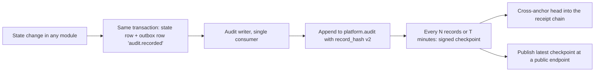

# Audit assurance plan: tamper-evident trail, accountability, detection and recovery

> **Audience:** contributors (human and AI agents). Read [AGENTS.md](../AGENTS.md) first; this plan does not relax any invariant in AGENTS.md §3.
>
> **Status:** In progress. Phases 1, 3 and 4, and the core of Phase 2, landed 2026-10-04; Phase 5 (dashboard) is next. **Created:** 2026-10-04. **Revision:** 7.
>
> **Constraint set by the maintainer:** enterprise-grade recoverability, accountability and security, **with no new infrastructure**. Everything here runs in the `lite` profile (Python only, ADR-0027) and uses only what the `full` profile already has (PostgreSQL with a schema and role per module, OpenBao). Audit access is governed by Clarity's own authorization layer and can be granted to named staff or to roles.

---

## 1. What is being asked

1. A cryptographic log of all work done in the system, for traceability and robustness.
2. Visible in the admin dashboard of the staff console.
3. An admin can assign people, or roles, to watch it.
4. A full recovery system built on it.
5. Suspicious activity raises an alert with a risk rating.
6. Every scenario of this kind thought through, not only the example given.

## 2. What exists today (measured 2026-10-04)

| Piece | What it does |
|---|---|
| `platform/audit/ledger.py` | Append-only, hash-chained. `verify()` recomputes the chain; `proves(record, payload)` lets an auditor match a document without the ledger holding it. Stores payload **hashes**, never payloads. 13 event types. |
| Writers | **Corrected in revision 3.** Only three of the 13 event types were ever appended: conversation turns, rule publications and kill-switch overrides. The MCP server kept calls in its own list, not the ledger. Decisions, executions and receipts were published on the bus and never audited. W1 closed this (section 7). |
| `platform/persistence` (B05) | The `full` profile persists `case.records`, `actions.plans`, `actions.attempts`, `actions.confirmations`, `receipts.chain`, `platform.outbox`, `iam.sessions`, `reconciliation.*` and more, one PostgreSQL schema and role per module, with row-level security. |
| Receipts | Ed25519-signed, hash-chained, publicly verifiable at `/r/{id}`; public keys at `/.well-known/clarity-keys.json`. |
| `modules/reconciliation` | T+1 match against adapter confirmations; publishes `reconciliation.mismatch`. |
| `modules/deskops` | Merchant watch scores (*"counted, never modelled"*), bulk fix under four-eyes, regulator pack, shift handover. |
| `modules/governance` | Change classes, maker-checker, `replay.py` impact reports. |
| Authorization | `AUDIT_READ` permission; `AUDITOR` role; `permissions_for()` applies separation of duties **after** the role union, so stacking roles cannot escape it. |
| Kill switches | `auto_fix_global`, `customer_actions`, `llm_explanations`, `proactive_messages`. |
| Refund budget | `RefundBudget(daily_limit_lkr=...)` on the action path. |

## 3. Gaps found in the code (verified, not assumed)

Each of these was checked against the code on 2026-10-04; the evidence is reproducible.

| # | Gap | Evidence | Consequence |
|---|---|---|---|
| **G1** | **The chain hash covers only `payload_hash` and the previous hash.** `seq`, `event_type`, `actor_ref`, `object_ref`, `case_id`, `at` and `detail` are outside it. | `kernel/canonical.py`: `chain_hash(payload_hash, prev) = sha256(prev + "\n" + payload_hash)`. A script that rewrote a record's approver from `sup:ruwan` to `agent:nadeesha`, changed its type, moved it to another case, backdated it to 2020 and changed the shown amount from 12000.00 to 50.00 left `verify()` returning `intact=True`. | Accountability fails exactly where it matters: *who* did it, *when*, to *which* case. |
| **G2** | **The ledger is in memory and per process.** Nothing persists it, and `entrypoints/mcp_asgi.py` builds its own `Clarity()`, so the API and the MCP server each keep a separate private chain. Multiple uvicorn workers would each keep another. | `self._records: list[AuditRecord]`; `self.audit = AuditLedger()` in `app/container.py`; no `audit` collection in `platform/persistence/schemas.py`. | Every restart erases the trail, and `verify()` then reports the empty remainder as intact. MCP tool calls are recorded where no dashboard can see them. |
| **G3** | **No identity or access event is audited.** | No audit call in the handlers for `/v1/auth/otp/request`, `/v1/auth/otp/verify` (success or failure), `/v1/auth/staff/session` (where a role and step-up are asserted), `/v1/auth/refresh`, nor on 403 denials. | The trail says "sup:ruwan approved" but never records the moment a session *became* sup:ruwan with step-up, nor the failed attempts that precede an attack. |
| **G4** | **Nothing enforces that a state change is audited.** | 30 state-changing routes in `interfaces/http/main.py`; coverage depends on each handler remembering. | "All the work done in the system" is a hope, not a property. |
| **G5** | **Verification is a full recompute.** | `verify()` walks every record. | Fine at demo scale; slow at production volume, which pushes people to run it less often. |
| **G6** | **No audit API, no audit UI.** | No `/v1/audit` route; console admin page shows kill switches only. | Nobody can see the trail. |
| **G7** | **No backup, restore or restore verification anywhere.** | No restore code in the backend. | "Recovery" today means re-seeding synthetic data. |

**Correction to the first draft.** It said cases, decisions, plans and the outbox are not persisted. That is true of the `lite` mock store only. The `full` profile persists all of them (table in section 2). The audit ledger is the one thing persisted in neither profile.

## 4. What changed from the first draft

| Added | Why |
|---|---|
| **W0: hash the whole record** | G1. Building checkpoints, a dashboard or recovery on a chain that cannot protect `actor_ref` would put a signature on records an insider can still rewrite. |
| **One trail through the outbox** | G2. Writing the audit record in the same transaction as the change it describes (I7) makes it atomic, and a single writer gives one ordered chain across every process. |
| **Fail closed on state changes** | If the audit record cannot be written, the action does not happen. Comes free with the outbox approach. |
| **Coverage enforcement** | G4. A test that fails when a state-changing route or tool does not declare its audit event, like the route contract test does for permissions (I9). |
| **Identity and access events** | G3. Sign-in, sign-in failure, role assertion, step-up, refresh, denial, grant changes, audit reads, exports. |
| **Dedicated checkpoint key** | Not the receipt key: a separate key purpose limits the blast radius of a compromise. Rotation by `kid`, old public keys kept so history stays verifiable. |
| **Time integrity** | `at` must be non-decreasing along the chain; injected clock (I11); `occurred_at` and `recorded_at` both kept so backdating shows. |
| **Incremental verification** | G5. Verify from the last signed checkpoint forward; full verification on a schedule; every verification run is itself audited. |
| **Chain-break playbook** | A break flips the existing kill switches to their safe state and pages the assigned monitor, automatically. |
| **Detector liveness** | If checkpointing or risk detection stops, that is itself an alert. Silence must not look like safety. |
| **Alert lifecycle** | Acknowledge, investigate, dispose with a reason, escalate on SLA, deduplicate, four-eyes to close high severity, feed false positives back into thresholds through governance. |
| **Access governance** | Time-boxed grants, periodic recertification, dual control to grant audit authority, audited break-glass. |
| **RACI** | "Responsibility" needs named owners for every control. |
| **Prove what was lost** | After a restore, compare against a checkpoint or witness held outside the backup, and report the exact range lost, not just "restored". |
| **Replay without side effects, then reconcile** | Rebuilding state must never call a HUTCH adapter; actions executed after the backup point are recovered from reconciliation, not re-executed (I8). |
| **Retention, archival, legal hold, erasure, verifiable export** | An immutable log still needs a lifecycle, and evidence handed to a regulator must verify offline. |
| **Threat model with a test per threat** | Every control in this plan is justified by an attack it stops, and every attack has a test. |

## 5. Design

### 5.1 Principles

1. **Integrity comes from keys, not storage.** Tamper evidence does not need WORM storage. The checkpoint signing key lives outside the database (OpenBao Transit in `full`, an isolated key file in `lite`), so someone with full write access to every audit row still cannot forge a checkpoint.
2. **One trail.** Every process writes audit events the same way, and one writer orders them into one chain.
3. **If it cannot be audited, it cannot happen.** State changes fail closed.
4. **Counted, not modelled.** Risk comes from rule packs with thresholds in the policy store, resolved `as_of` the event (I1, I10). No model scores risk; deskops' watch scores already set this precedent.
5. **Nobody audits themselves.** Separation of duties is enforced in the authorization layer, not by convention.
6. **Prove what you lost.** A recovery is complete when it can state what it could not recover.

### 5.2 The record, hash version 2

The hash covers the canonical serialisation of the **whole** record:

```text
record_hash = sha256(canonical_json({
  hash_version: 2, seq, event_type, actor_ref, actor_kind, session_ref,
  object_ref, case_id, payload_hash, detail_hash,
  occurred_at, recorded_at, prev_hash
}))
```

- `detail` stays human-readable and masked, and `detail_hash` binds it, so the text an admin reads is covered.
- `actor_kind` (`customer`, `staff`, `system`, `agent`) and `session_ref` tie every action to the session that performed it, which G3's identity events make traceable to a sign-in.
- `hash_version` lets the rule evolve. **No migration is needed now:** because the ledger has never been persisted (G2), there are no v1 records to carry forward.
- `payload_hash` uses a **keyed** hash (HMAC with a key held alongside the checkpoint key) for any payload that could contain low-entropy values. A plain SHA-256 of a phone number is reversible by enumeration. Today's payloads use `subscriber_ref` pseudonyms (checked); the keyed hash and a test that rejects raw MSISDN patterns keep it that way.

### 5.3 One trail: the audit writer



- **Atomic (I7):** the outbox row commits with the state change or not at all. A crash cannot leave a change with no record, or a record with no change.
- **Ordered:** one consumer assigns `seq`, so the API, the MCP server, the channel gateway and every worker feed **one** chain. A database-level guard (unique `seq`, unique `record_hash`) catches a second writer started by mistake.
- **Fail closed:** a failure to write the outbox row aborts the transaction, so the state change does not happen.
- **Lag is visible:** outbox rows older than a policy threshold and not yet chained raise an `audit.lagging` alert.

### 5.4 Checkpoints and anchoring, with no new infrastructure

| Layer | Stops | Cost |
|---|---|---|
| Hash chain v2 | Editing any field of any record | none |
| Signed checkpoint `(seq, head, recorded_at, kid)` | Truncation, and rewriting the whole table with a consistent new chain | existing signer |
| Cross-anchor: head embedded in the receipt chain | Forging needs two chains broken **and** the key | none |
| Public witness: latest checkpoint at a public endpoint | Anyone who fetched it holds a copy you cannot alter | none |
| Optional, production: RFC 3161 trusted timestamp | Proves *when*, against a third party | an external service; not required |

**Keys.** A dedicated checkpoint key, separate from the receipt key. Rotation by `kid`; every retired public key stays published so old checkpoints still verify. **Compromise procedure:** revoke the `kid`, issue a checkpoint under a new key that cites the last trusted one, and treat anything signed by the revoked key after the suspected compromise time as unverified. Witness copies and receipt cross-anchors made before the compromise still bound what an attacker could have changed.

### 5.5 What is audited, and how coverage is enforced

| Area | Events |
|---|---|
| Existing (13) | evidence collected, cause assessed, decision made, plan proposed, approval recorded, action executed, action compensated, receipt issued, MCP invoked, staff action, override recorded, rule published, turn recorded |
| Identity (new) | OTP requested, OTP verified, **OTP failed**, staff session started (roles and step-up asserted), token refreshed, signed out, session expired |
| Access (new) | **access denied (403)**, audit read, audit export, grant created, grant revoked, grant expired, break-glass used |
| Data access (new) | case viewed by staff, customer record viewed by staff: who looked, not only who changed |
| Assurance (new) | checkpoint issued, verification run and result, alert raised, alert acknowledged, alert disposed, monitor assigned, monitor reassigned |
| Operations (new) | kill switch flipped (exists via switches; ensure the event shape), demo reset, key rotated, backup taken, restore started, restore completed with loss report |

**Enforcement.** A route contract style test enumerates every state-changing route and MCP tool and fails if it does not declare the audit event it emits. A new route that changes state without an audit event fails the build, exactly as one without a permission does today (I9).

### 5.6 Access and accountability

**Grants through the authorization layer.**

| Field | Purpose |
|---|---|
| `subject_ref` | A named staff user, or a role |
| `permission` | `AUDIT_READ`, `AUDIT_ASSIGN`, `ALERT_DISPOSE`, `AUDIT_EXPORT` |
| `granted_by`, `reason` | Accountability for the grant itself |
| `expires_at` | Time-boxed by default; standing access is the exception |

Resolution becomes `role permissions ∪ active grants`, then the separation-of-duties subtraction that `permissions_for()` already applies after the union.

**Separation-of-duties rules.**

1. **A monitor cannot move money.** Holding an audit duty subtracts `MONEY_PERMISSIONS`, as admin roles already do.
2. **Nobody disposes of an alert in which they are the subject.**
3. **Granting audit authority needs two people** (`AUDIT_ASSIGN` follows four-eyes, like approvals above the cap).
4. **Nobody grants themselves anything.**
5. **Audit reads are audited.** Who looked at the trail is part of the trail.

**Recertification.** Every active grant is reviewed on a policy-store schedule; an unreviewed grant expires. **Break-glass** gives immediate access for an incident, is itself an alert, and expires within hours.

**Responsibility (RACI).** The organisational owners are **REQUIRES HUTCH CONFIRMATION**; the roles below are the system roles that would hold each duty.

| Control | Responsible | Accountable | Consulted | Informed |
|---|---|---|---|---|
| Audit trail integrity | platform_admin | security_admin | compliance | auditor |
| Watching the trail and triaging alerts | assigned monitor | compliance | supervisor | security_admin |
| Disposing high-severity alerts | compliance (second person) | security_admin | assigned monitor | auditor |
| Granting audit access | security_admin (two people) | security_admin | compliance | auditor |
| Checkpoint key custody and rotation | security_admin | security_admin | platform_admin | compliance |
| Backup and restore drills | platform_admin | security_admin | compliance | auditor |

### 5.7 Detection and response

**Risk rules, counted from the trail.** Each is a rule pack entry with thresholds in the policy store; none is a model.

| Scenario | Signal | Default band |
|---|---|---|
| Structuring | Repeated refunds just under the four-eyes cap, one actor, short window | high |
| Self-approval | Proposer and approver resolve to the same human across roles or sessions | high |
| Bulk-fix abuse | One operator, many cases, one action, outside the dry-run pattern | high |
| Switch-then-pay | A kill switch turned off, money moved, switch turned back on | high |
| Policy-then-payout | A cap or threshold raised, a large payout, the value restored | high |
| Money without proof | `action.executed` with no matching `receipt.issued` within the window | high |
| Reconciliation gap | `reconciliation.mismatch` (already emitted) | high |
| Chain break | `verify()` fails, or the head does not match the last checkpoint | critical |
| Checkpoint gap | No checkpoint for longer than the policy interval | critical |
| Detector silent | No risk evaluation heartbeat within the interval | critical |
| Brute force | OTP failures per number or per source above threshold | medium |
| SMS pumping | OTP requests across many numbers from one source | medium |
| Snooping | Staff viewing cases of one subscriber with no assigned work on them | medium |
| Collusion | Refunds to the same subscriber across different cases and agents | medium |
| Budget pressure | Daily refund budget consumption accelerating toward the limit | medium |
| Grant abuse | A grant created, used immediately, then revoked | high |
| Mass export | Audit or regulator-pack exports above the normal rate | high |
| Off-pattern | An actor outside their historical hours or case types | low |
| Agent pressure | Repeated MCP proposals near a cap or rejected in a row | low |

Every alert carries the record `seq` numbers that justify it, so a reviewer checks evidence rather than trusting a score.

**Alert lifecycle.** `open → acknowledged → investigating → disposed` with disposition `confirmed`, `false_positive` or `accepted_risk`, each with a mandatory reason. Every transition is an audit event. Duplicate signals group into one alert. Unacknowledged alerts escalate on a policy SLA. Closing a high or critical alert needs a second person. False-positive rates feed threshold changes, which go through governance change classes rather than being edited live.

**Chain-break playbook (automatic).**

1. Flip `auto_fix_global` and `customer_actions` to their safe state: money stops moving.
2. Raise a critical alert to the assigned monitor and the security admin.
3. Record the last verified `seq` and checkpoint.
4. Keep serving reads; refuse state changes until a person with authority clears it with a reason, under four-eyes.

### 5.8 Admin dashboard

| Panel | Shows |
|---|---|
| Chain health | Intact or broken, length, last checkpoint age, last verification run, witness count, writer lag |
| Trail explorer | Records filtered by actor, event type, case, time; hashes and masked detail only, never raw PII; "verify this record" calls `proves()` |
| Actor timeline | Everything one staff user did in a window, including sign-ins and denials |
| Alerts | Queue by severity, risk band, evidence links, lifecycle actions |
| Monitors | Who is assigned to what, since when, shift handover |
| Access | Active grants, expiry, recertification due, break-glass history |
| Recovery | Last backup, last restore drill and its loss report |
| Export | A verifiable bundle for an investigation or the regulator pack |

### 5.9 Recovery

**Targets.** RPO and RTO are **REQUIRES HUTCH CONFIRMATION**. The design below supports a near-zero RPO for the trail, because every audit record is committed with its state change.

**What is protected.**

| Data | Where | Recovered by |
|---|---|---|
| Domain state (cases, plans, attempts, confirmations, receipts, outbox, sessions) | PostgreSQL in `full`, already | PostgreSQL backup and point-in-time recovery |
| Audit trail and checkpoints | `platform.audit`, `platform.audit_checkpoints` (new) | Same |
| Policy, rules, templates | Git (`rules/packs`, `config/policy`) | Git |
| Public keys | Published, and in the export bundle | Re-publication |
| Private keys | OpenBao | OpenBao's own backup; **REQUIRES HUTCH CONFIRMATION** for escrow |

**Restore procedure.**

1. Restore the database to the target point.
2. Verify the audit chain from genesis, or from the last checkpoint inside the backup.
3. **Compare against the newest checkpoint held outside the backup** (the public witness or the receipt cross-anchor). If the restored head is older, report the exact `seq` range lost. A restore without this step cannot tell a complete recovery from a silent loss.
4. Rebuild derived state by **replay without side effects**: replay reads recorded outcomes and never calls a HUTCH adapter.
5. **Reconcile** against the adapters for the lost window. Money that moved after the backup point is re-ingested from confirmations, never re-executed (I8: a duplicate gets the original outcome).
6. Record `restore.completed` with the loss report, and keep state changes refused until a person clears it.

**Backups.** Encrypted, checksummed, and access to them audited. A backup nobody has restored is a rumour.

**Drills.** A destroy-and-restore drill runs in the existing `full` CI lane: seed, back up, destroy, restore, verify, compare against the external checkpoint, assert state equality, assert the loss report. Because no new infrastructure is involved, this runs on every merge, which most enterprises cannot afford to do.

### 5.10 Lifecycle and privacy

- **Retention** comes from the policy store (I10); the period is **REQUIRES HUTCH CONFIRMATION**.
- **Archival** seals a range into a segment whose head is covered by a signed checkpoint, so archived history still verifies.
- **Legal hold** blocks archival and deletion for a case under investigation.
- **Erasure against immutability.** Records hold pseudonyms (`subscriber_ref`) and masked detail, never raw personal data, so a subject's erasure is served by deleting the mapping from pseudonym to person, not by editing the chain. Where a detail field must hold personal data, it is encrypted per subject and erased by destroying that key (crypto-shredding); the chain covers the ciphertext's hash and stays intact. Applicability of Sri Lanka's Personal Data Protection Act No. 9 of 2022 is **REQUIRES HUTCH CONFIRMATION**.
- **Subject access.** A customer's own trail can be exported, masked, through the same export path.
- **Verifiable export.** The bundle holds the records, the covering checkpoints, the public keys and a small offline verifier, so a regulator checks it without trusting Clarity.

### 5.11 Where it lives

| Concern | Location | Layer |
|---|---|---|
| Record, hash v2, chain, checkpoint verification | `platform/audit` | L2 |
| Audit writer (outbox consumer) | `platform/audit` | L2 |
| Persistence | `platform.audit`, `platform.audit_checkpoints` collections in `platform/persistence` (B05 pattern); writer role with INSERT and SELECT only | L2 |
| Grants and their resolution | Authorization layer: resolution beside `permissions_for()` in `platform/security`, grant records owned by `modules/iam` | L2, L4 |
| Risk rules, alerts, assignment, playbook | New module `modules/assurance`, consuming outbox events only (I22, ADR-0029) | L4 |
| API | `/v1/audit/*`, `/v1/assurance/*` in `interfaces/http`, every route permissioned | L6 |
| Dashboard | Console app, new Audit section | frontend |

`modules/assurance` is reached only from `app` and `interfaces.http`, and nothing on a money path calls it: it reacts to events, so a slow or failing rule can never block a refund. The new module and its edges go into `docs/modules.md`, `ARCHITECTURE.md`, `tests/architecture/test_module_dependencies.py` and plan 21 §11.2.

## 6. Threat model: what each control stops

| Threat | Control | Test |
|---|---|---|
| Insider edits who approved a refund | Hash v2 covers `actor_ref` | Property test: any single-field edit is detected |
| Insider deletes a record | Contiguous `seq`, chain | Property test: any deletion is detected |
| Insider rewrites the whole table consistently | Signed checkpoint, key outside the database | Rewrite test: rebuilt chain fails checkpoint comparison |
| Insider truncates recent records | Checkpoint plus external witness | Truncation test: loss range reported |
| Insider backdates a record | Monotonic `recorded_at`, chain | Reorder and backdate tests |
| Two processes fork the chain | Single writer; unique `seq` and `record_hash` | Concurrency test with two writers |
| A change happens without a record | Outbox in the same transaction; fail closed | Crash-injection test between state and audit |
| A new route forgets to audit | Coverage contract test | Build fails on an undeclared state-changing route |
| Signing key stolen | Key rotation, revocation, witnesses, cross-anchor | Compromise drill |
| Monitor approves their own suspicious refund | SoD: audit duty removes money permissions | Authorization test |
| Admin grants themselves audit access | No self-grant; four-eyes on grants | Authorization test |
| Audit trail used to find a customer | Pseudonyms, masked detail, keyed hashes, audited reads | Test rejecting raw MSISDN in payloads; read-audit test |
| Restore silently loses records | External checkpoint comparison | Drill asserts the loss report |
| Replay re-executes a refund | Replay without adapters; idempotency (I8) | Replay test with adapter call counter at zero |
| Detection quietly stops | Liveness heartbeat | Silence test raises a critical alert |

## 7. To-do list

Updated as work proceeds. Checkbox states are the source of truth.

### Phase 0: Decide and record (no code)

- [x] ADR: audit record hash version 2 covers the whole record ([ADR-0033](adr/0033-audit-record-hash-covers-the-whole-record.md))
- [x] ADR: one trail through the outbox; state changes fail closed without an audit record ([ADR-0034](adr/0034-one-persisted-audit-trail.md))
- [x] ADR: signed checkpoints with a dedicated key; anchoring by witness, no WORM storage ([ADR-0035](adr/0035-signed-audit-checkpoints-with-a-separate-key.md))
- [x] ADR: audit access as time-boxed grants under separation of duties ([ADR-0036](adr/0036-audit-access-as-grants-under-separation-of-duties.md))
- [ ] ADR: retention, archival, legal hold and erasure for the audit trail
- [ ] Record RPO, RTO and retention, or mark them **REQUIRES HUTCH CONFIRMATION** with a stated interim value
- [ ] Add the new module to `docs/modules.md`, `ARCHITECTURE.md` and plan 21 §11.2 once its ADR is accepted

ADR numbers are assigned when each is written. Check `docs/adr/` first: `plan.md` has reserved 0032, and two collisions on that number have already happened.

### Phase 1: Integrity foundation

- [x] **W0** Hash version 2 over the whole record; `detail_hash`; `actor_kind`, `session_ref`, `occurred_at`, `recorded_at`
- [x] **W1** Persist the trail: `platform.audit` and `platform.audit_head` collections through the existing persistence port, ordered insert-only append (checkpoints move to Phase 2)
- [ ] **W1** Database-level append-only: revoke UPDATE and DELETE on `platform.audit` from the writing role. Blocked on an insert-only write path: the generic row store writes with `INSERT ... ON CONFLICT DO UPDATE`, which needs UPDATE. Not verifiable in the container this was built in (no PostgreSQL)
- [x] **W1** Audit writer: an `audit` consumer group on every domain event type, deduplicated; the MCP server writes to the shared trail
- [x] **W1** Startup verification; a broken chain stops the process; `CLARITY_AUDIT_BREAK_GLASS` starts it and is recorded; a demo reset carries the trail and records itself
- [x] **W2** Identity and access events: OTP requested, verified and failed; staff session started with roles and step-up; token refreshed and rejected; access denied with reason. `session_ref` links every later action to its sign-in
- [x] **W2** Who made each state-changing request (`request.performed`): an approval's domain event names a mode, `staff_approved`, never the supervisor, so the HTTP layer records the principal. **Not fail closed**: written after the handler commits; the domain events remain the atomic record
- [x] **W2** Coverage contract: recording is opt-out, exemptions carry a reason and must name real routes, and every recorded route is driven by a test (`tests/security/test_audit_coverage.py`). MCP tools are covered because every call is recorded (W1)

| # | Given | When | Then |
|---|---|---|---|
| 1 | a stored record | any one field is changed | `verify()` reports it broken at that `seq` |
| 2 | records written by the API and the MCP server | both run | one chain, contiguous `seq` |
| 3 | an approval | the process restarts | the record is still there and the chain verifies |
| 4 | a state change | the audit write fails | the state change did not happen |
| 5 | a new state-changing route with no audit event | the suite runs | the build fails |
| 6 | a wrong OTP code | it is submitted | an `otp.failed` record exists |
| 7 | a stepped-up supervisor approves | the approval succeeds | the record names the supervisor and the session that signed in with step-up |

### Phase 2: Tamper resistance

- [x] Dedicated checkpoint key (`CLARITY_AUDIT_SIGNER_KEY_NAME`, or a local key in `KEYS_DIR`); `kid` rotation; retired public keys stay valid
- [x] Signed checkpoints every N records or T minutes (`config/policy/audit.yaml`: 50, PT15M); each recorded as `checkpoint.issued`; startup verifies against them
- [ ] Cross-anchor the head into the receipt chain. **Deferred** (ADR-0035): it changes the signed receipt payload, a receipt contract change with its own review; the public witness gives an external copy meanwhile
- [x] Public endpoint for the latest checkpoint: `GET /.well-known/clarity-audit-checkpoint.json`; `verify(witness=...)` uses a saved copy
- [ ] Incremental verification from the last checkpoint; scheduled full verification. **Deferred**: verification still walks the whole chain (correct, slower at volume). Startup verification is recorded in `ledger.opened`
- [ ] Keyed payload hashes. **Deferred** pending where the HMAC key lives and how it rotates
- [x] A test that no form of a customer's number reaches the trail (W2, `test_no_raw_phone_number_reaches_the_trail`)

| # | Given | When | Then |
|---|---|---|---|
| 1 | a table rewritten with a consistent new chain | verification runs | it fails against the last checkpoint |
| 2 | the newest records deleted | verification runs | the lost `seq` range is reported |
| 3 | a rotated key | an old checkpoint is verified | it still verifies |

### Phase 3: Access and accountability

- [x] Grants in the authorization layer, time-boxed, with the five separation-of-duties rules (`modules/iam/grants.py`; resolved into `Principal.granted` at token verification; any driver wrapped so they hold under OPA)
- [x] `GET /v1/audit` paged and filtered by actor, type and case; hashes and masked detail only, never a payload; every read recorded as `audit.read`; the response carries the checkpoint verification
- [x] Recertification (unreviewed grants lapse after `audit.grant.review_interval`); break-glass for admins, PT4H, recorded as `grant.break_glass`
- [x] Record a grant's expiry or lapse as `grant.expired` / `grant.lapsed`, once, with `occurred_at` the exact end: a per-process sweep (`audit.grant.sweep_interval`, PT1M) and a check on every authenticated request

| # | Given | When | Then |
|---|---|---|---|
| 1 | a user granted an audit duty | they try to approve money | refused |
| 2 | an admin | they grant themselves audit access | refused |
| 3 | an expired grant | the user reads the trail | refused |
| 4 | any audit read | it succeeds | an `audit.read` record exists |

### Phase 4: Detection and response

- [x] `modules/assurance`, a leaf module reading the trail ([ADR-0037](adr/0037-assurance-is-a-leaf-module-that-reacts-to-the-trail.md)). It reads the trail rather than subscribing to the bus: the trail already holds every event (W1) **and** the identity and request records the bus never carried, which the rules need to attribute an amount to a person
- [x] Eight counted rules with thresholds in `config/policy/audit.yaml`: structuring, self-approval, money without proof, switch-then-pay, break-glass used, mass audit read, denial spike, brute force. Each alert cites the `seq` numbers that justify it
- [ ] The remaining scenarios in 5.7: snooping, collusion, budget pressure, grant abuse, off-pattern, agent pressure. Each needs a signal the trail does not yet carry, or a baseline of normal behaviour to compare against
- [x] Alert lifecycle (`open`, `acknowledged`, `investigating`, `disposed` with a reason), repeats folded into the open alert, escalation once on `assurance.alert.ack_sla`, closure by a second person for high and critical, never by the subject
- [x] Liveness: a heartbeat on every detection run including a quiet one, checked from outside the loop; a checkpoint gap is critical
- [ ] A liveness heartbeat for the audit *writer* specifically (outbox lag): the writer is in-process today, so a stalled writer shows as a stalled request rather than a quiet queue
- [x] Chain-break playbook: `auto_fix_global` and `customer_actions` to the safe side, only ever towards safe, recorded

| # | Given | When | Then |
|---|---|---|---|
| 1 | five refunds just under the cap by one actor in the window | detection runs | a high alert citing those five records |
| 2 | a chain break | it is detected | `auto_fix_global` is off and a critical alert exists |
| 3 | detection stopped | the interval passes | a critical liveness alert |
| 4 | a high alert | its subject tries to dispose of it | refused |

### Phase 5: Dashboard

- [ ] Console Audit section with the panels in section 5.8
- [ ] Browser tests for chain health, the trail explorer, alert disposition and assignment

### Phase 6: Recovery

- [ ] Backups encrypted and checksummed; backup access audited
- [ ] Restore procedure with external checkpoint comparison and a loss report
- [ ] Replay without side effects; reconciliation for the lost window
- [ ] Destroy-and-restore drill in the `full` CI lane on every merge
- [ ] Restore runbook as a walkthrough, re-verified with each drill

| # | Given | When | Then |
|---|---|---|---|
| 1 | a backup and later activity | the database is restored | the loss report names the exact `seq` range lost |
| 2 | a restore | state is rebuilt by replay | zero adapter calls |
| 3 | a refund executed after the backup point | reconciliation runs | it is re-ingested once, not executed again |

### Phase 7: Lifecycle

- [ ] Retention and archival into sealed, checkpointed segments
- [ ] Legal hold
- [ ] Erasure by pseudonym mapping and crypto-shredding
- [ ] Verifiable export bundle with an offline verifier; regulator pack uses it

## 8. Decisions needed from the maintainer

1. **RPO and RTO.** Needed to size backups and set the drill's pass criteria.
2. **Retention period** for the trail.
3. **Scope of fail closed:** every state change, or money paths only with other changes raising a degraded-audit alert.
4. **Organisational owners** for the RACI in section 5.6.

## 9. Risks

| Risk | Mitigation |
|---|---|
| Fail closed stops the business if the writer stalls | Lag alert well before the threshold; the outbox holds rows durably; playbook to restore the writer |
| Alert fatigue makes monitors stop looking | Deduplication, bands, false-positive feedback through governance, liveness alerts kept rare |
| Coverage test becomes a box-ticking exercise | Each declared event is asserted by a test that drives the route |
| Checkpoint key held by the same people who run the database | Key custody with security_admin, separate from platform_admin, per the RACI |
| Thresholds become hard-coded constants | I10 and the existing policy-value checks apply to every rule |

## 10. Honest assessment

The most important finding is **G1**. The current ledger looks cryptographic and verifies cleanly, but it protects only the hash of the payload, so the fields an investigation depends on (who, when, which case) can be rewritten without trace. Any dashboard, alert or recovery feature built before W0 would present those editable fields as trustworthy. W0 is small and must come first.

The second is **G2**. The trail is lost on every restart and split across processes, which makes "full recovery" impossible for the one dataset recovery most needs. W1 reuses the persistence and outbox machinery the `full` profile already has, so it adds no infrastructure.

Everything after Phase 2 is larger in volume than in difficulty, and every part of it runs without new infrastructure.

**Work in progress note.** Uncommitted edits adding `AuditRecordRow` and `AuditCheckpointRow` to the mock store appeared in the working tree on 2026-10-04 without being written in the session that produced this plan. They persisted the **version 1** chain hash. They were set aside with `git stash` (message "unexplained audit rows (v1 hash)") rather than deleted, and W1 was built on the persistence port instead, so the trail works in both profiles rather than only the mock store. Nothing in them is used.
