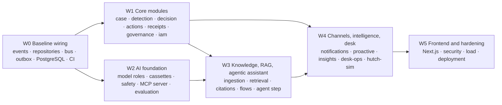

# Backlog: build on the baseline, module by module

Every work item for the migration (plan [21](../enterprise-plan/21-migration-and-deployment-plan.md)) and the agentic assistant (plan [22](../enterprise-plan/22-agentic-assistant-and-rag.md)), as issues ready for GitHub. Each issue has context, scope, dependencies, **Given/When/Then acceptance tests with the test file they belong in**, and a **Definition of Done**.

## How the waves build on each other

Build bottom-up. A wave starts when the issues it depends on are done; inside a wave, issues without dependencies on each other run in parallel.



## W0 Baseline wiring

| Issue | Title | Area | Priority | Depends on |
|---|---|---|---|---|
| [B01](issues/B01-event-contracts-typed-versioned-payloads-for-eve.md) | Event contracts: typed, versioned payloads for every catalogued event | `platform` | P0 | - |
| [B02](issues/B02-unit-of-work-and-repository-interfaces-per-modul.md) | Unit of work and repository interfaces per module (in-memory drivers) | `platform` | P0 | - |
| [B03](issues/B03-event-bus-port-in-process-driver-and-kafka-drive.md) | Event bus port: in-process driver and Kafka driver with one parity suite | `platform` | P0 | B01 |
| [B04](issues/B04-outbox-in-the-unit-of-work-relay-and-consumer-fr.md) | Outbox in the unit of work, relay, and consumer framework with dead-letter handling | `platform` | P0 | B02, B03 |
| [B05](issues/B05-postgresql-repositories-schema-and-role-per-modu.md) | PostgreSQL repositories: schema and role per module, migrations, row-level security | `platform` | P0 | B02 |
| [B06](issues/B06-first-event-driven-flow-receipts-issued-on-actio.md) | First event-driven flow: receipts issued on action.completed | `receipts` | P0 | B01, B04 |
| [B07](issues/B07-typed-settings-and-profile-wiring-no-environment.md) | Typed settings and profile wiring: no environment reads outside the composition root | `app` | P1 | - |
| [B08](issues/B08-observability-baseline-traces-metrics-masked-log.md) | Observability baseline: traces, metrics, masked logs, correlation IDs | `platform` | P1 | B04 |
| [B09](issues/B09-frontend-sdk-generated-from-openapi-checked-in-c.md) | Frontend SDK generated from OpenAPI, checked in CI | `frontend` | P1 | - |
| [B10](issues/B10-ci-lanes-full-profile-integration-blocking-front.md) | CI lanes: full-profile integration, blocking frontend build, real secret scanning and SBOM | `ci` | P1 | B05 |

## W1 Core modules on the baseline

| Issue | Title | Area | Priority | Depends on |
|---|---|---|---|---|
| [M-CASE](issues/M-CASE-case-split-orchestration-into-a-resolution-servi.md) | Case: split orchestration into a resolution service, case aggregate on repositories | `case` | P0 | B02, B06 |
| [M-DET](issues/M-DET-detection-rule-parameters-in-the-policy-store-d5.md) | Detection: rule parameters in the policy store (D5) and four more rule packs | `detection` | P0 | B02 |
| [M-DEC](issues/M-DEC-decision-outcome-matrix-as-a-gorules-zen-decisio.md) | Decision: outcome matrix as a GoRules ZEN decision table | `decision` | P1 | M-DET |
| [M-ACT](issues/M-ACT-actions-database-idempotency-row-locks-approval.md) | Actions: database idempotency, row locks, approval.requested, retry after transient failure | `actions` | P0 | B05, B04 |
| [M-RCPT](issues/M-RCPT-receipts-signer-service-port-with-openbao-kms-dr.md) | Receipts: signer service port with OpenBao/KMS driver, isolated rendering | `receipts` | P1 | B06 |
| [M-GOV](issues/M-GOV-governance-persisted-policy-artefacts-approvals.md) | Governance: persisted policy artefacts, approvals and activations; Policy Studio API | `governance` | P1 | B05 |
| [M-IAM](issues/M-IAM-identity-keycloak-for-staff-and-mcp-clients-opa.md) | Identity: Keycloak for staff and MCP clients, OPA for authorization, shared OTP state | `iam` | P1 | B05 |
| [M-REC](issues/M-REC-reconciliation-module-daily-match-of-actions-aga.md) | Reconciliation module: daily match of actions against adapter confirmations | `reconciliation` | P2 | B04 |

## W2 AI foundation

| Issue | Title | Area | Priority | Depends on |
|---|---|---|---|---|
| [A01](issues/A01-ai-gateway-model-roles-config-ai-models-yaml-fal.md) | AI gateway: model roles, config/ai/models.yaml, fallback chains, quota-aware buckets | `ai` | P0 | - |
| [A02](issues/A02-recorded-responses-cassettes-no-live-model-calls.md) | Recorded responses (cassettes): no live model calls in CI | `ai` | P0 | A01 |
| [A03](issues/A03-safety-pii-masking-coverage-per-language-and-the.md) | Safety: PII masking coverage per language and the guard role | `ai` | P0 | A01 |
| [A04](issues/A04-mcp-server-over-the-network-sdk-streamable-http.md) | MCP server over the network: SDK, Streamable HTTP, OAuth 2.1 resource server, new tools | `interfaces.mcp` | P0 | M-IAM |
| [A05](issues/A05-evaluation-harness-per-language-golden-sets-metr.md) | Evaluation harness: per-language golden sets, metrics and release gates | `ai` | P1 | A02 |

## W3 Knowledge, RAG and agentic assistant

| Issue | Title | Area | Priority | Depends on |
|---|---|---|---|---|
| [K01](issues/K01-knowledge-module-source-registry-and-governed-in.md) | Knowledge module: source registry and governed ingestion | `knowledge` | P0 | B02, M-GOV |
| [K02](issues/K02-index-and-retrieval-bm25-lite-pgvector-hybrid-fu.md) | Index and retrieval: BM25 (lite), pgvector hybrid (full), filters and rerank | `knowledge` | P0 | K01, A01 |
| [K03](issues/K03-grounded-answers-compose-with-citations-citation.md) | Grounded answers: compose with citations, citation verifier, refusal, semantic cache | `knowledge` | P0 | K02, A01 |
| [C01](issues/C01-conversation-orchestrator-and-state-store.md) | Conversation orchestrator and state store | `conversation` | P0 | B02 |
| [C02](issues/C02-flow-registry-and-the-seven-flows.md) | Flow registry and the seven flows | `conversation` | P0 | C01, M-GOV |
| [C03](issues/C03-bounded-agent-step-planner-with-tool-allowlist-l.md) | Bounded agent step: planner with tool allowlist, limits and fallback | `conversation` | P0 | C02, A01, A02, A04 |
| [C04](issues/C04-intake-keyword-rules-first-extract-role-when-uns.md) | Intake: keyword rules first, extract role when unsure, Singlish support | `conversation` | P1 | A01, A02 |
| [C05](issues/C05-customer-chat-experience-on-flows-confirm-cards.md) | Customer chat experience on flows: confirm cards, citations, handoff | `frontend` | P1 | C02, B09 |

## W4 Channels, intelligence and desk

| Issue | Title | Area | Priority | Depends on |
|---|---|---|---|---|
| [N01](issues/N01-notifications-module-templates-preferences-conse.md) | Notifications module: templates, preferences, consent, dispatch, delivery status | `notifications` | P1 | B04 |
| [N02](issues/N02-channel-gateway-whatsapp-sandbox-sms-and-ussd-si.md) | Channel gateway: WhatsApp sandbox, SMS and USSD simulator, verified webhooks | `channel-gateway` | P2 | C01, N01 |
| [P01](issues/P01-proactive-module-stream-detectors-and-risk-detec.md) | Proactive module: stream detectors and risk.detected | `proactive` | P1 | B03, B04 |
| [I01](issues/I01-insights-projections-and-console-dashboards.md) | Insights: projections and console dashboards | `insights` | P2 | B04 |
| [D01](issues/D01-desk-operations-bulk-fix-with-four-eyes-merchant.md) | Desk operations: bulk fix with four-eyes, merchant watch, regulator pack, shift handover | `deskops` | P2 | M-ACT, M-GOV |
| [AU01](issues/AU01-autopsy-event-fed-embeddings-via-the-embed-role.md) | Autopsy: event-fed, embeddings via the embed role, review workflow | `autopsy` | P2 | A01, B04 |
| [F01](issues/F01-foresight-backtest-and-calibration-report.md) | Foresight: backtest and calibration report | `foresight` | P3 | AU01 |
| [H01](issues/H01-hutch-sim-as-an-http-service-with-http-drivers.md) | hutch-sim as an HTTP service with HTTP drivers | `integration` | P1 | B07 |

## W5 Frontend and hardening

| Issue | Title | Area | Priority | Depends on |
|---|---|---|---|---|
| [FE01](issues/FE01-frontend-verified-build-static-ui-retired-next-j.md) | Frontend: verified build, static UI retired, accessibility and language review | `frontend` | P1 | B09 |
| [FE02](issues/FE02-next-js-16-upgrade-behind-the-browser-suite.md) | Next.js 16 upgrade, gated on the browser suite | `frontend` | P3 | FE01 |
| [X01](issues/X01-security-hardening-threat-model-checks-dast-depe.md) | Security hardening: threat-model checks, DAST, dependency and licence scanning | `security` | P1 | B10 |
| [X02](issues/X02-performance-and-resilience-load-and-chaos-tests.md) | Performance and resilience: load and chaos tests | `platform` | P2 | B05, B04 |
| [X03](issues/X03-deployment-artefacts-images-compose-full-helm-op.md) | Deployment artefacts: images, compose full, Helm, OpenTofu, serverless edges | `deploy` | P1 | B05, H01 |

## Labels

| Label | Meaning |
|---|---|
| `wave:w0` … `wave:w5` | Build wave (above) |
| `area:<module>` | Module or area that owns the change |
| `priority:p0` … `priority:p3` | P0 blocks the wave; P3 can slip |
| `type:baseline` / `type:feature` | Baseline wiring or a feature on top of it |

## Definition of Done (every issue)

- [ ] Every acceptance test above exists, fails before the change and passes after it
- [ ] `make check` green: lint, format, `mypy --strict`, import contracts, module boundaries, dependency map, all tests
- [ ] R0 acceptance suite green; OpenAPI snapshot unchanged, or regenerated on purpose with a CHANGELOG entry
- [ ] New call edges or events declared (plan 21 §11.2, §11.3; `test_module_dependencies.py`)
- [ ] Docs per the AGENTS.md sync matrix: `MODULE.md`, a devlog file, `ARCHITECTURE.md` / `docs/modules.md` when structure or status changes
- [ ] No secrets, no real personal data, simulated parts labelled; no em dash; commits follow AGENTS.md §10.1

## Import into GitHub Issues

With the GitHub CLI signed in, from the repository root (labels are created once):

```bash
for l in wave:w0 wave:w1 wave:w2 wave:w3 wave:w4 wave:w5 priority:p0 priority:p1 priority:p2 priority:p3 type:baseline type:feature; do
  gh label create "$l" --force >/dev/null
done
for a in $(grep -ho '`area:[a-z.-]*`' docs/backlog/issues/*.md | tr -d '`' | sort -u); do
  gh label create "$a" --force >/dev/null
done
for f in docs/backlog/issues/*.md; do
  title=$(head -1 "$f" | sed 's/^# //')
  labels=$(grep '^| Labels |' "$f" | sed -E 's/^\| Labels \| //; s/ \|$//; s/`//g; s/, /,/g')
  gh issue create --title "$title" --body-file "$f" --label "$labels"
done
```

Keep the files as the source of truth until the issues exist; afterwards, edit the issues and delete this folder in one PR.
