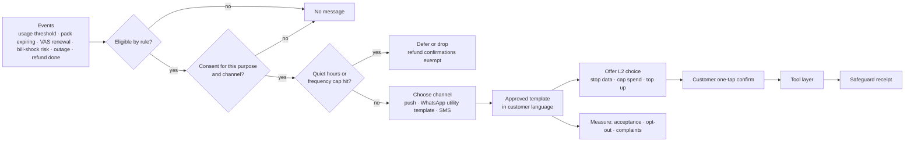

# Hutch Clarity — Solution Capabilities

[← 01-executive-summary-problem.md](01-executive-summary-problem.md) · [← Plan index](README.md) · [03-requirements-personas-journeys.md →](03-requirements-personas-journeys.md)

> Part of the **Hutch Clarity Enterprise Project Plan**. Labels: `[DECK Sx]` = stated in deck slide x · `[PROPOSED]` = expanded by this plan · **ASSUMPTION** / **REQUIRES HUTCH CONFIRMATION** / **PROPOSED TARGET – REQUIRES HUTCH VALIDATION**. See the [index](README.md) for the full legend.

## 3. Solution Capabilities

Value loop: **Foresight predicts → Autopsy spots the pattern → Copilot fixes → Desk handles the hard ones → Receipts prove it** `[DECK S3]`.

### 3.1 Clarity Copilot

| Stage | Deck basis | Enterprise design `[PROPOSED]` |
|---|---|---|
| **Intake** | Tap Why? or say it; si/ta/en/Singlish; voice note `[DECK S5, S7]` | Two intake modes. (a) **Structured:** Why? on a specific charge passes `charge_ref`, needs no NLU, costs 0 tokens. (b) **Free text/voice:** the LLM extracts `{intent, amount?, date_hint?, product_hint?, language}` into a Pydantic schema. Extracted values are only *hints* used to select candidate events. |
| **Multilingual interpretation** | LLM reads si, ta, en, Singlish `[DECK S7]` | Language ID: fastText-class classifier with an LLM fallback for code-mixed text. Language preference is stored per customer ("Language remembered") `[DECK S6]`. |
| **Timeline construction** | 8 log sources → one case file `[DECK S7]` | Timeline Builder queries adapters in parallel with a bounded window (default 30–90 days, **ASSUMPTION**). It normalizes events to the canonical `TimelineEvent`, records a source/completeness flag per source, and snapshots the evidence (hash) for replay. |
| **Cause detection** | 16 versioned cause rules `[DECK S7]` | Deterministic rule engine ([§13](09-rules-decision-receipts.md)). Every rule runs, and the output is **ranked causes + ruled-out causes** with the evidence references for each. |
| **Decision policy** | Confidence · caps · policy `[DECK S7]` | OPA policy over: confidence, amount vs cap, evidence completeness, SIM-swap recency, fraud flags, conflicting causes, reversibility and refund budget ([§14](09-rules-decision-receipts.md)). |
| **Safe actions** | Confirmed, idempotent `[DECK S7]` | Tool layer with idempotency keys, a transactional outbox, compensations, a per-day refund budget and reconciliation. |
| **Explanation** | Verifier checks numbers `[DECK S7]` | The LLM writes from a **facts JSON** (amounts, times, rule IDs) in the customer's language. A deterministic verifier checks every number, date and identifier against the facts. On failure, an approved template is used. |
| **Handoff** | Log missing, fraud risk, or customer asks `[DECK S7]`; handoff check on every turn `[DECK S12]` | Handoff check on every turn. Desk receives the full trail with the handoff reason code; reasons are counted, not guessed `[DECK S10]`. |

Customer-facing features carried from the deck `[DECK S5–S6]`:
- pack truth label, voice in/out, family guardian (≤10 numbers), Why? by SMS short code, pack-end choice, one case on any channel;
- proactive refunds, early VAS renewal notice with 1-tap stop, fair-use alerts at 80%/95%, outage heads-up with ETA;
- short or long answers, large text.

### 3.2 Trust Receipt
- **Generation:** `[PROPOSED]` emitted automatically on `action.completed` or `decision.explained`, or as an explain-only receipt `[DECK S6]`.
- **Contents:** what happened, what we corrected, the safeguard, and a recurrence test `[DECK S6]`. The full schema is in [§15](09-rules-decision-receipts.md).
- **Evidence:** references (IDs + hashes) to timeline events. Raw PII is not embedded.
- **Signing:** Ed25519 over a canonical JSON (RFC 8785 JCS) payload, plus a hash chain linking it to the previous receipt `[DECK S6]` (signing per [§15](09-rules-decision-receipts.md)).
- **QR verification:** a public verification page shows only signature validity and masked essentials. Customers can quote the receipt ID on 1788, WhatsApp or to TRCSL `[DECK S6]`.
- **Auditability and replay:** receipts reference `rule_version` and `policy_version`, and the decision can be replayed from the evidence snapshot `[DECK S12, S14]`.
- **Formats:** si/ta/en in PNG, PDF and SMS. Rendered with Playwright for correct Sinhala/Tamil shaping `[DECK S6, S13]`.
- **Recurrence test:** "PASSED only if really blocked" `[DECK S6]`. A deterministic post-action check (e.g., the merchant block is active in VAS consent) runs before the test is marked PASSED.

### 3.3 Complaint Autopsy `[DECK S11]`

| Step | Design |
|---|---|
| Ingestion | Complaints from 1788 notes, WhatsApp, email, app forms and Clarity cases. Connectors are **REQUIRES HUTCH CONFIRMATION**. |
| Clean & protect | Exact- and near-duplicate removal (MinHash), language detection, then PII masking **before** any LLM call. |
| Canonical summary | A small LLM rewrites each complaint into a short English canonical form (`{product, symptom, money_effect, channel}`), so Singlish and code-mixed text clusters together. |
| Embeddings | Multilingual embedding model (candidate list in [§12](08-ai-architecture.md)) stored in pgvector. |
| Clustering | UMAP (dimensionality reduction) → HDBSCAN (density clusters; noise allowed) `[DECK S11]`. Weekly batch plus a daily incremental assignment of new complaints to the nearest cluster. |
| Root cause | Each cluster is joined to rule hits and timeline facts for its cases. An LLM drafts a cluster label and hypothesis, which is marked *hypothesis* until a CX engineer confirms it. |
| Self-service flow generation | Flow drafts are generated **only from real checks**, i.e., existing read tools and rules `[DECK S11]`, in a flow DSL. |
| Approval | Replayed against historic cases, then CX + product + compliance approval, then publish (e.g., WhatsApp) behind a feature flag `[DECK S11]`. |
| Known causes | VAS surprise, reload issue, pack mismatch, social pack, FUP stop, balance burn, pack sunset, no reply `[DECK S11]`. |

### 3.4 Foresight `[DECK S11]`

| Step | Design |
|---|---|
| Scenario setup | Seed: new pack, price, policy or outage. Structured parameters are taken from the catalogue diff. |
| Personas | Aggregated segments only (students, dual-SIM, tourists, parents) `[DECK S11]`, built from aggregate statistics. No individual customer data is used `[DECK S8]`. |
| Simulation | MiroFish-style swarm (OASIS) `[DECK S11, S13]`: agents react over rounds, producing predicted complaint themes per segment. |
| Prediction | Output: complaint themes × segment × relative volume band (low/med/high), with uncertainty. Never presented as a forecast count without calibration. |
| Mitigation | Predictions become migration cards, scripts, flows and fixes before launch `[DECK S11]`. |
| Early-warning radar | Separate from simulation: live spike detection on Kafka complaint and contact streams `[DECK S11]`. |
| **Limitations** | "Scenarios, not certainties" `[DECK S11]`. LLM agents can carry cultural and language biases, and there is no ground truth before launch. Mitigations: (1) a statistical baseline from past launches; (2) backtest on ≥3 historic launches before use; (3) outputs are advisory, read-only and never trigger customer actions; (4) license and maturity review of MiroFish/OASIS/Zep (**ASSUMPTION** that licenses permit commercial use; legal review required). |

### 3.5 Clarity Desk `[DECK S9, S10]`

| Feature | Design |
|---|---|
| Case cockpit | Evidence timeline, ranked causes, ruled-out causes, policy-checked recommended fix |
| Smart queue | Ordered by money at stake, repeats and frustration signal `[DECK S9]` |
| Approved actions | One-click execution of the policy-checked recommendation. Approval above a threshold requires MFA step-up. |
| Multilingual replies | Read in English, send in Sinhala/Tamil. The draft goes through the verifier, and the agent edits/approves `[DECK S9]`. |
| Teach once | A correction becomes a golden test case and a draft rule proposal `[DECK S9]` |
| Fix all like this | Bulk apply an approved rule to a cohort. Each case gets its own receipt `[DECK S9]`. L4 with four-eyes approval. |
| Second look | Fresh reviewer compares customer statements with logs `[DECK S9]` |
| Policy what-if | Replay past cases under a candidate rule/policy version `[DECK S9]` |
| Merchant watch | VAS merchant scoring and suspension workflow `[DECK S9]` |
| Shift handover | Auto summary of cases, promises and owners `[DECK S9]` |
| Regulator pack | One click: trail + consents for TRCSL `[DECK S9]` |
| Insights | Top services, where the AI stops, self-service drops, slicing; gap → fix → measure loop `[DECK S10]` |
| Mobile approval | Supervisors can approve from phones `[DECK S9]`, via a PWA with SSO/MFA |

### 3.6 Proactive Care Engine `[DECK S5, S6]`
Proactive care covers refunds before customers ask, the pack-end choice, early VAS renewal notices, fair-use alerts at 80%/95% and outage heads-ups `[DECK S6]`. Without controls it could turn into spam, so every message passes through deterministic eligibility, consent and pacing checks.

| Control | Design `[PROPOSED]` |
|---|---|
| Triggers | `usage.threshold_reached`, `pack.expiring`, `vas.renewed`, `risk.detected` (bill shock), outage events, `action.completed` (zero-contact refund) |
| Eligibility | Deterministic trigger rules (e.g., pack ≥ 80% used **and** data-stop off **and** ≥ 2 days left). The bill-shock score only ranks and never decides alone. |
| Consent | Separate notification consent per purpose (service vs marketing) and channel. Guardian alerts need the member's consent (§3.7). |
| Quiet hours | No proactive messages 21:00–07:00 local time (**ASSUMPTION**). Refund confirmations and fraud alerts are exempt. |
| Frequency cap | ≤ 2 proactive messages per customer per day and ≤ 6 per week (**ASSUMPTION**), deduplicated by subject + trigger |
| Channel choice | Customer preference first, then app push → WhatsApp utility template → SMS |
| Content | CX-approved templates in si/ta/en. LLM wording only through the verifier. Each message carries "why you got this" and an opt-out. |
| Actions | Offered choices are L2 safeguards (stop data, cap spend) or a top-up link, confirmed with one tap. A safeguard receipt is issued. |
| Measurement | Offer acceptance, opt-out rate, complaints after messages, bill-shock recurrence ([§40](15-cost-scale-failure-kpi.md)) |

#### Diagram 38 — Proactive care engine



### 3.7 Personalization & Family Guardian `[DECK S5, S6]`

| Feature | Design `[PROPOSED]` |
|---|---|
| Remembered preferences | Language, short or long answers, large text and voice replies are stored on `CustomerReference` and changeable at any time `[DECK S6]` |
| Safeguards per person | Spend cap, data stop, merchant blocks and FUP alerts per number, each with a receipt when changed |
| Guardian link | Up to 10 numbers `[DECK S5]`. Each member approves the link by OTP from their own number. Either side can revoke at any time. Every link and revocation is audited. |
| Guardian rights | See safeguard status and receive alerts for linked numbers, and propose safeguards that the member confirms (or that apply directly where the guardian is the account holder). **No refunds or usage detail on another person's number without that member's consent.** |
| Minors and account holders | Rules for children's lines and corporate or family accounts **REQUIRE HUTCH legal confirmation** |
| Privacy | The guardian view shows status, not content. Foresight and analytics never use guardian links at the individual level. |

### 3.8 Self-Service Flow DSL `[DECK S11, S15]`
Autopsy generates self-service flows "from real checks only" `[DECK S11]`, and the deck names a reusable "flow DSL" `[DECK S15]`. A flow is versioned YAML that can call **only allowlisted read tools** and **propose L2 actions**. Money never moves inside a flow: refunds go through rules and the decision policy.

```yaml
flow_id: data_stopped_check
version: 3
status: approved                # draft | in_review | approved | retired
languages: [si, ta, en]
entry: { intents: [data_stopped], channels: [whatsapp, app, web] }
steps:
  - id: check_fup
    call: get_usage_summary     # allowlisted read tool only
    on_result:
      - when: "fup.cap_reached == true"
        goto: explain_fup
      - otherwise: check_pack
  - id: check_pack
    call: get_pack_details
    on_result:
      - when: "active_packs == 0"
        goto: offer_topup
      - otherwise: handoff
  - id: explain_fup
    say: { template: fup_reached_v2 }        # CX-approved template filled from tool results
    offer: [ENABLE_FUP_ALERTS, BUY_ADDON]    # L2 proposals; the customer confirms
  - id: offer_topup
    say: { template: no_active_pack_v1 }
  - id: handoff
    handoff: { reason: FLOW_NO_MATCH }
tests_ref: tests/flows/data_stopped_check/v3/
```

Lifecycle: draft (from Autopsy or a CX engineer) → replay on historic cases → approval by CX, product and compliance → publish behind a flag → A/B test of two versions where a step causes drop-off `[DECK S10]` → measure completion and repeats.

---

[← 01-executive-summary-problem.md](01-executive-summary-problem.md) · [← Plan index](README.md) · [03-requirements-personas-journeys.md →](03-requirements-personas-journeys.md)
