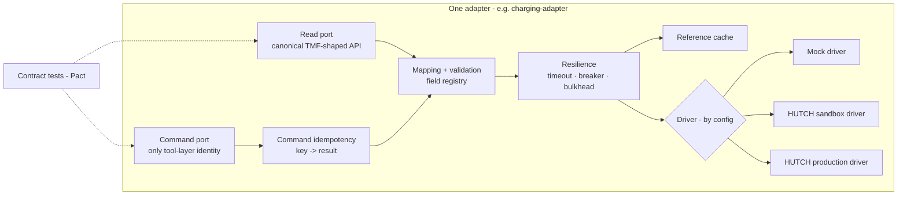

# Hutch Clarity — HUTCH Integration Strategy & TM Forum

[← 05-architecture-diagrams.md](05-architecture-diagrams.md) · [← Plan index](README.md) · [07-mcp.md →](07-mcp.md)

> Part of the **Hutch Clarity Enterprise Project Plan**. Labels: `[DECK Sx]` = stated in deck slide x · `[PROPOSED]` = expanded by this plan · **ASSUMPTION** / **REQUIRES HUTCH CONFIRMATION** / **PROPOSED TARGET – REQUIRES HUTCH VALIDATION**. See the [index](README.md) for the full legend.

## 9. HUTCH Integration Strategy

### 9.1 Principles
1. **Abstraction layer:** Clarity → **Integration Adapter Layer** → **Approved Enterprise Interfaces** → **Existing HUTCH Systems**. No Clarity service calls a HUTCH system directly.
2. **Read-first, write only via the tool layer** `[DECK S12]`. Adapters expose separate read and command ports, and command ports accept calls only from the tool layer's service identity.
3. **Anti-corruption layer.** Every adapter maps HUTCH-native fields to the canonical (TMF-shaped) model. A field mapping registry records the source, owner and quality of each field.
4. **Same contract, swappable implementation.** Prototype = mocks + synthetic streams. Pilot = HUTCH non-prod/sandbox. Production = approved HUTCH interfaces. The adapter is selected by config `[DECK S13]` ("plugs into Hutch systems by config").
5. **Resilience.** Per-adapter timeouts, retries with jitter (reads only), circuit breakers, bulkheads, cached reference data (catalogue), and a completeness flag on every response.
6. **Least privilege.** One service account per adapter, scoped to the minimum fields, mTLS, and an egress allowlist.

### 9.2 The "8 log sources"
The deck states 8 sources `[DECK S7]` but doesn't list them. The inferred mapping below is **REQUIRES HUTCH CONFIRMATION**:
1. payment gateway logs;
2. OCS charging events;
3. product catalogue versions;
4. VAS/DCB consent and OTP logs;
5. usage/CDR summaries;
6. PCRF/FUP policy state;
7. credit/loan (emergency loan) recovery events — "loan recovery" is a ruled-out cause in `[DECK S7]`;
8. CRM/ticket and interaction history.

### 9.3 Integration catalogue

| Integration | HUTCH system category | Required data (minimum) | Read/Write | Prototype | Production |
|---|---|---|---|---|---|
| **Payments** | Payment gateway / bank settlement logs | txn id, MSISDN token, amount, bank/card ref (masked), status, captured_at, settlement status | R; W = refund/reversal *request* | Mock gateway, synthetic duplicate-capture stream | Approved gateway reporting + reversal interface. **Whether a reversal or a balance credit is the remedy REQUIRES HUTCH CONFIRMATION.** |
| **Charging (OCS)** | Online charging system | charge event id, service/merchant id, amount, balance before/after, rating reason, timestamp | R; W = balance adjustment (credit) | Mock OCS event generator | OCS event feed (Kafka/file/CDR export) + adjustment API, **REQUIRES CONFIRMATION** |
| **Catalogue** | Product catalogue | offering id, version, price, validity, FUP cap, after-cap speed, included apps, T&C ref, effective dates | R | Versioned YAML catalogue | Catalogue API/export; versions retained for "what was shown at purchase" |
| **VAS consent** | DCB / VAS platform | subscription id, merchant, product, consent events (OTP verified, channel, timestamp), renewals | R; W = deactivate, block merchant for subscriber | Mock DCB with consent log | DCB/VAS APIs. Consent retained ≥ 1 yr `[DECK S8]`. |
| **Usage / FUP** | Mediation CDR, PCRF | usage counters per bucket, threshold crossings, throttle state, session timestamps | R; W = data stop, spend cap (may live in OCS) | Synthetic usage counters | Usage summary interface + PCRF/OCS policy command |
| **Credit / loans** | Emergency credit platform | loan given/recovered events | R | Mock | **REQUIRES CONFIRMATION** that such a system exists |
| **CRM / Tickets** | CRM, ticketing (TMF621-shaped `[DECK S12]`) | customer ref, segment, language preference, tickets, interactions | R; W = create/update ticket, add note | Mock ticket API | CRM ticket interface |
| **Identity / risk** | IAM, OTP service, SIM registry | MSISDN↔account mapping, OTP send/verify, last SIM swap date, fraud flags | R (+ OTP send) | Mock OTP (fixed code in demo) | HUTCH OTP/IAM; SIM-swap signal **REQUIRES CONFIRMATION** |
| **Notifications** | SMSC, USSD gateway, push, WhatsApp | template id, params, destination token | W | SMS/USSD simulator; WhatsApp test number | HUTCH SMSC/USSD gateway; Meta WhatsApp Business account owned by HUTCH |
| **Network / outage** | NOC / outage system | outage area, cell, start, ETA | R (W = network ticket) | Mock | **REQUIRES CONFIRMATION** (`[DECK S6, S10]` outage ETA, auto ticket) |
| **Analytics** | Warehouse (Snowflake per `[DECK S12]`, unconfirmed) | aggregated contacts, complaints, segments | R (aggregate); W = masked Clarity facts | Local DuckDB/PG | HUTCH warehouse share/ELT |

### 9.4 Adapter internal design — Diagram 19

### 9.5 Integration feasibility (Guidelines §4)

| Guideline item | Clarity response |
|---|---|
| Integration approach | Adapters on the categories above. Purpose: evidence (read) and corrections (write). |
| High-level architecture | Diagrams 1, 2, 7 and 11 |
| Data & API requirements | §9.3 table; canonical model [§16](10-data-api-events.md); APIs [§17](10-data-api-events.md); events [§18](10-data-api-events.md) |
| Implementation considerations | Security [§19](11-security-privacy-audit.md), resilience [§39](15-cost-scale-failure-kpi.md), scalability [§38](15-cost-scale-failure-kpi.md), dependencies [§32](13-delivery-plan.md) |
| Future feasibility | Shadow mode needs **read-only** access only (lowest integration risk). Write interfaces are added per action type after security and finance approval ([§34](14-risk-pilot-readiness-operations.md)). |

### 9.6 TM Forum Open API analysis
The deck uses "TM Forum API shapes" `[DECK S12, S13]`. **We do not assume HUTCH exposes any TMF API.** TMF is used as:
- **Canonical model (recommended):** internal resource shapes for timeline events, products, tickets and payments.
- **Adapter northbound interface (recommended):** Clarity-side adapter APIs follow TMF resource shapes, so a future HUTCH TMF-compliant API can be plugged in with minimal mapping.
- **Normalization layer (recommended):** heterogeneous HUTCH sources are mapped into one set of shapes.
- **Not** a requirement on HUTCH's southbound systems, and **not** full TMF conformance certification.

| TMF API | Relevance to Clarity | Use |
|---|---|---|
| TMF620 Product Catalog | Pack definitions, versions, FUP terms (pack truth label) | Canonical + adapter |
| TMF637 Product Inventory | Customer's active packs and VAS subscriptions | Canonical + adapter |
| TMF622 Product Ordering | VAS deactivation, pack change as an "order" | Adapter command shape |
| TMF635 Usage Management | Usage/charge records into the timeline | Canonical + adapter |
| TMF654 Prepay Balance Management | Balance, top-ups, balance adjustments (refund as credit) | Canonical + adapter command |
| TMF676 Payment Management | Reload payments, refunds | Canonical + adapter |
| TMF621 Trouble Ticket | Handoff, network tickets `[DECK S12]` | Adapter |
| TMF629 Customer Management | Customer reference, preferences | Canonical (minimal) |
| TMF644 Privacy Management | Consent records (notification, guardian, data use) | Canonical model for consent |
| TMF681 Communication Management | SMS/WhatsApp/push messages | Adapter |
| TMF688 Event Management | Event envelope/notification pattern | Event envelope inspiration |
| TMF678 Customer Bill Management | Postpaid bills | **Future** (Step 4 postpaid) |

Implementation: a shared `packages/schemas` defines Pydantic and TypeScript types generated from one JSON Schema source. Each schema carries TMF-style `id`, `href`, `@type`, `@baseType` and `@schemaLocation`, plus a Clarity extension `x-clarity-source` with completeness flags.

### 9.7 Channel constraints and design responses
Each channel has technical limits that shape the experience. Values come from public channel specifications. HUTCH-specific gateway settings **REQUIRE HUTCH CONFIRMATION**.

| Channel | Constraint | Design response |
|---|---|---|
| **WhatsApp** (Cloud API) | Business-initiated messages outside the 24-hour customer-service window must use pre-approved templates. Templates are categorised (utility, marketing, authentication) and charged per message by Meta. Voice notes arrive as OGG/Opus audio. Interactive buttons and lists have count and length limits. The business account, display name and templates belong to HUTCH. | Proactive messages use **utility** templates in si/ta/en. Confirmations use interactive reply buttons bound to a single-use token. Voice notes are capped at about 60 s (**ASSUMPTION**) before STT. Template approval is a dependency (DEP-10). Current pricing **REQUIRES CONFIRMATION** ([§50](17-governance-compliance-change-cost.md)). |
| **SMS** | GSM-7 allows 160 characters per segment. Sinhala and Tamil need UCS-2, which allows 70 characters in one segment and 67 per segment when concatenated, so long messages cost more segments. | The SMS receipt is a short form: receipt ID, amount, safeguard, and a short verify link on a HUTCH domain. At most 3 segments (**ASSUMPTION**). The language follows preference. Clarity never sends or asks for OTPs in free text. |
| **USSD** | Session-based. About 182 GSM characters per screen. Operator-defined session timeouts. Sinhala/Tamil rendering varies by handset. | USSD shows short menus (English or romanised, ≤ 3 levels). The full reason goes by SMS ("short code sends the reason by SMS" `[DECK S5]`). Gateway Unicode support and timeouts **REQUIRE HUTCH CONFIRMATION**. |
| **Hutch app (WebView)** | Depends on the app shell, the WebView version and how the session is passed | Token exchange from the app session. Deep links to receipts. Lean module per NFR-PERF-06. The embedding slot is DEP-12. |
| **Web (hutch.lk)** | Anonymous visitors; bot traffic | OTP login, WAF and bot management. A PWA shell lets customers keep receipts offline. |
| **Voice** | STT accuracy for si/ta and background noise | Show the transcript back to the customer ("Did you mean…?") before any L2+ proposal. The transcript is a hint, never evidence `[DECK S7]`. |
| **Shop (Desk shop view)** | Shared terminals; customer present | Staff SSO, customer OTP to open a case, no full PII on screen, session auto-lock |

---

[← 05-architecture-diagrams.md](05-architecture-diagrams.md) · [← Plan index](README.md) · [07-mcp.md →](07-mcp.md)
