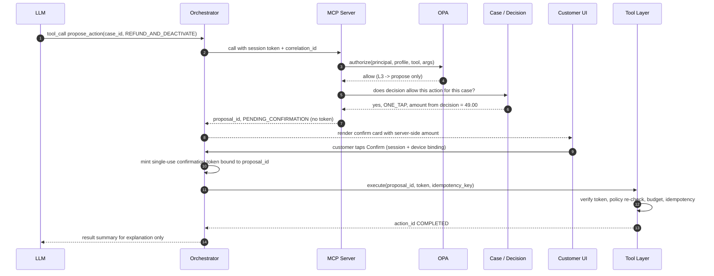

# Hutch Clarity — MCP Architecture & Tool Catalogue

[← 06-integration-tmf.md](06-integration-tmf.md) · [← Plan index](README.md) · [08-ai-architecture.md →](08-ai-architecture.md)

> Part of the **Hutch Clarity Enterprise Project Plan**. Labels: `[DECK Sx]` = stated in deck slide x · `[PROPOSED]` = expanded by this plan · **ASSUMPTION** / **REQUIRES HUTCH CONFIRMATION** / **PROPOSED TARGET – REQUIRES HUTCH VALIDATION**. See the [index](README.md) for the full legend.

## 10. MCP Architecture

### 10.1 Why MCP
- **One governed gateway** for every AI-initiated capability. Tools are typed, discoverable, versioned and auditable `[DECK S13, S15]` ("Every action a typed API (MCP too)").
- **Model-agnostic.** The same tools work with the self-hosted or hosted tier and future agents.
- **Separation of concerns.** The LLM sees tool *contracts*, never credentials, endpoints or SQL.

### 10.2 Why the LLM must not call backend APIs directly
- **Prompt injection.** Customer text or retrieved content could steer the model toward an action. Direct API access turns injection into money movement.
- **Hallucinated parameters.** A wrong amount, MSISDN or merchant can't be allowed to reach a system of record.
- **No principal binding.** Raw APIs don't know *which customer's session* the model is serving. MCP binds every call to the session principal.
- **Audit and rate control.** Centralized enforcement is impossible if calls are scattered.

### 10.3 Controls

| Control | Design |
|---|---|
| Tool allowlists | Per **profile**: `customer-assist`, `staff-assist`, `analytics`. A profile is fixed at session creation by the orchestrator, never by the model. |
| Schema validation | Pydantic v2 models with `extra="forbid"` and strict types. Enums for action types. Amount fields are **not accepted** from the LLM for L3 proposals: the amount is taken from the decision record. |
| AuthN | OAuth 2.1 bearer token (short-lived, audience = mcp-server) over mTLS, minted by the orchestrator for the session principal (customer or staff) + agent identity |
| AuthZ | OPA per call: `{principal, profile, tool, args, case.owner, safety_level}` → allow/deny + obligations (e.g., `mask_fields`) |
| Subject binding | Customer-profile calls can only reference the case and subscriber bound to the session. Cross-subscriber access is denied (except guardian links with consent). |
| Audit | `MCPInvocation` row per call: tool, args hash, masked args, principal, decision, latency, result hash, correlation ID |
| Rate limiting | Per session, per principal, per tool (token bucket in Redis). Lower limits for expensive tools (`run_policy_replay`). |
| Confirmation | L2 proposals and above need confirmation via a **UI-minted, single-use, action-bound token** that the LLM never sees |
| Tool failures | Typed errors (`EVIDENCE_UNAVAILABLE`, `NOT_AUTHORIZED`, `RATE_LIMITED`, `CONFLICT`, `UPSTREAM_TIMEOUT`). The orchestrator maps errors to templates or a handoff, never a retry loop by the model. |
| Transaction IDs | `correlation_id` (W3C traceparent) on every call. `proposal_id` and `action_id` (ULID) for writes. |
| Idempotency | Required `idempotency_key` on write-capable tools; stored with the result for 24 h+ (Redis) and as a unique constraint in PG |
| Least privilege | The MCP server's own credentials can read core APIs and create proposals. It **cannot** call the tool layer's execute endpoint. |

### 10.4 Safety levels

| Level | Definition | Examples (action types) | Who may initiate | Approval requirement | Via MCP? |
|---|---|---|---|---|---|
| **L1 — Read-only** | No state change | timeline, causes, usage, pack, receipt, knowledge search | LLM (bound to principal) | None; OPA scope check | ✅ |
| **L2 — Low-risk reversible** | Changes a customer setting or creates a record; no money moves | create handoff/ticket, send templated notification, *set_spend_cap*, *enable_data_stop*, *enable_fup_alerts* | LLM may **propose**; handoff and templated notification may execute directly | Handoff/notification: policy allow. Setting changes: **customer one-tap confirmation**. | ✅ (propose) |
| **L3 — Financial / service-changing** | Moves money or changes a paid service | refund/balance credit, payment reversal, VAS deactivation, merchant block for subscriber | LLM may only **propose**; deterministic decision must already allow it | Per decision matrix: customer confirmation (one-tap) **or** staff approval (MFA step-up; four-eyes above finance threshold). **Auto-fix only from the deterministic stream path, never from an LLM.** | Propose only |
| **L4 — Bulk / high-impact admin** | Affects many customers, policy or regulator data | fix-all-like-this, rule/policy publish, refund budget change, global merchant suspension, regulator pack export | Staff in Desk only | Four-eyes (maker + checker, different roles), change ticket, dry-run replay required | ❌ never |

**The LLM never independently executes Level 3 or Level 4 operations.**

### 10.5 Propose → confirm → execute sequence — Diagram 20



### 10.6 MCP server implementation

**Technology:** Python 3.12 with the official MCP Python SDK (`mcp`, FastMCP server API), Streamable HTTP transport, mounted inside a FastAPI app. Same stack as the core `[DECK S13]`, so there is no compelling reason to diverge.

```text
mcp/server/
├── app.py                 # FastAPI app; mounts MCP Streamable HTTP at /mcp; health, metrics
├── profiles.py            # profile -> allowlisted tools (customer-assist, staff-assist, analytics)
├── tools/
│   ├── read/              # L1: get_case_timeline.py, get_cause_assessment.py, search_knowledge.py ...
│   ├── low_risk/          # L2: request_handoff.py, send_templated_notification.py
│   └── proposals/         # propose_action.py (L2/L3 proposals only)
├── resources/             # read-only MCP resources: rule catalogue (public text), templates, glossary
├── prompts/               # MCP prompt templates (explain_case, staff_summary) - versioned
├── auth/                  # token verification (OIDC/JWKS), mTLS peer check, principal model
├── policy/                # OPA client, input builders, rego bundles reference, obligations handler
├── schemas/               # Pydantic v2 input/output models generated from packages/schemas
├── adapters/              # thin clients to Clarity Core APIs (never HUTCH systems directly)
├── audit/                 # MCPInvocation writer, args hashing/masking, outbox publish
├── idempotency/           # Redis + PG idempotency store
├── errors.py              # typed error taxonomy -> MCP error results
└── tests/                 # unit, contract, OPA policy tests, injection/abuse tests, golden tool-selection tests
```

| Concern | Implementation |
|---|---|
| Schemas | Pydantic v2 `BaseModel(model_config=ConfigDict(extra="forbid", strict=True))`. JSON Schema exported for the tool listing. Outputs are also validated, so the server can't leak extra fields. |
| Policy | Every tool is wrapped by a `@guarded(level=..., resource=...)` decorator: build OPA input → `POST /v1/data/clarity/mcp/allow` → enforce obligations (masking, field filtering). Default **deny**. |
| Audit events | Before and after each call: `MCPInvocation{id, correlation_id, session_id, principal_ref, profile, tool, level, args_hash, args_masked, policy_decision, policy_version, result_hash, status, latency_ms}`. Written to PG; `mcp.invoked` emitted via the outbox. |
| Correlation IDs | Propagated from the orchestrator (`traceparent`). New span per tool. Included in every downstream call and audit row. |
| Idempotency | `idempotency_key` required for proposals and L2 writes; key = hash(principal, tool, canonical args). Same key → stored result. Conflicting payload → `CONFLICT`. |
| Error handling | No stack traces to the model. Typed error codes plus a safe message. Upstream errors trip a circuit breaker. Repeated denials in a session raise a security signal to the SIEM (possible injection). |

Illustrative tool definition (design sketch, not final code):

```python
class ProposeActionIn(BaseModel):
    model_config = ConfigDict(extra="forbid", strict=True)
    case_id: CaseId
    action_type: Literal[
        "REFUND", "DEACTIVATE_VAS", "BLOCK_MERCHANT", "SET_SPEND_CAP", "ENABLE_DATA_STOP"
    ]
    idempotency_key: constr(min_length=16, max_length=64)
    # NOTE: no amount field - amounts come only from the deterministic Decision record


@mcp.tool()
@guarded(level=SafetyLevel.L3_PROPOSE, resource="case")
async def propose_action(inp: ProposeActionIn, ctx: ToolContext) -> ProposalOut:
    decision = await core.get_decision(inp.case_id, principal=ctx.principal)
    if inp.action_type not in decision.allowed_actions:
        raise ToolError("ACTION_NOT_ALLOWED_BY_POLICY")
    return await core.create_proposal(
        decision, inp.action_type, inp.idempotency_key, ctx.correlation_id
    )
```

---

## 11. MCP Tool Catalogue

### 11.1 Final tool set
Notation: CA = customer-assist, SA = staff-assist, AN = analytics profile.

| Tool | Level | Purpose | Inputs | Outputs | Permission (profiles · scope) | Confirmation | Backend |
|---|---|---|---|---|---|---|---|
| `get_case_timeline` | L1 | Evidence events for a case | case_id, sources?, event_types?, window? | events[] (masked), completeness per source, snapshot hash | CA (own case), SA | No | case-service / timeline-builder |
| `get_cause_assessment` | L1 | Ranked and ruled-out causes | case_id | causes[{rule_id, version, confidence, evidence_refs}], ruled_out[] | CA, SA | No | rule-engine results |
| `explain_rule` | L1 | Plain description of a rule and its policy basis | rule_id, version, language | description, required evidence, public citation | CA, SA, AN | No | rule catalogue (resource) |
| `get_usage_summary` | L1 | Usage counters, FUP state | subscriber_ref (bound), period | buckets[], thresholds crossed, throttle state | CA (bound), SA | No | usage adapter |
| `get_pack_details` | L1 | Active packs and truth label | subscriber_ref or offering_id | offerings[{cap, after_cap_speed, apps, validity, catalogue_version}] | CA, SA | No | catalogue + inventory adapters |
| `get_vas_subscriptions` | L1 | Subscriptions + consent evidence summary | subscriber_ref (bound) | subscriptions[{merchant, product, consent: {otp_verified, at, channel}}] | CA, SA | No | VAS consent adapter |
| `get_customer_safeguards` | L1 | Current caps, data stop, merchant blocks | subscriber_ref (bound) | safeguards[] | CA, SA | No | safeguard store / adapters |
| `get_ticket_status` | L1 | Ticket/case status | case_id or ticket_id | status, owner role, SLA, last update | CA, SA | No | CRM adapter |
| `search_knowledge` | L1 | Cited answers from catalogue, T&C, Gazette, help | query (masked), language, source_types? | chunks[{text, source_id, version, effective_date, url}] | CA, SA, AN | No | rag-service |
| `get_trust_receipt` | L1 | Read a receipt's public view | receipt_id | receipt public fields + verification status | CA (own), SA | No | receipt-service |
| `run_policy_replay` | L1 (heavy) | What-if on historic cases (read-only) | candidate rule/policy version, cohort filter | outcome deltas, sample cases | SA (CX engineer, finance roles) | No (rate-limited) | rule-engine replay |
| `get_cluster_summary` | L1 | Autopsy clusters and trends | period, filters | clusters[{label, size, trend, linked rules}] | SA, AN | No | autopsy |
| `get_shift_handover_data` | L1 | Structured data for a handover summary | team, shift window | open cases, promises, owners | SA (supervisor) | No | desk-api |
| `request_handoff` | L2 | Create/route a Desk case with reason | case_id, reason_code, summary (masked) | ticket_id, queue | CA, SA | No (policy allow) | case-service + CRM adapter |
| `send_templated_notification` | L2 | Send an approved template to the case's customer | case_id, template_id, params | message_id | CA, SA | No (template + params validated; free text not allowed) | notification service |
| `propose_action` | L2/L3 propose | Create a pending proposal for an action the decision allows | case_id, action_type, idempotency_key | proposal_id, status, display summary | CA, SA | **Yes, outside the LLM:** customer tap or staff approval | case-service proposals |

### 11.2 Deliberately excluded from MCP

| Candidate | Decision | Reason |
|---|---|---|
| `get_charge_details`, `get_payment_events` | Merged into `get_case_timeline` filters | Smaller surface; one consistent evidence view |
| `request_refund`, `disable_vas_subscription`, `set_spend_cap`, `enable_data_stop` | Not tools; **action types** of `propose_action` | Execution only through the tool layer with a confirmation token |
| `generate_trust_receipt` | Not a tool | Receipts are emitted automatically on `action.completed`. The LLM must never author proof. |
| `approve_case_action` | Desk API only | Approval is a human act with MFA step-up |
| `bulk_apply_approved_rule`, `generate_regulator_pack`, rule/policy publish | Desk API only (L4) | Bulk/regulatory impact needs four-eyes |
| `retrieve_policy`, `retrieve_catalogue` | Covered by `search_knowledge` + `get_pack_details` | Avoid duplicate retrieval paths |
---

[← 06-integration-tmf.md](06-integration-tmf.md) · [← Plan index](README.md) · [08-ai-architecture.md →](08-ai-architecture.md)
