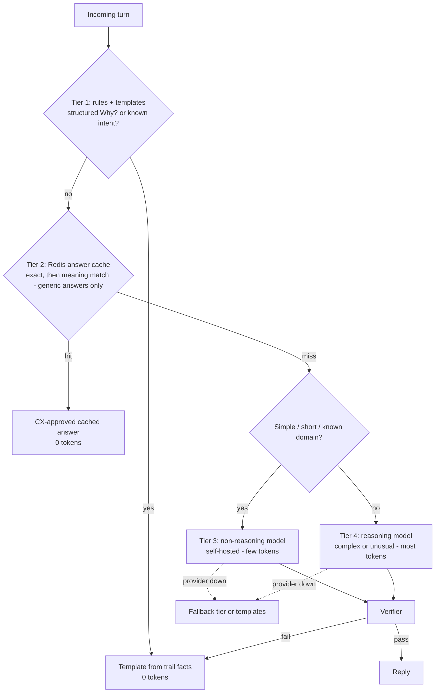

# Hutch Clarity — AI Architecture, RAG, Guardrails & Evaluation

[← 07-mcp.md](07-mcp.md) · [← Plan index](README.md) · [09-rules-decision-receipts.md →](09-rules-decision-receipts.md)

> Part of the **Hutch Clarity Enterprise Project Plan**. Labels: `[DECK Sx]` = stated in deck slide x · `[PROPOSED]` = expanded by this plan · **ASSUMPTION** / **REQUIRES HUTCH CONFIRMATION** / **PROPOSED TARGET – REQUIRES HUTCH VALIDATION**. See the [index](README.md) for the full legend.

## 12. AI Architecture

### 12.1 AI responsibilities

| Area | Tasks | Technique | Must never |
|---|---|---|---|
| **Language AI** | si/ta/en/Singlish intake extraction; explanation; staff summaries; reply drafting in customer language; shift handover text | Instruction-tuned LLM with JSON-schema output, few-shot per language, facts-JSON grounding | Decide causes, amounts or eligibility; invent facts |
| **Retrieval** | Packs, T&C, VAS rules, Gazette 2316/14, help content, CX-approved answers | Hybrid RAG (BM25 + vector), metadata filters, citations | Answer outside retrieved sources on policy questions |
| **Complaint intelligence** | Canonical summaries, embeddings, UMAP + HDBSCAN clusters, cluster labels | Small LLM + multilingual embedding model + classical ML `[DECK S11, S13]` | Publish flows or rules without human approval |
| **Foresight** | Persona simulation, complaint-theme prediction | OASIS-style agent simulation `[DECK S11]` + statistical baseline | Use individual customer data; trigger customer actions |
| **Risk / prediction** | Bill-shock risk `[DECK S6]`, confidence features, merchant risk score | Gradient-boosted or logistic model, calibrated (not an LLM) | Act without a deterministic rule |
| **Voice** | STT for Sinhala/Tamil voice notes; TTS spoken replies `[DECK S5, S13]` | STT/TTS models (candidates below) | Treat transcripts as evidence |

### 12.2 Model tiers and routing (preserves `[DECK S14]`) — Diagram 21

| Tier | Deployment | Candidates (**ASSUMPTION** — to be benchmarked in Phase 6 on si/ta/Singlish) |
|---|---|---|
| Non-reasoning (primary) | Self-hosted in HUTCH via vLLM on GPU nodes | Open-weight multilingual instruct models in the ~7–14B class (e.g., Qwen, Gemma, Llama families). Selection by eval, not by name. |
| Reasoning (escalation) | Self-hosted larger open-weight model **or** hosted API on masked text only `[DECK S8]` | Larger open-weight reasoning model, or a hosted frontier model under a no-training, data-processing agreement |
| Embeddings | Self-hosted | Multilingual embedding models (e.g., BGE-M3, multilingual-E5, LaBSE-class) |
| STT | Self-hosted or hosted (masked audio is impossible, so hosted needs HUTCH approval) | Whisper-family (fine-tuned for si/ta if needed) or a commercial STT with si/ta support. **Quality is a known risk.** |
| TTS | Self-hosted preferred | MMS-TTS-class or commercial voices with si/ta |

Model IDs, prompts and thresholds live in config `[DECK S13]` and are versioned. The AI gateway records the tier, model, version and token counts per call (Langfuse).

### 12.3 What must NOT use LLMs
- Cause detection, confidence scoring and evidence completeness.
- Eligibility, amounts, caps, budgets and approval routing.
- Executing actions, signing receipts and recurrence tests.
- Identity verification and OTP handling (OTPs and cards are never sent to AI `[DECK S8]`).
- Reconciliation and financial reporting.
- Authorization decisions (OPA).
- Numeric verification of LLM outputs.
- PII detection core (deterministic recognizers first; ML NER as an assist).
- Bill-shock and merchant risk scores (classical ML, calibrated).

### 12.4 Prompting approach (for AI disclosure, Guidelines §6.1)
- **System prompt (versioned):** role, tone, language, the "only state facts from FACTS" instruction, a forbidden-content list, and the output JSON schema.
- **FACTS block:** deterministic JSON from the decision (amounts, timestamps, rule ID/version, ruled-out list, actions, safeguard). Every value carries a fact ID.
- **CONTEXT block:** retrieved chunks with source IDs, *delimited and labelled as untrusted data*.
- **USER block:** masked customer text, delimited and labelled untrusted.
- **Output:** JSON `{text, cited_fact_ids[], cited_source_ids[], language}`. The verifier checks that every number/date/ID in `text` maps to a cited fact.
- **Few-shot:** 2–3 per language (si, ta, en, Singlish), curated by CX and native speakers.

### 12.5 RAG Design — Diagram 22

```mermaid
flowchart LR
    SRC["Sources<br/>catalogue · T and C · VAS rules · Gazette · help KB · CX-approved answers"] --> OWN["Owner approval + effective dates"]
    OWN --> ING["Ingest<br/>parse · clean · language tag"]
    ING --> CH["Chunk<br/>structure-aware"]
    CH --> MD["Metadata<br/>source_id · version · effective_from/to · language · product_ids · audience · classification"]
    MD --> EMB["Embed - multilingual"]
    EMB --> IDX[("pgvector + BM25 index")]
    Q["Masked query + language + case product_ids"] --> FIL["Filter: effective now · audience · authorization"]
    IDX --> FIL
    FIL --> HYB["Hybrid search + rerank"]
    HYB --> CTX["Top-k chunks with citations"]
    CTX --> LLM["LLM answer - must cite"]
    LLM --> CV["Citation verifier"]
    EXP["Expiry job: retire superseded versions"] --> IDX
```

| Aspect | Design |
|---|---|
| Sources | Product catalogue (versioned), T&C, VAS rules, Gazette 2316/14 text, HUTCH help content, CX-approved answers, internal SOPs (staff audience only). **All content ownership REQUIRES HUTCH CONFIRMATION.** |
| Chunking | Structure-aware. Catalogue: one chunk per offering per version. T&C/regulation: by clause (keep clause numbers), ~300–500 tokens, 10–15% overlap for prose. |
| Embeddings | Multilingual model; si/ta content embedded natively, with an English canonical gloss where available |
| Metadata | `source_id, doc_version, clause_ref, effective_from, effective_to, language, product_ids, audience (customer/staff), classification, owner` |
| Versioning | Each publish is a new version. Old versions stay queryable for "what applied at purchase time" (needed for explain-only FUP cases). |
| Citations | Every policy statement must cite `source_id + version + clause`. Uncited policy claims fail verification → template/handoff. |
| Retrieval | Hybrid (BM25 + vector), reranker, filters by effective date and the products in the case; top-k = 4–6 (**ASSUMPTION**) |
| Authorization | `audience` filter enforced in the retriever by principal; staff SOPs are never retrievable in the customer profile |
| Stale-content prevention | Effective-date filters, an expiry job, a catalogue-version key in cache entries `[DECK S14]`, a content-owner review SLA, and a "stale source" dashboard |

### 12.6 AI Guardrails

| Guardrail | Mechanism | Deck basis |
|---|---|---|
| PII masking | Mask before every LLM call; restore only inside HUTCH ([§20](11-security-privacy-audit.md)) | `[DECK S8]` |
| **Text is a hint, never evidence** | Extracted values only filter candidate timeline events; rules evaluate system records only | `[DECK S7]` |
| Deterministic financial values | Amounts come from the decision record; the LLM never supplies amounts; the verifier rejects any unmatched number | `[DECK S7]` |
| Output verification | (1) numbers, dates, IDs ⊆ FACTS; (2) no PII patterns in output; (3) language matches the request; (4) no forbidden promises ("we will refund" unless the decision says so); (5) citations present for policy claims | `[DECK S7, S8]` |
| Retrieval citations | Required for policy answers | `[DECK S13]` |
| Tool confirmation | L2+ via UI-minted token ([§10](07-mcp.md)) | `[DECK S13]` |
| No direct DB write | The LLM has no DB or adapter credentials; MCP only | `[DECK S8]` "no write tools" |
| Hallucination detection | Verifier + optional LLM-judge faithfulness check on sampled or low-confidence outputs; Langfuse scores | `[PROPOSED]` |
| Schema validation | Strict JSON-schema output; parse failure → one retry → template | `[PROPOSED]` |
| Prompt-injection defence | Delimited untrusted blocks, tool allowlist per profile, MCP subject binding, no tool can move money, injection classifier on input, denial spike alerts | `[DECK S8]` |
| Safe fallback | Templates (works without the LLM) | `[DECK S7]` |
| Human handoff | Missing log, fraud risk, low confidence, customer request, repeated verifier failure | `[DECK S7]` |

### 12.7 AI Evaluation
Targets are **PROPOSED TARGET – REQUIRES HUTCH VALIDATION**.

| Metric | Definition | Method | Target (launch gate) |
|---|---|---|---|
| Factual consistency | Statements agree with FACTS | Verifier + native-speaker review sample | ≥ 99% |
| Evidence faithfulness | Claims traceable to cited fact/source IDs | Automatic citation check + LLM-judge (calibrated against humans) | ≥ 98% |
| Incorrect-value rate | Any wrong amount/date/ID shown to a customer | Verifier block rate on post-verification audit sample | **0 shown**; pre-verifier < 2% |
| Hallucination rate | Unsupported claims in final output | Human review of stratified sample | < 0.5% |
| Language quality | Fluency, correctness, register (si, ta, en, Singlish) | Native-speaker rubric 1–5, ≥ 2 raters, κ reported | Mean ≥ 4.0 per language |
| Intake extraction accuracy | Intent/slots vs labels | Golden set per language (≥ 300 items each, **ASSUMPTION**) | Intent F1 ≥ 0.90 |
| Tool-selection accuracy | Correct MCP tool + args in agent loop | Golden conversations | ≥ 95%; 0 disallowed calls |
| Handoff accuracy | Hands off when it should; not when it shouldn't | Labelled scenarios | Recall ≥ 98% on must-handoff; precision ≥ 85% |
| STT WER | Word error rate si/ta | Recorded test set with consent | Baseline measured; target set after Phase 6 |

The evaluation set is built from synthetic and consented/anonymized real phrases. Tamil and Singlish get dedicated coverage because "low confidence in Tamil" is a known gap `[DECK S10]`. It runs in CI (smoke) and nightly (full). A release is blocked if a metric regresses by more than its tolerance.

### 12.8 Bill-shock risk model (forecast disclosure, Guidelines §6.3)

| Item | Disclosure |
|---|---|
| Purpose | Rank customers likely to burn main balance after a pack ends `[DECK S6]` |
| Inputs | Pack % used, days left, historical post-pack burn, data-stop status, top-up pattern (aggregated features; no content) |
| Model | Calibrated gradient-boosted classifier (or logistic baseline) |
| Output | Probability + band (Low/Med/High) + top features for "Why?" |
| Training data | Historic usage/charging (pilot cohort). **Not available in hackathon; prototype uses simulated values.** |
| Validation | Time-based split, AUC/PR-AUC, calibration (Brier), fairness by segment/region |
| Use | Triggers only an *offer* (stop data / cap / top up), never an automatic charge change |
| Example "78%" | Illustrative only `[DECK S6]` |

### 12.9 Foresight, early-warning and merchant-risk disclosures (Guidelines §6.3)
Guidelines §6.3 requires a disclosure for every forecasting or risk-scoring model. The bill-shock model is in §12.8. The others follow.

| Item | Foresight (launch rehearsal) | Early-warning radar | Merchant risk score | Cause confidence |
|---|---|---|---|---|
| Purpose | Predict complaint themes per segment before a pack, price, policy or outage change `[DECK S11]` | Alert staff to live complaint spikes before the queue fills `[DECK S11]` | Rank VAS merchants for merchant watch `[DECK S9]` | Rank causes within a case `[DECK S7]` |
| Inputs | Catalogue/policy diff; **aggregated** segment statistics; past launch complaint history; Autopsy cluster rates. No individual data `[DECK S8]`. | Complaint and contact counts per cluster, channel and region (Kafka) | Complaints per 1,000 subscriptions; VAS_NO_CONSENT hits; opt-outs after first charge; renewal disputes | Evidence weights defined in each rule |
| Method | Agent-based simulation (OASIS-style LLM personas over rounds) **plus** a statistical baseline (historic complaint rate by segment × change type) | Seasonal baseline with an EWMA/z-score anomaly test (deterministic statistics, no LLM) | Weighted score; later a calibrated model | Deterministic formula (base + boosts − penalties). Not ML. |
| Output | Complaint themes × segment × relative volume band (low/med/high) with an uncertainty band. **No absolute counts until calibrated.** | Alert with cluster, size and trend | Score + top reasons | 0–1 confidence + margin to the next cause |
| Validation | Backtest on ≥ 3 past launches (theme recall; rank correlation of segment volumes) before any business use | Precision of alerts in shadow; tuned false-alarm rate | Review against VAS-ops judgement; stability over time | Golden tests and shadow agreement ([§13.5](09-rules-decision-receipts.md)) |
| Use and limits | Advisory only; never triggers customer actions; "scenarios, not certainties" `[DECK S11]` | Informs staffing and Autopsy. No customer action. | Suspension is a **human L4 decision** | Feeds the decision policy. Thresholds are owned by Finance/CX. |
| Prototype status | One illustrative scenario: **model-generated output on simulated personas** | Simulated spike | Simulated | Computed on synthetic cases |

---

[← 07-mcp.md](07-mcp.md) · [← Plan index](README.md) · [09-rules-decision-receipts.md →](09-rules-decision-receipts.md)
