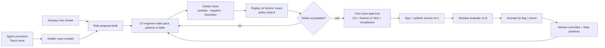
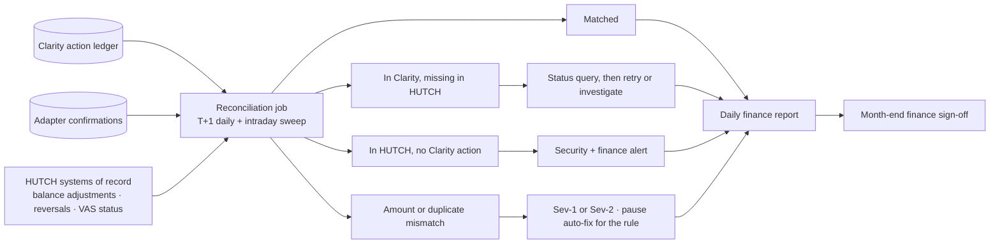

# Hutch Clarity - Rule Engine, Decision Policy & Trust Receipts

[← 08-ai-architecture.md](08-ai-architecture.md) · [← Plan index](README.md) · [10-data-api-events.md →](10-data-api-events.md)

> Part of the **Hutch Clarity Enterprise Project Plan**. Labels: `[DECK Sx]` = stated in deck slide x · `[PROPOSED]` = expanded by this plan · **ASSUMPTION** / **REQUIRES HUTCH CONFIRMATION** / **PROPOSED TARGET – REQUIRES HUTCH VALIDATION**. See the [index](README.md) for the full legend.

> **Plan v1.3 (2026-10-02).** Merged plan: updated to match [18](18-build-blueprint.md), [19](19-tech-stack-and-ai.md), [20](20-policy-change-management.md) and [21](21-migration-and-deployment-plan.md). Change record: [CHANGES.md](CHANGES.md).

## 13. Rule Engine

### 13.1 Concept
- Rules are **versioned deterministic policies** (rule packs) that map timeline evidence to a cause. They are data, not code.
- A rule pack is signed when published and loaded by `rule-engine`. A change requires four-eyes approval and passing golden tests (no code deploy) `[DECK S7, S14]`.
- Every decision records `rule_id@version` and `rule_pack_hash` `[DECK S7]`.
- **v1.3:** packs hold *logic* (conditions); numeric *parameters* (confidence base and adjustments, lookback and match windows) move to the scoped policy store so they change under the [20](20-policy-change-management.md) lifecycle without editing a pack (ADR-0001, ADR-0026). The outcome matrix (§14.2) becomes a ZEN decision table.

### 13.2 Conceptual rule structure (syntax illustrative)

```yaml
rule_id: VAS_NO_CONSENT
version: 4
status: active                      # draft | in_review | active | retired
owner: vas-ops
legal_basis: "Gazette 2316/14 - VAS requires consent + OTP"
applies_to: { domain: prepaid, event_types: [vas_charge] }
required_evidence:                  # missing -> evidence incomplete -> handoff, never a guess
  - source: charging     # vas_charge event
  - source: vas_consent  # consent log for the same subscription
conditions:
  all:
    - exists: { event: vas_charge, as: c }
    - absent: { event: consent_otp_verified, where: { subscription_id: "$c.subscription_id" }, before: "$c.at", lookback: P400D }
    - absent: { event: second_confirmation, where: { subscription_id: "$c.subscription_id" }, before: "$c.at" }
confidence:
  base: 0.90
  boosts: [ { when: { merchant_risk_band: high }, add: 0.05 } ]
  penalties: [ { when: { source_completeness.vas_consent: partial }, sub: 0.30 } ]
rules_out: [ PACK_EXPIRY_BURN, LOAN_RECOVERY ]   # compared and reported as "ruled out"
decision:
  category: unauthorized_vas
  money_effect: "sum(c.amount)"
allowed_actions: [ REFUND, DEACTIVATE_VAS, BLOCK_MERCHANT_UNTIL_OPTIN ]
safeguard: BLOCK_MERCHANT_UNTIL_OPTIN
recurrence_check: merchant_block_active
explanation_template_ids: { si: vas_no_consent_si_v3, ta: vas_no_consent_ta_v3, en: vas_no_consent_en_v3 }
approval_policy_ref: clarity.decision.vas      # thresholds live in OPA, not in the rule
tests_ref: tests/rules/VAS_NO_CONSENT/v4/
```

### 13.3 Candidate rule catalogue (16)
**Inferred from deck causes - final list REQUIRES HUTCH product/CX confirmation.**

| # | Rule ID | Cause | Typical outcome | Deck basis |
|---|---|---|---|---|
| 1 | VAS_NO_CONSENT | VAS charge with no OTP / second confirmation | One-tap fix | S6, S7 |
| 2 | VAS_RENEWAL_UNNOTIFIED | Renewal without required prior notice (**policy to confirm**) | One-tap fix / explain | S6 "early VAS renewal" |
| 3 | DUPLICATE_RELOAD | Two captures, one credit | Auto-fix | S2, S5 |
| 4 | RELOAD_NOT_CREDITED | Capture with no balance credit | Auto-fix if small, else staff | S2, S11 |
| 5 | PAYMENT_PENDING_SETTLEMENT | Bank pending; not yet failed | Explain only + watch | `[PROPOSED]` |
| 6 | PACK_EXPIRY_BURN | Data on main balance after pack end | Explain + safeguard offer | S6, S7 |
| 7 | FUP_CAP_REACHED | Throttled after disclosed FUP | Explain only | S2, S7 |
| 8 | FUP_NOT_DISCLOSED | Cap applied but not shown at purchase (catalogue version) | Staff / one-tap remedy | S5 pack truth label |
| 9 | PACK_MISMATCH | Sold pack ≠ provisioned pack | One-tap fix + product alert | S10, S11 |
| 10 | SOCIAL_PACK_SCOPE | App traffic outside social-pack scope | Explain only | S11 |
| 11 | PACK_SUNSET | Retired pack auto-migrated | Explain + migration card | S11 |
| 12 | LOAN_RECOVERY | Emergency credit recovered from reload | Explain only | S7 |
| 13 | BALANCE_BURN_PAYG | Pay-as-you-go usage with no pack | Explain + safeguard | S11 |
| 14 | WRONG_PACK_PURCHASE | Customer bought the wrong pack (even if used) | One-tap fix within policy window | S7 |
| 15 | DUPLICATE_VAS_CHARGE | Same subscription charged twice in a period | Auto-fix | `[PROPOSED]` |
| 16 | OUTAGE_DURING_PACK | Network outage consumed pack validity | Staff / goodwill per policy | S6, S10 |

### 13.4 Rule lifecycle (teach once → publish) - Diagram 23



### 13.5 Golden tests (every RuleVersion)

| Test type | Example for VAS_NO_CONSENT v4 |
|---|---|
| Positive | Charge LKR 49, no OTP event → match, confidence ≥ 0.90 |
| Negative | Charge with OTP verified 3 days earlier → no match; listed under "ruled out" |
| Boundary | OTP at exactly lookback limit; OTP 1 s after charge; partial consent-source completeness → confidence penalty → staff |
| Replay | Re-run 1,000 anonymized historic cases: v4 vs v3 outcome diff must equal the approved delta list |
| Property-based | Hypothesis-generated timelines: the rule never matches when `consent_otp_verified` precedes the charge |

Coverage gate: every condition branch is exercised (NFR-MNT-01). Replay snapshots are stored with their evidence hash so any historic decision can be reproduced bit-for-bit `[DECK S14]`.

---

## 14. Decision Policy

### 14.1 Inputs
Confidence of the top cause · margin to the second cause (conflict) · amount vs caps · evidence completeness · risk (SIM swap within N days, fraud flags, repeat-refund history) · action reversibility · customer request for a human · daily refund budget remaining · channel (the SMS/USSD channel supports only explain + simple confirm).

### 14.2 Outcome matrix (expands `[DECK S7]`)
All thresholds are **PROPOSED TARGET – REQUIRES HUTCH VALIDATION** (Finance/CX/Risk owners), configurable `[DECK S7]`.

| Outcome | Conditions (all must hold) | Example |
|---|---|---|
| **Auto Fix** | Money back only (no service change) · confidence ≥ 0.95 · amount ≤ auto cap (e.g., LKR 5,000) · evidence complete · no SIM swap ≤ 7 days · no fraud flag · margin ≥ 0.20 · budget available · rule whitelisted for auto | Double reload refunded unasked `[DECK S5, S7]`. The cap must cover the deck's own example, a LKR 3,500 reload taken twice `[DECK S2]`. |
| **Fix with Confirmation** (one tap) | Confidence ≥ 0.90 · amount ≤ one-tap cap (e.g., LKR 10,000) · a service change is involved **or** the rule isn't auto-whitelisted · evidence complete · no risk flags | VAS without OTP; wrong pack `[DECK S7]` |
| **Staff Approval** | Above cap · recent SIM swap · fraud flag · two causes within margin · confidence 0.70–0.90 · reversibility low | Large disputed reload `[DECK S7]` |
| **Explain Only** | Top cause is a rule the customer saw (disclosed) · no money owed | "Unlimited" hit a disclosed FUP `[DECK S7]` |
| **Human Handoff** | Required log missing · fraud risk high · confidence < 0.70 · customer asks · verifier fails twice | Staff start with the full trail `[DECK S7]` |

Additional tiers: above a finance threshold (e.g., LKR 25,000, **ASSUMPTION**), four-eyes (supervisor + finance). The daily refund budget is enforced per rule and globally; when exhausted, auto/one-tap degrade to staff approval. Daily reconciliation compares actions against adapter confirmations `[DECK S7]`.

### 14.3 Decision table sketch (GoRules ZEN, illustrative)

The outcome matrix becomes a **ZEN decision table** (JSON Decision Model), editable in the Policy Studio, hit policy *first* (ADR-0026). Until migration step R3 lands, the prototype evaluates the same ordered rules in Python over an OPA-shaped, hashed input document. OPA/Rego is kept for **authorization** (who may approve, MCP access), not for outcomes.

| # | evidence_complete | risk_flag | confidence | margin | amount ≤ | money_back_only | rule in auto whitelist | budget ok | → outcome |
|---|---|---|---|---|---|---|---|---|---|
| 1 | false | - | - | - | - | - | - | - | HANDOFF |
| 2 | - | high fraud | - | - | - | - | - | - | HANDOFF |
| 3 | true | none | ≥ `auto.confidence` | ≥ `conflict_margin` | `auto.cap_lkr` | true | true | true | AUTO_FIX |
| 4 | true | none | ≥ `one_tap.confidence` | ≥ `conflict_margin` | `one_tap.cap_lkr` | - | - | true | ONE_TAP_FIX |
| 5 | true | - | 0.70–0.90, or margin < `conflict_margin`, or above cap, or SIM swap | | | | | | STAFF_APPROVAL |
| 6 | true | - | - | - | - | - | - | - | per rule: EXPLAIN_ONLY if `disclosed`, else HANDOFF |

Cells in `backticks` are **parameters** resolved from the policy store at `as_of` = event time ([20](20-policy-change-management.md), ADR-0002). Every evaluation stores the table version, the config snapshot hash and the full input hash in `Decision`, so Policy what-if `[DECK S9]` is an exact replay with a candidate table or parameter set. **Every threshold the money path enforces (including four-eyes) must come from the same snapshot**; no constant in the tool layer may shadow a policy value.

### 14.4 Financial controls and reconciliation `[DECK S7, S14]`
The deck promises "refund budgets · daily reconciliation" `[DECK S7]` and "idempotency, caps, refund budget, reconciliation" `[DECK S14]`. This section designs those controls.

| Control | Design |
|---|---|
| Caps | Separate caps per outcome (auto, one-tap, staff, four-eyes) and optional per-rule caps, all in the OPA data bundle |
| Refund budgets | Global daily, per-rule daily, and per-customer velocity limits (e.g., more than N refunds in 30 days → staff). Counters live in PostgreSQL and are spent with an atomic conditional update, so concurrent decisions can't overspend. When a budget runs out, auto and one-tap fall back to staff approval. |
| Segregation of duties | The maker can never be the checker. An agent can't approve their own proposal. The finance-approver role is separate. Bulk fixes need two distinct principals. |
| Idempotency | One idempotency key per action (Redis + PG unique constraint). Status query before any retry ([§18.4](10-data-api-events.md)). |
| Reconciliation | **Daily (T+1) plus intraday sweeps.** Compares the Clarity action ledger with adapter confirmations and HUTCH system-of-record state (balance adjustments, payment reversals, VAS status). |
| Mismatch handling | *Recorded in Clarity, missing in HUTCH* → status query, then retry or investigate. *In HUTCH with no Clarity action* → security + finance alert. *Amount mismatch or duplicate* → Sev-2/Sev-1 and pause auto-fix for that rule. |
| Anomaly detection | Refund value per hour against a baseline band → automatic pause of auto-fix ([§25.3](12-platform-devops-testing-observability.md)) |
| Financial reporting | Daily refund report by rule, outcome and channel. Month-end reconciliation sign-off by Finance. Posting codes (balance-adjustment and reversal codes, GL mapping) **REQUIRE HUTCH Finance confirmation**. |

#### Diagram 37 - Reconciliation



---

## 15. Trust Receipt Architecture

### 15.1 Receipt schema (canonical JSON, signed)

```json
{
  "receipt_id": "TR-2027-000184",
  "schema_version": "1.0",
  "case_id": "CASE-01J...",
  "issued_at": "2027-09-14T08:42:10Z",
  "subject": { "msisdn_masked": "07X XXX 4567", "subscriber_ref_hash": "sha256:..." },
  "what_happened": { "cause_rule": "VAS_NO_CONSENT", "rule_version": 4, "summary_fact_ids": ["f1","f2"] },
  "evidence": [ { "event_id": "ev-...", "source": "charging", "hash": "sha256:..." },
                { "event_id": "ev-...", "source": "vas_consent", "assertion": "no_otp_found", "hash": "sha256:..." } ],
  "decision": { "decision_id": "DEC-...", "outcome": "ONE_TAP_FIX", "policy_version": "2027.09.1" },
  "actions": [ { "action_id": "ACT-...", "type": "REFUND", "amount_lkr": "49.00",
                 "before": { "balance_lkr": "263.00" }, "after": { "balance_lkr": "312.00" },
                 "status": "COMPLETED", "adapter_ref": "..." } ],
  "safeguard": { "type": "BLOCK_MERCHANT_UNTIL_OPTIN", "status": "ACTIVE" },
  "recurrence_test": { "check": "merchant_block_active", "result": "PASSED", "checked_at": "..." },
  "actor": { "type": "customer_confirmed", "approver_role": null, "system": "clarity-tool-layer@1.8.2" },
  "languages": ["si","ta","en"],
  "prev_receipt_hash": "sha256:...",
  "payload_hash": "sha256:...",
  "signature": { "alg": "Ed25519", "kid": "clarity-rcpt-2027-01", "value": "base64..." },
  "verify_url": "https://<hutch-domain>/v/TR-2027-000184"
}
```

### 15.2 Design decisions

| Element | Decision |
|---|---|
| Receipt ID | Human-quotable `TR-YYYY-NNNNNN` `[DECK S6]` + internal ULID. The sequence is allocated per year. |
| Canonicalization | RFC 8785 JSON Canonicalization Scheme before hashing |
| Hash chain | `payload_hash = SHA-256(JCS(payload_without_sig) ‖ prev_receipt_hash)`, serialized per partition (e.g., per day/shard) with row locks to avoid contention. Chain head anchored to WORM storage and the SIEM every N minutes. |
| Signature | Ed25519 `[DECK S6]` over `payload_hash`. Keys in HSM/KMS; `kid` in receipt; public keys at `/.well-known/clarity-keys.json`; annual rotation (**ASSUMPTION**), old keys kept for verification. |
| QR | Encodes `verify_url` + short signature fingerprint. No PII in the QR. |
| Public verification page | Shows VALID/INVALID, issue date, masked number, amounts corrected, safeguard status. Full evidence only for an authenticated owner or staff. |
| Audit record | Each issuance writes an `AuditEvent(receipt.issued)` linked to the decision/action audit chain |
| Replay | `POST /receipts/{id}/replay` (staff/auditor) re-runs the rule + policy versions on the evidence snapshot and must reproduce the decision |
| Formats | PNG, PDF, SMS (short form with ID + URL), in si/ta/en `[DECK S6]` |
| Revocation / correction | Receipts are never edited. A correction issues a new receipt that references `supersedes`. The verify page shows "superseded by …". |
| Fake receipt defence | Only signed receipts in the ledger verify. Forged PDFs fail the signature/lookup. Customer/agent verification counts are monitored, and a spike in failed verifications raises an alert ([§19](11-security-privacy-audit.md) threat model). |

Generation and verification sequence: **Diagram 14**.
---

[← 08-ai-architecture.md](08-ai-architecture.md) · [← Plan index](README.md) · [10-data-api-events.md →](10-data-api-events.md)
