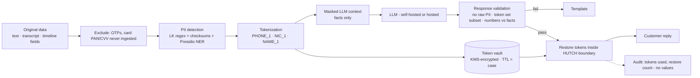
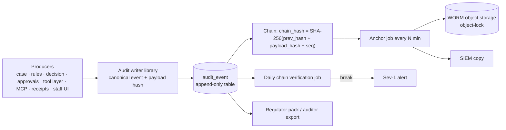

# Hutch Clarity - Security, Privacy & Audit

[← 10-data-api-events.md](10-data-api-events.md) · [← Plan index](README.md) · [12-platform-devops-testing-observability.md →](12-platform-devops-testing-observability.md)

> Part of the **Hutch Clarity Enterprise Project Plan**. Labels: `[DECK Sx]` = stated in deck slide x · `[PROPOSED]` = expanded by this plan · **ASSUMPTION** / **REQUIRES HUTCH CONFIRMATION** / **PROPOSED TARGET – REQUIRES HUTCH VALIDATION**. See the [index](README.md) for the full legend.

> **Plan v1.3 (2026-10-02).** Merged plan: updated to match [18](18-build-blueprint.md), [19](19-tech-stack-and-ai.md), [20](20-policy-change-management.md) and [21](21-migration-and-deployment-plan.md). Change record: [CHANGES.md](CHANGES.md).

## 19. Security Architecture

### 19.1 Controls (expands `[DECK S8]`)

| Domain | Control |
|---|---|
| Edge | CDN + WAF (OWASP CRS), bot management, rate limits per IP/MSISDN token/device, geo and velocity rules on OTP endpoints |
| Customer identity | App token exchange or OTP via HUTCH OTP service. Short-lived signed JWT (≤ 15 min, **PROPOSED**), refresh bound to device. **Step-up OTP before any L2+ confirmation on WhatsApp/SMS** (**REQUIRES HUTCH CONFIRMATION** of identity policy). |
| Staff identity | HUTCH SSO (OIDC/SAML) + MFA. Step-up MFA for approvals above threshold. Session timeout. Phishing-resistant MFA for admin roles (**PROPOSED**). |
| RBAC/ABAC | Roles: agent, supervisor, finance-approver, cx-engineer, vas-ops, compliance, auditor, platform-admin, security-admin. The full permission matrix and separation-of-duties rules are in [18 §5.4](18-build-blueprint.md); the prototype implements 10 roles and 19 permissions (`core/iam/principal.py`). ABAC attributes (team, region, amount) evaluated in OPA. Four-eyes for L4 and high-value L3. |
| Service identity | Workload identities (SPIFFE/SPIRE or mesh-issued certs); **mTLS** everywhere; per-service DB users |
| Data-level isolation | One PostgreSQL schema and DB role per module. **Row-level security** on customer-scoped tables keyed by `subscriber_ref` (set per request), so an application bug cannot return another subscriber's rows. |
| Network segmentation | Zones per Diagram 8 / Diagram 28. K8s NetworkPolicies default-deny. Adapters in an integration namespace with egress allowlists. AI zone egress only to an approved hosted endpoint. |
| Encryption | TLS 1.2+ (1.3 preferred) in transit. AES-256 at rest (DB, object storage, Kafka). Field-level encryption for vault entries. Keys in KMS/HSM with rotation. |
| Token vault | Separate service + DB. Stores the PII ↔ token mapping, encrypted with KMS data keys. TTL tied to case `[DECK S8]`. Access audited. |
| Secrets | OpenBao (or the cloud secrets manager) + KMS; no secrets in code or images; short-lived DB credentials; secret scanning in CI |
| MCP restrictions | Profile allowlists, subject binding, no L3/L4 execution, rate limits, denial-spike alerts ([§10](07-mcp.md)) |
| Financial safeguards | Caps, refund budgets, idempotency, reconciliation, refund-anomaly detection `[DECK S8]` |
| Audit ledger | Hash-chained append-only + WORM anchoring (§20.7) |
| Monitoring | SIEM integration, UEBA on staff approvals, pen tests before pilot and annually `[DECK S8]` |
| Supply chain | SBOM, signed images (cosign), admission policy that only signed images run, dependency pinning |
| Standards baseline | OWASP ASVS L2 (L3 for money path), OWASP Top 10 for LLM Applications, PDPA No. 9 of 2022. **HUTCH internal security standards REQUIRE CONFIRMATION.** |

### 19.2 Threat model (STRIDE-oriented)

| # | Threat | Vector | Impact | Controls | Residual |
|---|---|---|---|---|---|
| TH1 | Account abuse / takeover | SIM swap, OTP interception, WhatsApp number hijack | Fraudulent refunds/settings | OTP rate limits, SIM-swap recency → staff approval, device binding, step-up | Medium |
| TH2 | Refund abuse | Customers farming refunds by repeated disputes | Financial loss | Evidence-only decisions, per-customer refund velocity limits, refund budgets, anomaly detection, repeat-refund history in policy | Low–Med |
| TH3 | Prompt injection | Malicious text in a message, voice note or retrieved document | Tool misuse, data leak | Untrusted delimiting, MCP allowlist + subject binding, LLM cannot execute L3/L4, verifier, injection classifier | Low |
| TH4 | Data leakage | LLM output containing other customers' data; logs with PII | PDPA breach | Masking, subject binding, output PII scan, masked logs/traces `[DECK S8]`, DLP on exports | Low |
| TH5 | Replay attacks | Re-submitting confirmation tokens or webhook payloads | Duplicate actions | Single-use, action-bound, short-TTL tokens; webhook signature + timestamp + nonce; idempotency keys | Low |
| TH6 | Duplicate actions | Retries, double taps, consumer redelivery | Double refunds | Idempotency (Valkey + PG unique), outbox, status-query-before-retry, reconciliation | Very low |
| TH7 | Privilege escalation | Agent self-approves; role misconfiguration | Unauthorized refunds | Four-eyes with distinct principals, OPA tests, access reviews, UEBA | Low |
| TH8 | Malicious MCP calls | Compromised agent/orchestrator calling tools | Data exfiltration | mTLS + OAuth audience, per-profile allowlist, rate limits, denial alerts, no execute path | Low |
| TH9 | Compromised API keys | Leaked adapter or hosted LLM key | Upstream abuse | Short-lived creds, OpenBao dynamic secrets, egress allowlists, key rotation, anomaly alerts | Low–Med |
| TH10 | Fake receipts | Forged PDF/QR shown to staff or TRCSL | Fraudulent claims | Signature + ledger lookup, verify page, staff tool verifies before honouring | Very low |
| TH11 | Insider tampering with audit | DB admin edits ledger | Loss of evidence | Hash chain + WORM anchors + SIEM copies; separation of duties | Very low |
| TH12 | Denial of service | Floods on OTP, webhook, LLM-cost exhaustion | Outage/cost | WAF, rate limits, token budgets per session, queue back-pressure, cache | Medium |
| TH13 | Malicious VAS merchant | Charging without consent | Customer harm | VAS_NO_CONSENT, merchant watch scoring, suspension workflow | Low |
| TH14 | MCP tool poisoning / malicious external MCP client | Altered tool descriptions; registered client abusing scopes | Data exfiltration, misleading agents | Tool descriptions served only from the signed release; per-client registry, scopes, quotas and kill switch; denial-spike alerts | Low |
| TH15 | Confused deputy via token passthrough | MCP forwarding a client token downstream | Privilege misuse | Passthrough forbidden; RFC 8693 token exchange with narrowed audience; subject binding | Very low |
| TH16 | Data exposure through free-tier AI providers (prototype) | Real customer data sent to an unpaid tier that may use prompts for product improvement | PDPA breach | Synthetic data only; masking enforced in the AI gateway; Groq ZDR; paid/enterprise tier or HUTCH models before real data | Very low |
| TH17 | Unauthorized or faulty policy change | Insider edits a cap; wrong effective date; bad decision table; a constant shadowing a policy value | Over-refunding, unfair outcomes, regulatory breach | Maker-checker by change class, guardrails, mandatory replay impact report, signed bundles, scheduled activation, instant rollback, audit ([20](20-policy-change-management.md)) | Low |
| TH18 | Duplicate proof | Concurrent or repeated confirmation of one plan | Two signed receipts for one refund; confused customers and auditors | Receipt issued once per completed plan by an idempotent consumer of `action.completed`; replays return the original receipt ([21 §3](21-migration-and-deployment-plan.md)) | Low |
| TH19 | Self-asserted staff identity outside the demo | A development sign-in reachable on a public deployment | Anyone approves refunds | Development issuers exist only in the synthetic profiles (`demo`, `full`) and return 404 in `prod`; production staff identity is federated SSO | Very low |

---

## 20. Privacy, PII Masking and Audit

### 20.1 PII masking pipeline - Diagram 26

| Element | Design |
|---|---|
| Recognizers (Sri Lanka) | Mobile numbers (`+94`/`0` + `7x` prefixes, spaced/hyphenated variants); old NIC (9 digits + V/X) and new NIC (12 digits) with structural validation (birth-year/day field); passport patterns; email; bank account/card patterns (blocked); addresses (NER); person names in Sinhala/Tamil/English (Presidio NER + custom gazetteers, see limitations) |
| Excluded entirely | OTPs, card numbers, CVV, PINs, passwords: **never sent, never stored in Clarity text** `[DECK S8]`. Detection → drop + warn the user. |
| Tokens | Deterministic per case (`<PHONE_1>`), so the LLM can refer consistently. Tokens are meaningless outside the case. |
| Token vault | Separate service. AES-256-GCM with KMS data keys. TTL = case closure + N days (**ASSUMPTION** 30). Access only by the restore step. Every restore audited. |
| Response validation | Rejects outputs with unrecognised tokens, raw PII patterns, or numbers not in FACTS |
| Restoration | Only in the trusted boundary, just before channel delivery. Logs and traces keep masked text `[DECK S8]`. |
| Limitations | Name detection in Sinhala/Tamil script is imperfect. Mitigated by structured-first design (customers mostly tap Why?), conservative masking of capitalised or unknown tokens, and evaluation on a labelled si/ta PII set. |

### 20.2 PDPA alignment (REQUIRES HUTCH legal confirmation)
Lawful basis per processing purpose, a DPIA before pilot, purpose limitation (Foresight on aggregates only `[DECK S8]`), data-subject rights (access to receipts, correction), cross-border transfer assessment for any hosted LLM tier, breach notification runbook ([§36](14-risk-pilot-readiness-operations.md)), and retention schedule (§20.6).

### 20.3 Audit architecture - Diagram 27

Append-only is enforced by: DB role with INSERT only, no UPDATE/DELETE grants, trigger guard, partitioned tables, and archive to WORM after the hot period.

### 20.4 Audit record coverage

| Audited item | Record contents |
|---|---|
| Input evidence | snapshot hash, sources, completeness, adapter versions |
| Rule version | rule_id, version, pack hash, matched/unmatched, confidence |
| Decision | outcome, policy bundle version, input hash |
| Approval | approver ref, role, MFA step-up, timestamp, comment hash |
| MCP tool | MCPInvocation reference (tool, level, decision, args hash) |
| Staff action | user ref, role, UI action, case, before/after |
| System action | action id, adapter request/response refs, idempotency key, status |
| Response | template/LLM, model+prompt version, verifier result, output hash (masked text kept per retention) |
| Receipt | receipt id, payload hash, kid, chain link |
| Override | who, what was overridden (rule/decision), reason code, linked teach-once case |

### 20.5 Consent records
Notification consent, guardian links (each family member consents), voice processing consent, and marketing vs service messages are separated. VAS consent evidence is read from HUTCH systems and **kept ≥ 1 year** `[DECK S8]`.

### 20.6 Retention (ASSUMPTION - legal to confirm)

| Data | Hot | Archive |
|---|---|---|
| Masked conversation text | 90 days | 1 year (masked) |
| Token vault entries | Case close + 30 days | - (deleted) |
| Evidence snapshots, decisions, actions, receipts | 2 years | 7 years WORM |
| Audit events | 1 year | 7 years WORM |
| VAS consent evidence references | ≥ 1 year `[DECK S8]` | per HUTCH policy |
| LLM traces (Langfuse, masked) | 30 days | - |
---

[← 10-data-api-events.md](10-data-api-events.md) · [← Plan index](README.md) · [12-platform-devops-testing-observability.md →](12-platform-devops-testing-observability.md)
