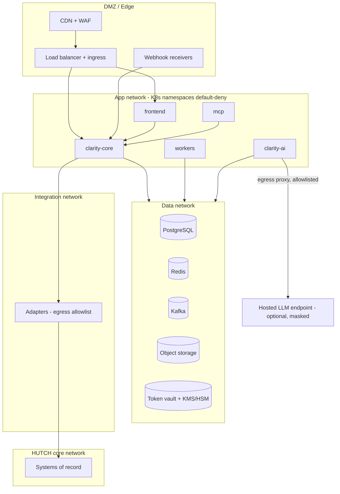
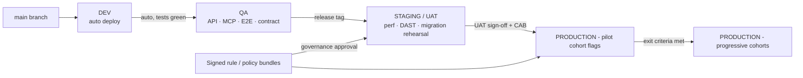
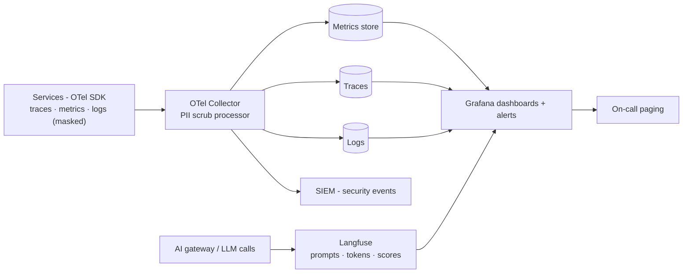

# Hutch Clarity — Technology Stack, Deployment, DevOps, Testing & Observability

[← 11-security-privacy-audit.md](11-security-privacy-audit.md) · [← Plan index](README.md) · [13-delivery-plan.md →](13-delivery-plan.md)

> Part of the **Hutch Clarity Enterprise Project Plan**. Labels: `[DECK Sx]` = stated in deck slide x · `[PROPOSED]` = expanded by this plan · **ASSUMPTION** / **REQUIRES HUTCH CONFIRMATION** / **PROPOSED TARGET – REQUIRES HUTCH VALIDATION**. See the [index](README.md) for the full legend.

## 21. Technology Stack

Classification: **P** = suitable for prototype · **PS** = production-suitable · **R** = replaceable according to HUTCH standards.

| Layer | Technology | Deck | P | PS | R | Notes |
|---|---|---|---|---|---|---|
| Frontend | Next.js, TypeScript, Tailwind, PWA | `[DECK S13]` | ✅ | ✅ | — | One codebase for web, app WebView module and consoles. Lean module for older phones `[DECK S15]`. |
| Backend | Python 3.12, FastAPI, Pydantic v2 | `[DECK S13]` | ✅ | ✅ | — | Async I/O suits adapter fan-out |
| Async jobs | Celery (Redis broker) | `[DECK S13]` | ✅ | ✅ (stateless jobs) | ◐ | Workflow state in PG (T1) |
| Policy | OPA (Rego), bundles | `[DECK S13]` | ✅ | ✅ | — | Decision policy + authZ |
| Rule engine | Python evaluator + YAML rule packs | `[PROPOSED]` refinement | ✅ | ✅ | — | T3 |
| Database | PostgreSQL 16 | `[DECK S13]` | ✅ | ✅ | ◐ (HUTCH DB standard) | HA: primary + sync replica + DR |
| Vector | pgvector | `[DECK S12]` | ✅ | ✅ (to ~10s of millions vectors) | ◐ | HNSW indexes; dedicated vector DB only if scale demands |
| Cache | Redis (+ RedisVL semantic cache) | `[DECK S12, S14]` | ✅ | ✅ | — | Sessions, cache, idempotency, rate limits |
| Streaming | Kafka + Schema Registry | `[DECK S12]` + T2 | ◐ (Redpanda/single broker in dev) | ✅ | ◐ (HUTCH's Kafka if available) | |
| Analytics | Snowflake | `[DECK S12]` | ◐ (DuckDB/PG locally) | ✅ | ✅ **REQUIRES HUTCH CONFIRMATION** | T5 |
| Object storage | S3-compatible with object lock | `[PROPOSED]` | ✅ (MinIO) | ✅ | ✅ | Receipts, exports, audit anchors |
| AI serving | vLLM (self-hosted) + AI gateway | `[PROPOSED]` (provider-agnostic `[DECK S13]`) | ◐ | ✅ | ✅ | GPU node pool **REQUIRES HUTCH infra confirmation** |
| LLM observability | Langfuse (self-hosted) | `[DECK S12]` | ✅ | ✅ | ◐ | Masked traces only |
| PII | Microsoft Presidio + Sri Lankan recognizers | `[DECK S8]` | ✅ | ✅ | — | |
| ML | UMAP, HDBSCAN, scikit-learn/LightGBM | `[DECK S13]` | ✅ | ✅ | — | |
| Foresight | MiroFish/OASIS (+ GraphRAG, Zep) | `[DECK S13]` | ◐ | ◐ after licence + backtest gate | ✅ | T8 |
| Receipts | Playwright render, Ed25519 (libsodium/cryptography), QR | `[DECK S13]` | ✅ | ✅ | — | Signing via HSM/KMS (T10) |
| Channels | WhatsApp Cloud API, SMS/USSD gateway | `[DECK S13]` | ◐ test number/simulator | ✅ | USSD/SMS via HUTCH gateway | Meta business verification by HUTCH |
| MCP | Python MCP SDK (FastMCP) on FastAPI | `[DECK S13]` "MCP tools" | ✅ | ✅ | — | [§10](07-mcp.md) |
| Containers | Docker (OCI) | `[DECK S13]` | ✅ | ✅ | — | Distroless/slim bases |
| Orchestration | Kubernetes | `[DECK S13]` | ◐ (kind/k3d) | ✅ | ◐ (HUTCH platform: OpenShift/EKS/AKS/on-prem) | **REQUIRES HUTCH CONFIRMATION** |
| IaC / GitOps | Terraform, Helm, Argo CD | `[PROPOSED]` | ◐ | ✅ | ✅ | |
| Observability | OpenTelemetry, Grafana (+ Prometheus, Loki, Tempo) | `[DECK S12]` | ✅ | ✅ | ◐ HUTCH APM | |
| Security tooling | Vault/KMS, cosign, Trivy, Semgrep/CodeQL, ZAP | `[PROPOSED]` | ◐ | ✅ | ✅ | |
| Feature flags | OpenFeature + flagd/Unleash | `[PROPOSED]` | ✅ | ✅ | ✅ | Per rule, channel, cohort |
| Testing | pytest, Hypothesis, Pact, Playwright, k6, Testcontainers, opa test | `[PROPOSED]` | ✅ | ✅ | — | |

---

## 22. Deployment Architecture

### 22.1 Environments

| Env | Purpose | Data | Integrations | AI | Access |
|---|---|---|---|---|---|
| **Local** | Developer loop | Synthetic fixtures | Mock drivers (docker-compose) | Small local model or recorded responses | Developers |
| **Development** | Shared integration of main | Synthetic | Mocks | Self-hosted dev model | Team |
| **QA** | Automated API/MCP/E2E/contract tests | Synthetic + generated edge cases | Mocks + HUTCH sandbox where available | Eval model | QA |
| **Staging / UAT** | Production-like; perf, DAST, UAT, migration rehearsal | Anonymized HUTCH extract (approved) | HUTCH non-prod interfaces | Production model config | QA, business UAT users |
| **Pilot** | Production cluster, restricted cohort via flags | Real (shadow: read-only, anonymized first) | HUTCH production read; write per approved action types | Production | Pilot staff + cohort |
| **Production** | General availability | Real | HUTCH production | Production + fallback | Customers, staff |

Pilot runs **inside production** under feature flags and cohort allowlists rather than in a separate stack. This avoids a second set of production integrations. **REQUIRES HUTCH CONFIRMATION** (some operators require a separate pilot tenant).

### 22.2 Deployment diagram
Production topology: **Diagram 9**.

### 22.3 Network zones — Diagram 28

### 22.4 Sizing and resilience (production starting point — **ASSUMPTION**, re-sized after load tests)
- Stateless services: min 3 replicas across zones, HPA on CPU/RPS/queue depth, PodDisruptionBudgets.
- PostgreSQL: primary + synchronous standby (RPO ≈ 0 inside the site) + asynchronous DR replica. PITR backups every 5 min WAL.
- Kafka: ≥ 3 brokers, RF = 3, `min.insync.replicas = 2`.
- Redis: HA (Sentinel/cluster). Losing it degrades cache and sessions but never loses money state (idempotency is also in PG).
- GPU: N+1 nodes for the self-hosted model; hosted tier as overflow/fallback.
- DR: warm standby in a second DC/region. **HUTCH data-residency and DC topology REQUIRE CONFIRMATION.**

---

## 23. DevOps / CI/CD

Pipeline: **Diagram 10**.

| Topic | Design |
|---|---|
| Branching | Trunk-based; short-lived branches; PR review (2 approvers for money-path code: `services/tool-layer`, `rules/`, `policy/`, `receipts/`) via CODEOWNERS |
| Quality gates | Lint/type, unit, golden rule tests, OPA tests, SAST, SCA + licence, secret scan, container scan, SBOM, AI eval smoke. Any failure blocks merge. |
| Artefacts | Signed images (cosign) with provenance (SLSA level target 2–3); Helm charts; signed rule/policy bundles |
| Deployment | GitOps (Argo CD) per environment; environment promotion by PR to an env repo |
| Migrations | Expand → migrate → contract pattern; backward-compatible for one release; run as pre-deploy Job; rehearsed in staging on an anonymized copy; no destructive DDL without a backup checkpoint |
| Rollback | Image rollback via GitOps revert. DB rollback by forward-fix (expand/contract makes old code compatible). Rule/policy rollback = re-activate the previous signed version (seconds). |
| Feature flags | Per channel, per rule (auto-fix whitelist), per cohort, per model tier. Kill switches: `auto_fix_global`, `llm_explanations`, `customer_actions`, `hosted_llm`. |
| Progressive delivery | Canary 5% → 25% → 100% with automated analysis on SLOs, verifier failure rate and refund anomaly metrics |
| Secrets | Per-environment Vault paths; CI uses OIDC federation (no static cloud keys); runtime secrets injected via CSI driver; rotation schedule |
| Change management | Production deploys via HUTCH CAB/change process (**REQUIRES CONFIRMATION**); freeze windows respected |

### 23.1 Environment promotion — Diagram 29

---

## 24. Testing Strategy

| Layer | Scope | Tools | Gate |
|---|---|---|---|
| Unit | Functions, mappers, verifier, masking recognizers | pytest, Hypothesis, Vitest | ≥ 85% line coverage core; 100% for tool-layer guards |
| Rule engine | Golden tests per RuleVersion (positive, negative, boundary, replay), property-based | pytest + fixtures | 100% rules with complete golden sets; replay diff = approved delta |
| Policy | OPA unit tests for every outcome + authZ rule | `opa test` | 100% decision branches |
| Integration | Services + PG/Redis/Kafka | Testcontainers | Green on each PR |
| Contract | Adapter ↔ mock ↔ HUTCH sandbox contracts | Pact | Provider verification before switching driver |
| API | OpenAPI conformance, negative tests, idempotency | Schemathesis, pytest | No 5xx on fuzz; idempotency proven |
| MCP | Schema validation, allowlist per profile, subject binding, denial paths, injection attempts, golden tool selection | pytest + MCP client harness | 0 disallowed executions |
| AI | Evaluation suite ([§12.7](08-ai-architecture.md)), red-team prompts (si/ta/en/Singlish), PII leakage tests | Langfuse datasets, custom harness | Metric gates |
| Security | SAST, SCA, DAST (ZAP), external pen test, threat-model verification, OTP abuse tests | Semgrep/CodeQL, ZAP, third party | No open High/Critical at Security Gate |
| Load / performance | Peak + 2× scenarios, soak 24 h, adapter-latency injection | k6 | NFR-PERF targets met at 2× pilot peak |
| End-to-end | The 6 journeys ([§6](03-requirements-personas-journeys.md)) per channel | Playwright, WhatsApp/USSD simulators | All journeys pass |
| Reconciliation | Synthetic action ledger vs adapter confirmations, including mismatches | pytest + scenarios | Every mismatch detected |
| UAT | Business scenarios with CX, finance, VAS, compliance; Sinhala/Tamil native reviewers | Test management tool | Signed UAT report |
| Chaos / resilience | Kill pods, Kafka broker loss, Redis loss, adapter timeouts, LLM outage, receipt-signing outage | Chaos Mesh/Litmus | Degradation per [§39](15-cost-scale-failure-kpi.md); zero duplicate actions |
| Shadow comparison | Clarity recommendations vs agent outcomes on live cases | Analytics | Agreement and false-positive targets ([§34](14-risk-pilot-readiness-operations.md)) |

### 24.1 Test data management

| Data set | Source | Rules |
|---|---|---|
| Synthetic generator | Code in `integrations/mocks`, seeded and reproducible | Subscribers, packs, charges, payments, consents, usage and complaints in si/ta/en/Singlish. A scenario library per rule (positive, negative, boundary). Available from week 3. |
| Anonymized HUTCH extract | Approved by data governance (DEP-05) | MSISDN tokenized with an environment-specific HMAC key. Names, NIC and free-text PII removed or masked. Timelines shifted uniformly so intervals that rules depend on stay intact. Amounts kept. k-anonymity checks on aggregates used for Autopsy/Foresight. |
| Golden sets | Repository (no PII) | Rule goldens, AI evaluation sets, MCP conversations and flow tests. Versioned with the code. |
| Test MSISDNs | HUTCH non-prod | For contract and E2E tests against the HUTCH sandbox |
| Environment policy | — | No production PII in local, DEV or QA. Staging uses approved anonymized data only. Data is refreshed per release. |

---

## 25. Observability

### 25.1 Telemetry pipeline — Diagram 30

### 25.2 Dashboards (all with SLO overlays; targets per [§4.2](03-requirements-personas-journeys.md) and [§40](15-cost-scale-failure-kpi.md))

| Dashboard | Panels |
|---|---|
| **Customer experience** | Resolution time (p50/p90) by cause and channel; first-contact resolution; handoff rate + reasons `[DECK S10]`; repeat complaints within 30 days; channel completion funnels (where people drop) `[DECK S10]`; CSAT per journey |
| **Rules** | Trigger rate per rule/version; auto-fix rate; one-tap acceptance; staff overrides per rule (false-positive proxy); explain-only share; evidence-incomplete rate per source |
| **AI** | Calls by tier/model; tokens in/out; latency p95; cache hit rate (exact/semantic) `[DECK S14]`; verifier failure rate; fallback-to-template rate; language performance (si/ta/en/Singlish) quality scores; cost/day; model calls avoided `[DECK S15]` |
| **MCP** | Invocations per tool/profile; failures by error code; policy denials (spike alert); latency; proposals created vs confirmed |
| **Financial** | Refund count and value by rule, outcome type and channel; budget utilization; approvals pending/aging; reconciliation matches/mismatches; refund anomalies |
| **Platform** | Golden signals per service (latency, traffic, errors, saturation); Kafka consumer lag; DLQ depth; DB load, locks, replication lag; Redis memory; GPU utilization; adapter latency/error/circuit state per HUTCH system |
| **Trust** | Receipts issued; verification requests (valid/invalid); recurrence tests PASSED/FAILED; chain verification status |
| **Sustainability** `[DECK S15]` | Model calls avoided, shop visits avoided (proxy), energy per case (estimated) |

### 25.3 Key alerts
Reconciliation mismatch > 0 (page finance + on-call); refund value/hour above anomaly band (auto-pause auto-fix); verifier failure rate > X%; MCP denial spike; audit chain break (Sev-1); Kafka lag > threshold; adapter circuit open; DLQ non-empty; LLM provider error rate; signing failures.

### 25.4 SLOs and error budgets
All values are **PROPOSED TARGET – REQUIRES HUTCH VALIDATION**.

| SLO | SLI | Target | Window | Error budget |
|---|---|---|---|---|
| Why? availability | Successful responses / valid requests | 99.9% | 30 days | ≈ 43 min/month |
| Why? latency | p95 end-to-end | ≤ 2.5 s (template), ≤ 6 s (LLM) | 30 days | 5% of requests may exceed |
| Zero-contact detection | Duplicate reloads decided ≤ 5 min after `payment.recorded` | 99% | 30 days | 1% |
| Receipt issuance | Receipts issued ≤ 5 min after `action.completed` | 99.5% | 30 days | 0.5% |
| Desk availability | Successful requests in staffed hours | 99.9% | 30 days | ≈ 43 min/month |
| Verify page | Availability | 99.95% | 30 days | ≈ 22 min/month |
| **Duplicate financial execution** | Count | **0** | Always | **No budget.** Any breach is Sev-1. |

**Error-budget policy.** Fast and slow burn-rate alerts. More than 50% of the budget burned mid-window → freeze non-critical releases. Budget exhausted → only reliability fixes ship until it recovers.

---

[← 11-security-privacy-audit.md](11-security-privacy-audit.md) · [← Plan index](README.md) · [13-delivery-plan.md →](13-delivery-plan.md)
