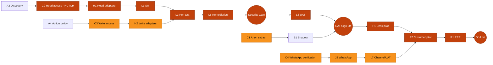

# Hutch Clarity - Delivery Plan: Phases, WBS, Gantt, Critical Path, Team, RACI, Dependencies

[← 12-platform-devops-testing-observability.md](12-platform-devops-testing-observability.md) · [← Plan index](README.md) · [14-risk-pilot-readiness-operations.md →](14-risk-pilot-readiness-operations.md)

> Part of the **Hutch Clarity Enterprise Project Plan**. Labels: `[DECK Sx]` = stated in deck slide x · `[PROPOSED]` = expanded by this plan · **ASSUMPTION** / **REQUIRES HUTCH CONFIRMATION** / **PROPOSED TARGET – REQUIRES HUTCH VALIDATION**. See the [index](README.md) for the full legend.

> **Plan v1.3 (2026-10-02).** Merged plan: updated to match [18](18-build-blueprint.md), [19](19-tech-stack-and-ai.md), [20](20-policy-change-management.md) and [21](21-migration-and-deployment-plan.md). Change record: [CHANGES.md](CHANGES.md).

> **Scope of this chapter.** This is the **HUTCH production programme**, from selection to production, assumed to start 2027-01-04. The **prototype migration** (restructure the working prototype into the target architecture, R0 to R7) is scheduled in [21](21-migration-and-deployment-plan.md); its output is the input to P0 below.

## 26. Implementation Phases

**Assumed project start date for planning purposes: Monday 2027-01-04.** The 21 required phases are grouped into 6 stages; many run in parallel. Dates come from the activity table (§28).

| Stage | Phase | Window (2027) | Key activities | Deliverables | Exit gate |
|---|---|---|---|---|---|
| **A. Mobilise & define** | P0 Architecture/Prototype Assessment | Jan 4 – Jan 17 | Review prototype code, deck, demo; gap analysis vs this plan; ADR backlog | Assessment report, ADR-000 list | Sponsor kick-off |
| | P1 Requirements Discovery | Jan 11 – Feb 14 | Stakeholder interviews (CX, finance, VAS, network, compliance, IT); data-source discovery; refund/action policy workshops | SRS (FR/NFR), personas, journey maps, rule catalogue v0, action policy draft | **M1 Requirements Sign-Off (Feb 15)** |
| | P2 Architecture & Security Design | Feb 1 – Mar 14 | Solution/data/integration/AI/MCP architecture; threat model; DPIA; licence reviews | SAD, ICDs per adapter, MCP spec, threat model, DPIA draft | **M2 Architecture Sign-Off (Mar 15)** |
| **B. Foundation & core** | P3 Platform Foundation | Feb 22 – Mar 28 | Envs, K8s, CI/CD, secrets, observability, Kafka/PG/Valkey/WORM | Running DEV/QA, pipelines, golden-signal dashboards | Platform smoke test |
| | P4 Timeline + Case Core | Mar 15 – May 2 | Case service, canonical model, timeline builder, snapshots | Case + timeline APIs on mocks | Contract tests green |
| | P5 Rule/Decision Engine + Tool Layer | Mar 22 – May 30 | Rule engine, 16 rules + golden tests, OPA policy, caps/budgets, tool layer, reconciliation | Rule pack v1, policy bundle v1, tool layer | **M3 Core Complete (May 31)** |
| | P6 AI + RAG | Mar 8 – May 30 | Model selection eval, AI gateway, PII masking, extraction/explanation/verifier, RAG, eval harness | AI services + eval report v1 | AI eval gates met on golden sets |
| | P7 MCP Server | Apr 19 – Jun 13 | Tools L1/L2, propose/confirm, OPA authZ, audit | MCP server + tool spec | MCP abuse tests pass |
| **C. Integrate & build experience** | P8 HUTCH Integration Adapters | Mar 29 – Jul 4 | Read adapters → HUTCH non-prod; event ingestion; write adapters per approved action | Adapters + contract tests | **M4 Integration Complete (Jul 5)** |
| | P9 Customer Channels | May 10 – Jul 18 | Web/app Why? module, WhatsApp (text/voice), SMS/USSD | Channel apps on staging | E2E journeys pass |
| | P10 Clarity Desk | Feb 15 – Aug 1 | UX research/design; Desk core; advanced features | Desk v1 (core) and v1.1 (advanced) | Desk UAT-ready |
| | P11 Trust Receipts | Apr 26 – Jun 6 | Receipt service, signing via KMS/HSM, render, verify page | Receipt service + verify page | Signature/chain tests pass |
| | P12 Complaint Autopsy | May 3 – Aug 1 | Pipeline on anonymized historic complaints; flow generation + approval | Autopsy v1, first cluster report | CX review of clusters |
| | P13 Foresight | Jun 7 – Jul 4 (discovery); Oct 4 – Dec 12 (build); 2028 Q1 (pilot) | Licence/maturity review, baseline, simulation, backtest | Foresight v1 + backtest report | Backtest gate ([§3.4](02-solution-capabilities.md)) |
| **D. Verify** | P14 Integration Testing (SIT) | Jun 14 – Jul 18 | End-to-end across adapters + channels | SIT report | No Sev-1/2 open |
| | P15 Security & Performance Testing | Jul 5 – Aug 15 | Pen test, DAST, AI red-team, load/soak, chaos; remediation | Pen-test report, perf report | **M5 Security Gate (Aug 16)** |
| | P16 UAT | Aug 16 – Sep 5 (Desk); Sep 13 – Oct 3 (customer channels) | Business scenario testing incl. si/ta native reviewers | UAT sign-off documents | **M6 UAT Sign-Off (Sep 6)** |
| **E. Prove in production** | P17 Shadow Mode (Step 1) | Jul 19 – Aug 29 | Read-only on anonymized logs; causes suggested to staff; compare with agent outcomes | Shadow report (agreement, false positives) | **M-Shadow start (Jul 19)**; exit criteria [§34](14-risk-pilot-readiness-operations.md) |
| | P18 Controlled Pilot (Steps 2–3) | Sep 6 – Nov 14 | Desk live with staff-approved fixes and receipts; weekly Autopsy; then customer pilot cohort with whitelisted auto-fix | Pilot KPI report | **M7 Pilot Go-Live (Sep 6)**; customer pilot Oct 4 |
| | P19 Customer Launch | Nov 15 – Dec 12 | Production readiness review; progressive rollout by cohort/channel | PRR pack, go-live runbook | **M8 Production Go-Live (Nov 22)** |
| **F. Run & grow** | Hypercare | Nov 22 – Jan 16 2028 | Elevated support, daily KPI review, defect burn-down | Hypercare exit report | Hypercare exit (Jan 17 2028) |
| | P20 Scale & Continuous Improvement (Step 4) | 2028 Q1 onward | Foresight pilot, more products (postpaid, home broadband `[DECK S17]`), more rules, channels | Quarterly roadmap | Quarterly business review |

**Total to controlled production go-live: ~46 weeks** (Jan 4 → Nov 22, 2027). Change freezes for Sinhala & Tamil New Year (mid-April) and December peak (Dec 13 – Jan 4) are an **ASSUMPTION**. No production go-live is planned inside them.

---

## 27. Work Breakdown Structure

| WBS | Work package | Owner role |
|---|---|---|
| **1.0 Discovery** | | PM |
| 1.1 | Prototype & deck assessment; gap analysis | Solution Architect |
| 1.2 | Stakeholder interviews (CX, finance, VAS, network, compliance, IT, security) | PO / BA |
| 1.3 | Data-source discovery (8 sources), data quality profiling | Data Engineer |
| 1.4 | Interface/API assessment per HUTCH system | Integration Engineer |
| 1.5 | Security, privacy and regulatory requirements (PDPA, Gazette 2316/14, TRCSL) | Security Architect + Compliance |
| 1.6 | Refund/action policy, caps, budgets, approval matrix | Finance + PO |
| 1.7 | SRS, rule catalogue v0, KPI baselines plan | BA / PO |
| **2.0 Architecture** | | Solution Architect |
| 2.1 | Solution architecture (SAD) + ADRs | SA |
| 2.2 | Data architecture, canonical model, retention | SA + Data Eng |
| 2.3 | Integration architecture, ICDs, TMF mapping | Integration Eng |
| 2.4 | AI architecture, model selection plan, eval design | AI Lead |
| 2.5 | MCP architecture and tool specification | AI Lead + Tech Lead |
| 2.6 | Security architecture, threat model, DPIA | Security Architect |
| 2.7 | Infrastructure/deployment architecture, DR | DevOps Lead |
| 2.8 | Licence and vendor review (LLM tiers, Foresight stack, STT/TTS) | PM + Legal |
| **3.0 Platform foundation** | | DevOps |
| 3.1 | Environments, K8s namespaces, network policies | DevOps |
| 3.2 | CI/CD, GitOps, signing, scanning | DevOps |
| 3.3 | Data services (PG, Valkey, Kafka + registry, object storage) | DevOps + Data Eng |
| 3.4 | Observability stack, Langfuse | SRE |
| 3.5 | Secrets/KMS/HSM integration | DevOps + Security |
| **4.0 Clarity core** | | Tech Lead |
| 4.1 | Case service + state machine + outbox | Backend |
| 4.2 | Timeline builder + snapshots | Backend |
| 4.3 | Rule engine + predicate library | Backend |
| 4.4 | Rule pack v1 (16 rules) + golden tests | CX Engineer + Backend |
| 4.5 | Decision policy (OPA) + caps/budgets | Backend |
| 4.6 | Tool layer + idempotency + compensations | Backend |
| 4.7 | Reconciliation service | Backend + Finance |
| 4.8 | Governance: rule/policy publish, four-eyes, replay | Backend |
| **5.0 AI & MCP** | | AI Lead |
| 5.1 | AI gateway + HUTCH model provider (managed or vLLM) + fallback roles | AI/ML Eng + DevOps |
| 5.2 | PII masking + token vault | AI/ML Eng + Security |
| 5.3 | Intake extraction, explanation, verifier, templates | AI/ML Eng |
| 5.4 | RAG ingestion, index, retrieval, citations | AI/ML Eng |
| 5.5 | Evaluation harness + multilingual golden sets | AI/ML Eng + QA + native reviewers |
| 5.6 | MCP server, tools, OPA authZ, audit | Backend + AI |
| 5.7 | STT/TTS integration | AI/ML Eng |
| 5.8 | Bill-shock risk model | Data Scientist |
| **6.0 Integration** | | Integration Lead |
| 6.1 | Adapter framework + mock drivers | Integration Eng |
| 6.2 | Read adapters: Payments, Charging, Catalogue, VAS, Usage/FUP, Loans, CRM, Identity | Integration Eng |
| 6.3 | Event ingestion connectors | Data Eng |
| 6.4 | Write adapters: refund/credit, VAS deactivate/block, spend cap/data stop, ticket | Integration Eng |
| 6.5 | Notification adapters: SMSC, USSD, WhatsApp, push | Integration Eng |
| 6.6 | Contract tests vs HUTCH non-prod | QA + Integration |
| **7.0 Experience** | | Frontend Lead |
| 7.1 | UX research, design system (si/ta/en, accessibility) | UX Designer |
| 7.2 | Customer Why? module (web + app WebView) | Frontend |
| 7.3 | WhatsApp conversational flows (text + voice) | Frontend/Backend |
| 7.4 | SMS/USSD flows | Backend |
| 7.5 | Clarity Desk core (queue, cockpit, approvals, replies) | Frontend |
| 7.6 | Desk advanced (bulk fix, second look, what-if, merchant watch, handover, regulator pack, insights) | Frontend + Backend |
| 7.7 | Trust Receipt service + verify page | Backend + Frontend |
| **8.0 Intelligence** | | AI Lead |
| 8.1 | Complaint Autopsy pipeline | AI/ML + Data Eng |
| 8.2 | Flow generation + approval workflow | Backend + CX |
| 8.3 | Foresight discovery, licence review | AI Lead |
| 8.4 | Foresight build + backtest | AI/ML |
| **9.0 Testing & assurance** | | QA Lead |
| 9.1 | SIT | QA |
| 9.2 | Performance, soak, chaos | QA + SRE |
| 9.3 | Pen test, DAST, AI red-team | Security (HUTCH/3rd party) |
| 9.4 | UAT (Desk, then customer channels) | Business + QA |
| **10.0 Rollout** | | PM |
| 10.1 | Shadow-mode security review + shadow operation | Security + PO |
| 10.2 | Desk-live pilot (Step 2) | PO + CX Ops |
| 10.3 | Customer pilot (Step 3) | PO |
| 10.4 | Production readiness review + go-live | PM + SRE |
| 10.5 | Training: agents, supervisors, finance, CX engineers | CX Ops |
| **11.0 Operations** | | SRE |
| 11.1 | Runbooks, on-call, incident playbooks | SRE |
| 11.2 | Hypercare | All |
| 11.3 | BAU handover, continuous improvement cadence | PO + SRE |

---

## 28. Gantt Chart

### 28.1 Activity table (source of truth)
**Assumed project start date for planning purposes: 2027-01-04.** Durations are in weeks. "SS" = start-to-start overlap.

| ID | Activity | Start | Duration | End (excl.) | Dependency | Team |
|---|---|---|---|---|---|---|
| A1 | Prototype & architecture assessment | 2027-01-04 | 2w | 01-18 | - | SA, TL |
| A2 | Stakeholder discovery & SRS | 2027-01-11 | 5w | 02-15 | A1 (SS+1w) | PO, BA, SA |
| A3 | Data-source & interface discovery | 2027-01-11 | 6w | 02-22 | A1 (SS+1w) | Integration, Data, HUTCH IT |
| A4 | Refund/action policy & thresholds | 2027-01-25 | 6w | 03-08 | A2 (SS+2w) | Finance, CX, Compliance, PO |
| M1 | **Requirements Sign-Off** | 2027-02-15 | - | - | A2 | Sponsor |
| B1 | Solution/data/integration architecture | 2027-02-01 | 5w | 03-08 | A1 | SA |
| B2 | AI & MCP architecture | 2027-02-08 | 4w | 03-08 | A1 | AI Lead |
| B3 | Security architecture, threat model, DPIA | 2027-02-01 | 6w | 03-15 | A2 (SS) | Security |
| B4 | Licence & vendor review | 2027-02-15 | 4w | 03-15 | B2 (SS) | PM, Legal |
| M2 | **Architecture Sign-Off** | 2027-03-15 | - | - | B1, B2, B3 | ARB |
| C1 | Data access approval + anonymized extract | 2027-02-01 | 8w | 03-29 | A3 (SS+3w) | HUTCH Data, Security |
| C2 | Read-interface agreements + non-prod access | 2027-02-15 | 10w | 04-26 | A3 | HUTCH IT, Integration |
| C3 | Write-interface + action-policy approvals | 2027-03-15 | 10w | 05-24 | A4, B3 | HUTCH IT, Finance, Security |
| C4 | WhatsApp business verification + templates | 2027-04-05 | 8w | 05-31 | M2 | HUTCH Digital, Meta |
| D1 | Environments, K8s, CI/CD, observability | 2027-02-22 | 5w | 03-29 | B1 (SS+3w) | DevOps |
| D2 | Kafka/PG/Valkey/WORM services | 2027-03-01 | 4w | 03-29 | D1 (SS+1w) | DevOps, Data |
| U1 | UX research & design system | 2027-02-15 | 8w | 04-12 | A2 (SS+5w) | UX |
| E1 | Case service + timeline builder | 2027-03-15 | 7w | 05-03 | M2, D1 | Backend |
| E2 | Rule engine + 16 rules + golden tests | 2027-03-22 | 9w | 05-24 | M2, A4 | Backend, CX Eng |
| E3 | Decision policy (OPA), caps, budgets, reconciliation | 2027-04-05 | 7w | 05-24 | E2 (SS+2w), A4 | Backend |
| E4 | Tool layer (idempotency, outbox, compensation) | 2027-04-19 | 6w | 05-31 | E1 (SS+5w) | Backend |
| M3 | **Core Complete** | 2027-05-31 | - | - | E1–E4 | TL |
| F1 | AI gateway + model selection eval | 2027-03-08 | 6w | 04-19 | B2 | AI/ML |
| F2 | PII masking + token vault | 2027-03-15 | 6w | 04-26 | B3 | AI/ML, Security |
| F4 | RAG (catalogue, T&C, Gazette, KB) | 2027-04-05 | 6w | 05-17 | F1 (SS+4w) | AI/ML |
| F3 | Extraction, explanation, verifier, templates | 2027-04-12 | 7w | 05-31 | F1, E1 (SS) | AI/ML |
| F5 | AI evaluation harness + golden sets | 2027-03-22 | 10w | 05-31 | F1 (SS+2w) | AI/ML, QA |
| G1 | MCP server + L1 tools + authZ + audit | 2027-04-19 | 5w | 05-24 | E1 (SS+5w), B2 | Backend, AI |
| G2 | MCP propose/confirm + L2 tools | 2027-05-24 | 3w | 06-14 | G1, E4 (SS) | Backend |
| H1 | Read adapters → HUTCH non-prod | 2027-03-29 | 10w | 06-07 | C2 (SS+6w), E1 (SS) | Integration |
| H3 | Event ingestion connectors | 2027-04-26 | 8w | 06-21 | C2, D2 | Data Eng |
| H2 | Write adapters (approved actions) | 2027-05-24 | 6w | 07-05 | C3, E4 (SS) | Integration |
| M4 | **Integration Complete** | 2027-07-05 | - | - | H1, H2, H3 | Integration Lead |
| I1 | Clarity Desk core | 2027-04-05 | 10w | 06-14 | U1 (SS+7w), E1 (SS) | Frontend |
| I3 | Trust Receipt service + verify page | 2027-04-26 | 6w | 06-07 | E4 (SS), B3 | Backend |
| I2 | Desk advanced features | 2027-06-07 | 8w | 08-02 | I1, E3 | Frontend, Backend |
| J1 | Web/app Why? module | 2027-05-10 | 8w | 07-05 | U1, F3 (SS), I3 (SS) | Frontend |
| J2 | WhatsApp text + voice | 2027-05-17 | 8w | 07-12 | C4 (SS+6w), F3 (SS) | Backend, AI |
| J3 | SMS/USSD short code | 2027-05-31 | 7w | 07-19 | C2 | Backend |
| K1 | Autopsy pipeline (historic, anonymized) | 2027-05-03 | 8w | 06-28 | C1, F2 | AI/ML, Data |
| K2 | Autopsy flow generation + approvals | 2027-06-28 | 5w | 08-02 | K1, I1 | Backend, CX |
| K3 | Foresight discovery + licence gate | 2027-06-07 | 4w | 07-05 | B4 | AI Lead |
| L1 | System integration testing | 2027-06-14 | 5w | 07-19 | H1, M3 | QA |
| L0 | Shadow-mode security review | 2027-07-05 | 2w | 07-19 | H1, F2 | Security |
| S1 | **Shadow mode (Step 1)** | 2027-07-19 | 6w | 08-30 | L0, L1 | PO, CX Ops |
| L2 | Performance, soak, chaos | 2027-07-05 | 4w | 08-02 | L1 (SS+3w) | QA, SRE |
| L4 | AI red-team (si/ta/en/Singlish) | 2027-07-05 | 4w | 08-02 | F5, G2 | Security, AI |
| L3 | External pen test + DAST | 2027-07-12 | 4w | 08-09 | L1 (SS+4w), H2 | Security (3rd party) |
| L5 | Remediation | 2027-08-09 | 1w | 08-16 | L2, L3, L4 | All |
| M5 | **Security Gate** | 2027-08-16 | - | - | L5 | CISO |
| L6 | UAT - Desk & staff-approved flows | 2027-08-16 | 3w | 09-06 | M5, I2 | Business, QA |
| M6 | **UAT Sign-Off** | 2027-09-06 | - | - | L6, S1 exit | Business owners |
| P1 | Desk-live pilot (Step 2) | 2027-09-06 | 8w | 11-01 | M6 | PO, CX Ops |
| M7 | **Pilot Go-Live** | 2027-09-06 | - | - | M6 | Steering |
| L7 | UAT - customer channels | 2027-09-13 | 3w | 10-04 | J1, J2, J3, M5 | Business, QA |
| P2 | Customer pilot (Step 3) | 2027-10-04 | 6w | 11-15 | L7, P1 (SS+4w) | PO |
| K4 | Foresight build + backtest | 2027-10-04 | 10w | 12-13 | K3 | AI/ML |
| R1 | Production readiness review | 2027-11-15 | 1w | 11-22 | P2 | PM, SRE, Security |
| M8 | **Production Go-Live** | 2027-11-22 | - | - | R1 | Steering, CAB |
| R2 | Progressive rollout | 2027-11-22 | 3w | 12-13 | M8 | SRE, PO |
| R3 | Hypercare | 2027-11-22 | 8w | 2028-01-17 | M8 | All |
| Z0 | Change freeze (ASSUMPTION) | 2027-12-13 | 3w | 2028-01-03 | - | - |
| K5 | Foresight pilot on 1–2 launches | 2028-01-10 | 8w | 2028-03-06 | K4 | AI, Product |
| Z1 | Scale: postpaid / home broadband discovery | 2028-01-17 | 8w | 2028-03-13 | R3 | PO, SA |

### 28.2 Mermaid Gantt - Diagram 31

```mermaid
gantt
    title Hutch Clarity - Prototype to Production (assumed start 2027-01-04)
    dateFormat YYYY-MM-DD
    axisFormat %b %Y
    todayMarker off

    section Mobilise and define
    Prototype and architecture assessment     :a1, 2027-01-04, 14d
    Stakeholder discovery and SRS             :crit, a2, 2027-01-11, 35d
    Data-source and interface discovery       :crit, a3, 2027-01-11, 42d
    Refund and action policy                  :a4, 2027-01-25, 42d
    Requirements Sign-Off                     :milestone, m1, 2027-02-15, 0d
    Solution data integration architecture    :b1, 2027-02-01, 35d
    AI and MCP architecture                   :b2, 2027-02-08, 28d
    Security architecture threat model DPIA   :b3, 2027-02-01, 42d
    Licence and vendor review                 :b4, 2027-02-15, 28d
    Architecture Sign-Off                     :milestone, m2, 2027-03-15, 0d

    section HUTCH access - external
    Data access approval and extract          :c1, 2027-02-01, 56d
    Read-interface agreements and non-prod    :crit, c2, 2027-02-15, 70d
    Write-interface and action approvals      :crit, c3, 2027-03-15, 70d
    WhatsApp business verification            :c4, 2027-04-05, 56d

    section Platform
    Environments CI-CD observability          :d1, 2027-02-22, 35d
    Kafka PG Valkey WORM                       :d2, 2027-03-01, 28d

    section Clarity core
    Case service and timeline builder         :e1, 2027-03-15, 49d
    Rule engine and 16 rules                  :e2, 2027-03-22, 63d
    Decision policy caps budgets              :e3, 2027-04-05, 49d
    Tool layer                                :e4, 2027-04-19, 42d
    Core Complete                             :milestone, m3, 2027-05-31, 0d

    section AI and MCP
    AI gateway and model selection            :f1, 2027-03-08, 42d
    PII masking and token vault               :f2, 2027-03-15, 42d
    Extraction explanation verifier           :f3, 2027-04-12, 49d
    RAG                                       :f4, 2027-04-05, 42d
    AI evaluation harness                     :f5, 2027-03-22, 70d
    MCP server L1 tools                       :g1, 2027-04-19, 35d
    MCP propose-confirm L2                    :g2, after g1, 21d

    section Integration
    Read adapters to HUTCH non-prod           :crit, h1, 2027-03-29, 70d
    Event ingestion                           :h3, 2027-04-26, 56d
    Write adapters                            :crit, h2, 2027-05-24, 42d
    Integration Complete                      :milestone, m4, 2027-07-05, 0d

    section Experience
    UX research and design system             :u1, 2027-02-15, 56d
    Clarity Desk core                         :i1, 2027-04-05, 70d
    Trust Receipt service                     :i3, 2027-04-26, 42d
    Desk advanced features                    :i2, 2027-06-07, 56d
    Web and app Why module                    :j1, 2027-05-10, 56d
    WhatsApp text and voice                   :j2, 2027-05-17, 56d
    SMS and USSD                              :j3, 2027-05-31, 49d

    section Intelligence
    Autopsy pipeline                          :k1, 2027-05-03, 56d
    Autopsy flows and approvals               :k2, after k1, 35d
    Foresight discovery and licence gate      :k3, 2027-06-07, 28d
    Foresight build and backtest              :k4, 2027-10-04, 70d
    Foresight pilot                           :k5, 2028-01-10, 56d

    section Verify
    System integration testing                :crit, l1, 2027-06-14, 35d
    Shadow-mode security review               :l0, 2027-07-05, 14d
    Performance soak chaos                    :l2, 2027-07-05, 28d
    AI red-team                               :l4, 2027-07-05, 28d
    Pen test and DAST                         :crit, l3, 2027-07-12, 28d
    Remediation                               :crit, l5, after l3, 7d
    Security Gate                             :milestone, m5, 2027-08-16, 0d
    UAT Desk                                  :crit, l6, 2027-08-16, 21d
    UAT Sign-Off                              :milestone, m6, 2027-09-06, 0d
    UAT customer channels                     :l7, 2027-09-13, 21d

    section Rollout
    Shadow Mode start                         :milestone, ms, 2027-07-19, 0d
    Shadow mode Step 1                        :s1, 2027-07-19, 42d
    Pilot Go-Live                             :milestone, m7, 2027-09-06, 0d
    Desk-live pilot Step 2                    :crit, p1, 2027-09-06, 56d
    Customer pilot Step 3                     :crit, p2, 2027-10-04, 42d
    Production readiness review               :crit, r1, after p2, 7d
    Production Go-Live                        :milestone, m8, 2027-11-22, 0d
    Progressive rollout                       :r2, 2027-11-22, 21d
    Hypercare                                 :r3, 2027-11-22, 56d
    Change freeze assumption                  :z0, 2027-12-13, 21d
    Scale postpaid and broadband discovery    :z1, 2028-01-17, 56d
```

---

## 29. Critical Path

**Critical chain (zero/near-zero float):**
A3 Data/interface discovery → **C2 Read-interface agreements (HUTCH)** → H1 Read adapters → L1 SIT → L3 Pen test → L5 Remediation → **M5 Security Gate** → L6 UAT → **M6** → P1 Desk pilot → P2 Customer pilot → R1 PRR → **M8 Go-Live**.

**Near-critical (≤ 2 weeks float):**
- A4 Action policy → **C3 Write-interface approvals** → H2 Write adapters → SIT/pen test. Write access is the most likely slip.
- C4 WhatsApp business verification → J2 WhatsApp → L7 customer-channel UAT → P2.
- C1 Anonymized data extract → K1 Autopsy / S1 Shadow mode (shadow needs real anonymized logs).

### Diagram 32 - Critical path network

| Go-live controller | Why it controls go-live | Mitigation |
|---|---|---|
| HUTCH data/API access (C1–C3) | No evidence → no Clarity. Write access gates fixes. | Named HUTCH integration owner in week 1; ICD templates ready; shadow needs read-only only; fall back to file/DB-view extracts for reads |
| Charging/payment integration | Core of top journeys (P1, P2) | Prioritize these adapters first; contract-test against recorded samples |
| Security approval (L0, M5) | Gates shadow and pilot | Security architect embedded from Phase 2; threat model reviewed early; pen-test slot booked in Feb |
| Refund/action policies (A4) | Thresholds, caps, budgets needed before any write | Finance workshop in weeks 3–4; start with explain + staff-approved only |
| Test data (C1) | Rules, AI eval, Autopsy and shadow need realistic data | Synthetic generator from week 3; anonymized extract as soon as approved |
| Compliance (DPIA, PDPA, TRCSL) | Blocks customer-facing launch | DPIA started in Phase 2; compliance in RACI as Accountable for regulator pack |
| UAT (L6, L7) | Business sign-off | UAT scripts written during build; native-language reviewers booked |

---

## 30. Team Structure

### 30.1 Core delivery team (vendor/hackathon team + HUTCH product)

| Role | Count (peak) | Responsibilities |
|---|---|---|
| Product Owner (HUTCH) | 1 | Backlog, priorities, acceptance, KPI ownership |
| Project/Delivery Manager | 1 | Plan, RAID log, dependencies, governance |
| Solution Architect | 1 | Architecture, ADRs, integration design |
| Tech Lead | 1 | Code quality, money-path reviews |
| Business Analyst | 1 | SRS, journeys, UAT scripts |
| Backend Engineers (Python) | 5 | Core, tool layer, MCP, receipts, governance |
| Frontend Engineers (Next.js) | 3 | Why? module, Desk, verify page |
| AI/ML Engineers | 2 | Gateway, masking, RAG, eval, Autopsy, Foresight |
| Data Engineer / Scientist | 1 + 1 | Event ingestion, warehouse, risk model |
| Integration Engineers | 2 | Adapters, contract tests |
| DevOps / SRE | 2 | Platform, CI/CD, observability, on-call setup |
| QA Engineers | 3 | Automation, performance, AI eval/test data |
| UX Designer (+ content designer for si/ta) | 1 + 0.5 | Design system, multilingual UX, accessibility |
| Embedded Security Engineer | 1 | Threat model, secure SDLC, remediation |

### 30.2 Shared HUTCH functions (part-time, **REQUIRES HUTCH CONFIRMATION**)
Security/CISO office, Finance (refund policy, reconciliation), Customer care/CX operations (agents, supervisors, training), VAS team, Network operations, Compliance/Regulatory (TRCSL, PDPA), Data governance, Enterprise architecture/ARB, IT system owners (OCS, payments, CRM, DCB, SMSC/USSD), Legal (licences, DPA with any hosted AI provider), Digital channels (app, website, WhatsApp account).

### 30.3 Team size by phase (FTE, core team - **ASSUMPTION**)

| Stage | Months (2027) | FTE |
|---|---|---|
| A. Mobilise & define | Jan – mid-Mar | 9–11 |
| B. Foundation & core | Mar – May | 20–22 |
| C. Integrate & build | May – Jul | 24–26 (peak) |
| D. Verify | Jul – Sep | 18–20 |
| E. Prove in production | Sep – Nov | 14–16 |
| F. Hypercare / BAU run & grow | Nov 2027 → | 10–12 (product team) |

---

## 31. RACI

R = Responsible · A = Accountable · C = Consulted · I = Informed.

| Activity | HUTCH Sponsor | Product Owner | Project Mgr | Solution Arch | Tech Lead | AI Lead | Security (HUTCH) | Finance | CX Ops | VAS Team | Compliance | HUTCH IT / System owners | DevOps/SRE | QA |
|---|---|---|---|---|---|---|---|---|---|---|---|---|---|---|
| Requirements | I | **A** | R | C | C | C | C | C | R | C | C | C | I | C |
| Architecture | I | C | I | **A/R** | R | R | C | I | I | I | C | C | C | I |
| Security | I | C | I | C | C | C | **A** | I | I | I | C | C | R | C |
| AI (models, eval, guardrails) | I | C | I | C | C | **A/R** | C | I | C | I | C | I | C | R |
| MCP | I | I | I | C | R | **A** | C | I | I | I | I | I | C | R |
| Integrations | I | C | R | C | R | I | C | I | I | C | I | **A** (interfaces) / R | C | R |
| Rules (catalogue, golden tests) | I | **A** | I | C | R | C | I | C | R | R | C | C | I | R |
| Refund / action policy | C | R | I | C | C | I | C | **A** | R | C | C | I | I | I |
| Testing (SIT, perf, security tests) | I | I | C | C | R | R | R | I | I | I | I | C | R | **A** |
| UAT | I | **A** | R | I | C | C | I | R | R | R | R | C | I | R |
| Deployment / go-live | **A** | R | R | C | R | C | C | I | C | I | C | C | R | C |
| Operations (run, on-call, incidents) | I | C | I | C | C | C | C | I | R | C | I | C | **A/R** | I |
| Regulator pack / TRCSL | I | C | I | I | I | I | C | I | C | C | **A/R** | I | I | I |

---

## 32. Dependencies Register

| ID | Dependency | Owner | Needed by | Impact if late |
|---|---|---|---|---|
| DEP-01 | Named HUTCH integration owner per system | HUTCH IT | Week 2 | Discovery stalls |
| DEP-02 | Interface documentation / ICDs for 8 sources | HUTCH IT | 2027-02-22 | Adapter design slips (critical) |
| DEP-03 | Non-prod read access + test MSISDNs | HUTCH IT | 2027-04-26 | H1 slips (critical) |
| DEP-04 | Approved write interfaces (refund/credit, VAS deactivate/block, caps/data stop, tickets) | HUTCH IT + Finance + Security | 2027-05-24 | No fixes in pilot; explain-only fallback |
| DEP-05 | Anonymized historic extract (charges, payments, consent, complaints) | HUTCH Data Gov | 2027-03-29 | Rules/eval/Autopsy on synthetic only |
| DEP-06 | Refund/action policy, caps, budgets | Finance | 2027-03-08 | Decision policy blocked |
| DEP-07 | Hosting decision (on-prem/cloud, K8s platform, GPU) | HUTCH Infra | 2027-02-22 | Platform foundation slips |
| DEP-08 | SSO/IdP integration for staff | HUTCH IAM | 2027-04-05 | Desk auth |
| DEP-09 | OTP service + SIM-swap signal | HUTCH IAM/Fraud | 2027-04-26 | Identity/risk degraded |
| DEP-10 | WhatsApp Business account, verification, templates | HUTCH Digital | 2027-05-31 | WhatsApp channel slips |
| DEP-11 | SMSC/USSD gateway access + short code | HUTCH VAS/IT | 2027-05-31 | Basic-phone channel slips |
| DEP-12 | App WebView embedding slot in the Hutch app | HUTCH Digital | 2027-06-14 | App channel slips (web still available) |
| DEP-13 | DPIA approval, PDPA legal basis, retention | Compliance/Legal | 2027-07-05 (shadow) | Shadow/pilot blocked |
| DEP-14 | Pen-test vendor slot | Security | 2027-07-12 | Security gate slips |
| DEP-15 | Native si/ta reviewers for eval + UAT | CX Ops | 2027-03-22 | AI quality unverified |
| DEP-16 | Licence clearance (LLM tiers, Foresight stack, STT/TTS) | Legal | 2027-03-15 | Model choices blocked |
| DEP-17 | Pilot cohort & agents selected; training time | CX Ops | 2027-08-30 | Pilot slips |
---

[← 12-platform-devops-testing-observability.md](12-platform-devops-testing-observability.md) · [← Plan index](README.md) · [14-risk-pilot-readiness-operations.md →](14-risk-pilot-readiness-operations.md)
