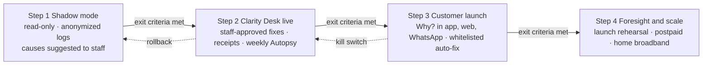

# Hutch Clarity — Risks, Pilot, Production Readiness & Operations

[← 13-delivery-plan.md](13-delivery-plan.md) · [← Plan index](README.md) · [15-cost-scale-failure-kpi.md →](15-cost-scale-failure-kpi.md)

> Part of the **Hutch Clarity Enterprise Project Plan**. Labels: `[DECK Sx]` = stated in deck slide x · `[PROPOSED]` = expanded by this plan · **ASSUMPTION** / **REQUIRES HUTCH CONFIRMATION** / **PROPOSED TARGET – REQUIRES HUTCH VALIDATION**. See the [index](README.md) for the full legend.

## 33. Risk Register
P = Probability, I = Impact (H/M/L).

| ID | Risk | P | I | Mitigation | Contingency |
|---|---|---|---|---|---|
| R01 | Missing or undocumented HUTCH APIs for one or more of the 8 sources | H | H | Discovery in weeks 2–6; adapters accept DB views, file extracts or event feeds; read-only first | Launch with the sources available; rules needing a missing source → handoff; "add the field" backlog `[DECK S10]` |
| R02 | Incomplete logs (e.g., consent evidence not retained) | M | H | Completeness flags; rules require evidence; data-quality profiling | Missing log → human, never a guess `[DECK S7]`; owner fixes logging |
| R03 | Inconsistent identifiers across systems (MSISDN formats, txn refs) | H | M | Canonical ID mapping service; normalization; probabilistic join only for *display*, never for decisions | Ambiguous joins → staff review |
| R04 | Data latency (CDR batches, settlement delays) | M | M | Per-source freshness SLAs; `PAYMENT_PENDING_SETTLEMENT` rule; hold-for-evidence state | Explain "pending" + scheduled re-check + notify |
| R05 | Wrong rule logic (false positives/negatives) | M | H | Golden tests, replay, four-eyes publish, shadow comparison, staff override tracking | Kill switch per rule; revert to previous version in seconds; remediation via bulk correction with receipts |
| R06 | Duplicate refunds | L | H | Idempotency (Redis + PG unique), status-query-before-retry, budgets, reconciliation | Auto-pause auto-fix on anomaly; recovery per finance policy; receipt supersede |
| R07 | AI hallucination in explanations | M | M | Facts-only prompting, numeric verifier, citations, templates | Disable LLM explanations via flag → templates only |
| R08 | Poor Sinhala/Tamil/Singlish quality | H | M | Native-speaker eval, curated phrases `[DECK S10]`, model selection by eval, structured-first UX | Template-only for affected language; earlier offer of a human |
| R09 | Prompt injection | M | M | [§12.6](08-ai-architecture.md) controls; no money-moving tools for the LLM | Disable affected tool/profile; review MCP logs |
| R10 | Privacy breach (PII in prompts, logs, exports) | L | H | Masking, scrubbed telemetry, DLP, DPIA, access reviews | Incident response (§36), PDPA notification per legal |
| R11 | Security compromise (staff account, keys) | L | H | SSO+MFA, step-up, UEBA, short-lived secrets, mTLS | Revoke, rotate, freeze approvals, forensic audit chain |
| R12 | Excessive false positives in shadow mode | M | M | Tune thresholds via what-if; start with high-precision rules only | Extend shadow; reduce rule scope |
| R13 | Pilot customer dissatisfaction (wrong or slow answers) | M | M | Small cohort, easy human handoff, CSAT per journey, cohort by opt-in | Pause customer channel; Desk-only mode |
| R14 | Downstream system outage (OCS, payments) | M | H | Circuit breakers, hold-for-evidence, queue commands | No actions without evidence; inform customer with ETA; replay later |
| R15 | Kafka backlog / lag | M | M | Partitioning, autoscaled consumers, lag alerts | On-demand timeline reads; suppress stale proactive messages; reconciliation catches up |
| R16 | AI provider / GPU outage | M | M | N+1 self-hosted, hosted fallback, templates | Templates-only mode (works without the LLM `[DECK S7]`) |
| R17 | Foresight predictions misused as forecasts | M | M | "Scenarios, not certainties" labelling, uncertainty bands, backtest gate, advisory-only | Withdraw Foresight outputs from decision forums until recalibrated |
| R18 | Regulatory change (VAS rules, TRCSL reporting) | M | M | Rules as data; legal basis per rule; compliance in governance | Fast rule update via governed publish |
| R19 | HUTCH approvals slower than plan (security, CAB, write access) | H | H | Early engagement, embedded security, phased write scope | Pilot with staff-approved fixes executed via existing HUTCH tools (Clarity recommends, agent executes) |
| R20 | Cost overrun on AI tokens/GPU | L | M | Tiered routing, cache, budgets, per-session token caps | Shift traffic to templates/cache; renegotiate tier |
| R21 | Agent adoption / change resistance | M | M | Co-design with agents, training, "teach once" credit, supervisor dashboards | Additional coaching; adjust UI |
| R22 | Third-party licence constraints (Foresight stack, models) | M | M | Licence review gate (B4) | Replace components behind interfaces |
| R23 | Refund fraud rings exploiting auto-fix | L | H | Velocity limits, SIM-swap checks, graph anomaly detection, whitelisted rules only | Disable auto-fix; staff approval for all |

---

## 34. Pilot Strategy

The deck's 4 steps are preserved `[DECK S17]` and made gated.

### Diagram 33 — Rollout path

| | **Step 1 — Shadow Mode** | **Step 2 — Clarity Desk Live** | **Step 3 — Customer Launch** | **Step 4 — Foresight & Scale** |
|---|---|---|---|---|
| Window | Jul 19 – Aug 29, 2027 | Sep 6 – Nov 1, 2027 | Oct 4 – Nov 14 (pilot) → GA Nov 22 | 2028 Q1+ |
| Scope | Read-only on anonymized logs; rules + decisions computed; recommendations shown to a small agent group; **no customer-impacting actions** | Agents/supervisors use Desk; fixes **staff-approved**; receipts issued; weekly Autopsy; Teach once | Why? in app, web, WhatsApp (SMS/USSD to follow); **whitelisted auto-fix** only (e.g., DUPLICATE_RELOAD, DUPLICATE_VAS_CHARGE); one-tap fixes | Foresight on 1–2 launches; more rules; postpaid, home broadband; voice + guardian |
| Cohort (**ASSUMPTION**) | Historic + live anonymized cases; 10–20 agents | 1–2 agent teams (~30–50 agents) | Opt-in/whitelisted ~10–50K subscribers, by region or segment | Progressive to full base |
| Entry criteria | Shadow security review (L0), DPIA for shadow, read adapters green | Security Gate, UAT sign-off, write adapters for approved actions, finance limits set, training complete | Desk pilot exit met, channel UAT, WhatsApp templates approved, verify page live | Production stable, hypercare exit |
| Exit / success criteria (**PROPOSED TARGET – REQUIRES HUTCH VALIDATION**) | Agreement with agent outcomes ≥ 85% on covered causes; rule false-positive rate ≤ 5% for auto-candidate rules; evidence completeness measured per source; 0 PII leaks | Median resolution time reduced vs baseline; override rate ≤ 10%; 0 duplicate/wrong refunds unrecovered; reconciliation 100% T+1; agent satisfaction ≥ baseline | Self-service completion ≥ target; handoff accuracy ≥ 98% (must-handoff); CSAT ≥ baseline; 0 Sev-1; refund anomaly alerts all explained | Backtest accuracy acceptable; product teams adopt |
| Monitoring | Shadow dashboard: recommendation vs outcome | All dashboards ([§25](12-platform-devops-testing-observability.md)) daily review | + customer funnels, CSAT, verification | Quarterly review |
| Rollback | n/a (no actions) | Disable Desk actions → recommendations only | Kill switch per channel / per rule / auto-fix global | Feature flags per domain |
| Comms | Internal only | Internal + agent training | Customer comms, FAQ, regulator informed (**compliance decides**) | — |

---

## 35. Production Readiness Checklist

| Area | Item | Owner |
|---|---|---|
| Security | ☐ Pen test closed (no open High/Critical) ☐ Threat model re-validated ☐ SSO/MFA/step-up live ☐ Secrets rotated, no static keys ☐ Signed images enforced ☐ WAF rules tuned | Security |
| Data | ☐ DPIA approved ☐ Retention jobs active ☐ Token vault TTL verified ☐ Data quality per source within SLA ☐ Anonymization verified for analytics | Data Gov |
| Integrations | ☐ All adapters contract-tested vs HUTCH prod config ☐ Circuit breakers/timeouts tuned ☐ Write actions approved per type ☐ Status-query endpoints for ambiguous results | Integration |
| Observability | ☐ Dashboards ([§25](12-platform-devops-testing-observability.md)) live ☐ SLOs defined ☐ Traces end-to-end ☐ Langfuse masked ☐ SIEM feeds | SRE |
| Backup | ☐ PITR tested ☐ Object storage versioning/lock ☐ Vault backups | SRE |
| DR | ☐ DR failover rehearsed (RTO/RPO met) ☐ Runbook signed | SRE |
| Rate limits | ☐ Edge, OTP, per-session token budgets, MCP per-tool limits configured | SRE/Security |
| AI fallback | ☐ Template-only mode tested ☐ Hosted/self-hosted failover tested ☐ Verifier blocking tested | AI |
| MCP controls | ☐ Profile allowlists reviewed ☐ Denial alerts ☐ No execute path from MCP proven by test | AI/Security |
| Rule test coverage | ☐ 100% active rules with golden sets ☐ Replay diffs approved ☐ Four-eyes publish working | CX Eng |
| Reconciliation | ☐ Daily job live ☐ Mismatch alerting and finance queue ☐ Budget counters verified | Finance |
| Audit | ☐ Chain verification job ☐ WORM anchoring ☐ Regulator pack tested with compliance | Compliance |
| Runbooks | ☐ Incident playbooks (§36) ☐ Kill switches documented ☐ Adapter outage procedures | SRE |
| Dashboards & alerts | ☐ Alert routing to on-call ☐ Finance and CX alert channels | SRE |
| On-call | ☐ 24×7 rota (L1 HUTCH NOC, L2 product SRE, L3 dev) ☐ Escalation matrix | SRE |
| Rollback | ☐ Image rollback rehearsed ☐ Rule/policy rollback rehearsed ☐ Feature-flag kill switches tested | DevOps |
| People | ☐ Agents/supervisors/finance trained ☐ Customer FAQ ☐ Support model agreed | CX Ops |

---

## 36. Operations and Incident Response

### 36.1 Operating model
- **L1:** HUTCH NOC/customer-care tooling monitors alerts.
- **L2:** Clarity SRE/product support.
- **L3:** Engineering.
- **Business owners:** CX Ops (queues), Finance (reconciliation), CX engineering (rules, weekly Autopsy review), AI team (eval drift, weekly).
- **Monthly:** governance board reviews rules, overrides, the hand-off table `[DECK S10]` and KPIs.

### 36.2 Severity definitions

| Sev | Definition | Response | Examples |
|---|---|---|---|
| **Sev-1** | Customer money or data at risk at scale; legal/regulatory exposure; core unavailable | 15 min, 24×7, exec notification | Mass incorrect action; PII exposure; false Trust Receipts verifying; audit chain break |
| **Sev-2** | Significant degradation or single-customer financial error | 30 min | Wrong refund (single); compromised staff account (contained); MCP abuse attempt detected; adapter outage blocking fixes |
| **Sev-3** | Partial degradation, workaround exists | 4 h business | LLM outage (templates active); one channel down; elevated verifier failures |
| **Sev-4** | Minor / cosmetic | Next sprint | Translation issue; dashboard defect |

### 36.3 Incident playbooks

| Incident | Sev | Immediate actions |
|---|---|---|
| Wrong refund | 2 (1 if systemic) | Freeze rule auto/one-tap via flag; identify cohort via audit; finance decides recovery; corrected receipts (supersede); root-cause → golden test |
| Mass incorrect action | 1 | Global `customer_actions` kill switch; stop consumers; quantify via audit; compensation plan; regulator comms per compliance |
| PII exposure | 1 | Contain (disable path, revoke keys); scope via logs; legal/DPO; PDPA notification per legal; post-mortem |
| Compromised staff account | 1–2 | Disable account, revoke sessions; freeze approvals by that principal; review all actions since compromise via audit; reverse where needed |
| False Trust Receipt | 1 | Determine whether forged (verify fails = expected) or mis-signed (key compromise?); if key compromise: revoke `kid`, rotate, re-sign valid receipts, publish revocation |
| MCP abuse | 2 | Disable profile/tool; revoke agent credentials; inspect MCPInvocation logs; injection analysis; add red-team case |
| System outage | 1–3 | Failover/DR per runbook; degrade per [§39](15-cost-scale-failure-kpi.md); status messaging in channels |
| AI failure (quality or outage) | 3 | Switch to templates or fallback tier; investigate eval drift; roll back prompt/model version |

Every Sev-1/2 gets a blameless post-mortem within 5 working days. Each corrective action has an owner, due date and target `[DECK S10]`.
---

[← 13-delivery-plan.md](13-delivery-plan.md) · [← Plan index](README.md) · [15-cost-scale-failure-kpi.md →](15-cost-scale-failure-kpi.md)
