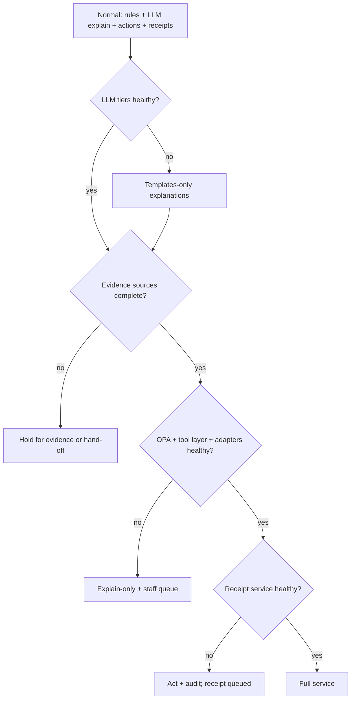

# Hutch Clarity - AI Cost, Scalability, Failure Handling & KPIs

[← 14-risk-pilot-readiness-operations.md](14-risk-pilot-readiness-operations.md) · [← Plan index](README.md) · [16-gap-submission-repo-docs.md →](16-gap-submission-repo-docs.md)

> Part of the **Hutch Clarity Enterprise Project Plan**. Labels: `[DECK Sx]` = stated in deck slide x · `[PROPOSED]` = expanded by this plan · **ASSUMPTION** / **REQUIRES HUTCH CONFIRMATION** / **PROPOSED TARGET – REQUIRES HUTCH VALIDATION**. See the [index](README.md) for the full legend.

> **Plan v1.3 (2026-10-02).** Merged plan: updated to match [18](18-build-blueprint.md), [19](19-tech-stack-and-ai.md), [20](20-policy-change-management.md) and [21](21-migration-and-deployment-plan.md). Change record: [CHANGES.md](CHANGES.md).

## 37. AI Cost / Token Model

**All values are ASSUMPTIONS for planning, not measurements.** Replace them with prototype-measured Langfuse data before submission (Guidelines §6.2).

### 37.1 Routing (preserved from `[DECK S14]`)
Rule/template (0 tokens) → answer cache (exact in Valkey → meaning on pgvector; 0 tokens) → small/non-reasoning model (few tokens) → reasoning model (most tokens). See Diagram 21.

### 37.2 Per-journey token estimates
Sinhala/Tamil text typically tokenizes into more tokens than English on many tokenizers. An inflation factor of ~2.5× on generated si/ta text is assumed and must be measured per model.

| Journey | Calls | Avg input tok/call | Avg output tok/call | Total tokens | Tier |
|---|---|---|---|---|---|
| Simple question (cache miss, RAG) - en | 1 | 1,500 | 150 | ~1,650 | Small |
| Simple question - si/ta | 1 | 1,500 | 375 | ~1,875 | Small |
| Dispute via Why? tap (structured) - en | 1 + 0.2 judge | 1,200 (+1,400) | 220 (+40) | ~1,710 | Small |
| Dispute via free text/voice - en | 2 + 0.2 judge | 600 / 1,200 | 80 / 220 | ~2,390 | Small |
| Multilingual dispute explanation (si/ta, free text) | 2 + 0.2 judge | 700 / 1,500 | 100 / 550 | ~3,200 | Small |
| Staff case summary + reply draft | 2 | 4,000 / 1,500 | 1,400 (incl. ~1,000 reasoning) / 550 | ~7,450 | Reasoning + small |
| Shift handover summary | 1 per shift per team | 6,000 | 1,600 | ~7,600 | Reasoning |
| Complaint Autopsy (per complaint) | 1 + embedding | 450 | 80 | ~530 (+150 embedding tokens) | Small + embedding |
| Autopsy cluster labelling | 1 per cluster per run | 3,000 | 200 | ~3,200 | Small |
| Proactive alert / zero-contact refund | 0 | - | - | 0 | Template |

### 37.3 Traffic mix (ASSUMPTION)
- 35% structured Why? disputes (30% answered by template only).
- 15% free-text/voice disputes.
- 30% simple questions (40% cache/template hits).
- 10% proactive notifications (templates).
- 10% staff-handled cases.
- Language mix 60% si/ta / 40% en. Complaints entering Autopsy = 15% of interactions.

**Result:** ≈ **2,100 generative tokens per interaction on average**, ≈ 1.15 LLM calls per interaction including Autopsy. About **33% of interactions need no LLM call** at baseline. NFR-EFF-01 targets ≥ 50% through template and cache growth. At 50%, tokens fall ~20–25%.

Worked example: 10,000 interactions/day ≈
- 5.2M (structured disputes) + 4.3M (free-text disputes) + 3.2M (simple) + 7.45M (staff) + 0.8M (Autopsy);
- **≈ 21M tokens/day** (~78% input / 22% output).

### 37.4 Indicative cost (illustrative unit prices - ASSUMPTION, not vendor quotes)

| Assumption | Value |
|---|---|
| Hosted small model | USD 0.40 / 1M input, 1.60 / 1M output |
| Hosted reasoning model | USD 3.00 / 1M input, 15.00 / 1M output |
| Self-hosted GPU (80 GB class, cloud-equivalent) | USD 2.50 / GPU-hour ≈ 1,800 / GPU-month |
| Self-hosted throughput (small model, mixed load) | ~60M tokens / GPU / day at target latency (benchmark in Phase 6) |

| Scenario | Tokens/day | Hosted-only ≈ / month | Self-hosted (GPUs incl. HA + reasoning) ≈ / month | Note |
|---|---|---|---|---|
| Pilot (2K/day) | 4.2M | ~USD 260 | 2–4 GPUs ≈ USD 3.6–7.2K | Self-host justified by residency, not cost |
| 10K/day | 21M | ~USD 1.3K | ~4 GPUs ≈ USD 7.2K | Hosted cheaper |
| 100K/day | 210M | ~USD 13K | ~10 GPUs ≈ USD 18K | Near parity |
| 1M/day | 2.1B | ~USD 130K | ~55 GPUs ≈ USD 99K | Self-host cheaper |

**Recommendation:** hybrid. The self-hosted small model is the default for all customer-facing explanation (data stays inside HUTCH). The hosted reasoning tier handles masked staff summaries and complex cases until volume justifies a self-hosted reasoning model. A per-session token cap and a daily budget alarm apply. **HUTCH data-residency policy decides the split (REQUIRES HUTCH CONFIRMATION).**

### 37.5 Prototype: model-free default, free-tier option (v1.3)
- **Default:** no model configured (ADR-0009); explanations come from CX-approved templates; **measured token use is 0**.
- **Opt-in live model:** Gemini + Groq free tiers by role ([19 §4](19-tech-stack-and-ai.md)), synthetic data only. Capacity about 3–5K LLM calls/day across both providers.
- **Measured, not assumed:** the AI gateway's usage ledger records tokens per role, model and journey (`scripts/measure_tokens.py`).
- **Production cost formula:** `monthly cost = Σ roles (input_tokens × input_price + output_tokens × output_price)` at HUTCH's chosen provider price, or GPU-hours for self-hosting (§37.4).

---

## 38. Scalability Model

Modelling scenarios only. **They make no claim about HUTCH's actual traffic.** Assumptions per interaction:
- ~8 API calls, ~25 DB writes, ~10 internal Kafka events, ~1.15 LLM calls, ~1 MCP call, ~2,100 tokens.
- Peak factor 5× average.

HUTCH-originated event ingestion (charging/payment streams for zero-contact detection) scales with **subscriber base**, not interactions, so it is shown separately.

| Metric | Prototype (200/day) | Pilot (2K/day) | 10K/day | 100K/day | 1M/day |
|---|---|---|---|---|---|
| API requests/day | 1.6K | 16K | 80K | 800K | 8M |
| Peak API RPS | < 1 | ~1 | ~5 | ~46 | ~460 |
| DB writes/day (peak/s) | 5K (<1) | 50K (3) | 250K (15) | 2.5M (145) | 25M (1,450) |
| Internal Kafka events/day | 2K | 20K | 100K | 1M | 10M |
| HUTCH events ingested/day (**ASSUMPTION**) | 0.1M simulated | 1M (pilot cohort) | 5M | 50M | 200M (~7K/s peak) |
| LLM calls/day (peak/s) | 230 | 2.3K | 11.5K (0.7) | 115K (7) | 1.15M (67) |
| MCP calls/day | 200 | 2K | 10K | 100K | 1M |
| Generative tokens/day | 0.42M | 4.2M | 21M | 210M | 2.1B |
| Valkey memory (sessions + cache + idempotency) | 256 MB | 512 MB | 1 GB | 2 GB | 4–8 GB |
| PG growth/day (~50 KB/interaction) | 10 MB | 100 MB | 0.5 GB | 5 GB | 50 GB (partition + archive) |
| Indicative compute | docker-compose | 1 small cluster | 3-node app pool | 6–10 nodes + Kafka 3 | 20+ nodes, Kafka 6+, PG read replicas, sharded consumers |

**Scale levers:** stateless horizontal scaling; Kafka partitions keyed by `subscriber_ref` `[DECK S14]`; PG partitioning + read replicas; timeline reference-data caching; cache hit rate; batching Autopsy; Foresight in small batches `[DECK S15]`.

---

## 39. Failure Handling (Graceful Degradation)

| Failure | Behaviour | Customer sees | Recovery |
|---|---|---|---|
| LLM (all tiers) fails | Rules + templates `[DECK S7]` | Template explanation in their language | Auto when healthy |
| External/hosted AI provider fails | Fall back down the role chain (other provider or model), else templates | Same, possibly shorter | Gateway health checks |
| MCP server fails | No AI-initiated proposals; **no financial action via AI**; Desk/staff workflow continues; structured Why? still works (doesn't need MCP) | "We're checking; an agent will confirm" when needed | Restart; replay pending proposals |
| Charging (or any evidence) source fails | Case **held for evidence**; no decision on incomplete evidence | Honest status + ETA; notified when resolved | Re-run timeline on recovery |
| Write adapter fails / ambiguous | Query status before any retry; compensation if partial; handoff | "Fix in progress" | Reconciliation confirms |
| Kafka delayed | Stream detectors lag → zero-contact fixes delayed; on-demand requests use direct adapter reads; proactive messages suppressed when stale; reconciliation sweeps catch missed duplicates | Normal on-demand service | Consumers catch up; lag alert |
| Receipt service / signing fails | Action + audit already committed; receipt issued from outbox retry; customer told the receipt will follow | "Receipt will arrive shortly" | Retry; alert if > N min |
| Valkey fails | Cache off (more LLM calls); sessions re-auth; idempotency falls back to PG constraint | Possible re-login | Valkey failover |
| PostgreSQL primary fails | Failover to sync standby; writes paused seconds | Brief retry | Automatic failover |
| OPA unavailable | **Fail closed:** no actions; explain-only + handoff | Explanation, fix pending | Restart; bundles cached locally |
| Token vault unavailable | No LLM path (can't mask/restore) → templates | Template | Vault failover |

### Diagram 34 - Degradation ladder

---

## 40. KPI Framework

Baselines are measured in shadow mode and the first pilot weeks. **All commercial outcomes are metrics to validate during the pilot, not claims** (Guidelines §6.5).

| Category | KPI | Definition | Source | Target status |
|---|---|---|---|---|
| Customer | Resolution time | Case open → resolved (p50/p90) | Case service | Validate in pilot |
| Customer | First-contact resolution | Resolved without repeat contact within 7 days | Case + CRM | Validate |
| Customer | Self-service completion | Journeys completed without a human | Funnels | Validate |
| Customer | Repeat complaints | Same cause, same customer, within 30 days | Autopsy + cases | Validate |
| Operational | Agent handling time | Desk time per case | Desk telemetry | Validate |
| Operational | Case backlog | Open cases by age | Desk | Validate |
| Operational | Bulk-fix effectiveness | Cases fixed per bulk action; post-fix repeat rate | Desk + audit | Validate |
| AI | Handoff accuracy | Correct handoffs / total | Labelled sample | ≥ 98% recall (proposed) |
| AI | Hallucination rate | Unsupported claims in outputs | Eval sample | < 0.5% (proposed) |
| AI | Language quality | Native rubric per language | Eval | ≥ 4.0/5 (proposed) |
| AI | LLM-free answer rate | Interactions with 0 tokens | Gateway | ≥ 50% (proposed) |
| Financial | Refund accuracy | Correct refunds / total (audited sample + overrides) | Audit + finance review | ≥ 99.5% (proposed) |
| Financial | Reconciliation | Actions reconciled by T+1 | Reconciliation | 100% |
| Trust | Receipt verification | Verifications; invalid-verification rate | Verify page | Monitor |
| Trust | Repeated-problem reduction | Recurrence after safeguard | Recurrence tests + cases | Validate |
| Business | Retention | Churn of customers with resolved disputes vs matched control | Warehouse | **Validate in pilot** |
| Business | Engagement | Use of Why?, safeguards, pack truth label | Analytics | Validate |
| Business | Customer satisfaction | CSAT/NPS per journey | Surveys | Validate |
| Sustainability | Model calls avoided; shop visits avoided; energy per case `[DECK S15]` | - | Gateway + CRM | Report |

### 40.1 Benefits measurement methodology
Business outcomes count as **measured** only if they come from this method (Guidelines §6.5).

1. **Baseline:** 8–12 weeks of pre-pilot data (contacts per cause, resolution time, refunds, repeats, CSAT) from CRM, 1788 and WhatsApp. **Depends on HUTCH data access.**
2. **Shadow comparison:** Clarity's recommendation vs the actual agent outcome on the same cases (Step 1).
3. **Control cohort:** a randomised or matched holdout (e.g., ~10% of eligible customers by region or segment, **ASSUMPTION**) that doesn't get *proactive and self-service features*. **A holdout never withholds a refund owed.** Legal and compliance review the design.
4. **Pre-registered metric definitions**, reported with confidence intervals. Measured, estimated and assumed values are labelled separately.
5. **Confounders:** seasonality (festivals, school terms), concurrent campaigns and network events are tracked and noted.
6. **Cadence:** weekly operational review, monthly business review, final pilot report at P2 exit.

---

[← 14-risk-pilot-readiness-operations.md](14-risk-pilot-readiness-operations.md) · [← Plan index](README.md) · [16-gap-submission-repo-docs.md →](16-gap-submission-repo-docs.md)
