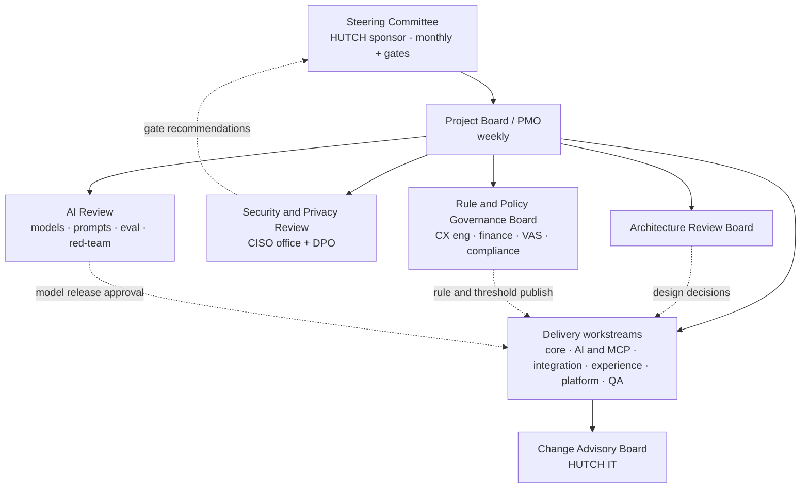
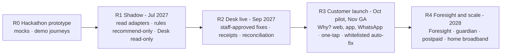
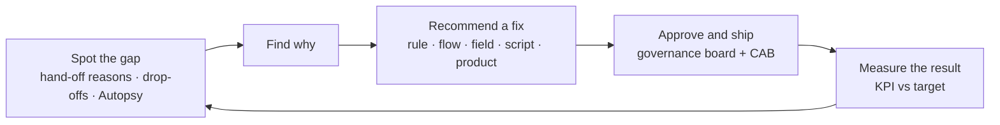

# Hutch Clarity - Governance, Compliance, Change Management, Cost & Support

[← 16-gap-submission-repo-docs.md](16-gap-submission-repo-docs.md) · [← Plan index](README.md) · [18-build-blueprint.md →](18-build-blueprint.md)

> Part of the **Hutch Clarity Enterprise Project Plan**. Labels: `[DECK Sx]` = stated in deck slide x · `[PROPOSED]` = expanded by this plan · **ASSUMPTION** / **REQUIRES HUTCH CONFIRMATION** / **PROPOSED TARGET – REQUIRES HUTCH VALIDATION**. See the [index](README.md) for the full legend.
>
> Sections 46–52 were added by the v1.1 plan audit ([README → Revision history](README.md#revision-history)). They cover enterprise topics the original outline didn't include: governance, traceability, compliance, change management, cost and support.

## 46. Project Governance & Stage Gates

### 46.1 Governance bodies `[PROPOSED]`

| Body | Chair | Members | Cadence | Decides |
|---|---|---|---|---|
| Steering Committee | HUTCH executive sponsor | CTO/CIO delegate, Head of CX, Finance, CISO, Compliance, delivery lead | Monthly + every stage gate | Scope, budget, go/no-go at gates, escalations |
| Project Board / PMO | Project Manager | PO, Solution Architect, Tech Lead, workstream leads, HUTCH integration lead | Weekly | Plan, RAID log, dependencies, change requests within tolerance |
| Architecture Review Board | HUTCH Enterprise Architecture | Solution Architect, Security Architect, HUTCH platform owners | At M2 + major ADRs | Architecture conformance, technology exceptions |
| Security & Privacy Review | CISO office | DPO, Security Architect, Compliance | At M2, shadow entry, security gate | Threat model, DPIA, pen-test acceptance, data access |
| Rule & Policy Governance Board | CX engineering lead | Finance, VAS ops, Compliance, PO | Weekly in pilot, then fortnightly | Rule and policy publishing, thresholds, auto-fix whitelist |
| AI Review | AI Lead | CX, Compliance, Security, QA | Per model/prompt release; monthly | Model and prompt releases, eval results, red-team findings |
| Change Advisory Board | HUTCH IT change management | SRE, Tech Lead | Per HUTCH CAB cadence (**REQUIRES CONFIRMATION**) | Production changes and freeze exceptions |

#### Diagram 35 - Governance structure

### 46.2 Stage gates

| Gate | Date (assumed) | Entry / exit criteria | Evidence | Approver |
|---|---|---|---|---|
| G0 Mobilisation | 2027-01-04 | Sponsor named, budget approved, core team on-boarded, HUTCH stakeholder access | Charter, team plan | Steering |
| G1 Requirements (M1) | 2027-02-15 | SRS, journeys, rule catalogue v0, NFR targets agreed | SRS sign-off sheet | PO + Steering |
| G2 Architecture (M2) | 2027-03-15 | SAD, ICD drafts, threat model, DPIA draft, licence review | ARB minutes, security review | ARB + CISO |
| G3 Build complete (M3 + M4) | 2027-07-05 | Core and adapters complete, contract tests green, SIT started | Test reports | Project Board |
| G4 Shadow entry | 2027-07-19 | Shadow security review, DPIA for shadow, read adapters on anonymized data | Security approval | CISO + DPO |
| G5 Security gate (M5) | 2027-08-16 | No open High/Critical findings; perf targets met at 2× pilot peak | Pen-test + perf reports | CISO |
| G6 Desk pilot go (M6/M7) | 2027-09-06 | UAT signed, agents trained, finance limits set, runbooks ready, shadow exit criteria met ([§34](14-risk-pilot-readiness-operations.md)) | UAT pack, shadow report | Steering |
| G7 Customer pilot go | 2027-10-04 | Desk pilot exit criteria met, channel UAT passed, WhatsApp templates approved, customer comms ready | Pilot interim report | Steering + Compliance |
| G8 Production go-live (M8) | 2027-11-22 | Production readiness checklist complete ([§35](14-risk-pilot-readiness-operations.md)) | PRR pack | Steering + CAB |
| G9 Hypercare exit | 2028-01-17 | No open Sev-1/2 for 2 weeks; KPIs stable; BAU team trained; knowledge transfer complete (§52) | Hypercare exit report | Steering |

### 46.3 Definition of Ready / Done and reporting
- **Definition of Ready:** acceptance criteria written; journey and rule references; data and interface dependencies identified; si/ta copy needs flagged.
- **Definition of Done:**
  - code reviewed (two reviewers on the money path);
  - unit, contract and golden tests pass;
  - security scans clean;
  - OpenAPI and MCP specs updated;
  - dashboards and alerts added;
  - si/ta/en strings reviewed;
  - feature flag in place;
  - runbook updated.
- **Reporting:** weekly RAG status and RAID log. Monthly steering pack: milestones, critical path, dependencies, risks, budget burn and KPIs once the pilot starts.

---

## 47. Release Plan & Requirements Traceability

### 47.1 Releases

| Release | Date (assumed) | Content | Rollout step `[DECK S17]` |
|---|---|---|---|
| **R0 Prototype** | Hackathon | Mock adapters, demo journeys, receipts, Desk mock-up | - |
| **R1 Shadow** | 2027-07-19 | Read adapters, timeline, rules, decision (recommend only), read-only Desk cockpit, Autopsy v1 offline, governance publishing | Step 1 |
| **R2 Desk live** | 2027-09-06 | Tool layer + write adapters, approvals, receipts, reply drafting, Teach once, bulk fix, what-if, regulator pack, reconciliation, MCP, early-warning radar, shop view | Step 2 |
| **R3 Customer launch** | Pilot 2027-10-04 → GA 2027-11-22 | Why? on web/app/WhatsApp, one-tap fixes, whitelisted auto-fix, proactive care, pack truth label, pack-end choice, SMS/USSD and voice when ready, supervisor mobile approval | Step 3 |
| **R4 Foresight & scale** | 2028 Q1+ | Foresight, family guardian, postpaid, home broadband | Step 4 |

#### Diagram 36 - Release roadmap

### 47.2 Requirements traceability matrix (condensed)
Every FR in [§4.1](03-requirements-personas-journeys.md) traces to its design, its verification and a release. The full per-FR matrix is kept in the test management tool from Phase 1.

| FR group | FR IDs | Design | Verified by | Release |
|---|---|---|---|---|
| Intake & multilingual | FR-COP-01, 02, 14, 15 | [§3.1](02-solution-capabilities.md), [§12.1–12.4](08-ai-architecture.md), Diagram 3 | AI eval ([§12.7](08-ai-architecture.md)), E2E journeys J1/J3 | R3 |
| Timeline, causes, decisions | FR-COP-03, 04, 05 | [§13](09-rules-decision-receipts.md), [§14](09-rules-decision-receipts.md), Diagrams 4, 17 | Rule golden tests, OPA tests, shadow agreement | R1 |
| Actions, explanation, handoff | FR-COP-06, 07, 08 | [§10](07-mcp.md), [§14](09-rules-decision-receipts.md), Diagrams 5, 20 | Idempotency, verifier and MCP tests | R2 (staff) / R3 (customer) |
| Zero-contact & proactive | FR-COP-09–12, FR-GOV-05 | [§3.6](02-solution-capabilities.md), [§18](10-data-api-events.md), Diagrams 25, 38 | Stream detector tests, E2E J2/J6 | R3 |
| Guardian | FR-COP-13 | [§3.7](02-solution-capabilities.md) | Consent and E2E tests | R4 |
| Channels & shops | FR-CH-01–05 | [§9.7](06-integration-tmf.md), [§17](10-data-api-events.md) | E2E per channel, channel UAT | R3 (shop view R2) |
| Trust Receipts | FR-TR-01–07 | [§15](09-rules-decision-receipts.md), Diagram 14 | Signature/chain tests, verify-page tests | R2 |
| Complaint Autopsy | FR-AUT-01–05 | [§3.3](02-solution-capabilities.md), Diagram 12 | Cluster review, flow replay | R1 (01–03), R2 (04–05) |
| Foresight | FR-FOR-01–04 | [§3.4](02-solution-capabilities.md), [§12.9](08-ai-architecture.md), Diagram 13 | Backtest gate | R4 (radar FR-FOR-04 in R2) |
| Desk core | FR-DSK-01–05 | [§3.5](02-solution-capabilities.md) | Desk UAT | R1 (01–02 read-only), R2 |
| Desk advanced | FR-DSK-06–13 | [§3.5](02-solution-capabilities.md) | Desk UAT | R2 (DSK-13 mobile in R3) |
| Governance & controls | FR-GOV-01–05 | [§13.4](09-rules-decision-receipts.md), [§14.4](09-rules-decision-receipts.md), [§23](12-platform-devops-testing-observability.md) | Governance, reconciliation, kill-switch tests | R1–R3 |
| MCP | FR-MCP-01 | [§10–11](07-mcp.md) | MCP abuse and allowlist tests | R2 |
| Future domains | FR-FUT-01 | Step 4 `[DECK S17]` | - | R4 |
| NFRs | NFR-* | [§4.2](03-requirements-personas-journeys.md) | Perf, security, DR, accessibility tests ([§24](12-platform-devops-testing-observability.md)); SLOs ([§25.4](12-platform-devops-testing-observability.md)) | All |

---

## 48. Regulatory & Compliance Mapping

> Exact legal obligations, applicability dates and reporting formats **REQUIRE HUTCH legal/compliance confirmation**. This table maps known themes to design controls. It is not legal advice.

| Obligation / standard | Source | Clarity design response | Evidence produced | Owner |
|---|---|---|---|---|
| VAS needs consent + OTP; logs producible | Gazette 2316/14 `[DECK S3, S7]` | `VAS_NO_CONSENT` rule, consent evidence kept ≥ 1 year `[DECK S8]`, merchant block until opt-in, merchant watch | Consent trail in the regulator pack | VAS ops + Compliance |
| Complaint handling and regulator queries | TRCSL `[DECK S6, S9]` | Receipts quotable to TRCSL, one-click regulator pack, audit ledger | Signed receipts, trail + consents export | Compliance |
| Lawful basis and purpose limitation | PDPA No. 9 of 2022 `[DECK S8]` | Purpose register per processing activity; Foresight on aggregates only | Records of processing | DPO |
| Data minimisation | PDPA | Masking before AI, minimal evidence snapshots, references not copies | DPIA | DPO + Security |
| Storage limitation | PDPA | Retention schedule and deletion jobs ([§20.6](11-security-privacy-audit.md)) | Deletion logs | Data Gov |
| Data subject rights (access, correction, erasure, consent withdrawal) | PDPA | Receipts and case access for the customer; preference and consent management; erasure workflow that respects legal holds | Request log | DPO + CX |
| Security of processing | PDPA | [§19](11-security-privacy-audit.md) controls, pen tests, SIEM | Pen-test reports | CISO |
| Cross-border transfer | PDPA | Hosted AI tier gets masked text only; transfer assessment and DPA with the provider; self-hosted default | Transfer assessment | DPO + Legal |
| Breach notification | PDPA | PII exposure playbook ([§36](14-risk-pilot-readiness-operations.md)) | Incident records | CISO + DPO |
| Explainability and contestability of automated outcomes | Consumer fairness `[PROPOSED]` | Every outcome shows cause, evidence and ruled-out causes. Automated actions are only customer-favourable refunds and fixes. Any customer can ask for a human `[DECK S7]`. | Receipts, handoff logs | CX |
| Payment card data | PCI DSS (if HUTCH processes cards) | Clarity never receives PAN/CVV; the payment adapter uses gateway references only, keeping Clarity out of the cardholder-data environment | Data-flow evidence for HUTCH's assessor | Security |
| Information security management | HUTCH ISMS (e.g., ISO/IEC 27001 if certified - **REQUIRES CONFIRMATION**) | Align controls and evidence to HUTCH policies | Control mapping | CISO |
| AI risk management | OWASP Top 10 for LLM Applications; NIST AI RMF as an optional reference | Guardrails ([§12.6](08-ai-architecture.md)), red-team, eval reports, model/prompt change control | AI evaluation reports | AI Lead |
| Accessibility | WCAG 2.2 AA `[PROPOSED]` | NFR-ACC-01, accessibility tests | Audit report | UX |
| Financial record retention | Finance/tax rules (**REQUIRES CONFIRMATION**) | 7-year WORM retention (**ASSUMPTION**) | Archive | Finance |
| Third-party terms | Meta WhatsApp Business terms, hosted AI provider DPA, OSS licences | Licence review (B4), DPA with no-training and deletion terms | Contracts, SBOM | Legal |

---

## 49. Organizational Change Management, Training & Communications

### 49.1 Stakeholder impact assessment

| Group | What changes | Impact | Support |
|---|---|---|---|
| Support agents | New cockpit, one-click fixes, multilingual replies, Teach once | High | Training, sandbox, champions, co-design sessions |
| Supervisors | Approvals (incl. mobile), bulk fixes, second look, shift handover | High | Training, approval playbooks |
| CX engineers *(new skill)* | Write and test rules and flows, review Autopsy clusters | High | Role definition, 3-day rule-authoring course |
| Finance | Approval matrix, budgets, reconciliation | Medium | Workshop, reconciliation runbook |
| VAS operations | Merchant watch, consent evidence | Medium | Training |
| Shop staff | Case continuation, receipt verification | Medium | Short e-learning |
| Network operations | Auto tickets with cell and time | Low | Briefing |
| Compliance | Regulator pack, audit ledger | Low–Medium | Walkthrough |
| Customers | Why?, receipts, safeguards, proactive messages | Medium | In-app introduction, FAQ, consent prompts |

### 49.2 Training plan (durations are **ASSUMPTION**)

| Audience | Format | Duration | When |
|---|---|---|---|
| Agents | Classroom + sandbox with synthetic cases | 1 day | 2 weeks before G6 |
| Supervisors | Classroom + approval drills | 1.5 days | 2 weeks before G6 |
| Finance approvers | Workshop | 0.5 day | Before G6 |
| CX engineers | Rule/flow authoring course + golden-test practice | 3 days | Before shadow (G4) |
| Shop staff | E-learning | 2 hours | Before shop view in R2 |
| SRE / L1 NOC | Runbook drills, kill switches, DR | 1 day | Before G6 and G8 |

**Champions network:** one champion per ~10 agents (**ASSUMPTION**), with a weekly feedback session during the pilot.

### 49.3 SOP updates
Refund handling, VAS complaints, escalation and handoff, regulator responses, shop case handling and incident response. Each updated SOP is owned by CX Ops and approved by Compliance.

### 49.4 Communications plan

| Audience | Message | Channel | Timing |
|---|---|---|---|
| HUTCH staff | Why Clarity, what changes, pilot plan | Town hall, intranet | Kick-off, before G6 |
| Pilot agents | Pilot rules, feedback loop | Team briefings | Weekly during pilot |
| Pilot customers | New Why? feature, receipts, how to reach a person | In-app, WhatsApp utility template, FAQ | G7 |
| All customers | Launch | App, web, social | G8 |
| Regulator | Clarity proof and regulator pack | Compliance-led | Compliance decides |

**Adoption metrics:** share of cases handled in Desk, recommendation acceptance, override reasons, training completion and agent satisfaction.

---

## 50. Delivery Effort & Total Cost of Ownership Model

> **All figures are ASSUMPTIONS for planning.** Rates and prices must come from HUTCH procurement and infrastructure.

### 50.1 Delivery effort (core team)

| Month (2027) | Jan | Feb | Mar | Apr | May | Jun | Jul | Aug | Sep | Oct | Nov | Dec |
|---|---|---|---|---|---|---|---|---|---|---|---|---|
| FTE | 9 | 11 | 20 | 22 | 25 | 26 | 24 | 20 | 16 | 15 | 14 | 12 |

- **Core team, 2027:** ≈ **214 person-months**, plus about 6 PM of hypercare in Jan 2028, ≈ **220 PM** in total. This matches the loading in [§30.3](13-delivery-plan.md).
- **HUTCH shared functions** (security, finance, CX ops, VAS, compliance, IT owners, legal): ≈ **30 PM** (**ASSUMPTION**).

### 50.2 Delivery cost formula
**Delivery cost = core PM × blended monthly rate R + third-party services** (pen tests, licences, training venues).

*Illustrative only:* R = USD 3,000 → ≈ USD 0.66M; R = USD 6,000 → ≈ USD 1.32M for core effort. The rate depends on sourcing (in-house, local vendor, offshore mix).

### 50.3 Run-cost drivers

| Category | Driver | Pilot sizing | 100K interactions/day sizing ([§38](15-cost-scale-failure-kpi.md)) |
|---|---|---|---|
| Kubernetes app nodes | Services, workers, render pool | ~6 nodes | ~10 nodes |
| GPU (self-hosted LLM) | Tokens/day, latency | 2–4 GPUs | ~10 GPUs ([§37.4](15-cost-scale-failure-kpi.md)) |
| Hosted AI tier | Escalation tokens | Low | Per [§37.4](15-cost-scale-failure-kpi.md) |
| PostgreSQL HA | Writes, storage growth | Primary + standby | + read replicas, partition archiving |
| Kafka | HUTCH event ingestion volume | 3 brokers | 3–6 brokers |
| Redis HA | Sessions, cache | Small | ~2 GB |
| Object storage (WORM) | Receipts (PNG/PDF), exports, anchors | Low | Grows with receipts; lifecycle to archive |
| Observability | Log, trace and metric volume | Low | Sampling + retention tiers |
| WAF / CDN | Requests | Low | Medium |
| WhatsApp | Template messages by category (Meta pricing) | Pilot cohort | Main variable cost; **REQUIRES CONFIRMATION** |
| SMS / USSD | Segments (UCS-2 for si/ta) | Internal HUTCH cost | Internal HUTCH cost |
| Security | Annual pen test, tooling | Annual | Annual |
| BAU team | 10–12 FTE ([§52](#52-post-production-support--bau-model)) | - | Main fixed cost |

### 50.4 Cost governance
Resource tagging by service and environment. A monthly FinOps review. AI budget alarms (daily and per session). A quarterly capacity and cost review against the scale model.

---

## 51. Assumptions Register & Data Provenance

### 51.1 Data provenance classes (Guidelines §6.4)

| Class | Meaning | Examples in this plan / deck | How labelled |
|---|---|---|---|
| **Actual / provided** | Content from the two source documents | Deck concepts, architecture, stack, rollout steps; the Guidelines' requirements | `[DECK Sx]` |
| **Third-party reported** | Public information quoted in the deck, not verified by the team | Hostinger resolution figures ("Hostinger-reported"); paraphrased Reddit/Trustpilot posts ("patterns, not statistics"); Gazette 2316/14 reference | Cited as in the deck |
| **Assumed values** | Planning numbers chosen by the team | Start date, thresholds and caps, traffic mix, token counts, prices, cohort sizes, retention, FTE | **ASSUMPTION** / **PROPOSED TARGET** |
| **Simulated values** | Sample data in the deck or prototype | Receipt TR-2026-000184, bill-shock risk 78%, LKR 480 burn, the "1,284 fixed with no staff" animation counter `[DECK S4, S6]`, synthetic prototype data | *Illustrative* / *simulated* |
| **Model-generated outputs** | Produced by AI/ML at runtime | LLM explanations, cluster labels, Foresight predictions, risk scores | Shown as AI output; never presented as measured results |

### 51.2 Assumptions register

| ID | Assumption | Value used | Used in | Validation owner | Validate by | Impact if wrong |
|---|---|---|---|---|---|---|
| A-01 | Project start date | 2027-01-04 | [§26–28](13-delivery-plan.md) | Sponsor | G0 | All dates shift |
| A-02 | HUTCH non-prod read access available | by 2027-04-26 | H1, critical path | HUTCH IT | G2 | Go-live slips week for week |
| A-03 | Write interfaces approved for refund/credit, VAS deactivate/block, safeguards | by 2027-05-24 | H2 | HUTCH IT + Finance | G2 | Pilot limited to recommend-only or agent-executed fixes |
| A-04 | Refund remedy = balance credit or payment reversal | TBD | [§9.3](06-integration-tmf.md) | Finance | G1 | Adapter and reconciliation design changes |
| A-05 | Mapping of the "8 log sources" | [§9.2](06-integration-tmf.md) | Timeline, rules | HUTCH IT | G1 | Rule coverage changes |
| A-06 | Caps: auto LKR 1,000; one-tap LKR 5,000; four-eyes above LKR 25,000 | [§14.2](09-rules-decision-receipts.md) | Decision policy | Finance | G1 | Auto-fix share changes |
| A-07 | Traffic mix, tokens per journey, 60% si/ta | [§37.2–37.3](15-cost-scale-failure-kpi.md) | Cost, scale | AI Lead | Prototype measurement | Cost model changes |
| A-08 | AI unit prices and GPU throughput | [§37.4](15-cost-scale-failure-kpi.md) | Cost | AI Lead + Procurement | Phase 6 benchmark | Hosting decision changes |
| A-09 | Pilot cohort 10–50K subscribers; 30–50 agents | [§34](14-risk-pilot-readiness-operations.md) | Pilot | CX Ops | G6 | Statistical power changes |
| A-10 | Retention periods | [§20.6](11-security-privacy-audit.md) | Data | Legal / DPO | G2 | Storage and deletion design changes |
| A-11 | Change freezes (Avurudu, December) | [§26](13-delivery-plan.md) | Schedule | HUTCH IT | G0 | Go-live window shifts |
| A-12 | Pilot can run inside production under flags | [§22.1](12-platform-devops-testing-observability.md) | Deployment | HUTCH IT / ARB | G2 | A separate pilot stack is needed |
| A-13 | Team profile and native si/ta reviewers available | [§30](13-delivery-plan.md) | Delivery, AI eval | PM + CX Ops | G0 | Quality and schedule risk |
| A-14 | Kubernetes platform and GPU capacity in HUTCH hosting | [§22](12-platform-devops-testing-observability.md) | Platform | HUTCH Infra | G2 | Hosted tier used more |
| A-15 | Warehouse (Snowflake?) can expose aggregates | [§7.2](04-enterprise-architecture.md) T5 | Autopsy, Foresight | HUTCH Data | G2 | Separate analytics store needed |
| A-16 | Foresight stack licences allow commercial use | [§3.4](02-solution-capabilities.md) | Foresight | Legal | B4 | Components replaced |
| A-17 | SMS/USSD gateway supports Unicode and the short code | [§9.7](06-integration-tmf.md) | Basic-phone channel | HUTCH VAS/IT | G2 | English or romanised only |
| A-18 | HUTCH-owned WhatsApp Business account available | DEP-10 | WhatsApp | HUTCH Digital | G2 | Channel slips |
| A-19 | Quiet hours 21:00–07:00; ≤ 2 proactive messages/day | [§3.6](02-solution-capabilities.md) | Proactive care | CX + Compliance | G1 | Message volumes change |
| A-20 | A measurement holdout (proactive features only) is allowed | [§40.1](15-cost-scale-failure-kpi.md) | KPIs | Legal + CX | G6 | Weaker attribution |

---

## 52. Post-Production Support & BAU Model

### 52.1 Support model

| Tier | Who | Scope |
|---|---|---|
| L1 | HUTCH NOC / customer-care tooling | Alert triage, known-issue runbooks, kill switches |
| L2 | Clarity product support / SRE | Diagnosis, configuration, rule/flag rollback, adapter issues |
| L3 | Engineering (delivery team, then BAU team) | Code fixes, data fixes, root cause |
| Vendors | Hosted AI provider, Meta, pen-test vendor | Per contract |

| Severity ([§36.2](14-risk-pilot-readiness-operations.md)) | Response | Restore target (**PROPOSED**) | Hours |
|---|---|---|---|
| Sev-1 | 15 min | 4 h | 24×7 |
| Sev-2 | 30 min | 8 h | 24×7 |
| Sev-3 | 4 business hours | 5 business days | Business hours |
| Sev-4 | Next sprint | Next release | Business hours |

### 52.2 Hypercare (Nov 22, 2027 – Jan 17, 2028)
- Daily stand-up and daily KPI/financial review, with a war-room for the first 2 weeks.
- Defect triage within 24 h.
- Exit criteria per G9 ([§46.2](#462-stage-gates)).

### 52.3 Warranty and knowledge transfer
- **Warranty:** 90 days after go-live, for defect fixes by the delivery team (**ASSUMPTION**, contractual).
- **Knowledge transfer plan:**
  - documentation set ([§44](16-gap-submission-repo-docs.md));
  - pairing and shadowing, then reverse shadowing (HUTCH team leads, delivery team supports);
  - runbook and DR drills;
  - ownership handover: rules and flows → CX engineering; platform → SRE; AI evaluation → AI team; reconciliation → Finance.

### 52.4 BAU team and release cadence
- **BAU product team, 10–12 FTE:** PO, Tech Lead, 3 backend, 1 frontend, 1 AI/ML, 1 integration, 1 SRE, 1 QA, plus a part-time UX/content designer and CX engineers from the CX function.
- **Cadence:**
  - services and apps fortnightly;
  - rules and policies weekly through the governance board;
  - models and prompts monthly behind evaluation gates;
  - security patches as needed;
  - quarterly roadmap.

### 52.5 Continuous improvement loop `[DECK S10]`
The deck's loop runs weekly: spot the gap, find why, recommend a fix, approve and ship, measure the result. Every "AI can't handle yet" reason has an owner, a due date and a target `[DECK S10]`.

#### Diagram 39 - Continuous improvement loop

- **Capacity management:** quarterly review against the scale model ([§38](15-cost-scale-failure-kpi.md)).
- **Vendor management:** quarterly SLA review of the hosted AI provider, Meta and the tooling vendors.

---

[← 16-gap-submission-repo-docs.md](16-gap-submission-repo-docs.md) · [← Plan index](README.md) · [18-build-blueprint.md →](18-build-blueprint.md)
