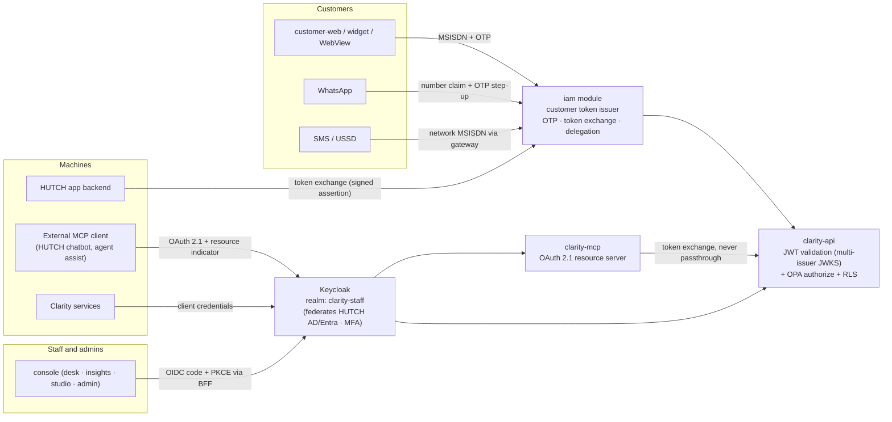
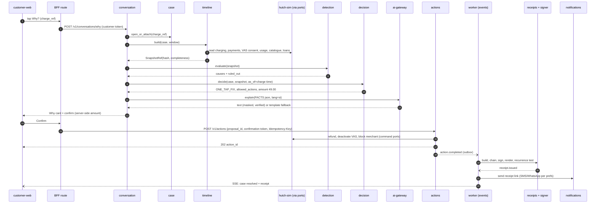
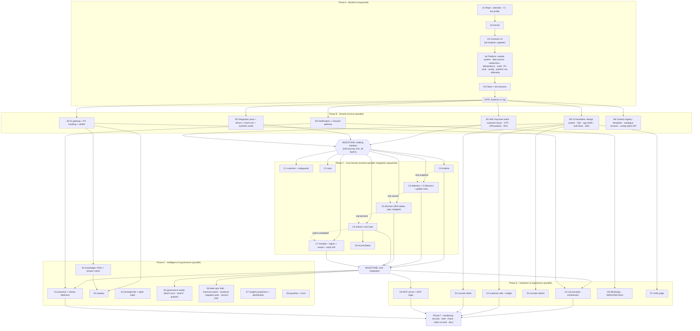
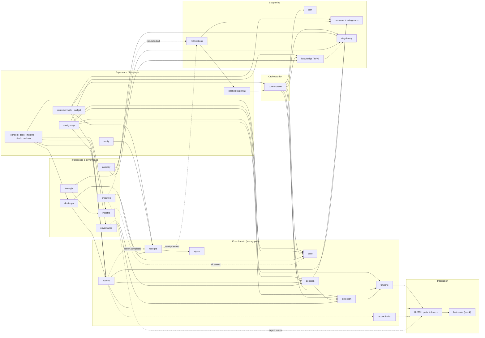
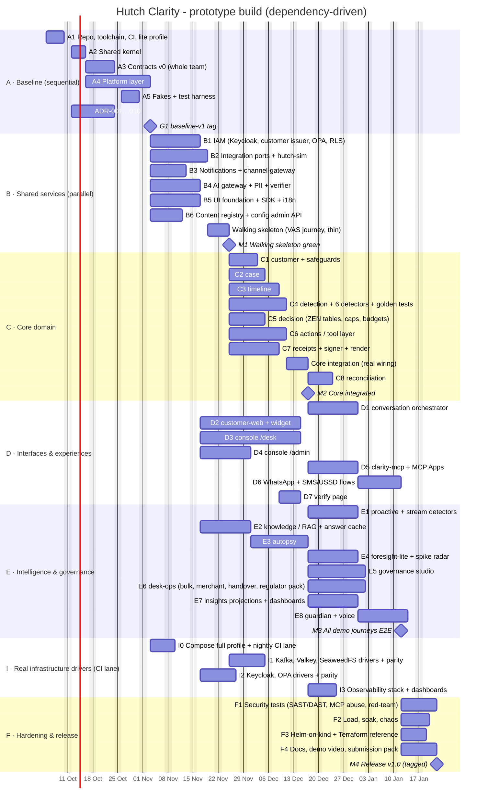

# Hutch Clarity - Build Blueprint: Baseline, Modules, Identity, Data Flow & Parallel Delivery

[← 17-governance-compliance-change-cost.md](17-governance-compliance-change-cost.md) · [← Plan index](README.md) · [19-tech-stack-and-ai.md →](19-tech-stack-and-ai.md)

> This chapter turns the plan into a **build order**. It answers four questions:
> 1. What is the permanent baseline that every module stands on?
> 2. How do modules plug into layers, and how do they become microservices later?
> 3. How do customers, HUTCH staff and admins authenticate, and how do the UIs connect?
> 4. Which work is sequential and which can several developers build in parallel?
>
> Principle: **production-grade code, swappable infrastructure.** Nothing in the baseline is temporary. Only *drivers* (mock HUTCH systems, local key file, hosted LLM) are swapped later, and they sit behind ports.

---

## 1. Actors and surfaces

| Actor group | Who | Surfaces | Authenticates via |
|---|---|---|---|
| **Customers** | Prepaid customer, WhatsApp-first customer, basic-phone customer, family guardian | `customer-web` (hutch.lk page, Hutch app WebView, embeddable `<clarity-why>` widget), WhatsApp, SMS/USSD | OTP, Hutch-app token exchange, network MSISDN (USSD) |
| **HUTCH staff** | Agent, supervisor, finance approver, VAS ops, CX analyst, CX engineer, compliance, network ops, product manager, auditor | `console` app: `/desk`, `/insights`, `/studio`, supervisor mobile PWA | Staff SSO (OIDC) + MFA, step-up for approvals |
| **Admins** | Platform admin, security admin | `console` app: `/admin` | Staff SSO + MFA (always), admin roles |
| **Machines** | Stream detectors, workers, MCP server, HUTCH backends, external MCP clients (HUTCH chatbot, agent assist) | REST, events, MCP | OAuth 2.1 client credentials / token exchange; mTLS in production |
| **Public** | Anyone holding a receipt (customer, shop, TRCSL) | `verify` page | None (rate-limited, masked data only) |

---

## 2. The permanent baseline (built first, once, properly)

The baseline is everything that **every** module needs. Building it badly makes everything above it temporary, so it is built first and **frozen with a tag (`baseline-v1`)**. After that, changes need an ADR and review.

| Baseline part | Contents | Why it must be solid |
|---|---|---|
| **B0 Repo & toolchain** | Monorepo, `make`/`just` tasks, pre-commit, ruff/mypy/eslint/tsc, CI skeleton, CODEOWNERS, ADR template, `make dev` (**`lite` profile: Python only, no infrastructure**), `make db-reset`, `make keys`, `.env.example`. The Compose `full` profile (Kafka KRaft, Valkey, SeaweedFS, Keycloak, OPA, OTel + Grafana LGTM, Langfuse) is added in I0. Profiles: §2.3; stack: [19-tech-stack-and-ai.md](19-tech-stack-and-ai.md). | Every developer can run and test in minutes with Python alone |
| **B1 Shared kernel** (`clarity.kernel`) | `Money` (Decimal, LKR, never float), `ULID` IDs with typed wrappers (`CaseId`, `ActionId`…), `Clock` (injectable, needed for point-in-time replay), `Result`/typed error taxonomy, `Principal`, `SubjectRef`, `CorrelationContext`, event envelope (CloudEvents style) | Shared vocabulary; a bug here spreads everywhere |
| **B2 Contracts v0** (`contracts/`) | Canonical model (TimelineEvent, Case, Cause, Decision, Proposal, Action, Receipt, Safeguard, Notification), OpenAPI skeleton, AsyncAPI event catalogue, **module facade interfaces**, **permission catalogue**, **config key catalogue**. TS + Pydantic generated. | **This is what makes parallel work possible.** Everyone builds against frozen contracts and fakes. |
| **B3 Module system** (`clarity.platform.app`) | `Module` protocol, `AppBuilder`, dependency-injection container, startup/shutdown lifecycle, entrypoints (`api`, `worker`, `stream`, `migrate`) | Modules register themselves; no module wires another by hand |
| **B4 Data access** | SQLAlchemy 2 async, **one Postgres schema + one DB role per module**, repository + unit-of-work, Alembic migrations per module, row-level security helpers, optimistic locking | Data ownership boundaries are what let modules become services later |
| **B5 Messaging** | Transactional **outbox** (same transaction as the state change) → relay → event bus port (Kafka-protocol driver, in-memory driver for tests) → consumer framework (idempotent via `processed_event`, retries, DLQ) | No lost or duplicated events, which matters because money moves on events |
| **B6 Idempotency** | `Idempotency-Key` middleware + store (Valkey fast path, Postgres unique constraint as truth) | The zero-duplicate-refund invariant |
| **B7 Audit ledger** | Append-only, hash-chained `audit` schema; `audit.record(actor, action, object, payload_hash)`; chain-verify job; periodic anchor to object storage | Regulator trust and tamper evidence |
| **B8 PII vault** | `subscriber_ref = HMAC(MSISDN)`; encrypted MSISDN/NIC store; tokenize/detokenize API with audit; masking utilities | No raw PII spreads into module tables |
| **B9 Config & flags** | Config resolver with **scoped, effective-dated, versioned overrides** (global → channel → segment → rule → campaign → subscriber); decisions get a resolved snapshot hash; OpenFeature flags + kill switches | Telecom rules change constantly ([§5 of the review](#8-how-changing-policies-flow-through)) |
| **B10 AuthN/AuthZ middleware** | JWT validation against multiple issuers (JWKS), `Principal` construction, OPA client (`authorize(principal, permission, resource)`), RLS session variables, step-up (`acr`) checks | Every route and consumer is protected by default (deny by default) |
| **B11 Observability** | OTel traces/metrics/logs (JSON stdout), correlation propagation through HTTP, events and MCP; masked logging filter | Debuggable from the first line of code |
| **B12 Test harness** | Testcontainers fixtures, **in-memory fakes for every module facade and port**, synthetic data factories, golden-file helpers, contract test kit | Parallel teams can test without each other's code |

### 2.1 The module protocol (how a module plugs into the layers)

```python
# clarity/platform/app/module.py
class Module(Protocol):
    name: str                                   # "decision"
    schema: str                                 # Postgres schema it owns
    def permissions(self) -> list[Permission]: ...      # e.g. "decision:read", "decision:replay"
    def config_keys(self) -> list[ConfigKey]: ...       # typed keys + defaults; admin UI renders them
    def register(self, app: AppBuilder) -> None: ...    # routes, event handlers, jobs, facade binding

# clarity/modules/decision/module.py
class DecisionModule:
    name, schema = "decision", "decision"
    def register(self, app: AppBuilder) -> None:
        app.provide(DecisionAPI, DecisionService)                 # public facade implementation
        app.routes(router, prefix="/v1/decisions", audience="internal")
        app.on_event("cause.detected.v1", handle_cause_detected)
        app.job("decision.budget_reset", cron="0 0 * * *", fn=reset_budgets)
```

```python
# clarity/modules/decision/public.py - the ONLY import other modules may use
class DecisionAPI(Protocol):
    async def decide(self, case_id: CaseId, snapshot: SnapshotRef, *, as_of: datetime) -> DecisionResult: ...
    async def get(self, decision_id: DecisionId) -> DecisionResult: ...
```

**Microservice path:** today `DecisionAPI` is bound to the in-process `DecisionService`. When `decision` is extracted, the same protocol is bound to an HTTP client generated from its OpenAPI. Callers don't change. The module already owns its schema, routes and events, so extraction is a deployment change, not a rewrite.

### 2.2 Layer rules (enforced by `import-linter` in CI)

```
L7 Experience      apps/customer-web · apps/console · apps/verify            (TypeScript)
L6 Interfaces      REST routers · MCP server · channel webhooks · consumers
L5 Identity/AuthZ  iam module · OPA policies
L4 Domain modules  case · timeline · detection · decision · actions · receipts · ...
L3 AI services     ai-gateway · pii · extract · explain · verifier · rag
L2 Platform        B3–B11
L1 Integration     ports + drivers (mock | sandbox | hutch)
L0 Kernel          B1 + generated contracts
```
1. A layer imports only from layers below it.
2. A module imports another module **only** through `public.py`, never its `domain/` or `infrastructure/`.
3. No SQL joins across schemas. Cross-module data comes through a facade call or a local projection built from events.
4. Domain code (`domain/`) has no I/O imports at all (pure, unit-testable).

### 2.3 Runtime profiles: light inner loop, full outer loop (ADR-0027)

Developers must not be blocked by infrastructure. Every infrastructure capability already sits behind a port (§2), so **a profile only chooses drivers**. The code paths, contracts and tests are identical in every profile.

| Capability (port) | `lite` (default for daily dev) | `full` (opt-in local, CI integration lane) | `prod` (HUTCH) |
|---|---|---|---|
| Relational DB | In-memory repositories (same interfaces, same parity suite) | **PostgreSQL 18 + pgvector** | Managed PostgreSQL |
| Event bus | Postgres outbox + in-process dispatcher | Apache Kafka (KRaft) + Apicurio | Kafka / MSK / Event Hubs |
| Job queue | Postgres-backed queue (same as all profiles) | Same | Same |
| Cache / rate limit / idempotency fast path | In-memory (Postgres stays the truth) | Valkey | Managed Valkey |
| Blob storage | Local folder (git-ignored) | SeaweedFS (S3 API) | S3 / Blob Storage |
| Staff identity | Dev issuer: local JWKS + seeded test users (from seed files) | Keycloak | HUTCH SSO via Keycloak / Entra |
| Customer identity | `iam` with OTP printed to the `hutch-sim` inbox | Same | HUTCH OTP service |
| Authorization | Python policy driver reading the same permission data | OPA | OPA |
| Feature flags | File provider | flagd | flagd / managed |
| Telemetry | Console exporter (JSON logs, spans) | OTel Collector + Grafana LGTM + Langfuse | HUTCH monitoring |
| HUTCH systems | `hutch-sim` drivers in process | `hutch-sim` as its own service | Real adapters |
| LLM | Cassette replay; free tiers when needed | Free tiers | HUTCH's provider |
| Signing key | Generated dev key (git-ignored) | Same | KMS / HSM |

**What a developer needs for `lite`:** Python (and Node only when working on the frontend). No database, broker, container runtime or cloud account (ADR-0027, revising ADR-0024).

**Rules that keep this safe**
1. **Skip servers, never seams.** The outbox, idempotency keys, `Money`, `Clock`, token validation, migrations, config resolver, permissions and correlation IDs exist in every profile from day one.
2. **Business code never checks the profile.** Only the composition root (B3) reads `CLARITY_PROFILE` and binds drivers. No `if profile == ...` anywhere else (AGENTS.md I20).
3. **Driver parity suites.** Each port has one contract test suite that every driver must pass (in-memory and Kafka, Python policy and OPA, dev issuer and Keycloak). That is how light drivers can't drift from real ones.
4. **Real drivers arrive early, in CI.** They are scheduled as work packages I1 to I3 (§14) and run in the CI integration lane (nightly and on PRs labelled `infra`), long before release. No big-bang infrastructure integration at the end.
5. **Deployment artefacts last.** Helm, OpenTofu and Kubernetes manifests are hardening work (F3). The deployment contract (ADR-0016) is what makes them easy then.

### 2.4 Local database workflow
- Every developer has their own local database; there is no shared dev database.
- Schema changes happen **only** through migrations, one migration history per module schema. Never edit a merged migration; add a new one (expand, migrate, contract).
- `make demo-reset` (lite) and `make db-reset` (full: drop, migrate, seed) load the same versioned synthetic `hutch-sim` scenarios, so every developer has the same data.
- Tests use a separate database: each test runs in a rolled-back transaction locally; CI uses a throwaway Postgres (Testcontainers).
- `lite` uses in-memory repositories that pass the same parity suite as the PostgreSQL ones; `full` and CI use real PostgreSQL. Never SQLite: schemas, row-level security and pgvector must behave exactly as in production wherever a database is used.

### 2.5 Configuration and secrets
- `.env.example` is committed and documents every variable (dummy values, comments). `.env` is git-ignored.
- One typed settings class (pydantic-settings) validates configuration at startup and **refuses to start** if anything is missing or invalid.
- Locally the only real secrets are each developer's **own** Gemini and Groq keys (Groq limits are per organisation, so keys are not shared). The dev signing key is generated by `make keys` into a git-ignored folder.
- CI uses GitHub Actions secrets; production uses the platform secret manager injected as environment variables. Same code everywhere.
- Never put secrets in `NEXT_PUBLIC_*` frontend variables. A leaked key is rotated immediately.

---

## 3. Module catalogue (every deck feature has a home)

| Module | Responsibility | Owns (schema) | Publishes | Consumes / calls |
|---|---|---|---|---|
| **iam** | Customer OTP login, token exchange, guardian delegation, staff profile mirror, permission catalogue, MCP client registry | `iam` | `auth.login`, `delegation.granted` | Identity port (OTP send/verify), Keycloak |
| **customer** | Subscriber profile ref, language, answer length, accessibility prefs, consents, **safeguards** (spend cap, data stop, merchant blocks) | `customer` | `safeguard.changed`, `consent.changed` | actions (to apply safeguard commands) |
| **case** | Case aggregate, state machine, channel-agnostic thread, SLA, handoff, assignment, smart-queue scoring | `case` | `case.created/updated/handoff` | - |
| **timeline** | Build evidence from 8 sources via ports, normalize, completeness flags, immutable **evidence snapshot** (hash) | `timeline` | `timeline.built` | Integration ports (read) |
| **detection** | Cause detectors (Python plugins `rule_id@version`), ranking, ruled-out list, confidence | `detection` | `cause.detected` | timeline snapshot, config |
| **decision** | Outcome via ZEN decision tables, caps, budgets, risk inputs, allowed actions | `decision` | `decision.generated` | detection, customer, config |
| **actions** (tool layer) | Proposals, confirmation tokens, approvals (four-eyes, step-up), idempotent execution, compensation, budgets | `actions` | `action.requested/completed/failed`, `approval.requested` | Integration ports (command), decision |
| **receipts** | Build canonical receipt, hash chain, call **signer**, render (PNG/PDF/SMS, si/ta/en), recurrence test, verify, replay | `receipts` | `receipt.issued` | `action.completed`, `decision.explained` |
| **reconciliation** | Daily action ↔ adapter confirmation match | `recon` | `reconciliation.mismatch` | actions, ports |
| **conversation** (orchestrator) | Intake (structured or free text/voice), language detection, routing (dispute / policy answer / flow), handoff check every turn, response composition (template → cache → LLM) | `conversation` | `message.received/sent` | case, timeline, detection, decision, ai, knowledge |
| **notifications** | Templates, preferences, consent, routing, dispatch, delivery status, quiet hours, fallback channels | `notify` | `notification.sent/delivered/failed` | Events from everywhere; channel-gateway |
| **knowledge** | Catalogue truth labels (versioned), T&C/Gazette corpus, RAG index, CX-approved answer cache | `knowledge` | `knowledge.published` | Catalogue port |
| **proactive** | Stream detectors: zero-contact duplicate reload, FUP 80/95, pack-end choice, VAS renewal notice, outage heads-up, bill-shock score | `proactive` | `risk.detected`, opens cases | Ingest topics (`payment.recorded`, `charge.applied`…) |
| **governance** | Teach once, rule/config/table proposals, golden test runs, policy what-if replay, four-eyes publish, signed bundles | `governance` | `rule.published`, `config.published` | detection, decision (replay mode) |
| **desk-ops** | Fix-all-like-this (bulk), second look, shift handover, merchant watch, regulator pack | `deskops` | `bulk.executed` | actions, receipts, case |
| **autopsy** | Ingest complaints, dedupe, mask, canonical summary, embed, cluster, map to rules, draft flows | `autopsy` | `cluster.updated` | ai, case, knowledge |
| **foresight** | Scenario setup, persona simulation (lite), baseline, early-warning radar | `foresight` | `forecast.ready`, `spike.detected` | ai, analytics projections |
| **insights** | Read models / projections for dashboards (top services, where AI stops, funnels, slicing) | `insights` | - | All events (read-only) |

### 3.1 Deck feature → module map

| Deck feature | Slide | Module(s) |
|---|---|---|
| Tap **Why?** / say it; reason + evidence + ruled out | S5, S7 | conversation, timeline, detection, decision, customer-web |
| Confirm in one tap | S5, S7 | actions (proposal + confirmation token), customer-web |
| Signed Trust Receipt, QR, recurrence test, si/ta/en PNG/PDF/SMS | S6 | receipts, signer, verify, notifications |
| Zero-contact double-reload refund | S5 | proactive → case → … → actions (auto-fix path) |
| Pack truth label | S5 | knowledge (catalogue), customer-web |
| Voice in/out (Sinhala/Tamil) | S5, S6 | conversation + ai (STT/TTS), channels |
| Family guardian (≤10 numbers) | S5, S6 | iam (delegation), customer |
| Why? on any phone (SMS/USSD) | S5 | channel-gateway, conversation |
| Choose before you pay (pack-end) / bill-shock risk | S5, S6 | proactive, notifications, customer (safeguards) |
| VAS renewal heads-up, FUP 80/95%, outage ETA | S6 | proactive, notifications |
| Language remembered, short/long answers, large text | S6 | customer (prefs), customer-web |
| One case on any channel | S5 | case (channel-agnostic thread), iam |
| Rules decide, LLM explains, verifier | S7 | detection, decision, ai (verifier) |
| PII masking, OTP, SSO/MFA/RBAC, audit ledger, vault | S8 | baseline B7, B8, B10; iam |
| Desk: queue, cockpit, one-click, reply in their language | S9 | console `/desk`, case, actions, conversation |
| Teach once, policy what-if | S9 | governance, console `/studio` |
| Fix all like this, second look, merchant watch, handover, regulator pack | S9 | desk-ops |
| Supervisor mobile approvals | S9 | console PWA + notifications (push) |
| Insights: top services, where AI stops, drop-offs, slicing | S10 | insights, console `/insights` |
| Complaint Autopsy | S11 | autopsy |
| Foresight + early-warning radar | S11 | foresight |
| Answer without the LLM (template → cache → small → reasoning) | S14 | conversation, knowledge (cache), ai-gateway |

---

## 4. Deployables (what actually runs)

Modules are code units. Deployables are processes. One image can run several entrypoints.

| Deployable | Contains | Why separate | Scales on |
|---|---|---|---|
| `clarity-api` | All L4 modules' HTTP routes | Core; modular monolith | RPS |
| `clarity-worker` | *Same image.* Event consumers, outbox relay, jobs, notification dispatch, receipt rendering, Autopsy batches | Async work must not slow the API | Queue lag |
| `clarity-stream` | *Same image.* Proactive stream detectors on ingest topics | HUTCH event volume scales with subscribers, not interactions | Partitions |
| `clarity-mcp` | MCP server (no DB access; calls `clarity-api`) | Separate trust zone; can only read and **propose** | Sessions |
| `clarity-signer` | Ed25519 signing; only process with key access | Key isolation | Low |
| `clarity-ai-gateway` | Model routing, masking enforcement, token budgets, provider drivers | Single egress point to any LLM | Tokens |
| `clarity-channel-gateway` | WhatsApp/SMS/USSD/push/email inbound webhooks and outbound providers | Internet-facing; holds provider credentials | Messages |
| `hutch-sim` | **Simulated** HUTCH systems (OCS, payments, DCB/VAS, catalogue, usage/FUP, loans, CRM, OTP, SMSC) + synthetic event generator + demo scenario control panel | Makes adapters do real network calls across a real boundary; clearly labelled mock | Demo |
| `customer-web` | Next.js PWA + `<clarity-why>` widget build + WebView entry | Customer audience | CDN |
| `console` | Next.js: `/desk`, `/insights`, `/studio`, `/admin` | Staff/admin audience; can be deployed on the internal network only | - |
| `verify` | Tiny SSR page for receipt QR | Public, must be fast on 3G | CDN |

**Extraction criteria** (when Hutch should split a module out of `clarity-api`): an independent scaling profile, a separate team owning it, a different security zone, or a release cadence that conflicts. Likely first candidates: `receipts`, `proactive`, `notifications`.

---

## 5. Identity, authentication and authorization

### 5.1 Overview



### 5.2 Customer authentication

| Entry | Flow | Assurance (`acr`) | Allowed |
|---|---|---|---|
| Hutch app (WebView) | App backend calls `POST /v1/auth/token-exchange` with a signed assertion of the logged-in subscriber → Clarity customer token (10 min, refresh bound to device) | `app` | Everything incl. one-tap fixes |
| Web (hutch.lk) | MSISDN → OTP via Identity port (→ HUTCH OTP / `hutch-sim` SMS inbox in demo) → token | `otp` | Everything incl. one-tap fixes |
| WhatsApp | Number from Meta webhook = *claimed* identity → general answers; **OTP step-up** before account data or actions | `claimed` → `otp` | Step-up gated |
| SMS / USSD | MSISDN asserted by the HUTCH gateway (mTLS) | `network` | Explain + simple confirm |
| Guardian | Member approves the link with an OTP on their own phone → `delegation` record → guardian token carries `delegations[]` | inherits | Read + safeguards on linked lines |

Customer token claims: `sub = subscriber_ref` (never the raw MSISDN), `acr`, `channel`, `delegations`, `aud`, short `exp`. The issuer sits behind an interface, so HUTCH's own customer IdP can replace it in production.

### 5.3 Staff and admin authentication
- **OIDC Authorization Code + PKCE** through the console's server-side BFF. Tokens never reach browser JavaScript; the browser holds an httpOnly, SameSite session cookie.
- Keycloak realm `clarity-staff`. In production it federates HUTCH Active Directory / Entra ID, so HUTCH manages joiners and leavers.
- **MFA always.** **Step-up re-authentication** (`acr=mfa-recent`, under 5 minutes) for approvals above threshold, bulk fixes and publishing.
- `/admin` requires an admin role. In production, deploy it on the internal network only (IP allowlist).

### 5.4 Roles and permissions (RBAC + ABAC)

Roles are coarse, permissions are fine-grained (declared by modules), and **OPA** decides with attributes (amount, case owner, safety level, maker ≠ checker).

| Permission ↓ / Role → | customer | agent | supervisor | finance | vas_ops | cx_engineer | compliance | auditor | platform_admin | security_admin |
|---|---|---|---|---|---|---|---|---|---|---|
| `case:read` (own) | ✅ | | | | | | | | | |
| `self:read`, `self:settings`, `self:transact` (own account; self:transact = simulated HUTCH self-care such as reload) | ✅ | | | | | | | | | |
| `case:read` (any) | | ✅ | ✅ | ✅ | ✅ | ✅ | ✅ | ✅ | | |
| `action:propose` | ✅ (own) | ✅ | ✅ | | ✅ | | | | | |
| `action:approve` ≤ one-tap cap | | ✅ | ✅ | | | | | | | |
| `action:approve` > cap | | | ✅ (step-up) | ✅ (step-up) | | | | | | |
| `bulk:execute` (four-eyes) | | | maker | checker | | | | | | |
| `rule:draft` / `rule:publish` | | | | | | draft | approve | | | |
| `config:change` caps/thresholds | | | | approve | | draft | | | | |
| `merchant:suspend` | | | | | ✅ | | ✅ | | | |
| `regulator_pack:export` | | | | | | | ✅ | | | |
| `audit:read` | | | | | | | ✅ | ✅ | | ✅ |
| `flags:kill_switch` | | | ✅ (auto-fix only) | | | | | | ✅ | |
| `users/roles`, `mcp_clients` | | | | | | | | | ✅ | ✅ |

**Separation of duties:** admins can't approve money actions, and a maker can never be the checker on the same item. OPA enforces both.

**Data-level defence:** for customer-scoped requests the API sets `SET LOCAL app.subscriber_ref = …`, and Postgres **row-level security** denies other subscribers' rows even if application code has a bug.

### 5.5 Machine identities
- Each service has its own Keycloak client (client credentials) and its own DB role. In production this moves to mTLS / SPIFFE workload identity.
- `svc-stream-detector` may open cases and request **auto-fix** actions only for whitelisted rules.
- **MCP clients** are registered per consumer (e.g., HUTCH chatbot) with scopes mapping to profiles (`clarity.customer-assist`, `clarity.staff-assist`, `clarity.analytics`). `clarity-mcp` validates the token (audience = clarity-mcp) and **exchanges** it for a downstream token. It never passes the token through.

---

## 6. UI architecture and connections

| App | Users | Pattern | Connects to |
|---|---|---|---|
| `customer-web` | Customers | Next.js PWA; server-side BFF routes; `<clarity-why>` web component built from the same React components for embedding in hutch.lk and the app WebView | BFF → `clarity-api` (customer token) · SSE for live case status |
| `console` | Staff + admins | Next.js; route groups `/desk`, `/insights`, `/studio`, `/admin`; role-gated navigation; PWA for supervisor mobile approvals | BFF → `clarity-api` (staff token) · SSE for queue/approval updates · web push |
| `verify` | Public | SSR, minimal JS, under 50 KB | `GET /v1/receipts/{id}/public` |
| MCP Apps card | Any MCP host | `ui://clarity/why-card` HTML resource built from the same widget | `clarity-mcp` |

Shared front-end packages:
- `packages/ui`: design tokens, Tailwind + shadcn/ui components, Noto Sans Sinhala / Tamil, LKR formatting, WCAG 2.2 AA.
- `packages/sdk`: TypeScript client generated from OpenAPI.
- `packages/i18n`: si / ta / en message catalogues, reviewed by native speakers.
- `packages/widget`: the Why? card, used by customer-web, the embed and the MCP Apps card.

**Admin console scope:** users and roles (view; HUTCH IdP is the source), MCP client registry, config and thresholds (four-eyes), feature flags and kill switches, notification templates, adapter/driver health and circuit state, signing key status and rotation, audit log viewer, retention jobs.

---

## 7. How data passes

### 7.1 Three communication modes
1. **Sync command/query:** a facade call in-process (or REST once extracted). Used when the caller needs the answer now (evaluate a case).
2. **Domain events:** outbox → bus → idempotent consumers. Used for side effects and fan-out (receipt after action, notification after receipt).
3. **Projections (read models):** consumers build query-optimised tables (Desk queue, insights). Nobody runs cross-schema joins.

Evidence moves **by reference**: the timeline writes an immutable snapshot and returns `SnapshotRef{id, hash}`. Detection, decision, receipts and replay all read the same snapshot, so every decision is reproducible.

### 7.2 Customer "Why?" → fix → receipt



### 7.3 Zero-contact (no customer action)
`hutch-sim` emits two `payment.recorded` events → `clarity-stream` detector matches `DUPLICATE_RELOAD` → opens a case (`trigger=stream`) → the same timeline → detection → decision path → `AUTO_FIX` (only if the rule is whitelisted and under the cap and budget) → actions → receipt → notification "we refunded you before you asked".

### 7.4 Data stores

| Store | Holds | Notes |
|---|---|---|
| PostgreSQL | One schema per module; `audit`; `vault` (encrypted PII); `outbox`; pgvector in `knowledge` and `autopsy` | Source of truth. RLS on customer-scoped tables. |
| Valkey (Redis protocol) | Sessions, idempotency fast path, rate limits, answer cache | Losing it never loses money state |
| Event bus (Kafka API) | Ingest topics from HUTCH; core domain topics; DLQs | Key = `subscriber_ref` (per-customer ordering) |
| Object storage (S3 API) | Receipt PDFs/PNGs, regulator packs, audit anchors (object lock) | `BlobStore` port |
| Warehouse | Event history for insights/Foresight | DuckDB/PG in prototype; HUTCH warehouse later |

---

## 8. How changing policies flow through

Summary only. The full enterprise design (change classes, lifecycle, approvals, effective dating, emergency changes, rollback, catalogue sync) is in [20-policy-change-management.md](20-policy-change-management.md).

| Kind of change | Lives in | Changed by | Lifecycle |
|---|---|---|---|
| Facts (pack price, FUP cap) | HUTCH catalogue → `knowledge` (effective-dated versions) | Product, in HUTCH systems | Sync; never hard-coded |
| Policy text (T&C, Gazette) | `knowledge` corpus, versioned | Legal/CX | Publish → re-index → old versions kept |
| Parameters (caps, windows, thresholds) | Config store with scoped overrides (B9) | Draft by CX eng, approve by finance | Four-eyes → replay → flag rollout |
| Decision tables | ZEN JDM files in `rules/` (signed bundle) | CX eng + finance | Studio edit → golden tests → replay → publish |
| Cause logic | Python detector plugins `rule_id@version` | Engineers (from "teach once") | PR → golden tests → shadow → activate |
| Wording | Template registry (si/ta/en) | CX content | Review by native speaker → publish |
| Switches | Feature flags / kill switches | Ops / supervisor | Immediate, audited |

Every decision stores `{detector_versions, table_version, config_snapshot_hash, catalogue_version, as_of}`, so replay and what-if analysis are exact.

---

## 9. Notification service design

```mermaid
flowchart LR
    EV["Events: receipt.issued · risk.detected · case.updated · approval.requested · spike.detected"] --> RT["Router<br/>who · why · urgency"]
    RT --> PR["Preferences + consent<br/>language · channel order · quiet hours"]
    PR --> TP["Template render<br/>versioned si/ta/en · params validated"]
    TP --> PL["Policy<br/>rate limits · WhatsApp 24h window · dedupe"]
    PL --> OB[("notify.outbox")]
    OB --> DS["Dispatcher (worker)"]
    DS --> CG["channel-gateway providers<br/>WhatsApp · SMS (SMSC) · push · email · in-app SSE"]
    CG --> ST["Delivery status callbacks"]
    ST --> FB{"Failed / undelivered?"}
    FB -- yes --> DS
    FB -- no --> DONE["notification.delivered + audit"]
```



- **Free text is never allowed.** Only approved templates with validated parameters, so the LLM cannot send messages.
- **Idempotency key** = `(event_id, recipient, template)`. No double SMS on event redelivery.
- **Fallback chain** per preference, e.g. WhatsApp → SMS. Templates outside WhatsApp's 24-hour window must be pre-approved by Meta.
- **Staff notifications** use the same service: approval requests (web push to the supervisor PWA), SLA breaches, spike alerts.
- **Providers sit behind ports.** Prototype uses `hutch-sim` SMSC and a WhatsApp test number. Production uses the HUTCH SMSC and HUTCH's WhatsApp Business account.

---

## 10. MCP server build

| Aspect | Design |
|---|---|
| Process | `clarity-mcp`, separate deployable, **stateless** (2026-07-28 spec core), Streamable HTTP, official Python MCP SDK |
| Data access | **None directly.** It calls `clarity-api` through the generated client, so it reuses all authZ, RLS and audit. |
| Auth | OAuth 2.1 resource server; validates Keycloak tokens (audience, scopes, `iss`); token exchange downstream |
| Profiles → tools | `customer-assist`: L1 reads on own case + `propose_action` + `request_handoff`. `staff-assist`: + any-case reads, replay, handover data. `analytics`: clusters, knowledge. Full catalogue in [§11](07-mcp.md). |
| Safety | L1 read · L2 propose / templated notify · L3 **propose only** (confirmation outside the LLM) · L4 never exposed |
| UI | MCP Apps extension: `ui://clarity/why-card`, `ui://clarity/receipt` built from `packages/widget` |
| Audit | `MCPInvocation` per call; denial-spike alert (possible prompt injection) |
| Tests | Schema, allowlist per profile, subject binding, injection attempts, golden tool selection; external client demo (MCP Inspector / desktop AI client) |

**Dependency:** needs contracts (B2) to start, and the `case`, `timeline`, `detection`, `decision` and `actions` (proposal) APIs to go live. Until those exist it is built against `clarity-api` fakes.

---

## 11. Build order: sequential vs parallel

### 11.1 Dependency graph



### 11.2 Work packages

| ID | Package | Hard dependency (must be real) | Can start early against fakes after | Blocks |
|---|---|---|---|---|
| A1–A5 | Baseline | - | - | **Everything** (sequential, 1–2 senior devs; whole team reviews A3) |
| B1 | IAM | A | - | Walking skeleton, D*, MCP |
| B2 | Integration + hutch-sim | A | - | C3, C6, E1 |
| B3 | Notifications + channel-gateway | A | - (templates from B6 can be stubbed) | D6, E1 |
| B4 | AI gateway + PII + verifier | A | - | D1, E2, E3, E4 |
| B5 | UI foundation | A | B1 (stub login) | D2, D3, D4, D7 |
| B6 | Content registry | A | - | B3 real templates, E5 |
| C1, C2 | customer, case | A | - | C3+, D1, D3 |
| C3 | timeline | B2 ports | A3 contracts | C4 *real* |
| C4 | detection | snapshot contract | **A3: fixture snapshots** | C5 *real* |
| C5 | decision | cause contract | **A3: fixture causes** | C6 *real* |
| C6 | actions | B2 command ports, C5 contract | A3 | C7 real, C8, D1 confirm flow |
| C7 | receipts + signer | `action.completed` contract | **A3: fixture events** | D7, notifications content |
| C8 | reconciliation | C6 | - | F |
| D1 | conversation | C2, B4 | A3 fakes of C3–C5 | D2/D6 real journeys |
| D2 | customer-web + widget | B5 | fake SDK responses | E2E journeys |
| D3 | console /desk | B5, B1 | fake SDK | E6, staff approval journey |
| D4 | console /admin | B5, B1, B6 | - | - |
| D5 | MCP server | B1 | `clarity-api` fakes | MCP demo |
| D6 | WhatsApp, SMS/USSD | B3, D1 | - | channel journeys |
| D7 | verify | C7 API | fake receipt | - |
| E1 | proactive | B2 streams, CI milestone | fixture events | zero-contact journey |
| E2 | knowledge / RAG | B4 | - | E3, explain-only FUP journey |
| E3 | autopsy | B4, E2 | synthetic complaints | E4 seeds |
| E4 | foresight-lite | B4 | - | - |
| E5 | governance studio | C4, C5, B6 | - | - |
| E6 | desk-ops | C6, C7 | - | - |
| E7 | insights | events from C* | synthetic events | - |
| E8 | guardian, voice | B1, B4, D1 | - | - |

### 11.3 Critical path
`A1 → A3 → A4 → G1 → B2 → C3 → (C4 → C5 → C6 real integration) → D1 → E2E journeys → F`

C4, C5 and C7 are **off** the critical path for development, because they are built against fixture contracts. They join it only at integration.

### 11.4 Rules that keep parallel work safe
1. **Contracts first.** A3 is drafted by the whole team in one session. Afterwards, contract changes go by PR with consumer approval and a semver bump. CI runs consumer-driven contract tests.
2. **Every facade and port ships a fake** (in A5 or alongside the contract). Nobody waits for someone else's module.
3. **Trunk-based development** with short branches and feature flags for unfinished features.
4. **Module ownership** via CODEOWNERS. Money-path modules (`actions`, `decision`, `receipts`, `rules/`) need 2 reviewers.
5. **Integration milestones are scheduled**: walking skeleton, core integrated, journeys E2E. Each one has an E2E test that must stay green afterwards.
6. **Definition of done per package:** tests (unit + contract + golden where relevant), OpenAPI/AsyncAPI updated, permissions and config keys declared, telemetry spans present, docs page updated.

### 11.4.1 Example allocation (6 developers)

| Dev | Phase A | Phase B | Phase C | Phase D/E |
|---|---|---|---|---|
| 1 Platform lead | A1–A5 | B1 IAM | C8 recon | F hardening, D4 admin |
| 2 Integration | A3 (canonical model) | B2 hutch-sim + ports | C3 timeline | E1 proactive |
| 3 Rules | A3 (rule contracts) | B6 content registry | C4 detection | E5 studio |
| 4 Money path | A3 (action/receipt contracts) | B3 notifications | C5 decision, C6 actions, C7 receipts | E6 desk-ops |
| 5 AI | A3 (AI contracts) | B4 AI gateway | C1/C2 customer + case | D1 conversation, D5 MCP, E2–E4 |
| 6 Frontend | A3 (SDK/UI contracts) | B5 UI foundation | D2 customer-web | D3 desk, D7 verify, E7 insights |

---

## 12. Definition of "baseline is solid" (gate G1 checklist)

- [ ] `make dev` runs `clarity-api` and `clarity-worker` healthy on the `lite` profile with only PostgreSQL
- [ ] Driver parity suites exist for every port (lite drivers pass them)
- [ ] A sample module (`_example`) shows routes, events, a job, permissions, config keys, migrations and tests, as the copy-paste template
- [ ] Outbox chaos test: kill the worker mid-relay → no event lost, no duplicate side effect
- [ ] Idempotency test: 50 concurrent identical POSTs → exactly one execution
- [ ] Audit chain verify job passes; tampering with a row is detected
- [ ] Config resolver: override precedence + effective dates + snapshot hash tested
- [ ] Deny-by-default: an unregistered route or permission returns 403; RLS blocks cross-subscriber reads
- [ ] Traces flow from HTTP → event → consumer under one correlation ID
- [ ] `import-linter` contracts enforce the layer rules
- [ ] CI: lint, types, tests, SAST, secret scan, image build + scan + SBOM all green
- [ ] Contracts v0 published (OpenAPI, AsyncAPI, JSON Schema) with generated Pydantic + TS
- [ ] ADR-001…ADR-010 written (modular monolith, schema-per-module, outbox, ZEN + Python detectors, OPA for authZ, infra ports, customer issuer, MCP stateless resource server, Keycloak, notification templates only)

---

## 13. Module dependency graph (runtime)

Arrows mean "calls or consumes events from". Dashed arrows are event-only (asynchronous) links. Everything depends on the baseline (kernel + platform), which isn't drawn to keep the graph readable.



### 13.1 Per-module dependency sheet

"Build after" means the earliest point a developer can start, using fakes for anything not yet real. "Real integration needs" means what must exist before the module runs end to end.

| Module | Calls (sync) | Consumes (events) | Used by | Build after | Real integration needs | Est. effort (dev-days) |
|---|---|---|---|---|---|---|
| kernel | - | - | everything | A1 | - | 4 |
| platform | kernel | - | everything | A2 | - | 12 |
| iam | platform, Identity port, Keycloak | - | all interfaces | G1 | Keycloak realm, hutch-sim OTP | 10 |
| integration ports + hutch-sim | platform | - | timeline, actions, proactive, recon | G1 | - | 12 |
| notifications | customer, channel-gateway, content registry | receipt.issued, risk.detected, case.updated, approval.requested | proactive, receipts, desk | G1 | channel-gateway, templates | 8 |
| channel-gateway | conversation, notifications | provider callbacks | notifications, conversation | G1 | WhatsApp test number, hutch-sim SMSC | 6 |
| ai-gateway (+PII, verifier) | providers (Gemini, Groq), PII vault | - | conversation, knowledge, autopsy, foresight, desk | G1 | provider keys | 10 |
| content registry | platform | - | notifications, conversation, governance, admin | G1 | - | 7 |
| customer + safeguards | platform, iam | consent.changed | decision, actions, notifications, customer-web | G1 | - | 6 |
| case | platform | many (status projections) | conversation, desk, proactive, MCP | G1 | - | 8 |
| timeline | integration ports | - | detection, conversation, MCP | B2 contracts | hutch-sim drivers | 10 |
| detection | timeline (snapshot) | - | decision, governance, MCP | G1 (fixture snapshots) | timeline | 12 |
| decision | detection, customer, config | - | actions, conversation, governance, MCP | G1 (fixture causes) | detection | 8 |
| actions (tool layer) | decision, command ports, customer | - | customer-web, desk, desk-ops, MCP | G1 (fixture decisions) | decision, hutch-sim commands | 12 |
| receipts + signer | signer, content registry | action.completed, decision.explained | verify, notifications, desk-ops | G1 (fixture events) | actions | 10 |
| reconciliation | ports | action.completed | finance dashboard | actions | actions, hutch-sim | 5 |
| conversation | iam, case, timeline, detection, decision, knowledge, ai-gateway | message.received | customer-web, channel-gateway | B4 | core integrated | 10 |
| customer-web + widget | conversation, actions, receipts, customer | SSE | customers, MCP Apps card | B5 | conversation | 20 |
| console /desk | case, actions, conversation (drafts) | SSE | staff | B5 | core integrated | 20 |
| console /admin | iam, content registry, flags, audit | - | admins | B5, B6 | - | 10 |
| verify | receipts | - | public | B5 | receipts | 4 |
| clarity-mcp | clarity-api (case, timeline, detection, decision, actions, knowledge) | - | HUTCH chatbot / agent tools | B1 | core integrated | 10 |
| proactive | case, ports | payment.recorded, charge.applied, usage.threshold_reached, pack.expiring, vas.renewed | notifications | B2 | core integrated | 10 |
| knowledge / RAG | ai-gateway, catalogue port | knowledge.published | conversation, autopsy, MCP | B4 | - | 10 |
| governance studio | detection, decision (replay), content registry | - | console /studio | core integrated | - | 12 |
| desk-ops | actions, receipts, case | - | console /desk | core + desk | - | 12 |
| autopsy | ai-gateway, knowledge, case | complaint.created | insights, governance | knowledge | - | 12 |
| foresight-lite | ai-gateway, insights | spike signals | console /insights | autopsy | - | 10 |
| insights | - | all core events | console /insights | core integrated | - | 10 |
| guardian + voice | iam, customer, ai-gateway (STT/TTS) | - | customer-web, WhatsApp | conversation | - | 10 |

Effort figures are **ASSUMPTIONS** for one experienced developer, including tests and docs. They exist to size the Gantt, not as commitments.

---

## 14. Gantt chart (all modules)

**Assumed start: Monday 2026-10-05 (ASSUMPTION, for scheduling only).** Weekends are excluded. Dependencies come from §11 and §13.1. The chart assumes **6–8 developers** (see the allocation in §11.4.1). With fewer people, parallel bars become sequential and the end date moves out, but the dependency order stays the same.



### 14.1 Reading the chart
- **Critical path:** A1 → A2 → A4 → G1 → B2 → walking skeleton → C4/C6 → core integration → D1 → D6 → M3 → F1/F4 → M4.
- **Float (slack):** E3/E4 (Autopsy, Foresight) and D4 (admin) have the most slack. They are the right packages for a developer who frees up early.
- **Overlap rule:** UI work (D2, D3) starts right after B5 against the generated SDK with fake responses, so the UI is ready when the core lands.
- **Infrastructure lane (I0 to I3):** real drivers are built and proven in CI in parallel with features, so hardening (F) only adds deployment artefacts, never first-time integration.
- **Gate discipline:** G1, M1, M2, M3 and M4 each have an E2E test that must stay green afterwards. A red gate stops new feature work until it's fixed.


---

[← 17-governance-compliance-change-cost.md](17-governance-compliance-change-cost.md) · [← Plan index](README.md) · [19-tech-stack-and-ai.md →](19-tech-stack-and-ai.md)
