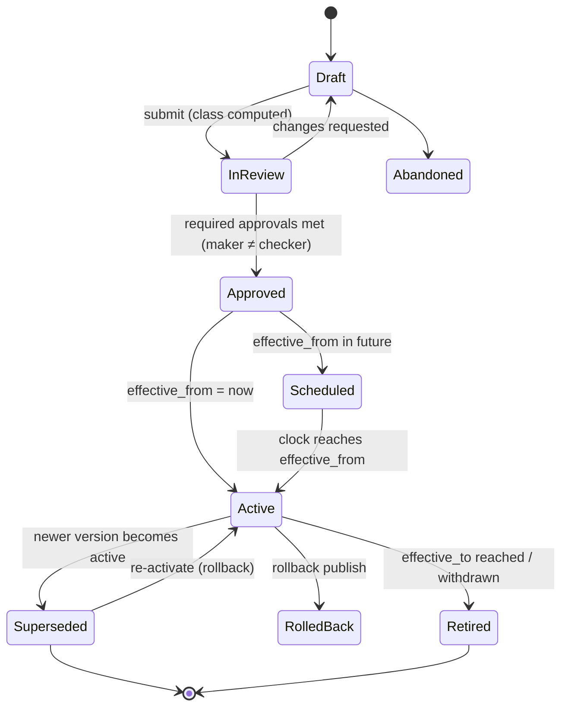
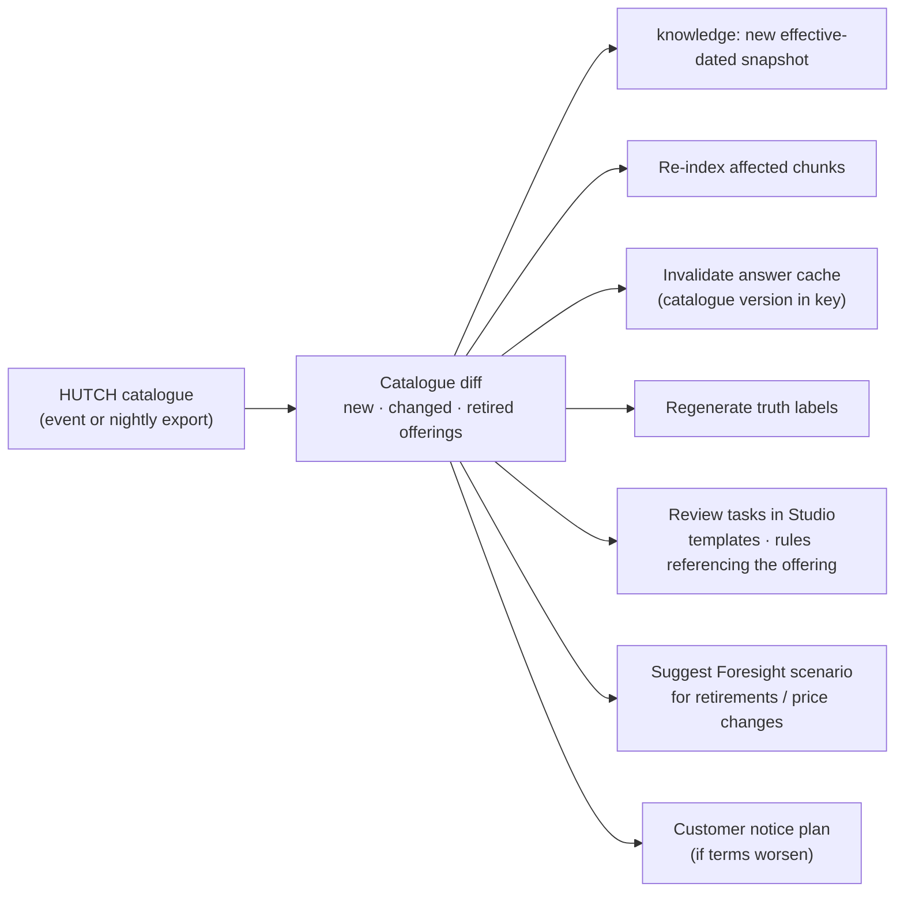

# Hutch Clarity - Enterprise Policy & Change Management

[← 19-tech-stack-and-ai.md](19-tech-stack-and-ai.md) · [← Plan index](README.md) · [21-migration-and-deployment-plan.md →](21-migration-and-deployment-plan.md)

> Telecom operators change packs, prices, fair-use caps, VAS rules, refund caps, campaigns and regulatory obligations constantly. This chapter defines **one governed lifecycle** for every such change, so Clarity never needs a code release to follow a business change, and every decision can always be explained with "which rules, values and wording applied at that moment".
> Labels as in the [index](README.md). Owners, lead times and approval thresholds are **ASSUMPTION / REQUIRES HUTCH CONFIRMATION**.

---

## 1. Principles

1. **Policy is data with a lifecycle, not code with a deploy.** Except new detector logic, every change is published, not deployed.
2. **Nothing is edited in place.** Every change creates a new immutable version; old versions remain readable forever (audit, replay, grandfathering).
3. **Time is explicit.** Every version has an effective window; every decision is evaluated `as_of` the event time, not "now".
4. **Most specific scope wins, inside hard guardrails.** Overrides can narrow or adjust, but never exceed ceilings set by Finance/Compliance.
5. **No change without evidence of impact.** Every money- or customer-affecting change shows a replay impact report before approval.
6. **Maker ≠ checker.** Approval depth depends on the change class.
7. **Rollback is a publish, and takes seconds.** Re-activating the previous version is always possible and audited.
8. **One source of truth per fact.** Pack facts come from the HUTCH catalogue; Clarity never re-types a price or cap.

---

## 2. What can change (policy artefact kinds)

| Kind | Examples | Source of truth | Editor | Form |
|---|---|---|---|---|
| **K1 Catalogue facts** | New pack, price change, FUP cap, after-cap speed, validity, pack sunset | HUTCH product catalogue | Product team (in HUTCH systems) | Synced, effective-dated snapshots in `knowledge` |
| **K2 Policy & legal text** | T&C clause, Gazette direction, VAS consent rule, refund policy text | HUTCH Legal / TRCSL publications | Legal, Compliance | Versioned documents in the RAG corpus (by clause) |
| **K3 Parameters** | Auto-fix cap, one-tap cap, confidence thresholds, SIM-swap days, refund budget, lookback windows, alert thresholds (80/95%) | Clarity config store | CX engineer drafts; Finance / Compliance approve | Typed keys with scoped overrides |
| **K4 Decision tables** | Outcome matrix, merchant risk bands, routing of approvals | Clarity rule bundle | CX engineer + Finance | GoRules ZEN JDM files |
| **K5 Cause logic** | New cause detector, changed evidence logic | Clarity rule bundle (Git) | Engineers (often from "teach once") | Python detector plugin + manifest |
| **K6 Wording** | Explanation templates, notification templates (si/ta/en), truth-label copy | Template registry | CX content + native-speaker reviewer | Versioned templates with typed parameters |
| **K7 Switches** | Kill switches, cohort rollouts, channel enablement, auto-fix whitelist | Flag service (OpenFeature) | Ops / supervisor (limited set) | Flags with audit |
| **K8 Access policy** | Who may approve what, MCP client scopes | OPA bundles + IdP | Security admin | Rego + role mappings |

---

## 3. Change classes (risk-based governance)

| Class | Definition | Examples | Approvals | Impact evidence required | Activation |
|---|---|---|---|---|---|
| **C0 Cosmetic** | No effect on outcomes, money or obligations | Typo in an English template | 1 reviewer (peer) | Rendered preview | Immediate |
| **C1 Customer-visible** | Changes what customers see, not outcomes or money | New Sinhala wording, truth-label copy | Content owner + native-speaker reviewer | Preview in si/ta/en | Immediate or scheduled |
| **C2 Outcome-affecting** | Changes outcomes or routing, not caps or budgets | Confidence threshold, new explain-only rule, alert threshold | CX engineer (maker) + CX lead (checker) | Replay impact report | Scheduled, shadow first for detectors |
| **C3 Money-affecting** | Changes who gets money back, how much, or how automatically | Auto-fix cap, refund budget, auto whitelist, new refund rule | Maker + **Finance approver** (+ Risk if auto-fix) with MFA step-up | Replay report with **money delta** + volume delta | Scheduled; staged cohort rollout |
| **C4 Regulatory** | Implements or responds to a legal/regulatory obligation | Gazette changes VAS consent; PDPA retention change | Maker + **Compliance** + Legal (+ Finance if money) | Legal reference + replay report + customer-notice plan | Effective date set by the obligation |
| **E Emergency** | Must change within hours (fraud wave, regulator directive, bad rule in production) | Disable auto-fix for one rule; lower a cap to 0 | **Two** approvers from the on-call approver list, step-up MFA | Short justification; replay may follow | Immediate; **post-hoc review within 24 h** mandatory |

The class is computed automatically from what the change touches (e.g., any K3 key tagged `money` → C3), and can only be raised manually, never lowered.

---

## 4. Lifecycle



### 4.1 Pipeline for one change

```mermaid
flowchart LR
    A["Trigger<br/>catalogue diff · Gazette · teach once ·<br/>Autopsy cluster · finance request"] --> B["Draft in Policy Studio<br/>(or PR for detector logic)"]
    B --> C["Static validation<br/>schema · types · overlaps ·<br/>guardrail ceilings · lint"]
    C --> D["Golden tests<br/>per affected rule"]
    D --> E["Replay impact report<br/>last N days of cases:<br/>outcome deltas · money delta · examples"]
    E --> F{"Approvals<br/>per change class"}
    F -- rejected --> B
    F -- approved --> G["Sign bundle<br/>version + hash"]
    G --> H["Shadow (C2+ logic)<br/>evaluate old and new, compare"]
    H --> I["Schedule activation<br/>effective_from · cohort · flag"]
    I --> J["Active<br/>monitor overrides, refunds, complaints"]
    J -- anomaly --> K["Rollback = re-activate previous version"]
    J --> L["Customer notice if required<br/>(notifications module)"]
```



### 4.2 Emergency path
1. On-call approver opens an **Emergency change** in the Studio (or uses a pre-defined kill switch: `auto_fix_global`, `auto_fix.<rule>`, `customer_actions`, `llm_explanations`, `hosted_llm`).
2. Two approvers with step-up MFA → immediate activation, audited with `class=E`.
3. Incident ticket auto-created; **post-hoc review within 24 h** converts the emergency change into a normal versioned change (or rolls it back).

---

## 5. Effective dating and point-in-time evaluation

Clarity is **bi-temporal** for policy:
- **Valid time** (`effective_from`, `effective_to`): when the policy applies in the real world.
- **Record time** (`recorded_at`): when Clarity learned about it.

Rules:
1. Decisions evaluate with `as_of = time of the disputed event` (e.g., the charge time), so a customer is judged by the rules that applied when it happened.
2. **Grandfathering:** pack-related checks use the catalogue version **at purchase** (e.g., FUP disclosure for explain-only decisions).
3. **Late-arriving changes** (a retroactive regulator direction) are recorded with an earlier valid time. A **re-evaluation job** lists affected past decisions for review; it never silently changes money outcomes.
4. Audits can ask both "what applied at time T" and "what did Clarity believe at time T".
5. Overlapping windows for the same key and scope are **rejected at validation**.

---

## 6. Scopes, overrides and guardrails

### 6.1 Precedence (most specific wins)
`subscriber` > `campaign` > `rule` > `merchant` > `segment` > `channel` > `region` > `global`

### 6.2 Example

```yaml
key: decision.auto_fix.cap_lkr          # tagged: money → C3
type: Money(LKR)
guardrail: { min: 0, max: 5000 }        # set by Finance as a separate C3 artefact; overrides can't exceed it
values:
  - scope: global                           value: 1000   effective_from: 2027-01-01
  - scope: { rule: DUPLICATE_RELOAD }        value: 3500
  - scope: { channel: ussd }                 value: 500
  - scope: { segment: postpaid }             value: 0      # not enabled yet
  - scope: { campaign: avurudu-2027 }        value: 2000   effective_from: 2027-04-10  effective_to: 2027-04-20
```

### 6.3 Conflict rules
- Two values at the **same specificity** that could both match (e.g., `channel: ussd` and `segment: prepaid` are different dimensions) are resolved by the precedence order above; truly ambiguous definitions (same dimension, overlapping windows) are rejected at publish.
- **Guardrails** are separate artefacts with stricter approval. A value outside the guardrail fails validation.
- Every resolution returns `{value, matched_scope, artefact_version}`; the decision stores the **config snapshot hash** of all resolved values.

---

## 7. Runtime distribution

| Concern | Design |
|---|---|
| Packaging | Published artefacts compile into **signed bundles** (rules, tables, templates) and **config snapshots**, each with a version and hash |
| Delivery | `policy.published` event → every instance fetches and verifies the signature → caches locally |
| Activation | Instances hold the next version **before** `effective_from`; selection is by time, so all instances switch at the same instant without a deploy |
| Consistency check | Each instance reports active versions on `/health/ready` and as a metric; **version drift** across instances alerts |
| Fail-safe | Signature invalid or bundle unavailable → keep last known good; if none, fail closed (no actions, explain + handoff) |
| Performance | Resolved config cached per `(key, scope, as_of)`; caches keyed by version, so a publish invalidates naturally |

---

## 8. Catalogue and knowledge synchronisation



- Clarity never stores a hand-typed price or cap. If the catalogue sync fails, the last snapshot stays active and an alert fires; decisions that need the missing version go to handoff.
- Legal/regulatory text (K2) follows the same pattern from the Legal content source: new version → re-index → old version kept for "what applied then".

---

## 9. Customer communication for changes

| Change | Customer obligation (**REQUIRES HUTCH CONFIRMATION**) | Clarity mechanism |
|---|---|---|
| Terms worsen (price up, cap down, pack sunset) | Advance notice per HUTCH policy / TRCSL | Notifications campaign (templates only), migration cards, Foresight-prepared FAQ |
| New consent requirement (VAS) | Before charging | Safeguard defaults updated; consent prompts |
| Refund policy becomes more generous | Optional proactive remedy | "Fix all like this" with per-case receipts (L4, four-eyes) |

Receipts and explanations always cite the **policy version** that applied, so a customer who disputes after a change sees the rule from their event time.

---

## 10. Ownership (RACI)

| Kind | Responsible | Accountable | Consulted | Informed |
|---|---|---|---|---|
| K1 Catalogue | HUTCH Product | Head of Product | CX, Finance | Clarity (sync), Agents |
| K2 Policy text | Legal / Compliance | Head of Compliance | CX, Product | Agents, Clarity |
| K3 Parameters | CX engineer | Finance (money) / CX lead | Risk, Compliance | Agents, Ops |
| K4 Decision tables | CX engineer | Finance + CX lead | Risk, Compliance | Ops |
| K5 Cause logic | Engineering | Tech lead + CX lead | Compliance (legal basis) | Agents |
| K6 Wording | CX content | CX lead | Native-speaker reviewers, Legal | Agents |
| K7 Switches | Ops / Supervisor | Ops lead | Finance | All |
| K8 Access policy | Security admin | CISO office | Compliance | Platform admin |

---

## 11. Data model

| Table (`governance` schema) | Key fields |
|---|---|
| `policy_artefact` | `id`, `kind` (K1–K8), `key`, `owner_role`, `tags` (money, regulatory, customer_visible), `legal_basis` |
| `policy_version` | `id`, `artefact_id`, `version`, `scope` (jsonb), `value`/`content_ref`, `effective_from`, `effective_to`, `recorded_at`, `status`, `class`, `supersedes`, `bundle_hash`, `created_by` |
| `policy_approval` | `version_id`, `approver_ref`, `role`, `decision`, `mfa_step_up`, `comment`, `at` |
| `policy_activation` | `version_id`, `activated_at`, `deactivated_at`, `reason` (scheduled, rollback, emergency), `cohort`, `flag` |
| `policy_impact_report` | `version_id`, `replay_window`, `cases_evaluated`, `outcome_deltas` (jsonb), `money_delta_lkr`, `samples`, `generated_at` |
| `decision.config_snapshot` | `hash`, resolved `{key: {value, scope, version}}` used by decisions (immutable) |

All rows are append-only, mirrored to the audit ledger (`policy.*` audit events), and included in the regulator pack.

---

## 12. Policy Studio (console `/studio`)

| Screen | Purpose |
|---|---|
| Catalogue of artefacts | Search by kind, key, rule, owner, tag; see active and scheduled versions per scope |
| Editor | Typed form for K3; visual table editor for K4 (ZEN); template editor with si/ta/en preview for K6 |
| Impact preview | Replay report: outcomes before/after, money delta, affected cohorts, sample cases |
| Approvals inbox | Per class; step-up MFA for C3/C4/E |
| Timeline | What was active when, per key and scope (answers auditors and TRCSL) |
| Rollback | One click to re-activate a previous version (it is itself an audited publish) |
| Emergency | Kill switches and emergency change form |

---

## 13. Testing and monitoring

| Gate / signal | Applies to |
|---|---|
| Schema + type validation, overlap and guardrail checks | Every artefact |
| Golden tests per affected rule | K3, K4, K5 |
| Replay impact report (mandatory) | C2, C3, C4 |
| Shadow evaluation (old vs new) for at least N days (**ASSUMPTION** 3) | K5 changes; large C3 changes |
| Post-activation monitors: override rate, refund value/hour, complaint spikes, verifier failures | All active changes for 7 days |
| Auto-rollback trigger (optional, per artefact) | Refund anomaly beyond band within 24 h of activation |
| KPIs | Lead time from draft to active; % changes with no code deploy; rollbacks per month; emergency changes per month |

---

## 14. Worked examples

**A. Avurudu campaign raises the duplicate-reload auto-fix cap (C3).**
CX engineer adds a `campaign: avurudu-2027` override (LKR 2,000, 10–20 April) → validation passes (guardrail max 5,000) → replay of last 30 days shows +312 auto-fixes, +LKR 410K auto-refunded, no new outcomes for other rules (*illustrative*) → Finance approves with MFA → scheduled → instances switch at 00:00 on 10 April → monitors watch refund rate → expires automatically on 20 April.

**B. A Gazette amendment requires a second confirmation for VAS renewals (C4).**
Compliance records the legal text version (K2) with its effective date → CX engineer updates `VAS_RENEWAL_UNNOTIFIED` manifest parameters and the decision table (K3, K4); engineering adds the new evidence check in the detector (K5, PR + golden tests + shadow) → replay shows affected merchants → Compliance + Legal + Finance approve → activation on the legal effective date → merchant watch thresholds tightened → customer notice campaign → receipts cite the new rule version.

**C. A rule misfires in production (E).**
Refund anomaly alert → on-call supervisor flips `auto_fix.DUPLICATE_RELOAD` off (two approvers, MFA) → affected cases fall back to staff approval → post-hoc review within 24 h → fix as a normal C3 change → re-enable.

---

[← 19-tech-stack-and-ai.md](19-tech-stack-and-ai.md) · [← Plan index](README.md) · [21-migration-and-deployment-plan.md →](21-migration-and-deployment-plan.md)
