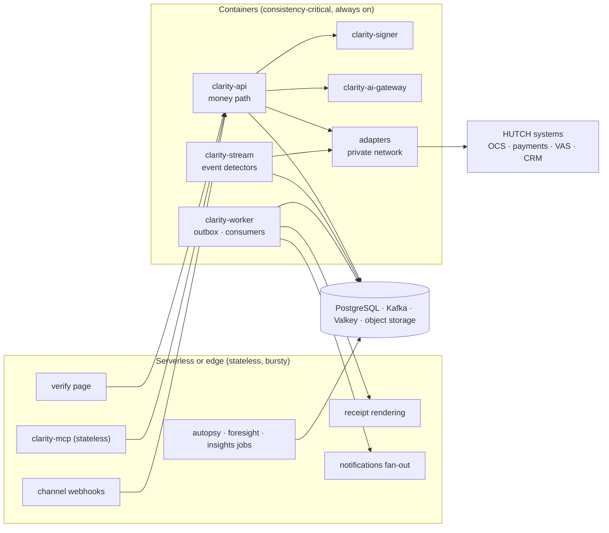
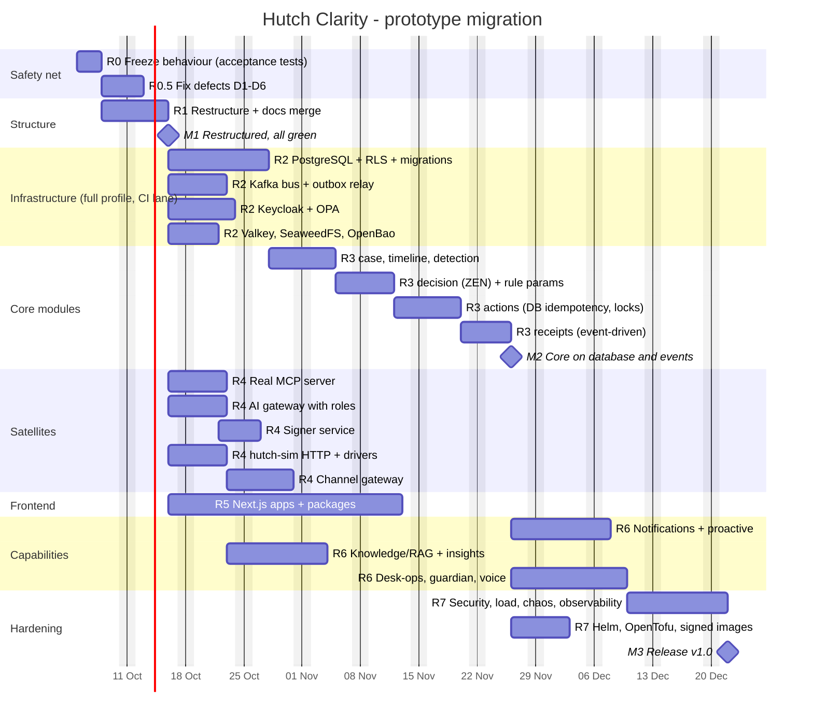
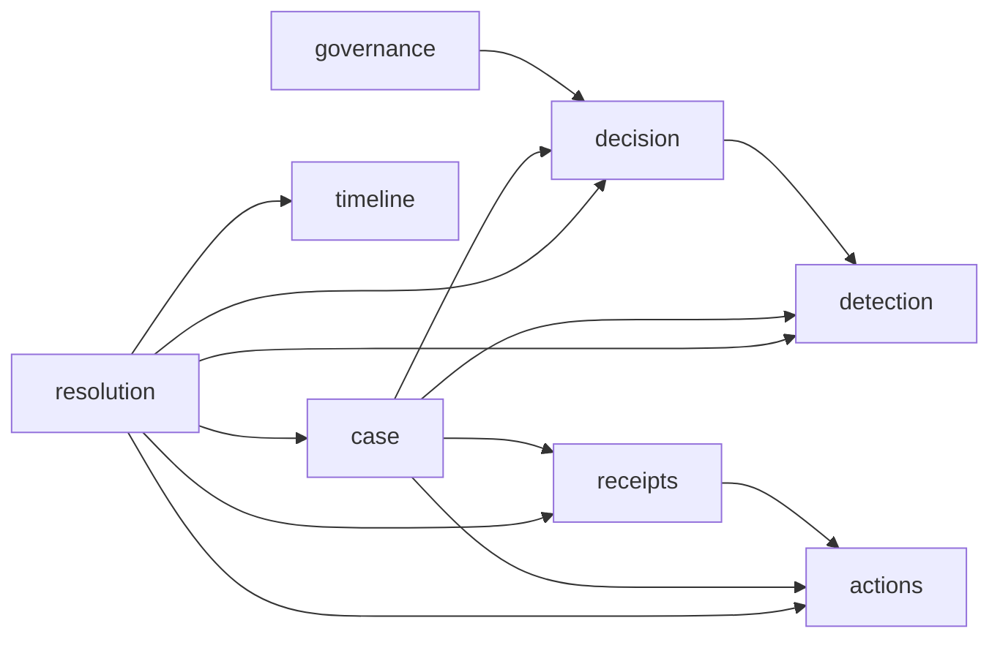

# Hutch Clarity - Migration & Deployment Plan: from working prototype to target architecture

[← 20-policy-change-management.md](20-policy-change-management.md) · [← Plan index](README.md) · [22-agentic-assistant-and-rag.md →](22-agentic-assistant-and-rag.md)

> **Purpose.** The prototype works (438 tests, all journeys end to end) but is shaped as one in-memory process. The target architecture ([18](18-build-blueprint.md), [19](19-tech-stack-and-ai.md), [20](20-policy-change-management.md)) is shaped for HUTCH production. This chapter is the plan to get from one to the other **without losing working behaviour**, and it defines the **runtime model**: which parts run as containers, which may run serverless, and how modules become microservices.
>
> **Rule of the migration:** *rewrite the structure, replace the infrastructure, keep the proven logic.* Decisions: ADR-0025 (migration), ADR-0026 (rules), ADR-0027 (runtime profiles), ADR-0028 (runtime model).

---

## 1. Principles

1. **Behaviour is frozen first.** Before any code moves, the four demo journeys and every `/v1` contract are captured as black-box acceptance tests (R0). Every later step keeps them green.
2. **Strangler, not big bang.** Each module moves behind its `public.py` interface; the old path is deleted only when the new one passes the same tests.
3. **Development is never blocked by infrastructure.** The default `lite` profile needs **only Python** (no Docker, Kubernetes, Terraform, database or broker). Real components run in the `full` profile and the CI integration lane (ADR-0027).
4. **Every replaced component sits behind a port with a parity suite**, so the in-memory driver and the real driver are provably interchangeable.
5. **Fix money-path and identity defects before features.**
6. **Docs move with code.** Every step updates `ARCHITECTURE.md`, the affected `MODULE.md`, a devlog entry, and this plan through [CHANGES.md](CHANGES.md).

---

## 2. Starting point: what is kept, rewritten, replaced, added

### 2.1 Keep (port as-is; the logic is proven)

| Component | Why it stays |
|---|---|
| `Money`, IDs, canonical JSON + hashing | Correct, tested vocabulary |
| Rule engine + YAML rule packs + golden tests | "Rules are data": a rule change is a publish, not a deploy (ADR-0001) |
| Policy resolver, guardrails, `as_of`, switches, replay, governance | Implements [20](20-policy-change-management.md) faithfully |
| Tool layer logic (plans, tokens minted server-side, compensation, budget) | Correct design; storage and locking move to the database |
| Receipt build, chain, sign, verify, recurrence test | Correct design; key custody moves to the signer |
| PII masking, output verifier | Correct, tested |
| MCP tool contracts, profiles, subject binding, narrow view | Correct; transport is added |
| Autopsy, Foresight logic | Correct for prototype scope |
| All 438 tests | Become the migration's safety net |

### 2.2 Rewrite (restructure)

| Today | Target |
|---|---|
| One package `src/clarity` with `core/*` | **Modular monolith** `backend/src/clarity/{kernel, contracts, integration, platform, ai, modules/*, interfaces/*, entrypoints}`; one `public.py` per module ([18 §2](18-build-blueprint.md)) |
| `CaseService` orchestrates everything (476 lines) | Split: `case` (aggregate + state), `timeline`, `detection`, `decision`, `actions`, `receipts`; orchestration in a thin `resolution` application service; **receipts issued once from `action.completed` by an idempotent consumer** |
| Concurrency by in-process locks | Idempotency as a database unique key, plan status changes under row locks, budgets as ledger rows |

### 2.3 Replace (component swap behind a port)

| Today | Replace with | Profile |
|---|---|---|
| In-memory stores | PostgreSQL 18, schema + role per module, RLS, migrations | `full`, `prod` (`lite` keeps in-memory repositories) |
| In-process event relay | Outbox → Kafka + Apicurio; consumers in `clarity-worker` | `full`, `prod` |
| Own token issuer + role picker | Keycloak (staff, admins, MCP clients); customer OTP issuer stays as the `iam` module | `full`, `prod` (`lite` keeps the labelled dev issuers) |
| Permission checks in Python | OPA policies over the same permission catalogue | `full`, `prod` |
| Decision outcome logic in Python | GoRules ZEN decision table | all profiles (ZEN is an in-process library) |
| Static HTML pages | Next.js `customer-web`, `console`, `verify` + shared UI, i18n, widget packages | all profiles |
| In-process MCP class | Real MCP server (SDK, Streamable HTTP, OAuth 2.1 resource server, token exchange, MCP Apps) as `clarity-mcp` | all profiles |
| Template-only gateway | AI gateway service with model roles, cassettes, Langfuse | all profiles (templates stay the default) |
| In-memory signing key | `clarity-signer` with OpenBao/KMS driver | `full`, `prod` (`lite` keeps a generated dev key) |
| In-process mock HUTCH | `hutch-sim` HTTP service + HTTP drivers | `full` (`lite` keeps in-process mocks) |

### 2.4 Add (missing capabilities)

Notifications + channel gateway (WhatsApp, SMS/USSD) · proactive stream detectors (zero-contact) · knowledge/RAG · insights projections · desk-ops (bulk fix, merchant watch, regulator pack, handover) · guardian · voice · OpenTelemetry + Grafana · CI/CD (GitHub Actions, SBOM, signed images) · reference deployment (Helm, OpenTofu, Compose `full`).

---

## 3. Defects to fix first (verified 2026-10-02)

| # | Defect | Evidence | Fix | Status |
|---|---|---|---|---|
| D1 | **Duplicate receipts and stuck plans on double-tap.** 1,486 of 1,500 concurrent double confirms issued two signed receipts for one refund (money moved once); 8 failed with `RuntimeError` and left the plan unexecutable; a second tap after success returned `PlanNotPending`. | `ConfirmationService.mint` wrote outside the lock; `CaseService._execute` re-advanced state and re-issued the receipt after a replayed result | `mint` under the lock; one lock per plan in the case service; confirm, approve and auto-fix return the original result and receipt for an executed plan. R3 makes receipt issuance event-driven. | **Fixed**: 1,500 of 1,500 trials now give one refund, one receipt, no error |
| D2 | **Four-eyes threshold in policy not enforced.** | The tool layer used a constant LKR 25,000 | Each plan carries the threshold from the decision's policy snapshot | **Fixed** |
| D3 | **Staff dev sign-in had no profile guard.** | `/v1/auth/staff/session` lacked the `demo_only` guard the OTP inbox has | Guarded like `/v1/demo/inbox`: allowed in the synthetic profiles (`demo`, `full`), 404 in `prod` | **Fixed** |
| D4 | **Signed receipts named the wrong approver role.** Every staff-approved receipt said `supervisor`, even when finance approved. (Customers triggering a whitelisted AUTO_FIX is by design: policy is the authority; the trigger is now recorded on the token.) | `ReceiptService._actor` hard-coded the role | The result carries the approving roles; the receipt records them (for example `supervisor+finance`) | **Fixed** |
| D5 | **ADR-0001 said rule parameters live in the policy store; they do not.** | Confidence and windows are in the YAML packs | Move parameters to the policy store | ADR amended; implementation in **R3** |
| D6 | **`make check` failed on a clean clone.** | Playwright not declared; mypy could not find it | Optional `render` extra + mypy override | **Fixed** |
| D7 | **Simulated-HUTCH `/mock/*` routes were open in every profile.** No sign-in, no profile guard; anyone could read any customer's synthetic charging, payment and consent records by ID. | Found by the R0 route audit | `demo_only` guard: 404 in `prod`; frozen by the route contract test | **Fixed** |
| D8 | **Customer self-service routes used the wrong permission.** All ten `/v1/me/*` routes (including reload, buy a pack, cancel a subscription) were authorised by `case:read`, and a staff token got a misleading 401. | Found by the R0 route audit (rule I9) | Named permissions `self:read`, `self:settings`, `self:transact`, held only by customers and declared on each route; staff get 403 | **Fixed** |

## 4. Target package layout

```text
hutch-clarity/
├── AGENTS.md  CLAUDE.md  ARCHITECTURE.md  CONTRIBUTING.md  CHANGELOG.md  SECURITY.md  README.md  Makefile
├── backend/
│   ├── pyproject.toml
│   ├── src/clarity/
│   │   ├── kernel/          L0  money + enums, IDs, canonical hashing
│   │   ├── contracts/       L0  canonical models: case, timeline, decision, receipt
│   │   ├── integration/     L1  ports, registry, drivers/{mock, http, hutch}
│   │   ├── platform/        L2  config (policy resolver, switches), audit, messaging (outbox, envelope),
│   │   │                        content (CX templates), security (principal, permissions)
│   │   ├── ai/              L3  gateway, providers, PII masking, verifier
│   │   ├── modules/         L4  case, timeline, detection, decision, actions, receipts,
│   │   │                        governance, iam, autopsy, foresight (+ later: notifications, proactive, knowledge, ...)
│   │   │   └── <module>/        public.py  MODULE.md  ... (domain, application, infrastructure as it grows)
│   │   ├── app/             L5  composition root (profiles, wiring; only reader of CLARITY_PROFILE), MCP view
│   │   ├── interfaces/      L6  http (FastAPI /v1, auth dependencies), mcp
│   │   └── entrypoints/     L7  process entry points (ASGI app; worker and stream from R3)
│   ├── tests/               unit, golden, property, contract (parity), acceptance (black-box /v1), architecture
│   └── scripts/             demo, measure_tokens
├── services/                separately deployed: mcp, signer, ai-gateway, channel-gateway, hutch-sim (R4)
├── frontend/                Next.js apps + packages (R5)
├── rules/  config/          policy artefacts (YAML), shared by every profile
├── deploy/                  compose (full profile), helm, opentofu (R7) - never needed for development
└── docs/                    enterprise-plan, adr, devlog, walkthroughs, templates, modules.md, submission
```

**Layer rules** (import-linter, CI): `kernel → contracts → integration → platform → ai → modules → app → interfaces → entrypoints`, bottom-up only; `interfaces.http` and `interfaces.mcp` are independent of each other. **Module rule** (architecture test): outside a module, only `clarity.modules.<name>.public` may be imported. **Money rule:** `ai` and `interfaces.mcp` cannot import `modules.actions` capabilities.

---

## 5. Runtime model: containers for the core, serverless at the edges (ADR-0028)

Telecom operators usually run core business systems on private infrastructure (Kubernetes or OpenShift) for data residency (PDPA) and for the network path to charging and payment systems. The workload also splits cleanly into a **consistency-critical core** and **stateless, bursty edges**.

| Deployable | Runtime | Why |
|---|---|---|
| `clarity-api` (money path: decide, approve, execute) | **Container** | Strong consistency, pooled DB connections, row locks, hash-chained audit; cold starts and short-lived connections work against all of them |
| `clarity-stream` (proactive detectors on charging/payment events) | **Container** | Always-on, high-volume Kafka consumers; steady load scales by partitions |
| Integration adapters into OCS, payments, VAS/DCB | **Container** | Inside HUTCH's private network, mutual TLS, fixed egress allowlists |
| `clarity-signer` | **Container** | Key custody (HSM/KMS), stable identity, strict audit |
| `clarity-worker` (outbox relay, consumers, receipts on `action.completed`) | **Container** (or event-driven autoscaling) | Long-running consumers; can scale to zero with KEDA |
| `clarity-mcp` | **Container or serverless** | Stateless by the 2026-07-28 MCP spec; scales per agent traffic |
| `verify` page (QR) | **Serverless / edge** | Public, read-only, spiky, cacheable |
| Receipt PDF/PNG rendering | **Serverless** | Stateless, isolated, burst on demand |
| Notifications fan-out | **Serverless** | Event-triggered, bursty |
| Channel webhooks (WhatsApp, USSD callbacks) | **Serverless or container** | Short, stateless; container if HUTCH's USSD gateway needs a fixed IP |
| Autopsy, Foresight, insights batch jobs | **Serverless jobs** | Scheduled, heavy, then idle |
| `clarity-ai-gateway` | **Container** | Egress control point, quotas, provider credentials |

**Serverless benefits without cloud lock-in:** on HUTCH's own Kubernetes/OpenShift, **Knative** (scale-to-zero HTTP) and **KEDA** (event-driven scaling on Kafka lag) give the serverless behaviour above. On AWS or Azure the same edges map to Lambda / Azure Functions. All of this works because every deployable follows the deployment contract (ADR-0016): stateless, configured from the environment, health probes, graceful shutdown.



---

## 6. Microservice migration path

The modular monolith is **microservice-ready by construction**: modules own their schema, talk through `public.py` or events, and have their own routes. Extraction is a deployment change, not a rewrite.

| Stage | What runs | Trigger |
|---|---|---|
| **S1 - modular monolith** (R1-R3) | `clarity-api`, `clarity-worker`, `clarity-stream` from one image; separate services only for trust or key boundaries | Default |
| **S2 - satellites** (R4) | `clarity-mcp`, `clarity-signer`, `clarity-ai-gateway`, `clarity-channel-gateway`, `hutch-sim` | Different trust zone, keys, egress or scaling |
| **S3 - extract hot modules** (production, as needed) | Likely first: `receipts`, `proactive`, `notifications`, then `knowledge` | A module needs independent scaling, a separate owning team, a separate security zone, or a conflicting release cadence |

**How a module is extracted** (no caller changes):
1. Its `public.py` protocol is bound to an HTTP client generated from the module's OpenAPI instead of the in-process implementation.
2. Its schema moves to its own database (it already has its own schema and role, so this is a data move, not a redesign).
3. Its events already flow through the outbox and Kafka, so consumers are unchanged.
4. Its parity and acceptance tests run against the extracted service before traffic moves.

**Scaling characteristics:** interactive traffic scales by adding stateless `clarity-api` replicas (possible once state is in PostgreSQL, R2-R3). Event ingestion scales with the subscriber base: Kafka topics keyed by `subscriber_ref`, more partitions and consumers.

---

## 7. Migration steps

| Step | Work | Done when |
|---|---|---|
| **R0 Freeze behaviour** | Black-box acceptance tests over `/v1` for the four journeys, auth, receipts, MCP tools; concurrency tests for double confirm | **Done 2026-10-02:** `backend/tests/acceptance` (route contract for all 66 routes, 6 journeys, OpenAPI snapshot of 54 operations) |
| **R0.5 Fix defects D1-D6** | §3 | Each defect has a failing test first, then passes (done for D1-D4, D6) |
| **R1 Restructure** | Target layout (§4); `backend/`; layers + module rule enforced; composition root in `app`, process entry in `entrypoints`; `public.py` per module; `MODULE.md` per module; docs merged (AGENTS.md, ADRs, plan) | **Done 2026-10-02:** 447 tests green; `make check` green; no behaviour change except the deliberate D1 contract |
| **R2 Real infrastructure drivers** (`full` profile; platform baseline R2a in §11.6) - *started by the team: simulated estate and receipts in SQL* | PostgreSQL repositories + migrations + RLS; Kafka bus; Keycloak; OPA; Valkey; SeaweedFS; OpenBao; Compose `full` stack; nightly CI lane | Each driver passes its port's parity suite |
| **R3 Core modules move to the database and events** | case → timeline → detection → decision (ZEN table) → actions (DB idempotency, row locks) → receipts (event-driven); rule parameters into policy | Acceptance suite green in `lite` and `full`; two API replicas pass the concurrency tests |
| **R4 Satellites** - *in progress: H01 complete* | Real MCP server; signer; AI gateway with roles; channel gateway; `hutch-sim` HTTP | `hutch-sim` read and command parity suites are green over HTTP; external MCP and the other satellites remain |
| **R5 Frontend** - *started early by the team: Next.js 14 apps; build to verify* | Next.js `customer-web`, `console` (desk, insights, studio, admin), `verify`; shared UI, i18n, widget | Browser journeys pass; accessibility checks pass |
| **R6 New capabilities** - *in progress: N01 and P01 complete* | Notifications, proactive detectors, knowledge/RAG, insights, desk-ops, guardian, voice | Notification safety tests and the proactive zero-contact duplicate-reload acceptance test are green; remaining capabilities and walkthroughs remain |
| **R7 Hardening** | Security tests, load, chaos, OTel + Grafana, Helm/OpenTofu reference, signed images, SBOM | Release v1.0 tagged |

## 8. Schedule

**Assumed start: Monday 2026-10-05 (ASSUMPTION).** Durations in working days for a team of 4-6. R5 starts right after R1 because the UI only uses the `/v1` API.



## 9. Profiles during and after the migration (ADR-0027)

| Profile | Needs | Drivers | Used for |
|---|---|---|---|
| `lite` (default) | **Python only** | In-memory repositories, in-process bus, dev issuers, local key, in-process `hutch-sim`, templates | Daily development, unit/contract/acceptance tests, the hackathon demo |
| `full` | Docker Compose | PostgreSQL, Kafka, Keycloak, OPA, Valkey, SeaweedFS, OpenBao, `hutch-sim` service, Grafana | Integration checks, CI integration lane |
| `prod` | HUTCH platform | Managed or HUTCH-run equivalents | Production |

Docker, Kubernetes and Terraform are **never** required to build, run or test the product.

## 10. Documentation sync

| When | Update |
|---|---|
| Every step | `ARCHITECTURE.md` (module map + status), affected `MODULE.md`, a devlog file, `CHANGELOG.md` |
| A decision | ADR first, then this plan via [CHANGES.md](CHANGES.md) |
| A flow changes | The walkthrough, re-verified |

---

## 11. Module interaction model (ADR-0029)

### 11.1 The rule
- **Call** a module's `public.py` when you need the answer to continue: read, evaluate, decide, propose, execute a confirmed plan.
- **Publish an event** through the outbox for anything that *reacts* to a fact: receipts, notifications, audit, insights, reconciliation, Autopsy.
- **Never** send an event as a remote command, never share tables, never pass raw PII in an event.

### 11.2 Synchronous dependency map (declared and test-enforced)

Source of truth: `backend/tests/architecture/test_module_dependencies.py`. A new edge needs that file and this table changed in the same PR.

| Module | May call (public surface) | Why |
|---|---|---|
| `resolution` | `case`, `timeline`, `detection`, `decision`, `actions`, `receipts` | Orchestrates one case and consumes `action.completed` to ask receipts for proof. |
| `case` | `actions`, `decision`, `detection`, `receipts` | Holds shared result vocabulary in the aggregate; it performs no synchronous domain calls. |
| `decision` | `detection` | Decides on the ranked causes |
| `governance` | `decision` | Replays decisions under candidate policy |
| `receipts` | `actions` | Reads result types (vocabulary only) |
| `timeline`, `detection`, `actions`, `iam`, `conversation`, `autopsy`, `foresight`, `reconciliation` | none | Leaf modules; reconciliation consumes events and queries the lower-layer adapter confirmation port |



### 11.3 Event catalogue

Producers own the schema (`clarity.contracts.events`, versioned `type@vN`). Key = `subscriber_ref` unless stated. **Schemas:** [`backend/src/clarity/contracts/events.py`](../../backend/src/clarity/contracts/events.py), one `…V1` model per row marked *exists*; `backend/tests/contract/test_event_contracts.py` fails if this table and the code disagree (issue #10). Status: **exists** = defined in `platform/messaging/envelope.py` today; **planned** = to add.

| Event | Producer | Consumers | Status |
|---|---|---|---|
| `case.created` | case | insights, autopsy | exists |
| `cause.detected` | detection | insights, autopsy | exists |
| `decision.generated` | decision | insights, desk queue projection | exists |
| `action.requested` | actions | audit | exists |
| `action.completed` | actions | **case** (issues the proof through `receipts`, §11.5), reconciliation, insights, audit | exists |
| `action.failed` | actions | case (hand off), notifications, audit | exists |
| `approval.requested` | actions | notifications (supervisor push), desk queue projection | exists |
| `receipt.issued` | receipts | notifications (send link), insights, audit | exists |
| `risk.detected` | proactive | case (open zero-contact case), notifications | exists |
| `notification.sent` / `.failed` | notifications | insights, audit | planned |
| `policy.published` / `rule.published` | governance | detection, decision (reload artefacts), audit | exists |
| `knowledge.published` | knowledge | knowledge (answer cache invalidation, re-index), audit | exists |
| `switch.changed` | platform config | decision, ai gateway, audit | planned |
| `mcp.invoked` | interfaces.mcp | audit, security alerts | exists |
| `reconciliation.mismatch` | reconciliation | finance queue, alerts | exists |
| `complaint.created` | channels / case | autopsy | exists |
| `conversation.turn.completed` | conversation | insights, audit | exists |
| `payment.recorded`, `charge.applied`, `usage.threshold_reached`, `pack.expiring`, `vas.renewed` | integration (HUTCH feeds) | proactive, timeline cache | exists |

### 11.4 Delivery rules
| Concern | Rule |
|---|---|
| Producing | Outbox row in the same transaction as the state change; a relay publishes it. No dual writes. |
| Consuming | At-least-once; idempotent by event ID (`processed_event`); handlers must be safe to repeat |
| Ordering | Per `subscriber_ref` (partition key); no ordering promise across subscribers |
| Failure | Retry with backoff, then dead-letter queue + alert; money-affecting consumers never guess, they ask the owning module |
| Versioning | Additive changes within `@vN`; breaking change = new version published alongside until consumers move |
| Profiles | `lite`: in-process bus dispatching after commit; `full`/`prod`: Kafka; one parity suite for both |
| Tests | Producer contract test per event type; consumer tests feed recorded events through the in-process bus |

### 11.5 First event-driven flow: receipts on `action.completed` (built, issue #14)
1. `actions` writes `action.completed` (plan, actions, approver roles, policy snapshot hash) to the outbox in the same unit of work as the plan status change.
2. The event is consumed and **one** receipt is issued per plan; a repeated event finds the receipt already issued and does nothing.
3. `case` no longer issues the receipt inside the money path. It reads the receipt for the response, and returns the original on a replay.
4. The per-plan lock added for D1 is removed; the R0 acceptance suite and the D1 regression tests stay green.

**Where the consumer lives, and why it is not inside `receipts`.** The original wording put the consumer in `receipts`. That cannot be built as written. `ActionCompletedV1` carries identifiers and amounts only, as §11.1 and ADR-0029 §4 require, so a consumer in `receipts` would have to ask `case` for the evidence snapshot, the decision and the cause. That adds `receipts → case` while `case → receipts` already exists, which is a cycle, and §11.2 is required to be acyclic. The alternative, fattening the event with the snapshot, is what §11.1 forbids.

So the consumer is `case.on_action_completed`, registered by the composition root. The flow is event-driven as intended: the receipt is the consequence of a published fact, not a second call inside the money path, and if the issuing process dies the relay issues the receipt on restart. Orchestration stays in `case`, which is where §11.2 says it belongs, and no new call edge is needed. The `case → receipts` edge is therefore **kept**, not removed.

**Done:** 1,500 concurrent double confirms give one refund and one receipt (`backend/tests/unit/test_migration_defects.py`), a twice-delivered `action.completed` issues one receipt (`backend/tests/unit/test_receipts_consumer.py`), and the R0 acceptance suite passes unchanged. Verified in `lite`; `full` needs the Kafka relay process, which is B10 and X03.

Idempotency now rests on three mechanisms instead of one lock, each independently sufficient on the receipt:
- the tool layer's idempotency key, so one plan executes once;
- the receipt's plan index, so one plan has one receipt;
- `processed_event`, so a redelivered event is not reprocessed.

A caller that loses the race to confirm no longer queues behind a lock: it finds the plan is no longer pending and joins the winner's outcome. Removing the wait in that join entirely needs database row locks, which is M-ACT.

### 11.6 Work packages before §11.5 (R2a, platform baseline)
| # | Work | Done when |
|---|---|---|
| R2a.1 | `clarity.contracts.events`: typed payloads per event, versioned | Producer contract tests exist for every "exists" row in §11.3 |
| R2a.2 | Unit of work + repository interfaces per module (in-memory driver for `lite`) | Case, plan and receipt state go through repositories |
| R2a.3 | Event bus port: in-process driver + Kafka driver, one parity suite | Same tests pass on both drivers |
| R2a.4 | Outbox wired into the unit of work; relay; consumer framework with `processed_event` and dead-letter handling | Chaos test: kill the relay mid-flight, no lost or duplicated side effect |
| R2a.5 | PostgreSQL repositories, schema and role per module, row-level security | Parity suites pass on PostgreSQL in the CI `full` lane |

---

[← 20-policy-change-management.md](20-policy-change-management.md) · [← Plan index](README.md) · [22-agentic-assistant-and-rag.md →](22-agentic-assistant-and-rag.md)
