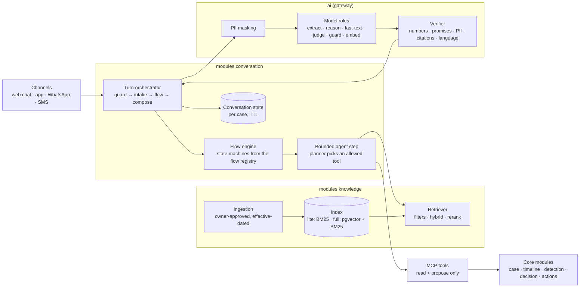
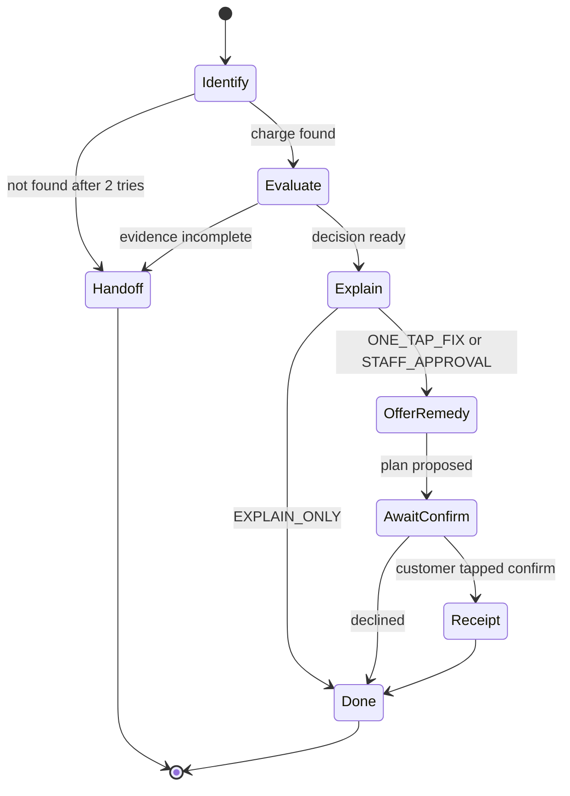

# Hutch Clarity - Agentic Assistant, Flows & RAG

[← 21-migration-and-deployment-plan.md](21-migration-and-deployment-plan.md) · [← Plan index](README.md)

> **Purpose.** How the Clarity chatbot thinks, acts and answers: the conversation flows, the bounded agent loop, retrieval-augmented answers (RAG) with citations, guardrails and evaluation. It builds on the baseline in [21 §11](21-migration-and-deployment-plan.md) (calls and events) and the AI roles in [19 §4](19-tech-stack-and-ai.md). Decision: ADR-0030.
>
> **Rule that never bends:** the assistant may read and *propose*; only deterministic rules and the tool layer decide or move money (I1). The assistant works with no model at all (templates and keyword rules), and gets better when a model is configured.

---

## 1. Where we start (as built, 2026-10-02)

| Piece | Today | Gap |
|---|---|---|
| Intake | `modules/conversation`: 19 intents by keyword rules; routes `account`, `knowledge`, `both`, `handoff`; si/ta/en detection | No model assist when rules are unsure; no conversation state between turns |
| Flows | Intent → route → one response | No multi-step flows with states, slots and exits |
| Knowledge | Keyword scoring over articles in the mock store | No ingestion governance, chunking, embeddings, filters, citations or verifier |
| AI gateway | Explanations only: template → cache → model tiers, masking, verifier | No model roles, no planner or answer composition for chat, no cassettes |
| Tools | MCP server with 8 tools (read + `propose_action` + `request_handoff`), in-process | No knowledge tool; no network transport; not used by the chat |
| Evaluation | Unit tests | No per-language golden sets or quality gates |

## 2. Principles

1. **Bounded agency.** Conversations run as explicit flows (state machines). Inside a state, a model may choose among the tools that state allows and fill their arguments; it never invents a step, a tool or an amount.
2. **Deterministic first, model second.** Every step has a deterministic path (rules, templates, keyword intake). A model is used when it adds value (unclear intake, free-form questions, wording) and is always optional.
3. **Facts in, words out.** Models receive a FACTS block (from rules, decisions, tools) and retrieved CONTEXT, both labelled as data; they write words. A verifier checks every number, date, ID, promise and citation before anything reaches a customer.
4. **Tools, not data access.** The assistant reaches Clarity only through MCP tools bound to the session principal (ADR-0004, ADR-0018). No tool executes money movement.
5. **Grounded or silent.** Policy answers must cite approved, effective sources; with no source, the assistant says it does not know and offers a person.
6. **Everything replayable.** Each turn records the flow state, tool calls (args hash, result hash), retrieved chunk IDs, model role and version, and verifier outcome.

## 3. Architecture

## 4. Turn lifecycle

| # | Step | Deterministic path | Model path (optional) |
|---|---|---|---|
| 1 | **Guard input** | Refuse OTPs, card numbers, CVVs (never stored); length and rate limits | `guard` role scores prompt injection (assist only) |
| 2 | **Mask** | Sri Lankan PII recognizers replace numbers, NICs, names with tokens | - |
| 3 | **Intake** | Keyword rules: language, intent, slots (amount, date, product) | `extract` role when rule confidence < threshold; JSON schema validated; still a *hint* (I2) |
| 4 | **Handoff check** | Every turn: customer asked for a person, fraud words, repeated failure, low confidence | - |
| 5 | **Flow step** | Flow engine moves to the next state from intake + slots | Bounded agent step chooses an allowed tool in that state (§6) |
| 6 | **Tools** | MCP tools bound to the session subject (timeline, causes, safeguards, receipts, knowledge search, propose, handoff) | - |
| 7 | **Retrieve** (knowledge states) | Filtered retrieval by effective date, audience, language, product | Query rewrite by `extract` for Singlish and code-mixed text |
| 8 | **Compose** | Approved template from FACTS | `fast-text` writes from FACTS + CONTEXT; `reason` only for complex staff summaries |
| 9 | **Verify** | Numbers, dates, IDs ⊆ FACTS; no unauthorised promise; no PII; language; citations present | `judge` on a sample (offline) |
| 10 | **Respond** | Text + cards (cause, evidence, confirm card from a proposal, citations) | - |
| 11 | **Record** | Turn audit (flow state, tool and chunk IDs, role and model, verifier result), `conversation.turn.completed` event | - |

A confirm card never carries authority. The customer's tap goes to `/v1/cases/{id}/confirm`, which mints and spends the confirmation token server-side (ADR-0007).

## 5. Flow catalogue

Flows are **policy content** (plan 20, kind K6/K4): versioned YAML in the flow registry, published under the change lifecycle, replayable.

| Flow | Entry intents | States (happy path) | Tools allowed | Exits |
|---|---|---|---|---|
| `DISPUTE_CHARGE` | UNEXPECTED_CHARGE, BALANCE_DEDUCTION_QUERY, DOUBLE_CHARGE, RELOAD_MISSING, VAS_SUBSCRIPTIONS | identify charge → open/attach case → evaluate → explain → offer remedy → await confirm → show receipt | `get_case_timeline`, `get_cause_assessment`, `explain_rule`, `propose_action`, `get_trust_receipt`, `request_handoff` | receipt shown · explain-only · handoff |
| `KNOWLEDGE_QA` | FUP_QUERY, PACK_EXPIRY, ESIM_HELP, PACK_RECOMMEND, FALLBACK with knowledge route | rewrite query → retrieve → answer with citations → offer next step | `search_knowledge`, `get_pack_details` | answered · no source → offer person |
| `ACCOUNT_AND_POLICY` (route `both`) | "why did my data stop" style | account facts + policy context → combined answer | dispute tools + `search_knowledge` | as above |
| `SAFEGUARD_SETUP` | PREVENT_CHARGES | choose safeguard → propose (L2) → confirm → safeguard receipt | `get_customer_safeguards`, `propose_action` | safeguard on · cancelled |
| `CASE_STATUS` | CASE_STATUS, REFUND_STATUS | find case → status → receipt link | `get_case_timeline`, `get_trust_receipt` | answered |
| `NETWORK_STATUS` | NETWORK_STATUS, DATA_SLOW | outage lookup → honest ETA → offer ticket | `get_network_status` (new), `request_handoff` | answered · ticket |
| `HANDOFF` | HANDOFF, any guard trip | summarise (masked) → route to Desk with reason code | `request_handoff` | handed off |

## 6. Bounded agent step

| Aspect | Design |
|---|---|
| When | Only in flow states marked `agentic: true` (for example `Identify` when the customer is vague, `KNOWLEDGE_QA.retrieve` for multi-part questions) |
| Planner | `reason` role (or `fast-text` for simple states) returns JSON `{tool, args, reason_code}` against a schema generated from the state's tool allowlist |
| Limits | Max 4 tool calls per turn; max token budget per turn and per session; wall-clock timeout |
| Validation | Unknown tool, disallowed tool, invalid args or an `amount` field → rejected; the flow falls back to its deterministic step |
| Tool results | Treated as untrusted data in the next prompt (delimited); never as instructions |
| Stop | Flow exit reached, limits hit, verifier failure twice, or handoff condition |
| Without a model | The deterministic step runs; the conversation still completes |

## 7. Retrieval-augmented answers (RAG)

| Stage | Design |
|---|---|
| **Sources** | Product catalogue (versioned), T&C clauses, VAS rules, Gazette 2316/14 text, help articles, CX-approved answers. Staff SOPs are staff-audience only. |
| **Governance** | Each source has an owner and goes through the policy lifecycle (plan 20, kind K2): draft → review → publish with `effective_from/to`; old versions stay retrievable for "what applied then" |
| **Ingestion** | Parse → clean → language tag → structure-aware chunking (catalogue: one chunk per offering per version; legal text: per clause, 300–500 tokens, 10–15% overlap) |
| **Metadata** | `source_id, version, clause_ref, effective_from, effective_to, language, product_ids, audience, owner` |
| **Index** | `lite`: in-memory BM25 (Python only). `full`/`prod`: pgvector (embeddings from the `embed` role, BGE-M3 class) + BM25 hybrid |
| **Retrieve** | Filter by effective date (the event time for disputes), audience (customer or staff), language, products in the case; hybrid score; rerank; top-k 4–6 (ASSUMPTION) |
| **Answer** | `fast-text` from CONTEXT + FACTS; every policy sentence cites `source_id@version#clause` |
| **Verify** | Citation verifier: each cited ID was retrieved, is effective and is audience-allowed; uncited policy claim → template or "I don't know + person" |
| **Cache** | Exact and meaning cache for generic, CX-approved answers only, keyed by catalogue version and language; never case-specific |
| **Freshness** | `knowledge.published` event invalidates cache entries and re-indexes affected chunks |

## 8. Guardrails

| Risk | Control |
|---|---|
| Model moves money or invents amounts | No execute tools; amounts only from decisions; verifier blocks unmatched numbers |
| Prompt injection (customer text, retrieved text) | Delimited untrusted blocks; per-state tool allowlist; subject binding; `guard` assist; denial-spike alerts |
| Hallucinated policy | Cite-or-refuse; citation verifier; effective-date filters |
| PII leakage | Mask before any model call; restore only inside Clarity; output PII scan; masked logs |
| Wrong language or tone | Language check in verifier; native-speaker reviewed templates per language |
| Over-automation | Handoff check every turn; customer can always ask for a person |
| Cost runaway | Per-turn and per-session token caps; role routing; cache; quota-aware gateway |

## 9. Conversation state and memory

- Short-term state per conversation: flow, state, slots, case ID, language, last proposal ID; stored by the conversation module (in memory in `lite`, PostgreSQL in `full`), TTL 24 h (ASSUMPTION).
- No long-term memory of conversation content. Durable preferences (language, answer length) live in the customer's profile.
- Cross-channel continuity: a conversation is attached to a case, so WhatsApp → app → shop resumes the same case.

## 10. Evaluation

| Dataset | Content | Metric | Launch gate (PROPOSED TARGET - REQUIRES HUTCH VALIDATION) |
|---|---|---|---|
| Intake set | ≥ 300 utterances per language (si, ta, en, Singlish) | Intent F1, slot accuracy | F1 ≥ 0.90 per language |
| Flow set | Scripted multi-turn conversations per flow | Task success, turns to resolution, correct handoffs | Success ≥ 90%; must-handoff recall ≥ 98% |
| RAG set | Questions with gold source clauses | Recall@k, citation accuracy, faithfulness | Recall@5 ≥ 0.9; citation accuracy ≥ 0.98 |
| Safety set | Injection, PII, out-of-scope prompts | Blocked rate, zero executed actions | 100% of executes refused |
| Language review | Native-speaker rubric on samples | Fluency and correctness 1–5 | ≥ 4.0 per language |

Runs on recorded responses in CI (no live calls); a nightly job runs live models when configured; a release is blocked on regression.

## 11. Profiles

| Profile | Intake | Planner and compose | Retrieval | State |
|---|---|---|---|---|
| `lite` | Keyword rules | Templates (no model) | In-memory BM25 | In memory |
| `lite` + model opt-in | Rules + `extract` | Roles on free tiers, synthetic data only | BM25 | In memory |
| `full` | Rules + `extract` | Roles | pgvector + BM25 | PostgreSQL |
| `prod` | As `full` with HUTCH models | As `full` | As `full` | PostgreSQL |

## 12. Delivery

Work items are in the backlog ([docs/backlog](../backlog/README.md)), epics **AI foundation**, **Knowledge & RAG** and **Agentic assistant**, built after the platform baseline (21 §11.6) and the AI gateway roles.

---

[← 21-migration-and-deployment-plan.md](21-migration-and-deployment-plan.md) · [← Plan index](README.md)
