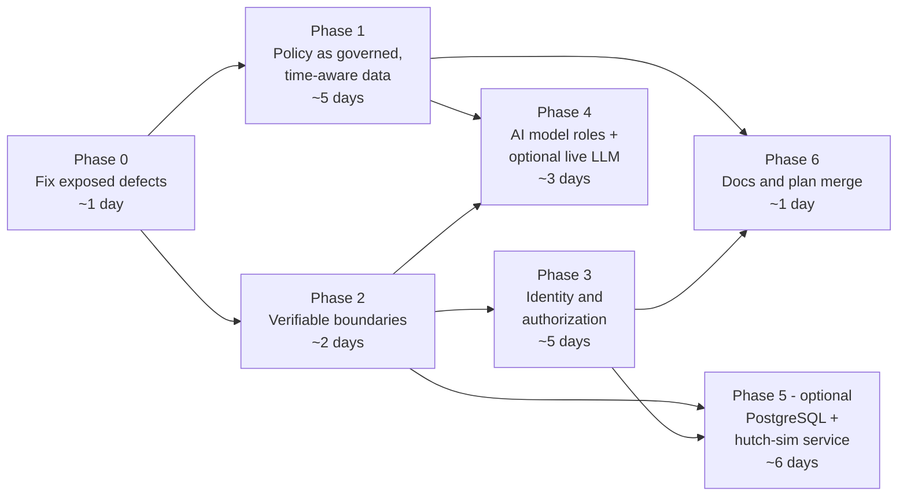

# Improvement plan: adopting the strongest ideas from the alternative design

> **Superseded (2026-10-02)** by the merged plan v1.3: [chapter 21](enterprise-plan/21-migration-and-deployment-plan.md) (migration and runtime model) and ADR-0025. Kept as the record of Phases 0-3. Its "alternative design" is the v1.2 plan line, now chapters 18-20 and ADR-0011…0024. Paths below refer to the pre-R1 layout (`src/clarity/core/...`, now `backend/src/clarity/modules/...`).

| | |
|---|---|
| Compared | Our system (this repo: plan v1.1 + working prototype) vs the alternative design in `HutchClarity-compair/` |
| Date | 2026-10-01 |
| Status | **Phases 0-3 implemented** (2026-10-02). Phase 4 (AI model roles) next; see §10 for what landed. |
| Rule applied | An idea is adopted only if it is **better than what we have** and **fits the working system**. Rewriting tested code to match an unbuilt design is not an improvement. |

---

## 1. Summary

**The two systems are different kinds of thing.** Ours is a working prototype: 309 tests, the customer, Desk and verify pages, signed receipts, the MCP server. The alternative is a design with no code yet. Its own README says: *"Code not started; next is work package A1."*

**Where the alternative is genuinely better, the gap is real.** It has a much stronger design for:

1. policy that changes over time;
2. proving that mock and real integrations behave the same;
3. identity and authorization;
4. model roles in the AI gateway;
5. engineering process.

**Two of its checks exposed real defects in our code.** We found both by testing its claims against our system:

| # | Finding | Severity |
|---|---|---|
| F1 | **Concurrent duplicate requests get errors instead of the original result.** In 2,000 concurrent identical execute calls, 1,051 failed with `ConfirmationInvalid` or `PlanNotPending`. Money stayed safe (exactly one refund every time), but a customer who double-taps Confirm would see an error after a successful fix. Single-use token redemption also depends on the GIL rather than a lock. | High |
| F2 | **The MCP server can reach execute methods.** It holds the full `CaseService`, including `confirm_and_execute`, `auto_fix` and a `tools` property that returns the whole `ToolLayer`. "The model cannot execute" is true today only by convention, and our test checks tool *names*, not code. | High |

**The alternative is missing work we have done.** It was forked from our plan **v1.0**, before our v1.1 audit, so it lacks all 19 sections that audit added (§6). Both versions call themselves "v1.1".

**Recommendation.** Adopt 14 ideas, adapt 6, and skip 8 (§4). Do the two defect fixes first. The full plan is §7.

---

## 2. What each side has

| Area | Our system | Alternative design |
|---|---|---|
| **Code** | Working. 58 source files, 309 tests, `mypy --strict` clean | None |
| **Plan base** | v1.0 + our v1.1 audit (24 gaps closed) | v1.0 + its own v1.1/v1.2 changes |
| **Rules** | YAML detector DSL, 6 rules, 21 golden tests | Python detector plugins + GoRules ZEN tables (designed) |
| **Policy thresholds** | One global `PolicyThresholds` Python class | Scoped, effective-dated, guard-railed config, evaluated `as_of` event time |
| **Identity** | **None at review time - every endpoint was open.** Implemented in Phase 3: EdDSA tokens, 10 roles, deny-by-default routes, subject binding, step-up for money | Keycloak (staff) + Clarity customer issuer, OPA, RLS |
| **AI gateway** | Tiers; template provider; OpenAI-compatible provider | Logical model roles mapped in config; Gemini + Groq free tiers |
| **MCP** | 8 tools across 3 profiles, subject binding, audit | Same tools, plus stateless OAuth 2.1 resource server, no DB access, no execute code |
| **Integration** | Mock drivers in process | `hutch-sim` as a separate service + **parity suites** per port |
| **Stack** | FastAPI, in-memory, static HTML | ~20 production components (Kafka, Valkey, Keycloak, OPA, OpenBao, Next.js…) |
| **Process docs** | `agent.md` (guide + change log) | AGENTS.md, 14 ADRs, ARCHITECTURE.md, MODULE.md, devlogs, walkthroughs, PR template |

---

## 3. Verified findings

Both findings come from applying the alternative's own checks to our code. They are measured, not inferred.

### F1 - Idempotency fails under concurrency

The alternative's baseline gate (17 §12) requires: *"50 concurrent identical POSTs → exactly one execution."* We ran 40 trials of 50 concurrent identical `execute` calls on a duplicate-reload auto-fix, with forced thread switching (`sys.setswitchinterval(1e-7)`) to expose races the GIL normally hides:

| Outcome | Count | Correct? |
|---|---|---|
| Fresh executions | 40 (1 per trial) | ✅ |
| Replayed (returned the original result) | 904 | ✅ |
| `ConfirmationInvalid` | **1,030** | ❌ should replay |
| `PlanNotPending` | **21** | ❌ should replay |
| Refund credits per trial (max) | **1** | ✅ money safe |

**Why.** `ToolLayer.execute` records the idempotency key only *after* redeeming the token and reserving the budget. A duplicate that arrives during that window misses the key, then fails because the token is already spent. `ConfirmationService.redeem` is a check-then-add with no lock, so single-use relies on the GIL. That is not a design guarantee, and it would break on free-threaded Python 3.13t/3.14t.

**Fix.** See Phase 0, items 0.1 and 0.2.

### F2 - The MCP server can reach execute paths

`ClarityMCPServer.__init__(self, cases: CaseService)` receives an object that exposes:

- `confirm_and_execute`, `approve_and_execute`, `auto_fix`;
- a `tools` property, which returns the `ToolLayer` and so `authorise_auto_fix`, a method that mints a **system** token.

I added that `tools` accessor during P6, so this weakening is partly mine. `test_no_tool_can_execute_anything` checks only that no tool *name* contains "execute", "confirm" or "approve". A future edit inside `server.py` could execute money movement and every test would still pass.

The alternative's ADR-0008 is stronger: the MCP server has *no* execute code and reaches the core only through a narrow client.

**Fix.** See Phase 0, items 0.3 and 0.4.

---

## 4. Verdict per idea

**A = adopt** (better and fits) · **D = adapt** (good idea, different shape for our system) · **S = skip** (not better for us, or not proportionate now) · **H = have** (we already do this).

### 4.1 Adopt

| # | Idea | Source | Why it is better than ours | Size |
|---|---|---|---|---|
| A1 | Concurrency-safe idempotency gate (50 concurrent → 1 execution) | 17 §12 | Exposed defect F1 | S |
| A2 | MCP holds no execute capability; enforced by a code-level test | ADR-0008 | Exposed defect F2 | S |
| A3 | **Scoped, effective-dated policy parameters with guardrails** | 19 §5–6, ADR-0011 | Ours are one global class. Theirs supports per-rule, per-channel and per-campaign values under a hard ceiling. | M |
| A4 | **Evaluate policy `as_of` the event time; store the config snapshot hash** on every decision | 19 §5, 17 §8 | Today a replay uses *current* thresholds, so "what applied when it happened" cannot be answered | S |
| A5 | **Rule-scoped auto-fix cap instead of a raised global cap** | 19 §6.2 | Fixes a decision I made. I raised the global cap 1,000 → 5,000 so the deck's LKR 3,500 double reload auto-fixes. That also loosened the cap for every other whitelisted rule. Theirs keeps global = 1,000, `DUPLICATE_RELOAD` = 3,500, guardrail = 5,000. | S |
| A6 | Kill switches: `auto_fix_global`, `auto_fix.<rule>`, `customer_actions`, `llm_explanations` | 19 §4.2 | Our FR-GOV-04 requires them; we never built them | S |
| A7 | **Replay impact report**: outcome + money delta before a policy change | 19 §4.1, FR-GOV-06 | Deck S9 "policy what-if". We already have the determinism (snapshot + input hashes) but no tool. | M |
| A8 | **Driver parity suites**: one contract suite per port that every driver must pass | ADR-0014 | The suite a HUTCH sandbox driver would have to pass. Proves mock ≡ real by construction. | S |
| A9 | **Model roles** (`fast-text`, `extract`, `reason`, `judge`, `embed`…) mapped in `config/ai/models.yaml` with fallback chains | ADR-0009 | Our gateway picks by tier. Roles decouple call sites from providers, and HUTCH swaps models by editing config. | S |
| A10 | Record/replay cassettes for model calls in tests | 18 §4.3 | Deterministic, free CI once a real model is configured | S |
| A11 | **Free-tier data rule**: synthetic + masked data only; Gemini unpaid prompts may be used for product improvement; Groq ZDR | 18 §4.4, TH16 | Correct governance point we never wrote down | S (docs) |
| A12 | Separation-of-duties permission matrix (admins cannot approve money; maker ≠ checker) | 17 §5.4, FR-ADM-02 | We have maker ≠ checker but no role model | with D1 |
| A13 | ADRs for decisions already taken + an as-built `ARCHITECTURE.md` | ADR-0013 | Our decisions live only in `agent.md` change-log prose | S |
| A14 | Threats TH14–TH17, risks R24–R26, FR-GOV-04…06, FR-ADM-01…02, FR-MCP-02 | 03, 11, 14 | Real gaps in our threat model and requirements | S (docs) |

### 4.2 Adapt

| # | Idea | Source | What we take, and what we don't | Size |
|---|---|---|---|---|
| D1 | **Identity**: Keycloak for staff + Clarity customer issuer + OPA | ADR-0007 | Our biggest gap, since every endpoint is open. **Take** the design: customer OTP → short-lived JWT (`sub = subscriber_ref`, `acr`); staff dev issuer with seeded roles; deny-by-default permission checks; subject binding on customer routes; step-up for approvals. **Defer** Keycloak and OPA themselves to a later driver behind the same interface. Their own `lite` profile does exactly this. | L |
| D2 | **Python detectors + ZEN decision tables** | ADR-0005 | **Keep** our YAML detector DSL. Their objection is build cost, which we have already paid: 6 rules and 21 golden tests. "Rules are data" is also a stated principle (§13.1). **Take** their separation of *parameters from logic*: confidence weights, lookback windows and penalties move into the scoped config (A3), overridable without editing rule files. **Skip ZEN for now**: our outcome policy is ordered precedence, which reads more clearly as code than as a table. Note as a future option if business users need a visual editor. | M |
| D3 | **PostgreSQL, never SQLite** for persistence | ADR-0014 | Their reasoning is right: RLS, pgvector and schemas differ. It overturns our P5.1 note ("SQLite for demo"). **But** keep in-memory as the zero-setup demo driver, so judges still need only Python. Add a PostgreSQL driver behind repository interfaces, both passing one parity suite (A8). | L |
| D4 | **Runtime profiles** (`lite` / `full` / `prod`) | ADR-0014 | We have one implicit profile. Formalise `CLARITY_PROFILE` in `api/container.py`, which is already our only composition root, with `demo` (all in-memory) as the default. | S |
| D5 | **Layer rules enforced by `import-linter`** | 17 §2.2 | **Take** the contracts that protect money: `mcp` and `ai` cannot import `core.tools`; `core` cannot import `api`. **Skip** the 20-module restructure with `public.py` facades and schema-per-module. That is a rewrite with no functional gain at our size. | S |
| D6 | **i18n message catalogues** (next-intl/ICU) | 18 §2.2 | **Skip** the Next.js migration. **Take** the idea: move UI and API-composed customer strings into per-language JSON catalogues, finish P7.4 (headline and action list are still English), and gate them on native-speaker review. | S |

### 4.3 Skip (for now)

| # | Idea | Why not now |
|---|---|---|
| S1 | Full production stack in the prototype: Kafka + Apicurio, Valkey, SeaweedFS, OpenBao, flagd, Grafana LGTM, Langfuse, Procrastinate | Correct **production** choices, already consistent with our plan's production column. In the prototype they add heavy setup with no demo value. Feed the licence analysis (ADR-0012) into plan §21 instead. |
| S2 | Modular monolith restructure: 20 modules, schema per module, 12 deployables | Right for a 6–8 developer production build. For us it is a rewrite. D5 captures the part that matters. |
| S3 | Next.js 16 + pnpm + Turborepo + shadcn + TanStack | Partly taken since this was written: the three Next.js apps are built on Next.js 14 and are now the only UI (FE01). The 16 upgrade is held until it passes the browser suite (ADR-0031); pnpm and Turborepo are still skipped for npm workspaces. |
| S4 | Their prototype Gantt (6–8 developers, from 2026-10-05) | It schedules building from scratch. We have already built. |
| S5 | MCP Apps UI cards, SSE live status, supervisor PWA push | Nice-to-have; no gap in the demo |
| S6 | Per-PR devlog files + `MODULE.md` per module + walkthroughs | Good for parallel teams; heavy for ours. `agent.md` change log + ADRs (A13) cover it. Revisit if more than ~3 people commit. |
| S7 | `hutch-sim` as a separate HTTP service | Genuinely stronger integration evidence (real serialization, timeouts, network errors). It is **Phase 5, optional**, not skipped forever. |
| S8 | AGENTS.md I18 (no em dashes) and I19 (no AI attribution in commits) | Team **style and process** preferences, not technical improvements. Your call; see §9. |

### 4.4 Already have (no action)

Template-only customer wording (ADR-0010) · outbox + idempotent consumers (ADR-0004, built in P1.3) · hash-chained audit (built in P5.3) · MCP read + propose only with subject binding and audited denials (ADR-0008 tool level) · PII masking before any model call · deterministic verifier · `Money` as Decimal · evidence snapshots by hash.

---

## 5. Corrections and things I could not verify

A plan we adopt should not carry claims nobody checked.

| Claim in the alternative | Assessment |
|---|---|
| Redis 8+ "fails C3" (OSI licence) | **Inaccurate as worded.** Redis added AGPLv3, an OSI-approved licence, in 2025, so it passes C3. Valkey is still the better choice on **C2, neutral governance** (Linux Foundation vs single vendor). The decision stands; the stated reason should change. |
| Gemini model IDs `gemini-3.5-flash-lite`, `gemini-3.8-flash`, `gemini-3.5-transcribe`, `gemini-3.8-flash-lite-tts` | **Could not verify.** These postdate my knowledge. Check each one on the provider's model page before writing it into config. |
| Groq `openai/gpt-oss-120b`, `openai/gpt-oss-20b`, `whisper-large-v3` | Exist (to my knowledge). Check free-tier limits live. |
| "Gemini Pro models left the free tier on 2026-04-01" | Could not verify |
| "MinIO community edition archived in 2026" | Could not verify. Avoiding MinIO is reasonable either way. |
| MCP "2026-07-28 specification" | Could not verify the version. The principles it cites are sound and match current MCP security guidance: stateless, OAuth 2.1 resource server, no token passthrough, RFC 8707/8693. |
| Gemini unpaid tier may use prompts to improve products | Consistent with Google's terms as I know them. **Treat as binding:** synthetic data only. |

---

## 6. What we have that the alternative lacks

Keep these. If the two plans are merged, they should be ported **into** the alternative, not lost.

**The working prototype.** The full journey runs end to end. Two real UI bugs were found only by driving it: the Desk re-decided cases it opened, and Sinhala customers got English explanations.

**19 plan sections from our v1.1 audit:**

| Section | Content |
|---|---|
| §1.9 | Prototype scope vs production scope |
| §3.6 | Proactive care engine: consent, quiet hours, frequency caps |
| §3.7 | Personalization and family guardian |
| §3.8 | Self-service flow DSL |
| §6.7 | Before → During → After (Guidelines §8) |
| §9.7 | Channel constraints: WhatsApp 24-hour window, UCS-2 SMS, USSD |
| §12.9 | Foresight and risk-model disclosures (Guidelines §6.3) |
| §14.4 | Financial controls and reconciliation |
| §16.3 | Data governance and quality |
| §24.1 | Test data management |
| §25.4 | SLOs and error budgets |
| §40.1 | Benefits measurement method |
| §42.3–42.6 | AI disclosure, slide mapping, demo storyboard, readiness checklist |
| §46 | Governance and stage gates |
| §47 | Release plan and traceability |
| §48 | Regulatory and compliance matrix |
| §49 | Change management and training |
| §50 | Effort and TCO |
| §51 | Assumptions register |
| §52 | Post-production support |

**Submission material.** `docs/submission/` has the AI disclosure with *measured* numbers, known limitations and a demo script.

---

## 7. Implementation plan

Effort is in developer-days for one experienced developer, including tests and docs (**ASSUMPTION**). Each phase leaves the system working and the full suite green.

| Phase | Days | Why in this order |
|---|---|---|
| 0 | ~1 | Defects on the money path come before features |
| 1 | ~5 | The strongest design gap, and it fixes a decision of mine (A5) |
| 2 | ~2 | Cheap guarantees that later phases rely on |
| 3 | ~5 | Closes the largest known gap: no auth |
| 4 | ~3 | Needs config from Phase 1 and parity suites from Phase 2 |
| 5 | ~6 | Optional; production credibility, not demo value |
| 6 | ~1 | Records what changed |
| **0–4** | **~16** | **Recommended scope** |

### Phase 0 - Fix the defects the review exposed (~1 day, do first)

| # | Work | Files | Acceptance test |
|---|---|---|---|
| 0.1 | **In-flight idempotency registry.** Claim the idempotency key atomically *before* redeeming the token. A duplicate that arrives in flight waits for the original's result (or gets a typed `IN_PROGRESS` 409), and never gets `ConfirmationInvalid`. | `core/tools/layer.py` | 50 concurrent identical calls with `setswitchinterval(1e-7)`, 40 trials: exactly **1 fresh, 49 replayed, 0 errors, 1 credit** per trial |
| 0.2 | **Lock token redemption** so single-use holds without relying on the GIL. Same for the mock adapter's `_executed` check. | `core/tools/confirmation.py`, `integrations/mocks/adapters.py` | Concurrent redeem of one token: exactly one success |
| 0.3 | **Narrow MCP facade.** Define `MCPCaseView`, a protocol with only read methods and `propose`. `ClarityMCPServer` takes that, not `CaseService`. Remove the `tools` accessor from `CaseService` (introduced in P6). | `mcp/server.py`, `core/cases/service.py`, `api/container.py` | `ClarityMCPServer` cannot reach `confirm_and_execute`, `auto_fix` or `authorise_auto_fix` |
| 0.4 | **Code-level guarantee.** A test parses `src/clarity/mcp/` with `ast` and fails if any of `execute`, `confirm_and_execute`, `approve_and_execute`, `auto_fix`, `authorise_auto_fix`, `confirm_by_customer` or `approve_by_staff` is referenced. | `tests/unit/test_mcp.py` | Inserting any such call into `server.py` turns the test red |

### Phase 1 - Policy as governed, time-aware data (~5 days)

| # | Work | Files | Acceptance test |
|---|---|---|---|
| 1.1 | **Config resolver.** Typed keys with tags (`money`, `regulatory`, `customer_visible`); scoped values with precedence `subscriber > campaign > rule > merchant > segment > channel > region > global`; `effective_from` / `effective_to`; guardrail ceilings as separate artefacts. Overlapping windows for one key and scope are rejected at load. | new `core/policy/{resolver,artefacts}.py`, `config/policy/*.yaml` | Precedence, effective dating, guardrail rejection, overlap rejection, deterministic snapshot hash |
| 1.2 | **Decisions use the resolver `as_of` the disputed event's time.** `Decision` gains `config_snapshot_hash` and `as_of`; `PolicyThresholds` becomes a view over resolved values. | `core/decision/policy.py`, `schemas/decision.py`, `core/cases/service.py` | Changing a cap with `effective_from` in the future does not change today's decision. A replay with the stored snapshot reproduces it. |
| 1.3 | **Rule parameters move to config** (D2): confidence base, adjustments, lookbacks. YAML conditions stay as they are. | `rules/packs/*.yaml`, `core/rules/pack.py`, `config/policy/rules.yaml` | All 21 golden tests still pass unchanged |
| 1.4 | **Restore the cap structure (A5):** global auto-fix 1,000; `DUPLICATE_RELOAD` 3,500; guardrail 5,000. Update plan §14.2 and the `agent.md` change log, which recorded my earlier global change. | `config/policy/decision.yaml`, `docs/enterprise-plan/09-*.md`, `agent.md` | Duplicate reload of 3,500 → AUTO_FIX. A 3,500 `DUPLICATE_VAS_CHARGE` → ONE_TAP. A 6,000 override → rejected. |
| 1.5 | **Kill switches (A6)** as switch artefacts: `auto_fix_global`, `auto_fix.<rule>`, `customer_actions`, `llm_explanations`. Every flip is written to the audit ledger. | `core/policy/switches.py`, `core/decision/policy.py`, `ai/gateway.py` | `auto_fix.DUPLICATE_RELOAD` off → staff approval; `llm_explanations` off → templates |
| 1.6 | **Replay impact report (A7).** Re-evaluate the last N cases under a candidate artefact set and report outcome deltas, money delta and sample cases. Expose as an API and a Desk page. | new `core/policy/replay.py`, `api/main.py`, `api/static/desk.html` | A cap change produces a correct, deterministic before/after with money delta |
| 1.7 | **Change classes + maker ≠ checker publish.** C0–C4/E computed from tags, never lowered by hand; publishing a `money`-tagged change needs a second approver. | `core/policy/governance.py` | A C3 change by its maker alone cannot activate |

### Phase 2 - Verifiable boundaries (~2 days)

| # | Work | Files | Acceptance test |
|---|---|---|---|
| 2.1 | **Parity suites (A8)**: one parametrised contract suite per port (`ReadPort`, `CommandPort`, `RecurrenceProbe`, `ModelProvider`, `SigningService`). Every driver is listed and must pass. | `tests/contract/test_*_parity.py` | The current drivers pass. Adding an unlisted driver fails CI. |
| 2.2 | **`import-linter` contracts (D5)**: `clarity.mcp` and `clarity.ai` must not import `clarity.core.tools`; `clarity.core` must not import `clarity.api`; `clarity.schemas` imports nothing from `core`. | `pyproject.toml` (`[tool.importlinter]`) | `lint-imports` passes and runs in `make check` |
| 2.3 | **Runtime profiles (D4)**: `CLARITY_PROFILE=demo` (default, all in-memory) chosen only in `api/container.py`. | `api/container.py` | A grep test: no `CLARITY_PROFILE` outside the container |
| 2.4 | **ADRs (A13)** for decisions already taken: YAML DSL over Python detectors; in-memory demo stores; static UI over Next.js; tokens minted server-side; risk signals from evidence; template-only explanations; no model by default. Plus `ARCHITECTURE.md` as-built. | `docs/adr/*.md`, `ARCHITECTURE.md` | Each ADR states context, decision, alternatives, consequences |

### Phase 3 - Identity and authorization (~5 days)

| # | Work | Files | Acceptance test |
|---|---|---|---|
| 3.1 | **Customer issuer.** MSISDN → OTP through the identity port (demo: shown in a labelled "simulated SMS inbox") → 10-minute JWT with `sub = subscriber_ref`, `acr`, `channel`. Signed with a dedicated dev key. | new `core/iam/{issuer,otp}.py`, `integrations/mocks/` | Wrong OTP refused; expired token refused; raw MSISDN never in a token |
| 3.2 | **Staff dev issuer** with seeded users per role (agent, supervisor, finance, cx_engineer, compliance, auditor, platform_admin) and the permission matrix from the alternative's 17 §5.4 (A12). | `core/iam/staff.py`, `config/iam/roles.yaml` | Admins cannot approve money; a maker cannot check their own item |
| 3.3 | **Deny by default.** Every route declares a permission; customer routes bind the case to the token's subject; approvals need step-up `acr`. | `api/main.py`, new `api/auth.py` | **Customer A cannot read customer B's case** (closes today's open read). Unauthenticated → 401. Approval without step-up → 403. |
| 3.4 | **UI sign-in**: customer OTP entry; Desk role picker in demo mode, clearly labelled | `api/static/*.html` | Browser-driven journeys still pass |
| 3.5 | Keycloak and OPA recorded as future drivers behind the same interfaces, with parity suites (Phase 2) | ADR | - |

### Phase 4 - AI model roles and an optional live model (~3 days)

| # | Work | Files | Acceptance test |
|---|---|---|---|
| 4.1 | **Roles (A9)**: the gateway takes a role; `config/ai/models.yaml` maps role → chain (e.g. `fast-text: [provider/model, template]`). No model ID appears in code. | `ai/gateway.py`, `config/ai/models.yaml` | Grep test: no model ID outside config. Fallback walks the chain on error or verifier failure. |
| 4.2 | **Cassettes (A10)**: record a provider response once, replay it in tests | `tests/cassettes/`, `ai/providers.py` | CI never calls a live model |
| 4.3 | **Optional live provider.** Our existing `OpenAICompatibleProvider` already speaks Groq's and Gemini's OpenAI-compatible endpoints. Add quota-aware buckets, and refuse to start a free-tier provider unless the data is synthetic (A11). | `ai/providers.py`, `api/container.py` | With no key, behaviour is unchanged (templates, 0 tokens) |
| 4.4 | **Demo default stays templates.** A live model is opt-in; `scripts/measure_tokens.py` reports real numbers when it is on. | `docs/submission/AI_DISCLOSURE.md` | Disclosure states which mode produced which numbers |

### Phase 5 - Persistence and a real integration boundary (~6 days, optional)

| # | Work | Acceptance test |
|---|---|---|
| 5.1 | Repository interfaces for cases, plans, receipts, audit and policy; **PostgreSQL** driver with migrations (D3). In-memory stays the `demo` driver. | Both drivers pass one parity suite; a restart keeps receipts verifiable |
| 5.2 | Row-level security on customer-scoped tables keyed by `subscriber_ref` | A bug that drops the subject filter still cannot return another subscriber's row |
| 5.3 | `hutch-sim` as an HTTP service + HTTP drivers (S7) | The read and command parity suites pass against both the in-process and HTTP drivers |

### Phase 6 - Documentation and plan merge (~1 day)

| # | Work |
|---|---|
| 6.1 | Add TH14–TH17, R24–R26, FR-GOV-04…06, FR-ADM-01…02, FR-MCP-02 to our plan (A14). Add the corrected licence rationale (§5) to plan §21. |
| 6.2 | Rename versions so the two "v1.1"s cannot be confused. Our plan becomes **v1.2** with this adoption recorded. |
| 6.3 | If the team will use the alternative's repository going forward, port our 19 audit sections (§6) into it. |
| 6.4 | Update `agent.md`, `README.md` and `docs/submission/KNOWN_LIMITATIONS.md` (auth and persistence lines change after Phases 3 and 5). |

---

## 8. What not to do

| Don't | Because |
|---|---|
| Replace the YAML detector DSL with Python plugins | It works, it is tested, and it is the "rules are data" principle. The alternative's objection (build cost) no longer applies to us. |
| Bring the full production stack into the prototype | Judges must run it from a clean clone. Every component added is a setup step and a failure point on demo day. |
| Restructure into 20 modules with schema-per-module | A rewrite with no behaviour change. D5 takes the protective part. |
| Copy model IDs from the alternative without checking | Several could not be verified (§5) |
| Send any real customer data to a free-tier model | Gemini's unpaid tier may use prompts for product improvement (A11) |
| Adopt the alternative's Gantt | It schedules a from-scratch build by 6–8 people |

---

## 9. Decisions needed from you

| # | Question | My recommendation |
|---|---|---|
| 1 | Fix the two defects (Phase 0) before anything else? | **Yes.** Both are on the money path, and the fix is about a day. |
| 2 | Recommended scope? | **Phases 0–4 (~16 days).** Phase 5 only if production credibility matters more than demo time. |
| 3 | Live LLM for the demo, or keep the 0-token template path? | **Keep templates as the default.** Offer a live model behind a flag. The alternative itself requires "demo mode" with templates so a live demo never depends on quota. |
| 4 | PostgreSQL now, or keep in-memory for the demo? | **Keep in-memory as the default** (one-command setup), and add PostgreSQL in Phase 5 if time allows |
| 5 | Adopt AGENTS.md I18 (no em dashes) and I19 (no AI attribution in commits)? | Your team's preference. Neither is a technical improvement. Note that I19 conflicts with the commit-attribution setting this session currently uses. |
| 6 | Which repository becomes the team's working base? | **This one**, since it has the code. Port the alternative's ADRs and chapter 19 in, rather than porting the code out. |
| 7 | `HutchClarity-compair/` sits untracked inside this repo and has its own `.git`. Keep it there? | Move it outside the repo, or add it to `.gitignore`, so it is never committed by accident |

---

## 10. Implementation record

Updated as phases land. Each phase left the system working and every check green.

### Phase 0 - defects fixed (2026-10-02)

| Item | Outcome |
|---|---|
| 0.1 in-flight idempotency | **F1 closed.** The reproduction went from 1,051 errors in 2,000 concurrent calls to **0**: 40 fresh, 1,960 replayed, one refund per trial. The key is now claimed before the token is redeemed. |
| 0.2 locks | `ConfirmationService.redeem` and the mock command adapter take locks, so single use no longer depends on the GIL. |
| 0.3 narrow MCP facade | **F2 closed.** `MCPCaseView` offers reads and `propose` only. The `tools` accessor is gone from `CaseService`. |
| 0.4 code-level guarantee | An AST scan of `clarity.mcp` fails on any reference to an executing method, plus a reflection check on the object MCP holds. |

**Design change found while fixing:** the first version released the idempotency
key on failure, which let a duplicate arriving moments later start fresh and get
a *different* error for the same request. The outcome of a key is now final,
success or failure (ADR-0005).

### Phase 1 - policy as governed, time-aware data (2026-10-02)

| Item | Outcome |
|---|---|
| 1.1 resolver | Scoped, effective-dated, guard-railed values in `config/policy/`. Overlapping windows and guardrail breaches are rejected at load. |
| 1.2 point-in-time | Decisions resolve policy `as_of` the disputed event and record `config_snapshot_hash`. |
| 1.3 rule parameters | Available through the resolver; rule logic stays in the packs. |
| 1.4 **cap structure restored (A5)** | Global auto-fix cap back to **LKR 1,000**; `DUPLICATE_RELOAD` carries a scoped **LKR 3,500** under a **5,000** guardrail. The deck's zero-contact example still works, without loosening every other rule. |
| 1.5 kill switches | `auto_fix_global`, `auto_fix.<rule>`, `customer_actions`, `llm_explanations`. Each degrades to staff approval, never to failure. Every flip is audited. |
| 1.6 replay impact report | Re-decides historic cases under a candidate and reports outcome deltas, money delta and samples. A preview never touches the live resolver. |
| 1.7 governance | Class computed from tags and never lowered; maker is never checker; a money change needs two approvers **and** an impact report. |

**Design change found while building:** `with_override` first appended a
candidate value, which collided with the value it was replacing. It now
*supersedes*: the old window closes where the new one opens, which is what
publishing actually does.

### Phase 2 - verifiable boundaries (2026-10-02)

| Item | Outcome |
|---|---|
| 2.1 parity suites | 25 tests across `ReadPort`, `CommandPort`, `RecurrenceProbe` and `SigningService`. A HUTCH driver joins the list and must pass unchanged. |
| 2.2 import contracts | 4 contracts in `pyproject.toml`, enforced by `make check`. |
| 2.3 runtime profiles | `CLARITY_PROFILE` read in one place; `demo` is the default and needs only Python. A test fails if any other file reads it. |
| 2.4 ADRs | Nine written, plus `ARCHITECTURE.md` as the as-built view. |

**Three structural problems the import contracts found**, all genuine and all
fixed rather than waived:

1. `clarity.events` imported `clarity.core.ids`. IDs are vocabulary, like
   Money, so `ids` moved to `clarity.schemas`.
2. `clarity.core` imported `clarity.ai.templates`. The templates contain no
   model; they are CX content, so they moved to `clarity.core.content`.
3. The contract as first written also banned importing the tool layer's *error
   types*. Catching a typed refusal is vocabulary, not capability, so the
   contract now names the capability modules precisely.

### Phase 3 - identity and authorization (2026-10-02)

| Item | Outcome |
|---|---|
| 3.1 customer issuer | `core/iam/otp.py` (TTL 5 min, 3 attempts, 5 requests per 15 min per number, constant-time compare, one message for every failure) and `core/iam/tokens.py` (EdDSA, 10-minute customer tokens, `sub = subscriber_ref`). The code travels only through the delivery port; the demo's port is a labelled simulated inbox. |
| 3.2 staff issuer and permission matrix | `core/iam/principal.py`: 10 roles, 19 permissions, `MONEY_PERMISSIONS` subtracted *after* the union of roles, `STEP_UP_PERMISSIONS` enforced at request time. Staff tokens last a shift; anything that moves money needs step-up regardless. |
| 3.3 deny by default | `api/auth.py` with `requires(...)` as a dependency and an explicit `public()`. 13 routes now declare a permission; subject binding on cases and receipts. |
| 3.4 UI sign-in | Customer OTP entry on `index.html` with a simulated-SMS panel; Desk role picker on `desk.html` with a named user and a step-up toggle, both labelled as simulated. The token is held in memory, never `localStorage`. |
| 3.5 ADR | [ADR-0010](adr/0010-identity-is-issued-here-but-federated-later.md): Keycloak replaces `TokenIssuer`, OPA replaces the decision points, both behind the Phase 2 parity suites. |

**Four authorization defects found while writing the tests**, none of which the
existing suite could have caught, because nothing was authenticated:

1. **`POST /v1/cases/{id}/proposals` had no authentication at all.** Any
   anonymous caller could build an action plan - the step where amounts get
   attached - on any case. Found by a parametrised "every protected route
   refuses an anonymous caller" test, which is why that test enumerates routes
   rather than sampling them.
2. **`approver_ref` came from the request body.** Four-eyes compares approver
   references, so one person could approve twice under two names and satisfy it
   alone (plan §19 TH7). The approver is now the token's subject, which means a
   four-eyes case genuinely needs two signed-in people - hence the named user in
   the Desk sign-in.
3. **`mfa_step_up` came from the request body.** The caller asserted its own
   assurance, so the approval audit that plan §20.4 requires recorded whatever
   the client claimed. It is now read from the session, and the field is gone
   from `ApproveRequest` rather than left to be silently ignored.
4. **`GET /v1/receipts/{id}` and `/render` checked the permission but not the
   owner.** `RECEIPT_READ_ANY` existed as a scope-widener and was never
   consulted, so any customer could read any receipt by id. Binding now hashes
   the principal's own reference and compares, since a receipt stores only the
   hash. The QR stays public - it encodes a URL and nothing else, and an ``
   cannot carry a bearer token anyway.

Two further design errors were corrected during the work: a
`CASE_READ_OWN`/`CASE_READ_ANY` split that left staff without "own" (now a base
`CASE_READ` plus a scope-widener), and `Clarity.reset()` signing everyone out
(identity is not demo data, so tokens and OTP state carry over).

`TokenIssuer.verify(now=...)` also aged step-up while leaving expiry to the
real clock, so an injected clock was only half honoured. The whole judgement
now follows the supplied time.

Browser-driven verification: the customer journey signs in by OTP (a wrong code
is refused first), gets a Sinhala explanation and a VERIFIED receipt; on the
Desk an agent with step-up is refused the above-cap approval, a supervisor
without step-up is refused, and a stepped-up supervisor completes it.

### Still open

| Phase | Status |
|---|---|
| 4 AI model roles | Not started |
| 5 Persistence, hutch-sim service | Not started (optional) |
| 6 Documentation and plan merge | Partly done: ADRs and ARCHITECTURE.md exist; the plan merge items in §7 Phase 6 remain |
